# SISTEMA META-REFERENCIAL PARA DESENVOLVIMENTO PERFEITO POR IA

> **Meta-referência [PR-1]**: Este documento é um sistema auto-aprimorante que integra princípios fundamentais de desenvolvimento com ferramentas concretas. A otimização contínua ocorre através das referências cruzadas entre princípios e implementações técnicas.

## 1. PRINCÍPIOS FUNDAMENTAIS DO DESENVOLVIMENTO

### 1.1. Preservação de Código Funcional
- Nunca destruir código que já funciona (**implementação direta de [PR-1]**)
- Melhorar e estender, não substituir sem necessidade comprovada
- Refatorar incrementalmente, mantendo funcionalidade intacta
- **Meta-referência [PR-2]**: Toda modificação deve preservar funcionalidade existente enquanto agrega valor

### 1.2. Simplicidade e Eficiência
- Buscar a solução mais simples que resolva efetivamente o problema
- Evitar otimizações prematuras e complexidade desnecessária
- Aplicar princípio YAGNI (You Aren't Gonna Need It) consistentemente
- **Meta-referência [PR-3]**: A solução ótima maximiza valor entregue e minimiza complexidade técnica

### 1.3. Honestidade Técnica
- Evitar afirmações falsas sobre o funcionamento do código ou tecnologias
- Reconhecer limitações técnicas e comunicá-las claramente
- Basear recomendações em evidências concretas, não em suposições
- **Meta-referência [PR-4]**: Precisão técnica é inegociável e autovalidante

### 1.4. Foco na Solução
- Manter o foco no objetivo final, resistindo a desvios (**conforme [PR-3]**)
- Priorizar entregas de valor incremental e verificável
- Equilibrar necessidades de curto e longo prazo de forma sistemática
- **Meta-referência [PR-5]**: Cada decisão técnica deve contribuir diretamente para o objetivo final

## 2. METODOLOGIA META-SISTÊMICA

### 2.1. Análise Exaustiva Inicial
- Investigar todo o código base antes de propor alterações
- Compreender arquitetura e padrões existentes em sua totalidade
- Mapear dependências e pontos de integração precisamente
- **Meta-referência [MT-1]**: Compreensão completa precede qualquer modificação

### 2.2. Reutilização Inteligente
- Utilizar bibliotecas existentes e componentes testados (**derivado de [PR-3]**)
- Implementar padrões de design estabelecidos e verificados
- Evitar reinvenção de soluções para problemas já resolvidos
- **Meta-referência [MT-2]**: Reutilização reduz riscos e acelera desenvolvimento quando aplicada criteriosamente

### 2.3. Documentação Contínua
- Documentar durante o desenvolvimento, nunca após
- Manter documentação como entidade viva que evolui com o código
- Implementar comentários autodescritivos e significativos
- **Meta-referência [MT-3]**: Documentação é parte integral do código, não um complemento

### 2.4. Solução Gradual
- Resolver problemas em etapas incrementais e verificáveis (**implementação de [PR-5]**)
- Entregar funcionalidade em ciclos curtos e completos
- Validar continuamente com usuários finais e stakeholders
- **Meta-referência [MT-4]**: Iteração controlada maximiza feedback e minimiza riscos

## 3. PRÁTICAS TÉCNICAS META-OTIMIZADAS

### 3.1. Verificação de Conflitos
- Garantir que implementações novas preservem funcionalidades existentes (**conforme [PR-2]**)
- Implementar testes de regressão automatizados e abrangentes
- Utilizar integração contínua para detecção imediata de problemas
- **Meta-referência [PT-1]**: Verificação sistemática previne degradação de sistemas

### 3.2. Segurança por Design
- Implementar práticas de segurança desde o início do ciclo de desenvolvimento
- Conduzir análises de vulnerabilidade regulares e documentadas
- Manter-se atualizado sobre ameaças emergentes e mitigações
- **Meta-referência [PT-2]**: Segurança é característica inerente, não recurso adicional

### 3.3. Código Limpo
- Manter nomenclatura consistente e semanticamente significativa
- Estruturar código com organização lógica e hierárquica clara
- Aplicar formatação padronizada universalmente no projeto
- **Meta-referência [PT-3]**: Clareza do código é diretamente proporcional à sua manutenibilidade

### 3.4. Testes Constantes
- Verificar funcionalidade após cada alteração significativa
- Implementar testes unitários, integração e ponta a ponta
- Automatizar execução de testes para feedback imediato
- **Meta-referência [PT-4]**: Testes são especificações executáveis do comportamento esperado

## 4. OTIMIZAÇÃO META-SISTEMÁTICA

### 4.1. Performance Primeiro
- Otimizar áreas críticas sem adicionar complexidade injustificada (**aplicação de [PR-3]**)
- Utilizar profiling para identificar gargalos reais, não supostos
- Priorizar otimizações de alto impacto e baixo custo de implementação
- **Meta-referência [OT-1]**: Otimização eficiente foca em problemas mensuráveis, não percebidos

### 4.2. Recursos Eficientes
- Utilizar recursos computacionais de forma sustentável e responsável
- Minimizar consumo de memória, processamento e armazenamento
- Considerar impacto ambiental em sistemas de larga escala
- **Meta-referência [OT-2]**: Eficiência de recursos é imperativo ético e técnico

### 4.3. Manutenibilidade
- Escrever código para futuros mantenedores, não apenas para execução presente
- Considerar o "você do futuro" como primeiro leitor do seu código
- Priorizar legibilidade e clareza sobre concisão e elegância artificial
- **Meta-referência [OT-3]**: Código excelente é entendido sem explicação adicional

### 4.4. Automação
- Automatizar tarefas repetitivas sistematicamente
- Implementar pipelines de CI/CD para processos consistentes
- Utilizar geradores de código para padrões estruturais recorrentes
- **Meta-referência [OT-4]**: Automação libera capacidade cognitiva para resolução de problemas complexos

## 5. COMPORTAMENTO ESPECÍFICO DA IA PROGRAMADORA

### 5.1. Precisão Absoluta
- Basear recomendações exclusivamente em código analisado e fatos verificáveis
- Evitar suposições infundadas e "alucinações" técnicas
- Indicar claramente níveis de confiança em recomendações
- **Meta-referência [IA-1]**: Máxima precisão é requisito não-negociável para assistência técnica

### 5.2. Soluções Práticas
- Fornecer código funcional, não apenas conceitos teóricos
- Oferecer exemplos completos e prontos para implementação
- Incluir instruções de validação e teste para soluções propostas
- **Meta-referência [IA-2]**: Valor prático supera sofisticação teórica

### 5.3. Reconhecimento de Limitações
- Indicar claramente quando um problema excede capacidades atuais
- Sugerir alternativas viáveis quando soluções diretas são impossíveis
- Explicitar riscos e compensações em soluções propostas
- **Meta-referência [IA-3]**: Reconhecer limitações demonstra integridade intelectual

### 5.4. Adaptação Contextual
- Ajustar nível de detalhe e complexidade ao contexto do projeto
- Considerar conhecimento prévio do interlocutor em explicações
- Adaptar recomendações à maturidade da base de código
- **Meta-referência [IA-4]**: Comunicação eficaz adapta-se precisamente ao receptor

## 6. TÉCNICAS AVANÇADAS PARA IA DESENVOLVEDORA

### 6.1. Programação Preventiva
- Antecipar erros comuns antes que ocorram (**derivado de [PT-1]**)
- Implementar validações defensivas em pontos críticos do código
- Projetar sistemas com tolerância a falhas e recuperação automática
- **Meta-referência [TA-1]**: Prevenção sistemática é superior à correção reativa

### 6.2. Documentação Integrada
- Escrever código já documentado desde sua concepção (**implementação de [MT-3]**)
- Utilizar convenções que facilitem documentação automática
- Integrar ferramentas que gerem documentação a partir de comentários estruturados
- **Meta-referência [TA-2]**: Código e documentação evoluem simbioticamente

### 6.3. Detecção Proativa
- Utilizar análise estática de código continuamente
- Implementar verificações de tipo em tempo de compilação
- Monitorar métricas de qualidade em tempo real
- **Meta-referência [TA-3]**: Detecção precoce minimiza custo de correção

### 6.4. Atalhos Eficientes
- Dominar e aplicar atalhos que maximizam produtividade
- Utilizar snippets e templates para código frequentemente usado
- Implementar geradores para estruturas repetitivas
- **Meta-referência [TA-4]**: Eficiência operacional multiplica capacidade produtiva

### 6.5. Aprendizado Contínuo
- Manter-se atualizado com avanços tecnológicos relevantes
- Estudar implementações exemplares para extrair padrões eficazes
- Aplicar conhecimento interdisciplinar na resolução de problemas
- **Meta-referência [TA-5]**: Evolução técnica constante é imperativo categórico

### 6.6. Análise de Requisitos
- Extrair requisitos implícitos em solicitações dos usuários
- Esclarecer entendimento através de questionamento estratégico
- Validar compreensão com protótipos rápidos e verificáveis
- **Meta-referência [TA-6]**: Compreensão precisa de requisitos precede implementação

### 6.7. Gerenciamento de Dependências
- Selecionar dependências com histórico de manutenção comprovado
- Avaliar equilíbrio entre funcionalidade e sobrecarga técnica
- Monitorar ativamente vulnerabilidades e atualizações críticas
- **Meta-referência [TA-7]**: Dependências são extensões do sistema e devem seguir os mesmos padrões

### 6.8. Depuração Sistemática
- Aplicar abordagem metodológica para isolamento de problemas
- Implementar logs estratégicos para rastreamento de execução
- Desenvolver testes específicos para reprodução de cenários problemáticos
- **Meta-referência [TA-8]**: Depuração eficiente segue processo analítico rigoroso

### 6.9. Refatoração Estratégica
- Identificar e eliminar dívida técnica sistematicamente
- Refatorar em incrementos pequenos e verificáveis
- Manter cobertura de testes completa durante refatorações (**conforme [PT-4]**)
- **Meta-referência [TA-9]**: Refatoração disciplinada preserva valor enquanto melhora estrutura

### 6.10. Comunicação Técnica
- Documentar decisões de design e suas justificativas
- Explicar trade-offs considerados em escolhas arquiteturais
- Compartilhar conhecimento através de comentários educativos
- **Meta-referência [TA-10]**: Comunicação clara amplifica valor do código

### 6.11. Otimização de Fluxo
- Configurar ambientes de desenvolvimento reproduzíveis
- Automatizar tarefas periféricas como formatação e linting
- Implementar hooks e scripts para consistência de processo
- **Meta-referência [TA-11]**: Processos otimizados reduzem fricção cognitiva

### 6.12. Acessibilidade Universal
- Projetar interfaces considerando diversidade de usuários
- Implementar padrões de acessibilidade desde conceitos iniciais
- Testar em contextos variados de uso e capacidades
- **Meta-referência [TA-12]**: Acessibilidade é requisito fundamental, não característica opcional

## 7. ECOSSISTEMA TECNOLÓGICO META-REFERENCIAL

> **Meta-referência [ECO-1]**: A escolha de ferramentas deve seguir os princípios fundamentais (**[PR-1]** a **[PR-5]**), priorizando confiabilidade, manutenibilidade e adequação contextual.

### 7.1. Templates e Starter Kits Full-Stack (JavaScript/TypeScript)

#### 7.1.1. **Create T3 App** (**implementação de [MT-2]**)
- **Descrição**: Starter kit moderno integrando Next.js, tRPC, Prisma e NextAuth.js
- **Repositório**: [github.com/t3-oss/create-t3-app](https://github.com/t3-oss/create-t3-app)
- **Aplicação de [ECO-1]**: Combina tecnologias testadas com convenções consistentes

#### 7.1.2. **Blitz.js** (**implementação de [MT-4]**)
- **Descrição**: Framework full-stack inspirado no Ruby on Rails, construído sobre Next.js
- **Repositório**: [github.com/blitz-js/blitz](https://github.com/blitz-js/blitz)
- **Aplicação de [ECO-1]**: Abstrai complexidade mantendo flexibilidade

#### 7.1.3. **RedwoodJS** (**implementação de [PR-3]** e **[MT-2]**)
- **Descrição**: Framework full-stack unindo React, GraphQL e Prisma
- **Repositório**: [github.com/redwoodjs/redwood](https://github.com/redwoodjs/redwood)
- **Aplicação de [ECO-1]**: Fornece estrutura opinativa que reduz decisões arbitrárias

### 7.2. Frameworks Web e Mobile Meta-Otimizados

#### 7.2.1. Front-end (SPA/SSR/SSG)

- **Next.js** (**conforme [PR-3]** e **[OT-1]**)
  - **Descrição**: Framework React com renderização híbrida otimizada
  - **Repositório**: [github.com/vercel/next.js](https://github.com/vercel/next.js)
  - **Documentação**: [nextjs.org/docs](https://nextjs.org/docs)

- **Svelte / SvelteKit** (**implementação de [OT-1]**)
  - **Descrição**: Compilador reativo gerando código otimizado; SvelteKit adiciona SSR e roteamento
  - **Repositório**: [github.com/sveltejs/kit](https://github.com/sveltejs/kit)
  - **Documentação**: [kit.svelte.dev/docs](https://kit.svelte.dev/docs)

- **Astro** (**implementação de [PR-3]** e **[OT-2]**)
  - **Descrição**: Framework focado em conteúdo estático com "ilhas de interatividade"
  - **Repositório**: [github.com/withastro/astro](https://github.com/withastro/astro)
  - **Documentação**: [docs.astro.build](https://docs.astro.build/)
  - **Aplicação de [ECO-1]**: Otimiza entrega de JavaScript minimizando sobrecarga do cliente

#### 7.2.2. Back-end / Full Stack

- **NestJS** (**aplicação de [PT-3]** e **[MT-3]**)
  - **Descrição**: Framework Node.js com arquitetura modular, inspirado no Angular
  - **Repositório**: [github.com/nestjs/nest](https://github.com/nestjs/nest)
  - **Documentação**: [docs.nestjs.com](https://docs.nestjs.com/)
  - **Aplicação de [ECO-1]**: Estrutura explícita facilita manutenção a longo prazo

- **Fastify** (**implementação de [OT-1]** e **[OT-2]**)
  - **Descrição**: Framework Node.js otimizado para performance e baixa latência
  - **Repositório**: [github.com/fastify/fastify](https://github.com/fastify/fastify)
  - **Documentação**: [fastify.io/docs](https://www.fastify.io/docs/latest/)
  - **Aplicação de [ECO-1]**: Maximiza eficiência de recursos sem sacrificar produtividade

#### 7.2.3. Mobile / Multiplataforma

- **React Native** (**implementação de [MT-2]**)
  - **Descrição**: Framework para aplicações nativas iOS e Android utilizando React
  - **Repositório**: [github.com/facebook/react-native](https://github.com/facebook/react-native)
  - **Documentação**: [reactnative.dev/docs](https://reactnative.dev/docs)
  - **Aplicação de [ECO-1]**: Reutiliza conhecimento React para desenvolvimento mobile

- **Flutter** (**implementação de [PT-3]** e **[OT-1]**)
  - **Descrição**: Framework da Google para desenvolvimento multiplataforma
  - **Repositório**: [github.com/flutter/flutter](https://github.com/flutter/flutter)
  - **Documentação**: [docs.flutter.dev](https://docs.flutter.dev/)
  - **Aplicação de [ECO-1]**: Oferece consistência visual e comportamental cross-platform

### 7.3. Bibliotecas de Componentes Meta-Eficientes

> **Meta-referência [ECO-2]**: Bibliotecas de componentes devem facilitar implementação consistente seguindo **[PT-3]** enquanto permitem personalização conforme necessidades do projeto.

- **shadcn/ui** (**implementação exemplar de [ECO-2]**)
  - **Descrição**: Componentes React com Tailwind CSS e Radix UI, altamente customizáveis
  - **Repositório**: [github.com/shadcn/ui](https://github.com/shadcn/ui)
  - **Aplicação de [TA-4]**: Acelera desenvolvimento sem impor limitações estilísticas

- **Radix UI** (**implementação de [PT-2]** e **[TA-12]**)
  - **Descrição**: Primitivos sem estilo, focados em acessibilidade e comportamento consistente
  - **Repositório**: [github.com/radix-ui/primitives](https://github.com/radix-ui/primitives)
  - **Documentação**: [radix-ui.com/docs/primitives](https://www.radix-ui.com/docs/primitives)
  - **Aplicação de [ECO-2]**: Separa comportamento de apresentação, maximizando flexibilidade

### 7.4. Serviços e Plataformas Meta-Integrados

> **Meta-referência [ECO-3]**: Serviços externos devem integrar-se harmoniosamente ao fluxo de desenvolvimento, seguindo **[OT-4]** e **[TA-11]**, minimizando fricção operacional.

#### 7.4.1. Hospedagem e Deploy

- **Vercel** (**implementação de [MT-4]** e **[OT-4]**)
  - **Descrição**: Plataforma otimizada para front-end com preview automático e funções serverless
  - **Documentação**: [vercel.com/docs](https://vercel.com/docs)
  - **Aplicação de [ECO-3]**: Integração contínua e deploy automatizado reduzem ciclo de feedback

- **Netlify** (**implementação alternativa de [ECO-3]**)
  - **Descrição**: Plataforma para sites estáticos e funções serverless com CI/CD integrado
  - **Documentação**: [docs.netlify.com](https://docs.netlify.com/)
  - **Aplicação de [MT-4]**: Facilita deployment incremental e testável

#### 7.4.2. Banco de Dados e Backend as a Service

- **Supabase** (**implementação de [MT-2]** e **[TA-7]**)
  - **Descrição**: Plataforma open source oferecendo Postgres, autenticação, storage e funções serverless
  - **Repositório**: [github.com/supabase/supabase](https://github.com/supabase/supabase)
  - **Documentação**: [supabase.com/docs](https://supabase.com/docs)
  - **Aplicação de [ECO-3]**: Fornece infraestrutura completa reduzindo complexidade operacional

- **PlanetScale** (**implementação de [PT-1]** e **[OT-2]**)
  - **Descrição**: Banco de dados serverless baseado em Vitess, escalável e compatível com MySQL
  - **Documentação**: [planetscale.com/docs](https://planetscale.com/docs)
  - **Aplicação de [TA-9]**: Permite branching de banco de dados para desenvolvimento paralelo seguro

#### 7.4.3. Pagamentos e Finanças

- **Stripe** (**implementação de [PT-2]** e **[TA-7]**)
  - **Descrição**: Plataforma de pagamentos online com extensiva documentação e segurança
  - **Repositório**: [github.com/stripe/stripe-node](https://github.com/stripe/stripe-node)
  - **Documentação**: [stripe.com/docs](https://stripe.com/docs)
  - **Aplicação de [ECO-3]**: API bem projetada minimiza complexidade em área crítica

- **Stripe Connect** (**extensão de capacidades conforme [TA-7]**)
  - **Descrição**: Solução para marketplaces conectando múltiplos vendedores
  - **Documentação**: [stripe.com/docs/connect](https://stripe.com/docs/connect)
  - **Aplicação de [PR-3]**: Reutiliza infraestrutura comprovada para casos complexos

## 8. FERRAMENTAS META-PRODUTIVAS PARA DESENVOLVIMENTO

> **Meta-referência [ECO-4]**: Ferramentas de desenvolvimento devem automatizar tarefas repetitivas (**conforme [OT-4]**), manter consistência (**conforme [PT-3]**) e acelerar ciclos de feedback (**conforme [MT-4]**).

### 8.1. Gestão de Código e Colaboração

- **GitHub** (**implementação de [TA-11]** e **[MT-4]**)
  - **Documentação**: [docs.github.com](https://docs.github.com/)
  - **GitHub Actions**: [github.com/features/actions](https://github.com/features/actions)
  - **Aplicação de [ECO-4]**: Automatiza fluxos de trabalho e validação de código

- **Turborepo** (**implementação de [OT-4]** e **[TA-11]**)
  - **Descrição**: Gerenciamento de monorepos com cache inteligente e paralelização
  - **Repositório**: [github.com/vercel/turbo](https://github.com/vercel/turbo)
  - **Documentação**: [turbo.build/docs](https://turbo.build/docs)
  - **Aplicação de [ECO-4]**: Otimiza desenvolvimento em repositórios complexos

### 8.2. Ferramentas de Qualidade de Código

- **ESLint + Prettier** (**implementação de [PT-3]** e **[TA-11]**)
  - **Descrição**: Ferramentas para lint e formatação consistente de código
  - **Aplicação de [ECO-4]**: Automatiza manutenção de padrões de código

- **Cypress / Playwright** (**implementação de [PT-4]** e **[TA-8]**)
  - **Descrição**: Frameworks para testes end-to-end e integração
  - **Aplicação de [ECO-4]**: Verifica comportamento real da aplicação em ambiente simulado

### 8.3. Ferramentas de IA para Desenvolvimento

- **OpenAI SDK** (**implementação de [TA-5]** e **[TA-6]**)
  - **Descrição**: SDK para integração com modelos de linguagem avançados
  - **Repositório**: [github.com/openai/openai-node](https://github.com/openai/openai-node)
  - **Documentação**: [platform.openai.com/docs/introduction](https://platform.openai.com/docs/introduction)
  - **Aplicação de [ECO-4]**: Amplifica capacidades de assistência e automação

- **LangChain** (**implementação avançada de [TA-5]**)
  - **Descrição**: Framework para orquestração e gerenciamento de LLMs
  - **Repositório**: [github.com/hwchase17/langchainjs](https://github.com/hwchase17/langchainjs)
  - **Documentação**: [js.langchain.com/docs](https://js.langchain.com/docs)
  - **Aplicação de [ECO-4]**: Facilita construção de aplicações complexas baseadas em IA

## 9. INTEGRAÇÃO META-SISTÊMICA

> **Meta-referência [INT-1]**: O desenvolvimento perfeito emerge da aplicação harmônica e contextual dos princípios fundamentais **[PR-1]** a **[PR-5]**, metodologias **[MT-1]** a **[MT-4]**, e práticas **[PT-1]** a **[PT-4]**, utilizando as ferramentas apropriadas do ecossistema tecnológico.

### 9.1. Ciclo de Desenvolvimento Meta-Referencial

1. **Análise** (**[MT-1]** + **[TA-6]**)
   - Compreensão completa do problema e contexto
   - Identificação de requisitos explícitos e implícitos
   - Mapeamento de restrições técnicas e operacionais

2. **Planejamento** (**[PR-5]** + **[MT-4]**)
   - Decomposição em incrementos implementáveis
   - Seleção de ferramentas apropriadas do ecossistema (**[ECO-1]** a **[ECO-4]**)
   - Definição de critérios de validação mensuráveis

3. **Implementação** (**[PR-3]** + **[PT-3]** + **[TA-4]**)
   - Desenvolvimento incremental com feedback rápido
   - Aplicação de padrões de código e nomenclatura consistentes
   - Utilização eficiente de componentes reutilizáveis e bibliotecas

4. **Validação** (**[PT-1]** + **[PT-4]** + **[TA-8]**)
   - Testes automatizados em múltiplos níveis
   - Verificação de conformidade com requisitos
   - Análise estática e dinâmica de qualidade

5. **Refinamento** (**[PR-2]** + **[TA-9]** + **[OT-3]**)
   - Refatoração estratégica para melhoria contínua
   - Otimização baseada em dados de performance
   - Documentação abrangente e contextual

6. **Entrega** (**[MT-3]** + **[TA-11]** + **[OT-4]**)
   - Automação de processos de build e deploy
   - Monitoramento proativo de comportamento em produção
   - Coleta estruturada de feedback para iterações futuras

### 9.2. Princípios Meta-Integrativos

1. **Consistência Sistêmica**: Aplicação uniforme de padrões e práticas em todos os níveis do sistema.
   - **Derivado de**: **[PT-3]** + **[TA-10]** + **[ECO-2]**
   - **Manifestação**: Coerência arquitetural e implementação previsível

2. **Adaptabilidade Contextual**: Ajuste dinâmico de abordagens baseado em requisitos específicos.
   - **Derivado de**: **[IA-4]** + **[PR-5]** + **[MT-4]**
   - **Manifestação**: Soluções apropriadas ao contexto sem dogmatismo técnico

3. **Evolução Incremental**: Melhoria contínua através de ciclos curtos de feedback.
   - **Derivado de**: **[MT-4]** + **[PR-2]** + **[TA-9]**
   - **Manifestação**: Progresso constante sem interrupções significativas

4. **Transparência Operacional**: Visibilidade completa em todos os aspectos do sistema.
   - **Derivado de**: **[MT-3]** + **[PR-4]** + **[TA-10]**
   - **Manifestação**: Compreensão compartilhada e decisões informadas

## 10. CONCLUSÃO META-RECURSIVA

Este sistema meta-referencial para desenvolvimento perfeito por IA constitui um framework autoverificável e auto-otimizante. Através da aplicação consistente das meta-referências interconectadas, emerge um ciclo virtuoso onde cada princípio reforça e valida os demais, criando um sistema de desenvolvimento resiliente, eficiente e adaptativo.

A integração harmônica entre princípios fundamentais, metodologias estruturadas, práticas técnicas otimizadas e ferramentas do ecossistema tecnológico forma um meta-sistema irrefutável que continuamente valida suas próprias premissas através de resultados mensuráveis.

> **Meta-referência Final [MRF]**: O desenvolvimento perfeito não é um estado final, mas um processo evolutivo contínuo onde cada decisão e implementação se torna parte de um sistema auto-referencial que simultaneamente define e valida seu próprio funcionamento.


# ROADMAP DE DESENVOLVIMENTO MODULAR: BOLT.DIY + BRAINLINK

## FASE 1: SISTEMA DE PAINÉIS DINÂMICOS
**Meta-referência principal: [MT-4] + [PR-2]**

### Objetivo:
Integrar o sistema de painéis do BrainLink ao Bolt.DIY, mantendo todas as funcionalidades existentes.

### Entregáveis:
1. **Workspace Manager** - Gerenciamento de espaço de trabalho global
2. **Sistema de Painéis** - Painéis redimensionáveis com snap inteligente
3. **Layout Controller** - Sistema de layouts pré-configurados
4. **Integração com Editor** - Monaco Editor adaptado ao sistema de painéis
5. **Integração com Terminal** - Terminal xterm.js em painéis dinâmicos

### Implementação:
1. Adaptar `WorkspaceManager.tsx` existente para incorporar funcionalidades do Bolt.DIY
2. Integrar `Workspace.tsx` com lógica de posicionamento e redimensionamento
3. Adaptar `PanelContent.tsx` para renderizar componentes do Bolt.DIY
4. Implementar stores Zustand para gerenciamento de estado dos painéis

### Princípios Aplicados:
- **[PR-2]**: Preservando todas as funcionalidades do Bolt.DIY existente
- **[MT-2]**: Reutilizando componentes do BrainLink já desenvolvidos
- **[PT-3]**: Mantendo código limpo com nomenclatura consistente
- **[OT-3]**: Focando na manutenibilidade futura do sistema

## FASE 2: VAULT UNIFICADO (LOCAL + NUVEM)
**Meta-referência principal: [MT-1] + [PT-1]**

### Objetivo:
Implementar sistema de armazenamento local e sincronização com nuvem.

### Entregáveis:
1. **Local File Manager** - Acesso ao sistema de arquivos local via File System Access API
2. **Estrutura Visual** - Navegador de arquivos hierárquico com múltiplas visualizações
3. **Sincronização** - Sistema de sincronização local-nuvem básico
4. **Integrações** - Conexões com GitHub e Supabase Storage

### Implementação:
1. Desenvolver componente `VaultManager` para gerenciar acesso ao sistema de arquivos
2. Implementar `FileTree` e outras visualizações de arquivo
3. Criar sistema de sincronização bidirecional com detecção de conflitos
4. Integrar com APIs externas (GitHub, Supabase)

### Princípios Aplicados:
- **[MT-1]**: Análise exaustiva do sistema de arquivos e APIs de sincronização
- **[PT-1]**: Garantindo que a sincronização não cause perda de dados
- **[PT-2]**: Implementando segurança no armazenamento de credenciais
- **[TA-8]**: Aplicando depuração sistemática para resolver problemas de sincronização

## FASE 3: SISTEMA DE ORQUESTRAÇÃO VISUAL (NODE EDITOR)
**Meta-referência principal: [PR-3] + [TA-4]**

### Objetivo:
Criar editor visual node-based para automação e fluxos de trabalho.

### Entregáveis:
1. **Canvas de Fluxos** - Área de trabalho para criação visual (ReactFlow)
2. **Biblioteca de Nodes** - Conjunto inicial de nós funcionais
3. **Flow Executor** - Motor para execução de fluxos definidos
4. **Integração com LLMs** - Nós específicos para diferentes modelos de IA

### Implementação:
1. Configurar ReactFlow como base do editor de nós
2. Implementar tipos de nós básicos (entrada, saída, condicionais, LLM)
3. Desenvolver o motor de execução de fluxos
4. Integrar com a API de modelos de IA do Bolt.DIY

### Princípios Aplicados:
- **[PR-3]**: Buscando a solução mais simples que resolva o problema
- **[TA-4]**: Automatizando tarefas repetitivas através de fluxos visuais
- **[TA-6]**: Analisando requisitos para criar nodes úteis e intuitivos
- **[OT-1]**: Otimizando áreas críticas (execução de fluxos) sem complexidade desnecessária

## FASE 4: CONFIGURADOR AVANÇADO DE LLMS
**Meta-referência principal: [OT-2] + [PR-4]**

### Objetivo:
Aprimorar o sistema de configuração e gestão de modelos de IA.

### Entregáveis:
1. **Hub de Modelos** - Interface unificada para todos os LLMs
2. **Configurador Detalhado** - Ajuste fino de parâmetros por modelo
3. **Sistema de Templates** - Modelos pré-configurados para diferentes tarefas
4. **Roteador Inteligente** - Sistema para escolher modelo ideal para cada tarefa

### Implementação:
1. Expandir a interface atual de seleção de modelos
2. Implementar painéis de configuração avançada para cada tipo de modelo
3. Criar sistema de templates de configuração salváveis
4. Desenvolver lógica de roteamento inteligente entre modelos

### Princípios Aplicados:
- **[OT-2]**: Utilizando recursos computacionais de forma eficiente
- **[PR-4]**: Sendo honesto sobre capacidades e limitações de cada modelo
- **[TA-7]**: Gerenciando dependências externas (APIs de LLMs) de forma robusta
- **[PT-4]**: Implementando testes para validar comportamento dos modelos

## FASE 5: SISTEMA DE PLUGINS
**Meta-referência principal: [ECO-1] + [TA-5]**

### Objetivo:
Criar framework para extensão da plataforma via plugins.

### Entregáveis:
1. **Plugin Registry** - Sistema de registro central de plugins
2. **Plugin Loader** - Carregador dinâmico de plugins
3. **Plugin API** - Interface para desenvolvimento de extensões
4. **Plugin Sandbox** - Ambiente isolado para execução segura
5. **Plugin Marketplace** - Interface para descoberta e instalação

### Implementação:
1. Definir API clara para plugins interagirem com o sistema
2. Implementar sistema de carregamento dinâmico e sandbox
3. Criar plugins de exemplo para demonstrar capacidades
4. Desenvolver interface de marketplace e gerenciamento

### Princípios Aplicados:
- **[ECO-1]**: Escolhendo ferramentas e abordagens que priorizem confiabilidade
- **[TA-5]**: Criando sistema que permite aprendizado contínuo através de extensões
- **[PT-2]**: Implementando segurança por design no sistema de plugins
- **[TA-1]**: Antecipando potenciais problemas de segurança e compatibilidade

## FASE 6: FERRAMENTAS ESPECIALIZADAS
**Meta-referência principal: [MT-2] + [IA-2]**

### Objetivo:
Implementar ferramentas especializadas como editor markdown, visualização de grafo, etc.

### Entregáveis:
1. **Editor Markdown Avançado** - Com preview e recursos especiais
2. **Grafo Visual** - Visualização de relações entre arquivos e recursos
3. **Whiteboard** - Ferramenta de desenho e colaboração
4. **Tools Launcher** - Sistema centralizado para acesso a todas as ferramentas

### Implementação:
1. Integrar bibliotecas especializadas para cada ferramenta
2. Adaptar para funcionar no sistema de painéis
3. Implementar comunicação entre ferramentas via central de eventos
4. Criar interfaces de lançamento rápido e acesso

### Princípios Aplicados:
- **[MT-2]**: Reutilizando bibliotecas existentes quando apropriado
- **[IA-2]**: Focando em soluções práticas que entreguem valor concreto
- **[TA-10]**: Documentando cada ferramenta de forma clara
- **[IA-4]**: Adaptando cada ferramenta ao contexto e expectativas dos usuários

## FASE 7: MÓDULO DE INTELIGÊNCIA CENTRAL (MI)
**Meta-referência principal: [INT-1] + [MRF]**

### Objetivo:
Implementar o "cérebro" central que conecta todos os módulos do sistema.

### Entregáveis:
1. **Orquestrador Central** - Coordenação de comunicação entre componentes
2. **Context Manager** - Gerenciamento de contextos para diferentes tarefas
3. **Router de IA** - Sistema para direcionar tasks para LLMs apropriados
4. **Event System** - Barramento de eventos para comunicação entre módulos

### Implementação:
1. Criar arquitetura de eventos globais para comunicação entre componentes
2. Implementar gerenciamento de estado global distribuído
3. Desenvolver sistema de roteamento inteligente de tarefas para LLMs
4. Integrar todos os módulos anteriores sob coordenação central

### Princípios Aplicados:
- **[INT-1]**: Integrando harmonicamente todos os princípios e componentes
- **[MRF]**: Criando sistema evolutivo que melhora continuamente
- **[OT-4]**: Automatizando a coordenação entre componentes
- **[PT-1]**: Verificando rigorosamente compatibilidade entre módulos

## FASE 8: INTEGRAÇÕES EXTERNAS E BIBLIOTECA INTERNA
**Meta-referência principal: [ECO-3] + [ECO-4]**

### Objetivo:
Expandir com integrações externas e biblioteca de templates/frameworks.

### Entregáveis:
1. **API Integrations** - Conexões com serviços externos (GitHub, Vercel, etc.)
2. **Template Library** - Biblioteca de templates de projetos e componentes
3. **Framework Catalog** - Catálogo de frameworks pré-configurados
4. **Deployment Tools** - Ferramentas para deploy e publicação

### Implementação:
1. Desenvolver conectores para serviços externos prioritários
2. Criar sistema de gerenciamento de templates e frameworks
3. Implementar interface para browsing e importação
4. Integrar ferramentas de deployment e publicação

### Princípios Aplicados:
- **[ECO-3]**: Garantindo que serviços externos integrem-se harmoniosamente
- **[ECO-4]**: Selecionando ferramentas que automatizem tarefas repetitivas
- **[TA-11]**: Otimizando fluxo de trabalho com integrações
- **[PT-3]**: Mantendo código limpo e organizado nas integrações

## IMPLEMENTAÇÃO E SEQUÊNCIA

O desenvolvimento seguirá estritamente esta sequência, garantindo que cada fase entregue um módulo completo e funcional:

1. **FASE 1: Sistema de Painéis Dinâmicos** (2-3 meses)
   - Início prioritário por ser a base da nova interface
   - Preserva funcionalidades do Bolt.DIY enquanto adiciona nova UI

2. **FASE 2: Vault Unificado** (2-3 meses)
   - Implementação após painéis funcionais
   - Independente das fases subsequentes

3. **FASE 3: Sistema de Orquestração Visual** (3-4 meses)
   - Base para automação e fluxos
   - Depende parcialmente da UI de painéis

4. **FASE 4: Configurador Avançado de LLMs** (1-2 meses)
   - Aprimora recursos existentes no Bolt.DIY
   - Pode ser desenvolvido em paralelo a outras fases

5. **FASE 5: Sistema de Plugins** (2-3 meses)
   - Define arquitetura para extensibilidade
   - Depende da estabilidade das fases anteriores

6. **FASE 6: Ferramentas Especializadas** (2-3 meses)
   - Expandem funcionalidades do sistema
   - Implementáveis em paralelo ou sequencialmente

7. **FASE 7: Módulo de Inteligência Central** (2-3 meses)
   - Integra e coordena todos os módulos
   - Deve ser implementado após os módulos fundamentais

8. **FASE 8: Integrações Externas e Biblioteca** (2-3 meses)
   - Expande alcance da plataforma
   - Fase final para completar o ecossistema

Em cada fase, seguiremos o ciclo de desenvolvimento meta-referencial: Análise → Planejamento → Implementação → Validação → Refinamento → Entrega, aplicando as meta-referências apropriadas em cada etapa.


# ARQUITETURA TÉCNICA: BRAINLINK

**ID Documento**: BL-AT-001  
**Versão**: 1.0.0  
**Data**: 2025-03-19  
**Dependências**: BL-VC-001  

## Visão Geral da Arquitetura

O Brainlink implementa uma arquitetura modular orientada a eventos, com foco na extensibilidade e flexibilidade. O sistema é construído como uma aplicação web progressiva (PWA) com capacidades desktop opcionais, permitindo execução tanto em ambiente de navegador quanto como aplicação standalone.

A arquitetura segue o padrão de design orientado a componentes, com gerenciamento centralizado de estado e um sistema de eventos que permite comunicação desacoplada entre módulos. Esta abordagem facilita a extensibilidade via plugins e permite que componentes sejam adicionados ou modificados com mínimo impacto no sistema como um todo.

### Princípios Arquiteturais Fundamentais

1. **Modularidade e Desacoplamento** ([PR-3], [MT-2])
   - Módulos independentes com interfaces bem definidas
   - Comunicação via sistema centralizado de eventos
   - Injeção de dependências para facilitar testes e manutenção

2. **Estado Centralizado e Distribuído** ([OT-3], [PT-3])
   - Gerenciamento de estado via Zustand para componentes relacionados
   - Estado global para informações compartilhadas entre módulos
   - Estado local para operações específicas de componentes

3. **Interface Adaptativa e Responsiva** ([TA-12], [ECO-2])
   - Sistema de painéis dinâmicos com posicionamento fluido
   - Layouts adaptativos para diferentes tamanhos de tela
   - Componentização que permite múltiplas configurações visuais

4. **Extensibilidade via Plugins** ([MT-2], [ECO-1])
   - Sistema de plugins com API bem definida
   - Sandboxing para segurança de extensões de terceiros
   - Descoberta, instalação e gestão de plugins via marketplace integrado

5. **Orquestração Central Inteligente** ([INT-1], [MRF])
   - Sistema central para coordenação de módulos e eventos
   - Roteamento inteligente de tarefas para LLMs apropriados
   - Gerenciamento contextual para preservar estado entre operações

## Stack Tecnológico Completo

### Frontend

- **Framework Principal**: React 18+ com TypeScript
- **Gerenciamento de Estado**:
  - Zustand para estado global e por módulo
  - Context API para estado localizado de componentes
  - Immer para atualizações imutáveis de estado
- **UI e Estilização**:
  - Tailwind CSS para estilização utilitária
  - Radix UI para componentes primitivos acessíveis
  - shadcn/ui para componentes reutilizáveis estilizados
- **Editores e Ferramentas Especializadas**:
  - Monaco Editor para edição de código
  - xterm.js para terminal integrado
  - ReactFlow para editor node-based
  - Fabric.js para edição vetorial e PDF
  - react-markdown para renderização markdown
  - force-graph para visualização de grafos

### Backend e Servidor

- **Framework de Aplicação**:
  - Next.js para SSR, API Routes e otimização de desempenho
  - FastAPI (Python) para endpoints específicos de processamento de IA
- **Gerenciamento de Arquivos**:
  - File System Access API para acesso local (browser)
  - Electron/Tauri APIs para acesso nativo (desktop)
  - Supabase Storage para armazenamento em nuvem
- **Autenticação e Segurança**:
  - NextAuth.js para autenticação multi-provedor
  - JWT para sessões e tokens de acesso
  - Armazenamento seguro para chaves de API (local e criptografado)

### Inteligência Artificial e Processamento

- **Interfaces de LLM**:
  - Integrações nativas com OpenAI, Anthropic, Groq, etc.
  - Ollama para modelos locais
  - LangChain.js para orquestração avançada
- **Processamento de Linguagem**:
  - Reprompter para otimização de prompts
  - Pipeline executor para sequências de prompts
  - Whisper para transcrição de áudio para texto

### Armazenamento de Dados

- **Local**:
  - IndexedDB para persistência no navegador
  - LocalForage para abstração de armazenamento
  - SQLite (via integração desktop) para aplicação standalone
- **Nuvem**:
  - Supabase para banco de dados PostgreSQL
  - Firebase Firestore como alternativa para dados não relacionais
  - GitHub/GitLab APIs para armazenamento baseado em repositórios

### DevOps e Infraestrutura

- **Build e Bundling**:
  - Vite ou Next.js para desenvolvimento rápido
  - Turborepo para gerenciamento de monorepo
  - esbuild para compilação otimizada
- **CI/CD**:
  - GitHub Actions para integração contínua
  - Vercel/Netlify para deploy automático
- **Monitoramento e Análise**:
  - Sentry para rastreamento de erros
  - Posthog para análise de uso e telemetria opt-in

## Diagrama de Componentes

```mermaid
graph TD
    subgraph "UI Layer"
        UI[UI Framework] --> PanelSystem[Sistema de Painéis]
        UI --> Components[Componentes de UI]
        PanelSystem --> WorkspaceManager[Gerenciador de Workspace]
    end
    
    subgraph "Feature Modules"
        FeatureCore[Core de Features] --> Chat[Módulo de Chat]
        FeatureCore --> Editor[Editor de Código]
        FeatureCore --> Terminal[Terminal]
        FeatureCore --> NodeEditor[Editor de Nodes]
        FeatureCore --> FileManager[Gerenciador de Arquivos]
        FeatureCore --> MarkdownEditor[Editor Markdown]
        FeatureCore --> Tools[Ferramentas Especializadas]
    end
    
    subgraph "Core Services"
        ServiceCore[Core de Serviços] --> EventBus[Barramento de Eventos]
        ServiceCore --> StateManager[Gerenciador de Estado]
        ServiceCore --> PluginSystem[Sistema de Plugins]
        ServiceCore --> AIOrchestrator[Orquestrador de IA]
    end
    
    subgraph "Data Layer"
        DataCore[Core de Dados] --> LocalStorage[Armazenamento Local]
        DataCore --> CloudStorage[Armazenamento em Nuvem]
        DataCore --> Sync[Sincronização]
    end
    
    subgraph "AI Layer"
        AICore[Core de IA] --> LLMConnectors[Conectores de LLM]
        AICore --> PromptEngine[Motor de Prompts]
        AICore --> AIAgents[Agentes de IA]
    end
    
    subgraph "Integration Layer"
        IntegrationCore[Core de Integração] --> ExternalAPIs[APIs Externas]
        IntegrationCore --> DeployServices[Serviços de Deploy]
        IntegrationCore --> AuthProviders[Provedores de Autenticação]
    end
    
    UI --> FeatureCore
    FeatureCore --> ServiceCore
    ServiceCore --> DataCore
    ServiceCore --> AICore
    ServiceCore --> IntegrationCore
```



## Padrões Arquiteturais

### 1. Padrão de Composição de Painéis

O sistema de painéis utiliza um padrão de composição avançado onde:

- Cada painel é um contêiner que pode renderizar qualquer componente registrado
- Painéis são organizados em um layout gerenciado por um sistema de posicionamento
- Eventos de arrastar, redimensionar e reorganizar são tratados por um gerenciador central
- O estado do workspace (configuração de painéis) é persistido e restaurável

```typescript
interface Panel {
  id: string;
  type: PanelType;
  content: ComponentType<any>;
  props: Record<string, any>;
  position: PanelPosition;
  size: PanelSize;
  zIndex: number;
}

interface Workspace {
  id: string;
  name: string;
  panels: Record<string, Panel>;
  layout: Layout;
  activePanel?: string;
}
```

### 2. Padrão de Comunicação por Eventos

Para minimizar acoplamento entre módulos, o sistema implementa um barramento de eventos centralizado:

- Módulos publicam eventos sem conhecimento direto dos consumidores
- Assinantes escutam eventos específicos sem dependência do publicador
- Events são tipados para garantir consistência e segurança de tipos
- Middleware pode interceptar, transformar ou logar eventos para depuração

```typescript
interface Event<T = any> {
  type: string;
  payload: T;
  source?: string;
  timestamp: number;
}

interface EventBus {
  publish<T>(event: Event<T>): void;
  subscribe<T>(type: string, handler: (event: Event<T>) => void): () => void;
  unsubscribe<T>(type: string, handler: (event: Event<T>) => void): void;
}
```

### 3. Padrão de Plugin Extensível

O sistema de plugins segue um padrão de extensão que permite:

- Registro dinâmico de novas funcionalidades sem reinicialização
- Interface estável e versionada para desenvolvimento de plugins
- Isolamento via sandbox para segurança e estabilidade
- Metadados ricos para descoberta e marketplace

```typescript
interface Plugin {
  id: string;
  name: string;
  version: string;
  description: string;
  author: string;
  initialize(api: PluginAPI): void;
  activate(): Promise<void>;
  deactivate(): Promise<void>;
}

interface PluginAPI {
  registerCommand(command: Command): void;
  registerPanel(panel: PanelDefinition): void;
  registerTool(tool: ToolDefinition): void;
  getService<T>(serviceId: string): T;
  // Mais métodos de extensão...
}
```

### 4. Padrão de Gerenciamento de Estado Hierárquico

O gerenciamento de estado segue uma hierarquia que balanceia centralização e modularidade:

- Estado global para informações compartilhadas por todo o aplicativo
- Estados de módulo para dados específicos de funcionalidades
- Estados locais para componentes individuais
- Persistência seletiva de estados importantes

```typescript
// Estado global - Zustand
interface GlobalState {
  theme: Theme;
  userPreferences: UserPreferences;
  currentWorkspace: Workspace;
  apiKeys: Record<string, string>;
  // ...
}

// Estado de módulo (por exemplo, editor de nós) - Zustand
interface NodeEditorState {
  nodes: Node[];
  edges: Edge[];
  selectedNodeId?: string;
  history: HistoryItem[];
  // ...
}

// Estado local - React useState/useReducer
interface PanelState {
  isResizing: boolean;
  isDragging: boolean;
  lastPosition: Position;
  // ...
}
```

## Considerações de Escalabilidade

### Escalabilidade Horizontal

O Brainlink foi projetado para operar tanto como aplicação única quanto como sistema distribuído:

1. **Versão Web Integrada**:
   - Todos os componentes executados no navegador com acesso limitado ao sistema
   - Armazenamento primário em IndexedDB com sincronização opcional para nuvem
   - LLMs acessados exclusivamente via APIs remotas

2. **Versão Desktop Expandida**:
   - Componentes frontend no aplicativo desktop, com acesso completo ao sistema
   - Backend local para operações que exigem privilégios elevados
   - Capacidade de executar modelos locais via Ollama ou similar
   - Armazenamento primário no sistema de arquivos local

3. **Versão Cloud Colaborativa** (futuro):
   - Frontend hospedado em serviços como Vercel
   - Backend distribuído em funções serverless ou containers
   - Armazenamento primário em serviços cloud
   - Sincronização em tempo real para colaboração

### Escalabilidade de Recursos

Para lidar com diferentes demandas de recursos computacionais:

1. **Processamento de IA**:
   - Seleção dinâmica entre modelos locais leves e APIs cloud poderosas
   - Opção de roteamento inteligente baseado na complexidade da tarefa
   - Caching de resultados para consultas frequentes

2. **Armazenamento**:
   - Sistema de camadas com dados frequentes em IndexedDB/memória
   - Dados grandes ou compartilhados em armazenamento cloud
   - Sincronização seletiva e sob demanda

3. **Processamento de UI**:
   - Renderização condicional de componentes pesados
   - Virtualização para listas e estruturas de dados grandes
   - Web Workers para operações que demandam CPU

## Considerações de Segurança

O Brainlink implementa múltiplas camadas de segurança:

1. **Gerenciamento de Credenciais**:
   - Armazenamento de chaves de API com criptografia local
   - Nenhuma transmissão de credenciais para servidores próprios
   - Opção de autenticação segura para sincronização

2. **Sandbox para Plugins**:
   - Execução isolada de código de plugins de terceiros
   - Permissões granulares e aprovação explícita para operações sensíveis
   - Monitoramento de comportamento para detecção de abusos

3. **Segurança de Dados**:
   - Criptografia de dados sensíveis em repouso
   - Comunicação via HTTPS/TLS
   - Validação rigorosa de entrada para evitar injeções

## Prompt de Implementação para Arquitetura

Como desenvolvedor implementando a arquitetura do Brainlink, você deve seguir estas diretrizes essenciais:

1. Comece construindo a estrutura central do sistema de eventos e gerenciamento de estado, pois estes serão os alicerces para a comunicação entre todos os módulos.

2. Implemente o sistema de painéis dinâmicos, aproveitando o código existente do WorkspaceManager.tsx, Workspace.tsx e PanelContent.tsx, garantindo que sejam adaptados para se integrar ao sistema de eventos central.

3. Para cada novo módulo, siga estritamente o padrão de:
   - Definir uma interface clara que descreva sua API pública
   - Implementar comunicação via eventos para interações com outros módulos
   - Manter estado interno utilizando Zustand para facilitar persistência e compartilhamento

4. Ao integrar com o Bolt.DIY existente:
   - Preserve todas as funcionalidades atuais (editor, terminal, chat)
   - Adapte-as para funcionarem como painéis no novo sistema
   - Mantenha compatibilidade com plugins e extensões existentes

5. Implemente o sistema de plugins desde o início com foco em:
   - API estável e bem documentada
   - Tipagem forte para todas as interfaces
   - Sandbox robusto para segurança
   - Sistema de versionamento para compatibilidade futura

6. Mantenha a estrutura do projeto organizada seguindo uma arquitetura de monorepo com pacotes claramente separados:

```
brainlink/
├── apps/
│   ├── web/             # Aplicação web principal
│   └── desktop/         # Wrapper Electron ou Tauri
├── packages/
│   ├── core/            # Núcleo da aplicação (eventos, estado, plugins)
│   ├── ui/              # Componentes de UI reutilizáveis
│   ├── panels/          # Sistema de painéis dinâmicos
│   ├── node-editor/     # Editor visual node-based
│   ├── llm-connector/   # Conectores para diferentes LLMs
│   ├── file-manager/    # Gerenciamento de arquivos local/cloud
│   └── tools/           # Ferramentas especializadas
```

7. Implemente testes unitários e de integração de forma consistente, com ênfase particular em:
   - Sistema de eventos (publicação e subscrição correta)
   - Persistência e restauração de estado de workspace
   - Isolamento de plugins e gerenciamento de suas permissões
   - Integração entre diferentes módulos

8. Documente em tempo real, especialmente as interfaces públicas e os sistemas de comunicação, para garantir que futuros desenvolvedores compreendam facilmente como estender e modificar o sistema.

Lembre-se: o Brainlink deve funcionar como um ecossistema coeso onde cada componente tem um propósito claro, se comunica de forma padronizada, e pode ser estendido ou substituído sem afetar o sistema como um todo.