# ARQUITETURA TÉCNICA: BRAINLINK

**ID Documento**: BL-AT-001  
**Versão**: 1.0.0  
**Data**: 2025-03-19  
**Dependências**: BL-VC-001  

## Visão Geral da Arquitetura

O Brainlink implementa uma arquitetura modular orientada a eventos, com foco na extensibilidade e flexibilidade. O sistema é construído como uma aplicação web progressiva (PWA) com capacidades desktop opcionais, permitindo execução tanto em ambiente de navegador quanto como aplicação standalone.

A arquitetura segue o padrão de design orientado a componentes, com gerenciamento centralizado de estado e um sistema de eventos que permite comunicação desacoplada entre módulos. Esta abordagem facilita a extensibilidade via plugins e permite que componentes sejam adicionados ou modificados com mínimo impacto no sistema como um todo.

### Princípios Arquiteturais Fundamentais

1. **Modularidade e Desacoplamento** ([PR-3], [MT-2])
   - Módulos independentes com interfaces bem definidas
   - Comunicação via sistema centralizado de eventos
   - Injeção de dependências para facilitar testes e manutenção

2. **Estado Centralizado e Distribuído** ([OT-3], [PT-3])
   - Gerenciamento de estado via Zustand para componentes relacionados
   - Estado global para informações compartilhadas entre módulos
   - Estado local para operações específicas de componentes

3. **Interface Adaptativa e Responsiva** ([TA-12], [ECO-2])
   - Sistema de painéis dinâmicos com posicionamento fluido
   - Layouts adaptativos para diferentes tamanhos de tela
   - Componentização que permite múltiplas configurações visuais

4. **Extensibilidade via Plugins** ([MT-2], [ECO-1])
   - Sistema de plugins com API bem definida
   - Sandboxing para segurança de extensões de terceiros
   - Descoberta, instalação e gestão de plugins via marketplace integrado

5. **Orquestração Central Inteligente** ([INT-1], [MRF])
   - Sistema central para coordenação de módulos e eventos
   - Roteamento inteligente de tarefas para LLMs apropriados
   - Gerenciamento contextual para preservar estado entre operações

## Stack Tecnológico Completo

### Frontend

- **Framework Principal**: React 18+ com TypeScript
- **Gerenciamento de Estado**:
  - Zustand para estado global e por módulo
  - Context API para estado localizado de componentes
  - Immer para atualizações imutáveis de estado
- **UI e Estilização**:
  - Tailwind CSS para estilização utilitária
  - Radix UI para componentes primitivos acessíveis
  - shadcn/ui para componentes reutilizáveis estilizados
- **Editores e Ferramentas Especializadas**:
  - Monaco Editor para edição de código
  - xterm.js para terminal integrado
  - ReactFlow para editor node-based
  - Fabric.js para edição vetorial e PDF
  - react-markdown para renderização markdown
  - force-graph para visualização de grafos

### Backend e Servidor

- **Framework de Aplicação**:
  - Next.js para SSR, API Routes e otimização de desempenho
  - FastAPI (Python) para endpoints específicos de processamento de IA
- **Gerenciamento de Arquivos**:
  - File System Access API para acesso local (browser)
  - Electron/Tauri APIs para acesso nativo (desktop)
  - Supabase Storage para armazenamento em nuvem
- **Autenticação e Segurança**:
  - NextAuth.js para autenticação multi-provedor
  - JWT para sessões e tokens de acesso
  - Armazenamento seguro para chaves de API (local e criptografado)

### Inteligência Artificial e Processamento

- **Interfaces de LLM**:
  - Integrações nativas com OpenAI, Anthropic, Groq, etc.
  - Ollama para modelos locais
  - LangChain.js para orquestração avançada
- **Processamento de Linguagem**:
  - Reprompter para otimização de prompts
  - Pipeline executor para sequências de prompts
  - Whisper para transcrição de áudio para texto

### Armazenamento de Dados

- **Local**:
  - IndexedDB para persistência no navegador
  - LocalForage para abstração de armazenamento
  - SQLite (via integração desktop) para aplicação standalone
- **Nuvem**:
  - Supabase para banco de dados PostgreSQL
  - Firebase Firestore como alternativa para dados não relacionais
  - GitHub/GitLab APIs para armazenamento baseado em repositórios

### DevOps e Infraestrutura

- **Build e Bundling**:
  - Vite ou Next.js para desenvolvimento rápido
  - Turborepo para gerenciamento de monorepo
  - esbuild para compilação otimizada
- **CI/CD**:
  - GitHub Actions para integração contínua
  - Vercel/Netlify para deploy automático
- **Monitoramento e Análise**:
  - Sentry para rastreamento de erros
  - Posthog para análise de uso e telemetria opt-in

## Diagrama de Componentes

```mermaid
graph TD
    subgraph "UI Layer"
        UI[UI Framework] --> PanelSystem[Sistema de Painéis]
        UI --> Components[Componentes de UI]
        PanelSystem --> WorkspaceManager[Gerenciador de Workspace]
    end
    
    subgraph "Feature Modules"
        FeatureCore[Core de Features] --> Chat[Módulo de Chat]
        FeatureCore --> Editor[Editor de Código]
        FeatureCore --> Terminal[Terminal]
        FeatureCore --> NodeEditor[Editor de Nodes]
        FeatureCore --> FileManager[Gerenciador de Arquivos]
        FeatureCore --> MarkdownEditor[Editor Markdown]
        FeatureCore --> Tools[Ferramentas Especializadas]
    end
    
    subgraph "Core Services"
        ServiceCore[Core de Serviços] --> EventBus[Barramento de Eventos]
        ServiceCore --> StateManager[Gerenciador de Estado]
        ServiceCore --> PluginSystem[Sistema de Plugins]
        ServiceCore --> AIOrchestrator[Orquestrador de IA]
    end
    
    subgraph "Data Layer"
        DataCore[Core de Dados] --> LocalStorage[Armazenamento Local]
        DataCore --> CloudStorage[Armazenamento em Nuvem]
        DataCore --> Sync[Sincronização]
    end
    
    subgraph "AI Layer"
        AICore[Core de IA] --> LLMConnectors[Conectores de LLM]
        AICore --> PromptEngine[Motor de Prompts]
        AICore --> AIAgents[Agentes de IA]
    end
    
    subgraph "Integration Layer"
        IntegrationCore[Core de Integração] --> ExternalAPIs[APIs Externas]
        IntegrationCore --> DeployServices[Serviços de Deploy]
        IntegrationCore --> AuthProviders[Provedores de Autenticação]
    end
    
    UI --> FeatureCore
    FeatureCore --> ServiceCore
    ServiceCore --> DataCore
    ServiceCore --> AICore
    ServiceCore --> IntegrationCore
```



## Padrões Arquiteturais

### 1. Padrão de Composição de Painéis

O sistema de painéis utiliza um padrão de composição avançado onde:

- Cada painel é um contêiner que pode renderizar qualquer componente registrado
- Painéis são organizados em um layout gerenciado por um sistema de posicionamento
- Eventos de arrastar, redimensionar e reorganizar são tratados por um gerenciador central
- O estado do workspace (configuração de painéis) é persistido e restaurável

```typescript
interface Panel {
  id: string;
  type: PanelType;
  content: ComponentType<any>;
  props: Record<string, any>;
  position: PanelPosition;
  size: PanelSize;
  zIndex: number;
}

interface Workspace {
  id: string;
  name: string;
  panels: Record<string, Panel>;
  layout: Layout;
  activePanel?: string;
}
```

### 2. Padrão de Comunicação por Eventos

Para minimizar acoplamento entre módulos, o sistema implementa um barramento de eventos centralizado:

- Módulos publicam eventos sem conhecimento direto dos consumidores
- Assinantes escutam eventos específicos sem dependência do publicador
- Events são tipados para garantir consistência e segurança de tipos
- Middleware pode interceptar, transformar ou logar eventos para depuração

```typescript
interface Event<T = any> {
  type: string;
  payload: T;
  source?: string;
  timestamp: number;
}

interface EventBus {
  publish<T>(event: Event<T>): void;
  subscribe<T>(type: string, handler: (event: Event<T>) => void): () => void;
  unsubscribe<T>(type: string, handler: (event: Event<T>) => void): void;
}
```

### 3. Padrão de Plugin Extensível

O sistema de plugins segue um padrão de extensão que permite:

- Registro dinâmico de novas funcionalidades sem reinicialização
- Interface estável e versionada para desenvolvimento de plugins
- Isolamento via sandbox para segurança e estabilidade
- Metadados ricos para descoberta e marketplace

```typescript
interface Plugin {
  id: string;
  name: string;
  version: string;
  description: string;
  author: string;
  initialize(api: PluginAPI): void;
  activate(): Promise<void>;
  deactivate(): Promise<void>;
}

interface PluginAPI {
  registerCommand(command: Command): void;
  registerPanel(panel: PanelDefinition): void;
  registerTool(tool: ToolDefinition): void;
  getService<T>(serviceId: string): T;
  // Mais métodos de extensão...
}
```

### 4. Padrão de Gerenciamento de Estado Hierárquico

O gerenciamento de estado segue uma hierarquia que balanceia centralização e modularidade:

- Estado global para informações compartilhadas por todo o aplicativo
- Estados de módulo para dados específicos de funcionalidades
- Estados locais para componentes individuais
- Persistência seletiva de estados importantes

```typescript
// Estado global - Zustand
interface GlobalState {
  theme: Theme;
  userPreferences: UserPreferences;
  currentWorkspace: Workspace;
  apiKeys: Record<string, string>;
  // ...
}

// Estado de módulo (por exemplo, editor de nós) - Zustand
interface NodeEditorState {
  nodes: Node[];
  edges: Edge[];
  selectedNodeId?: string;
  history: HistoryItem[];
  // ...
}

// Estado local - React useState/useReducer
interface PanelState {
  isResizing: boolean;
  isDragging: boolean;
  lastPosition: Position;
  // ...
}
```

## Considerações de Escalabilidade

### Escalabilidade Horizontal

O Brainlink foi projetado para operar tanto como aplicação única quanto como sistema distribuído:

1. **Versão Web Integrada**:
   - Todos os componentes executados no navegador com acesso limitado ao sistema
   - Armazenamento primário em IndexedDB com sincronização opcional para nuvem
   - LLMs acessados exclusivamente via APIs remotas

2. **Versão Desktop Expandida**:
   - Componentes frontend no aplicativo desktop, com acesso completo ao sistema
   - Backend local para operações que exigem privilégios elevados
   - Capacidade de executar modelos locais via Ollama ou similar
   - Armazenamento primário no sistema de arquivos local

3. **Versão Cloud Colaborativa** (futuro):
   - Frontend hospedado em serviços como Vercel
   - Backend distribuído em funções serverless ou containers
   - Armazenamento primário em serviços cloud
   - Sincronização em tempo real para colaboração

### Escalabilidade de Recursos

Para lidar com diferentes demandas de recursos computacionais:

1. **Processamento de IA**:
   - Seleção dinâmica entre modelos locais leves e APIs cloud poderosas
   - Opção de roteamento inteligente baseado na complexidade da tarefa
   - Caching de resultados para consultas frequentes

2. **Armazenamento**:
   - Sistema de camadas com dados frequentes em IndexedDB/memória
   - Dados grandes ou compartilhados em armazenamento cloud
   - Sincronização seletiva e sob demanda

3. **Processamento de UI**:
   - Renderização condicional de componentes pesados
   - Virtualização para listas e estruturas de dados grandes
   - Web Workers para operações que demandam CPU

## Considerações de Segurança

O Brainlink implementa múltiplas camadas de segurança:

1. **Gerenciamento de Credenciais**:
   - Armazenamento de chaves de API com criptografia local
   - Nenhuma transmissão de credenciais para servidores próprios
   - Opção de autenticação segura para sincronização

2. **Sandbox para Plugins**:
   - Execução isolada de código de plugins de terceiros
   - Permissões granulares e aprovação explícita para operações sensíveis
   - Monitoramento de comportamento para detecção de abusos

3. **Segurança de Dados**:
   - Criptografia de dados sensíveis em repouso
   - Comunicação via HTTPS/TLS
   - Validação rigorosa de entrada para evitar injeções

## Prompt de Implementação para Arquitetura

Como desenvolvedor implementando a arquitetura do Brainlink, você deve seguir estas diretrizes essenciais:

1. Comece construindo a estrutura central do sistema de eventos e gerenciamento de estado, pois estes serão os alicerces para a comunicação entre todos os módulos.

2. Implemente o sistema de painéis dinâmicos, aproveitando o código existente do WorkspaceManager.tsx, Workspace.tsx e PanelContent.tsx, garantindo que sejam adaptados para se integrar ao sistema de eventos central.

3. Para cada novo módulo, siga estritamente o padrão de:
   - Definir uma interface clara que descreva sua API pública
   - Implementar comunicação via eventos para interações com outros módulos
   - Manter estado interno utilizando Zustand para facilitar persistência e compartilhamento

4. Ao integrar com o Bolt.DIY existente:
   - Preserve todas as funcionalidades atuais (editor, terminal, chat)
   - Adapte-as para funcionarem como painéis no novo sistema
   - Mantenha compatibilidade com plugins e extensões existentes

5. Implemente o sistema de plugins desde o início com foco em:
   - API estável e bem documentada
   - Tipagem forte para todas as interfaces
   - Sandbox robusto para segurança
   - Sistema de versionamento para compatibilidade futura

6. Mantenha a estrutura do projeto organizada seguindo uma arquitetura de monorepo com pacotes claramente separados:

```
brainlink/
├── apps/
│   ├── web/             # Aplicação web principal
│   └── desktop/         # Wrapper Electron ou Tauri
├── packages/
│   ├── core/            # Núcleo da aplicação (eventos, estado, plugins)
│   ├── ui/              # Componentes de UI reutilizáveis
│   ├── panels/          # Sistema de painéis dinâmicos
│   ├── node-editor/     # Editor visual node-based
│   ├── llm-connector/   # Conectores para diferentes LLMs
│   ├── file-manager/    # Gerenciamento de arquivos local/cloud
│   └── tools/           # Ferramentas especializadas
```

7. Implemente testes unitários e de integração de forma consistente, com ênfase particular em:
   - Sistema de eventos (publicação e subscrição correta)
   - Persistência e restauração de estado de workspace
   - Isolamento de plugins e gerenciamento de suas permissões
   - Integração entre diferentes módulos

8. Documente em tempo real, especialmente as interfaces públicas e os sistemas de comunicação, para garantir que futuros desenvolvedores compreendam facilmente como estender e modificar o sistema.

Lembre-se: o Brainlink deve funcionar como um ecossistema coeso onde cada componente tem um propósito claro, se comunica de forma padronizada, e pode ser estendido ou substituído sem afetar o sistema como um todo.