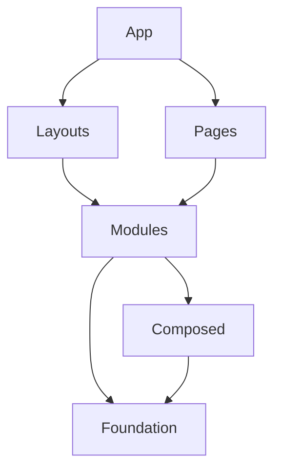

# FRONTEND: BRAINLINK

**ID Documento**: BL-FE-001  
**Versão**: 1.0.0  
**Data**: 2025-03-19  
**Dependências**: BL-VC-001, BL-AT-001  

## Visão Geral de Frontend

O frontend do Brainlink é uma aplicação React moderna, construída com TypeScript e centrada em um sistema avançado de painéis dinâmicos que permite configuração flexível do espaço de trabalho. A interface é projetada para maximizar a produtividade ao permitir que múltiplas ferramentas (chat com IA, editor de código, terminal, visualização de projetos, etc.) coexistam de forma harmoniosa e configurável na mesma tela.

A arquitetura frontend segue princípios de modularidade, extensibilidade e responsividade, organizando componentes em uma hierarquia clara com comunicação baseada em eventos. O sistema gerencia eficientemente o estado global via Zustand enquanto mantém estados locais encapsulados para otimização de renderização.

### Objetivos Principais do Frontend

1. **Flexibilidade de Workspace**: Permitir configuração personalizada do ambiente de trabalho
2. **Desempenho Otimizado**: Garantir resposta ágil mesmo com múltiplos componentes complexos
3. **Consistência Visual**: Manter experiência coesa em todo o aplicativo
4. **Acessibilidade**: Seguir padrões WCAG para inclusão de todos os usuários
5. **Extensibilidade**: Facilitar adição de novos componentes e ferramentas

## Stack e Frameworks

### Tecnologias Core

1. **React 18+** - Framework base para construção de interfaces
   - Hooks avançados para gerenciamento de estado e efeitos
   - Concurrent Mode para interfaces responsivas durante carregamentos
   - Server Components para otimização de renderização (via Next.js)

2. **TypeScript** - Tipagem estática para código mais seguro e manutenível
   - Interfaces detalhadas para todos os módulos
   - Type guards para manipulação segura de dados
   - Generics para componentes e hooks reutilizáveis

3. **Next.js** - Framework React para renderização otimizada
   - App Router para navegação baseada em sistema de arquivos
   - Server Components para performance melhorada
   - API Routes para endpoints serverless

### Gerenciamento de Estado

1. **Zustand** - Gerenciamento de estado global e por módulo
   - Stores separadas por domínio funcional
   - Middleware para persistência (via localForage/IndexedDB)
   - Middleware para devtools e depuração

2. **React Context API** - Para estados localizados
   - Contexts específicos para árvores de componentes relacionados
   - Providers otimizados para prevenir re-renderizações desnecessárias

3. **Immer** - Para atualizações imutáveis de estado
   - Integrado com Zustand para manipulações ergonômicas de estado
   - Facilita atualizações de estruturas de dados complexas

### UI e Estilização

1. **Tailwind CSS** - Framework CSS utilitário
   - Configuração personalizada para design system do Brainlink
   - JIT (Just-In-Time) compiler para otimização
   - Plugins para animações e recursos avançados

2. **Radix UI** - Primitivos acessíveis e sem estilos
   - Base para componentes interativos complexos
   - Acessibilidade incorporada em cada componente
   - API declarativa consistente

3. **shadcn/ui** - Componentes UI reutilizáveis
   - Adaptados para o design system do Brainlink
   - Extendidos com componentes específicos da aplicação
   - Documentados em storybook para referência

### Editores e Ferramentas Especializadas

1. **Monaco Editor** - Editor de código avançado
   - Configurado para múltiplas linguagens
   - Extensões para IntelliSense e completions via IA
   - Tema personalizado integrado com o design system

2. **xterm.js** - Terminal interativo
   - Integração com backend para execução de comandos
   - Histórico persistente e configurações personalizáveis
   - Suporte a cores e fontes personalizáveis

3. **ReactFlow** - Editor visual node-based
   - Nodes customizados para diferentes tipos de operações
   - Suporte a interação por arrastar e conexões inteligentes
   - Serialização/desserialização de fluxos para persistência

4. **react-markdown** - Renderização de markdown
   - Plugins para syntax highlighting (código)
   - Extensões para diagramas (mermaid.js)
   - Suporte a LaTeX para fórmulas matemáticas

5. **force-graph** - Visualização de grafos
   - Renderização otimizada de grafos grandes
   - Física simulada para navegação intuitiva
   - Interatividade para navegação em dados relacionados

## Estrutura de Componentes

A arquitetura de componentes do Brainlink segue uma estrutura hierárquica bem definida, organizada por níveis de especialização e responsabilidade:

### 1. Componentes de Foundation (Baixo Nível)

Componentes fundamentais que servem como blocos de construção para toda a interface:

```
foundation/
├── Button/             # Botões em várias variantes
├── Input/              # Campos de entrada e controles de formulário
├── Typography/         # Elementos tipográficos (títulos, parágrafos)
├── Card/               # Containers estilizados
├── Dialog/             # Modais e diálogos
├── Dropdown/           # Menus dropdown
└── Icons/              # Sistema de ícones
```

### 2. Componentes Compostos (Médio Nível)

Combinações de componentes foundation para criar unidades funcionais mais complexas:

```
composed/
├── Form/               # Grupos de controles de formulário
├── Navigation/         # Barras e menus de navegação
├── Tabs/               # Sistema de abas
├── Toolbars/           # Barras de ferramentas
├── Search/             # Componentes de busca
├── Notifications/      # Sistema de notificações
└── CommandPalette/     # Paleta de comandos (estilo VSCode)
```

### 3. Módulos de Funcionalidade (Alto Nível)

Componentes complexos que implementam funcionalidades específicas do sistema:

```
modules/
├── Workspace/          # Sistema de workspace e painéis
│   ├── WorkspaceManager.tsx
│   ├── Workspace.tsx
│   ├── Panel.tsx
│   └── PanelContent.tsx
├── Chat/               # Interface de chat com IA
├── CodeEditor/         # Editor de código Monaco
├── Terminal/           # Terminal integrado
├── NodeEditor/         # Editor visual node-based
├── FileManager/        # Gerenciador de arquivos
├── MarkdownEditor/     # Editor de markdown
└── GraphVisualizer/    # Visualizador de grafos
```

### 4. Layouts e Templates

Estruturas para organizar a interface em diferentes contextos:

```
layouts/
├── MainLayout.tsx      # Layout principal da aplicação
├── AuthLayout.tsx      # Layout para telas de autenticação
├── SettingsLayout.tsx  # Layout para páginas de configuração
└── templates/          # Templates pré-configurados de workspace
```

### 5. Pages

Componentes de página que compõem a aplicação:

```
pages/
├── Home/               # Página inicial
├── Workspace/          # Ambiente de trabalho principal
├── Settings/           # Configurações da aplicação
├── Auth/               # Páginas de autenticação
└── Documentation/      # Documentação integrada
```

### Diagrama de Dependências de Componentes



## Gerenciamento de Estado

O Brainlink implementa uma estratégia de gerenciamento de estado híbrida e hierárquica, combinando diferentes abordagens baseadas na natureza e escopo dos dados:

### 1. Estado Global da Aplicação (Zustand)

```typescript
// store/appStore.ts
interface AppState {
  theme: Theme;
  preferences: UserPreferences;
  currentWorkspace: Workspace;
  apiKeys: Record<string, string>;
  isAuthenticated: boolean;
  user: User | null;
  
  // Ações
  setTheme: (theme: Theme) => void;
  updatePreferences: (preferences: Partial<UserPreferences>) => void;
  setCurrentWorkspace: (workspace: Workspace) => void;
  // ...
}

export const useAppStore = create<AppState>()(
  persist(
    (set) => ({
      theme: 'system',
      preferences: defaultPreferences,
      currentWorkspace: defaultWorkspace,
      apiKeys: {},
      isAuthenticated: false,
      user: null,
      
      setTheme: (theme) => set({ theme }),
      updatePreferences: (prefs) => set((state) => ({
        preferences: { ...state.preferences, ...prefs }
      })),
      setCurrentWorkspace: (workspace) => set({ currentWorkspace: workspace }),
      // ...
    }),
    {
      name: 'brainlink-app-store',
      storage: createEncryptedStorage('app'),
    }
  )
);
```

### 2. Estados de Módulos (Zustand por Domínio)

Cada módulo funcional principal tem sua própria store para gerenciar estado específico:

```typescript
// store/workspaceStore.ts
interface WorkspaceState {
  workspaces: Workspace[];
  panels: Record<string, Panel>;
  activePanel: string | null;
  panelHistory: string[];
  
  // Ações
  addPanel: (panel: Panel) => void;
  removePanel: (panelId: string) => void;
  updatePanelPosition: (panelId: string, position: Position) => void;
  updatePanelSize: (panelId: string, size: Size) => void;
  setActivePanel: (panelId: string) => void;
  // ...
}

export const useWorkspaceStore = create<WorkspaceState>()(
  persist(
    (set, get) => ({
      workspaces: [],
      panels: {},
      activePanel: null,
      panelHistory: [],
      
      addPanel: (panel) => set((state) => ({
        panels: { ...state.panels, [panel.id]: panel }
      })),
      removePanel: (panelId) => set((state) => {
        const { [panelId]: _, ...restPanels } = state.panels;
        return { panels: restPanels };
      }),
      // ... outras ações
    }),
    {
      name: 'brainlink-workspace-store',
      storage: createStorage('workspace'),
    }
  )
);
```

### 3. Estado Local de Componentes (useState/useReducer)

Para estado transitório ou específico de UI que não precisa ser compartilhado:

```typescript
const Panel = ({ id, initialPosition, initialSize }) => {
  const [isDragging, setIsDragging] = useState(false);
  const [isResizing, setIsResizing] = useState(false);
  const [localPosition, setLocalPosition] = useState(initialPosition);
  const [localSize, setLocalSize] = useState(initialSize);
  
  // Sincroniza com a store global apenas após conclusão das operações
  const { updatePanelPosition, updatePanelSize } = useWorkspaceStore();
  
  const handleDragEnd = useCallback(() => {
    setIsDragging(false);
    updatePanelPosition(id, localPosition);
  }, [id, localPosition, updatePanelPosition]);
  
  // ...
};
```

### 4. Estado de Contexto (React Context)

Para estados compartilhados em subárvores específicas de componentes:

```typescript
// contexts/NodeEditorContext.tsx
interface NodeEditorContextType {
  selectedNodes: string[];
  hoveredNode: string | null;
  scale: number;
  position: Position;
  selectNode: (id: string) => void;
  deselectNode: (id: string) => void;
  // ...
}

const NodeEditorContext = createContext<NodeEditorContextType | undefined>(undefined);

export const NodeEditorProvider: FC<{ children: ReactNode }> = ({ children }) => {
  const [selectedNodes, setSelectedNodes] = useState<string[]>([]);
  const [hoveredNode, setHoveredNode] = useState<string | null>(null);
  const [scale, setScale] = useState(1);
  const [position, setPosition] = useState({ x: 0, y: 0 });
  
  const selectNode = useCallback((id: string) => {
    setSelectedNodes(prev => [...prev, id]);
  }, []);
  
  const deselectNode = useCallback((id: string) => {
    setSelectedNodes(prev => prev.filter(nodeId => nodeId !== id));
  }, []);
  
  // ...
  
  return (
    <NodeEditorContext.Provider value={{
      selectedNodes,
      hoveredNode,
      scale,
      position,
      selectNode,
      deselectNode,
      // ...
    }}>
      {children}
    </NodeEditorContext.Provider>
  );
};
```

### 5. Estado Persistente e Sincronização

Estratégias para persistência e sincronização de estado:

- **Persistência Local**: Uso de middleware persist do Zustand com localForage/IndexedDB
- **Estado Efêmero**: Estados transitórios mantidos apenas em memória
- **Sincronização**: Middleware customizado para sincronização entre dispositivos
- **Versionamento**: Sistema de migração para compatibilidade entre versões do schema

## Rotas e Navegação

O Brainlink implementa um sistema de navegação baseado na estrutura do Next.js App Router, com otimizações para preservação de estado e melhor experiência de usuário:

### 1. Estrutura de Rotas

```
app/
├── layout.tsx         # Layout root da aplicação
├── page.tsx           # Página inicial/landing
├── auth/              # Rotas de autenticação
│   ├── login/
│   └── register/
├── workspace/         # Ambiente de trabalho principal
│   ├── layout.tsx     # Layout compartilhado
│   ├── [id]/          # Workspaces específicos
│   │   └── page.tsx
│   └── new/
│       └── page.tsx
├── settings/          # Configurações da aplicação
│   ├── layout.tsx
│   ├── profile/
│   ├── api-keys/
│   └── plugins/
└── docs/              # Documentação interna
```

### 2. Navegação Contextual

Além das rotas URL, o Brainlink implementa um sistema de navegação contextual dentro do workspace:

```typescript
// Tipos de navegação contextual
type NavigationTarget = 
  | { type: 'panel'; panelId: string }
  | { type: 'tool'; toolId: string }
  | { type: 'file'; fileId: string; line?: number }
  | { type: 'node'; nodeId: string }
  | { type: 'setting'; section: string; subsection?: string };

// Hook para navegação contextual
const useContextualNavigation = () => {
  const navigate = useCallback((target: NavigationTarget) => {
    switch (target.type) {
      case 'panel':
        // Ativa e foca no painel especificado
        break;
      case 'tool':
        // Abre ou foca na ferramenta especificada
        break;
      case 'file':
        // Abre arquivo no editor, opcionalmente na linha especificada
        break;
      // ...outros casos
    }
  }, []);
  
  return { navigate };
};
```

### 3. Histórico de Navegação

Sistema para rastrear e permitir navegação entre painéis, arquivos e ferramentas:

```typescript
// store/navigationStore.ts
interface NavigationState {
  history: NavigationTarget[];
  currentIndex: number;
  
  navigate: (target: NavigationTarget) => void;
  back: () => void;
  forward: () => void;
  canGoBack: () => boolean;
  canGoForward: () => boolean;
}

export const useNavigationStore = create<NavigationState>((set, get) => ({
  history: [],
  currentIndex: -1,
  
  navigate: (target) => set(state => {
    const newHistory = [
      ...state.history.slice(0, state.currentIndex + 1),
      target
    ];
    return {
      history: newHistory,
      currentIndex: newHistory.length - 1
    };
  }),
  
  back: () => set(state => {
    if (state.currentIndex <= 0) return state;
    return { currentIndex: state.currentIndex - 1 };
  }),
  
  forward: () => set(state => {
    if (state.currentIndex >= state.history.length - 1) return state;
    return { currentIndex: state.currentIndex + 1 };
  }),
  
  canGoBack: () => get().currentIndex > 0,
  canGoForward: () => get().currentIndex < get().history.length - 1,
}));
```

## Design System

O Design System do Brainlink é construído para flexibilidade, consistência e acessibilidade, seguindo princípios de design atômico e tokens de design:

### 1. Tokens de Design

```typescript
// design-system/tokens.ts
export const tokens = {
  colors: {
    // Cores primárias
    primary: {
      50: '#F0F9FF',
      100: '#E0F2FE',
      200: '#BAE6FD',
      300: '#7DD3FC',
      400: '#38BDF8',
      500: '#0EA5E9',
      600: '#0284C7',
      700: '#0369A1',
      800: '#075985',
      900: '#0C4A6E',
    },
    // Tons neutros
    neutral: {
      50: '#F8FAFC',
      100: '#F1F5F9',
      200: '#E2E8F0',
      300: '#CBD5E1',
      400: '#94A3B8',
      500: '#64748B',
      600: '#475569',
      700: '#334155',
      800: '#1E293B',
      900: '#0F172A',
      950: '#020617',
    },
    // Estados semânticos
    success: '#10B981',
    warning: '#F59E0B',
    error: '#EF4444',
    info: '#3B82F6',
    // Modos de tema
    light: {
      background: '#FFFFFF',
      foreground: '#0F172A',
      muted: '#F1F5F9',
      border: '#E2E8F0',
    },
    dark: {
      background: '#0F172A',
      foreground: '#F8FAFC',
      muted: '#1E293B',
      border: '#334155',
    },
  },
  
  spacing: {
    px: '1px',
    0.5: '0.125rem',
    1: '0.25rem',
    1.5: '0.375rem',
    2: '0.5rem',
    3: '0.75rem',
    4: '1rem',
    5: '1.25rem',
    6: '1.5rem',
    8: '2rem',
    10: '2.5rem',
    12: '3rem',
    16: '4rem',
    20: '5rem',
    24: '6rem',
    // ...
  },
  
  fontSizes: {
    xs: '0.75rem',
    sm: '0.875rem',
    base: '1rem',
    lg: '1.125rem',
    xl: '1.25rem',
    '2xl': '1.5rem',
    '3xl': '1.875rem',
    '4xl': '2.25rem',
    // ...
  },
  
  fontWeights: {
    light: 300,
    normal: 400,
    medium: 500,
    semibold: 600,
    bold: 700,
  },
  
  borderRadius: {
    none: '0',
    sm: '0.125rem',
    md: '0.375rem',
    lg: '0.5rem',
    xl: '0.75rem',
    '2xl': '1rem',
    full: '9999px',
  },
  
  shadows: {
    sm: '0 1px 2px 0 rgba(0, 0, 0, 0.05)',
    md: '0 4px 6px -1px rgba(0, 0, 0, 0.1), 0 2px 4px -1px rgba(0, 0, 0, 0.06)',
    lg: '0 10px 15px -3px rgba(0, 0, 0, 0.1), 0 4px 6px -2px rgba(0, 0, 0, 0.05)',
    xl: '0 20px 25px -5px rgba(0, 0, 0, 0.1), 0 10px 10px -5px rgba(0, 0, 0, 0.04)',
    inner: 'inset 0 2px 4px 0 rgba(0, 0, 0, 0.06)',
    none: 'none',
  },
  
  zIndices: {
    0: '0',
    10: '10',
    20: '20',
    30: '30',
    40: '40',
    50: '50',
    auto: 'auto',
  },
  
  transitions: {
    DEFAULT: '150ms cubic-bezier(0.4, 0, 0.2, 1)',
    slow: '300ms cubic-bezier(0.4, 0, 0.2, 1)',
    fast: '100ms cubic-bezier(0.4, 0, 0.2, 1)',
  },
};
```

### 2. Componentes do Design System

O design system é implementado como uma biblioteca de componentes, construídos sobre os primitivos Radix UI e estilizados com Tailwind CSS, seguindo a abordagem do shadcn/ui:

```typescript
// components/ui/button.tsx
import * as React from 'react';
import { cva, type VariantProps } from 'class-variance-authority';
import { cn } from '@/lib/utils';

const buttonVariants = cva(
  "inline-flex items-center justify-center rounded-md text-sm font-medium transition-colors focus-visible:outline-none focus-visible:ring-2 focus-visible:ring-primary-500 focus-visible:ring-offset-2 disabled:opacity-50 disabled:pointer-events-none",
  {
    variants: {
      variant: {
        default: "bg-primary-600 text-white hover:bg-primary-700",
        secondary: "bg-neutral-200 text-neutral-900 hover:bg-neutral-300",
        ghost: "hover:bg-neutral-100 hover:text-neutral-900",
        outline: "border border-neutral-300 hover:bg-neutral-100",
        destructive: "bg-error text-white hover:bg-error/90",
      },
      size: {
        sm: "h-8 px-3 text-xs",
        default: "h-10 px-4",
        lg: "h-12 px-6 text-lg",
        icon: "h-10 w-10",
      },
    },
    defaultVariants: {
      variant: "default",
      size: "default",
    },
  }
);

export interface ButtonProps
  extends React.ButtonHTMLAttributes<HTMLButtonElement>,
    VariantProps<typeof buttonVariants> {
  asChild?: boolean;
}

const Button = React.forwardRef<HTMLButtonElement, ButtonProps>(
  ({ className, variant, size, asChild = false, ...props }, ref) => {
    const Comp = asChild ? Slot : "button";
    return (
      <Comp
        className={cn(buttonVariants({ variant, size, className }))}
        ref={ref}
        {...props}
      />
    );
  }
);
Button.displayName = "Button";

export { Button, buttonVariants };
```

### 3. Sistema de Temas

Implementação de temas claros, escuros e personalizados:

```typescript
// components/theme-provider.tsx
import { createContext, useContext, useEffect, useState } from 'react';
import { useAppStore } from '@/store/appStore';

type Theme = 'light' | 'dark' | 'system';

interface ThemeProviderProps {
  children: React.ReactNode;
  defaultTheme?: Theme;
}

const ThemeProviderContext = createContext<{
  theme: Theme;
  setTheme: (theme: Theme) => void;
}>({
  theme: 'system',
  setTheme: () => null,
});

export function ThemeProvider({
  children,
  defaultTheme = 'system',
}: ThemeProviderProps) {
  const { theme, setTheme } = useAppStore(state => ({ 
    theme: state.theme, 
    setTheme: state.setTheme 
  }));
  
  useEffect(() => {
    const root = window.document.documentElement;
    root.classList.remove('light', 'dark');
    
    if (theme === 'system') {
      const systemTheme = window.matchMedia('(prefers-color-scheme: dark)')
        .matches ? 'dark' : 'light';
      root.classList.add(systemTheme);
    } else {
      root.classList.add(theme);
    }
  }, [theme]);
  
  return (
    <ThemeProviderContext.Provider value={{ theme, setTheme }}>
      {children}
    </ThemeProviderContext.Provider>
  );
}

export const useTheme = () => useContext(ThemeProviderContext);
```

### 4. Iconografia

Sistema de ícones consistente e flexível:

```typescript
// components/ui/icon.tsx
import { LucideProps } from 'lucide-react';
import dynamicIconImports from 'lucide-react/dynamicIconImports';
import { forwardRef } from 'react';
import dynamic from 'next/dynamic';

interface IconProps extends LucideProps {
  name: keyof typeof dynamicIconImports;
}

const Icon = forwardRef<SVGSVGElement, IconProps>(
  ({ name, ...props }, ref) => {
    const LucideIcon = dynamic(dynamicIconImports[name]);
    
    return <LucideIcon ref={ref} {...props} />;
  }
);
Icon.displayName = "Icon";

export { Icon };
```

## Responsividade

A interface do Brainlink é projetada para adaptar-se a diferentes tamanhos de tela e dispositivos, seguindo uma abordagem mobile-first e utilizando media queries e utilitários de resposta:

### 1. Sistema de Grid Responsivo

```typescript
// components/ui/grid.tsx
import { cn } from '@/lib/utils';
import { HTMLAttributes, forwardRef } from 'react';

interface GridProps extends HTMLAttributes<HTMLDivElement> {
  columns?: {
    xs?: number;
    sm?: number;
    md?: number;
    lg?: number;
    xl?: number;
  };
  gap?: number | string;
}

export const Grid = forwardRef<HTMLDivElement, GridProps>(
  ({ className, columns = {}, gap = 4, children, ...props }, ref) => {
    const { xs = 1, sm, md, lg, xl } = columns;
    
    const gridClass = cn(
      'grid',
      `grid-cols-${xs}`,
      sm && `sm:grid-cols-${sm}`,
      md && `md:grid-cols-${md}`,
      lg && `lg:grid-cols-${lg}`,
      xl && `xl:grid-cols-${xl}`,
      typeof gap === 'number' ? `gap-${gap}` : `gap-[${gap}]`,
      className
    );
    
    return (
      <div className={gridClass} ref={ref} {...props}>
        {children}
      </div>
    );
  }
);
```

### 2. Layout Adaptativo de Painéis

O sistema de painéis do Brainlink adapta-se a diferentes tamanhos de tela:

```typescript
// hooks/useResponsiveLayout.ts
import { useEffect, useState } from 'react';
import { useWorkspaceStore } from '@/store/workspaceStore';

export type LayoutMode = 'compact' | 'comfortable' | 'expanded';

export function useResponsiveLayout() {
  const [layoutMode, setLayoutMode] = useState<LayoutMode>('comfortable');
  const { rearrangePanelsForMode } = useWorkspaceStore();
  
  useEffect(() => {
    const updateLayout = () => {
      if (window.innerWidth < 640) {
        setLayoutMode('compact');
      } else if (window.innerWidth < 1024) {
        setLayoutMode('comfortable');
      } else {
        setLayoutMode('expanded');
      }
    };
    
    updateLayout();
    window.addEventListener('resize', updateLayout);
    
    return () => {
      window.removeEventListener('resize', updateLayout);
    };
  }, []);
  
  useEffect(() => {
    rearrangePanelsForMode(layoutMode);
  }, [layoutMode, rearrangePanelsForMode]);
  
  return { layoutMode };
}
```

### 3. Media Queries Consistentes

Definição de breakpoints consistentes para uso em toda a aplicação:

```typescript
// styles/breakpoints.ts
export const breakpoints = {
  xs: 0,
  sm: 640,
  md: 768,
  lg: 1024,
  xl: 1280,
  '2xl': 1536,
};

export type Breakpoint = keyof typeof breakpoints;

export const mediaQueries = Object.entries(breakpoints).reduce(
  (acc, [key, value]) => {
    acc[key as Breakpoint] = `@media (min-width: ${value}px)`;
    return acc;
  },
  {} as Record<Breakpoint, string>
);
```

### 4. Componentes Responsivos

Exemplo de um componente que adapta sua apresentação baseado no tamanho da tela:

```typescript
// components/workspace/panel-switcher.tsx
import { useResponsiveLayout } from '@/hooks/useResponsiveLayout';
import { useWorkspaceStore } from '@/store/workspaceStore';
import { Button } from '@/components/ui/button';
import { Icon } from '@/components/ui/icon';

export function PanelSwitcher() {
  const { layoutMode } = useResponsiveLayout();
  const { panels, activePanel, setActivePanel } = useWorkspaceStore();
  
  // No modo compact, exibimos tabs para alternar entre painéis
  if (layoutMode === 'compact') {
    return (
      <div className="flex overflow-x-auto scrollbar-thin scrollbar-thumb-neutral-300 dark:scrollbar-thumb-neutral-700 p-1">
        {Object.values(panels).map((panel) => (
          <Button
            key={panel.id}
            variant={activePanel === panel.id ? 'default' : 'ghost'}
            size="sm"
            className="mx-1 whitespace-nowrap"
            onClick={() => setActivePanel(panel.id)}
          >
            <Icon name={panel.icon} className="mr-2 h-4 w-4" />
            {panel.title}
          </Button>
        ))}
      </div>
    );
  }
  
  // Em outros modos, não precisamos desse componente pois os painéis
  // são visíveis simultaneamente
  return null;
}
```

## Acessibilidade

O Brainlink foi projetado com acessibilidade como princípio fundamental, seguindo as diretrizes WCAG 2.1 AA e implementando práticas que garantem que a plataforma seja utilizável pelo maior número possível de usuários:

### 1. Princípios de Acessibilidade Implementados

- **Perceptível**: Informações e interfaces de usuário são apresentadas de maneiras que todos possam perceber
- **Operável**: Componentes de interface e navegação são operáveis por diversos dispositivos de entrada
- **Compreensível**: Informações e operações são claras e previsíveis
- **Robusto**: Conteúdo é compatível com tecnologias assistivas atuais e futuras

### 2. Componentes Acessíveis

Os componentes do Brainlink são construídos sobre primitivos acessíveis do Radix UI, garantindo:

```typescript
// components/ui/accordion.tsx (exemplo)
import * as React from "react";
import * as AccordionPrimitive from "@radix-ui/react-accordion";
import { ChevronDown } from "lucide-react";
import { cn } from "@/lib/utils";

const Accordion = AccordionPrimitive.Root;

const AccordionItem = React.forwardRef<
  React.ElementRef<typeof AccordionPrimitive.Item>,
  React.ComponentPropsWithoutRef<typeof AccordionPrimitive.Item>
>(({ className, ...props }, ref) => (
  <AccordionPrimitive.Item
    ref={ref}
    className={cn("border-b", className)}
    {...props}
  />
));
AccordionItem.displayName = "AccordionItem";

const AccordionTrigger = React.forwardRef<
  React.ElementRef<typeof AccordionPrimitive.Trigger>,
  React.ComponentPropsWithoutRef<typeof AccordionPrimitive.Trigger>
>(({ className, children, ...props }, ref) => (
  <AccordionPrimitive.Header className="flex">
    <AccordionPrimitive.Trigger
      ref={ref}
      className={cn(
        "flex flex-1 items-center justify-between py-4 font-medium transition-all [&[data-state=open]>svg]:rotate-180",
        className
      )}
      {...props}
    >
      {children}
      <ChevronDown className="h-4 w-4 shrink-0 transition-transform duration-200" />
    </AccordionPrimitive.Trigger>
  </AccordionPrimitive.Header>
));
AccordionTrigger.displayName = "AccordionTrigger";

const AccordionContent = React.forwardRef<
  React.ElementRef<typeof AccordionPrimitive.Content>,
  React.ComponentPropsWithoutRef<typeof AccordionPrimitive.Content>
>(({ className, children, ...props }, ref) => (
  <AccordionPrimitive.Content
    ref={ref}
    className="overflow-hidden text-sm transition-all data-[state=closed]:animate-accordion-up data-[state=open]:animate-accordion-down"
    {...props}
  >
    <div className={cn("pb-4 pt-0", className)}>{children}</div>
  </AccordionPrimitive.Content>
));
AccordionContent.displayName = "AccordionContent";

export { Accordion, AccordionItem, AccordionTrigger, AccordionContent };
```

### 3. Suporte a Navegação por Teclado

Todos os componentes interativos são navegáveis por teclado, com foco visual claro e fluxos lógicos:

```typescript
// hooks/useFocusTrap.ts
import { useEffect, useRef } from 'react';

export function useFocusTrap(active: boolean = true) {
  const containerRef = useRef<HTMLElement>(null);
  
  useEffect(() => {
    if (!active) return;
    
    const container = containerRef.current;
    if (!container) return;
    
    const focusableElements = container.querySelectorAll(
      'button, [href], input, select, textarea, [tabindex]:not([tabindex="-1"])'
    );
    
    const firstElement = focusableElements[0] as HTMLElement;
    const lastElement = focusableElements[focusableElements.length - 1] as HTMLElement;
    
    const handleKeyDown = (e: KeyboardEvent) => {
      if (e.key !== 'Tab') return;
      
      if (e.shiftKey) {
        if (document.activeElement === firstElement) {
          lastElement.focus();
          e.preventDefault();
        }
      } else {
        if (document.activeElement === lastElement) {
          firstElement.focus();
          e.preventDefault();
        }
      }
    };
    
    document.addEventListener('keydown', handleKeyDown);
    firstElement?.focus();
    
    return () => {
      document.removeEventListener('keydown', handleKeyDown);
    };
  }, [active]);
  
  return containerRef;
}
```

### 4. Suporte a Tecnologias Assistivas

O Brainlink implementa atributos ARIA apropriados, garantindo que leitores de tela possam interpretar corretamente a interface:

```typescript
// components/workspace/panel.tsx
import { useDraggable } from '@dnd-kit/core';
import { cn } from '@/lib/utils';
import { forwardRef, HTMLAttributes } from 'react';
import { useWorkspaceStore } from '@/store/workspaceStore';
import { Icon } from '@/components/ui/icon';

interface PanelProps extends HTMLAttributes<HTMLDivElement> {
  id: string;
  title: string;
  isDraggable?: boolean;
  isResizable?: boolean;
}

export const Panel = forwardRef<HTMLDivElement, PanelProps>(
  ({ id, title, isDraggable = true, isResizable = true, className, children, ...props }, ref) => {
    const { activePanel, setActivePanel } = useWorkspaceStore();
    const isActive = activePanel === id;
    
    const { attributes, listeners, setNodeRef, transform } = useDraggable({
      id,
      disabled: !isDraggable,
    });
    
    return (
      <div
        ref={setNodeRef}
        style={transform ? {
          transform: `translate3d(${transform.x}px, ${transform.y}px, 0)`,
        } : undefined}
        className={cn(
          "flex flex-col rounded-md border shadow-sm",
          isActive ? "border-primary-500 ring-1 ring-primary-500" : "border-neutral-200 dark:border-neutral-700",
          className
        )}
        role="region"
        aria-label={title}
        onClick={() => setActivePanel(id)}
        {...props}
      >
        <div 
          className="flex items-center p-2 bg-neutral-50 dark:bg-neutral-800 rounded-t-md"
          {...attributes}
          {...listeners}
        >
          <div 
            className="flex-1 text-sm font-medium truncate"
            id={`panel-${id}-heading`}
          >
            {title}
          </div>
          <div className="flex items-center space-x-1">
            {isDraggable && (
              <button
                type="button"
                className="p-1 rounded hover:bg-neutral-200 dark:hover:bg-neutral-700"
                aria-label="Mover painel"
                tabIndex={isActive ? 0 : -1}
              >
                <Icon name="gripVertical" className="h-4 w-4" />
              </button>
            )}
            <button
              type="button"
              className="p-1 rounded hover:bg-neutral-200 dark:hover:bg-neutral-700"
              aria-label="Fechar painel"
              tabIndex={isActive ? 0 : -1}
              onClick={(e) => {
                e.stopPropagation();
                // Lógica para fechar o painel
              }}
            >
              <Icon name="x" className="h-4 w-4" />
            </button>
          </div>
        </div>
        <div 
          className="flex-1 p-4 overflow-auto"
          role="group"
          aria-labelledby={`panel-${id}-heading`}
        >
          {children}
        </div>
        {isResizable && (
          <div 
            className="absolute bottom-0 right-0 w-4 h-4 cursor-nwse-resize"
            aria-hidden="true"
            // Lógica de resize
          />
        )}
      </div>
    );
  }
);
Panel.displayName = "Panel";
```

### 5. Contrastes e Textos

Garantimos que todos os textos e elementos interativos atendam aos requisitos de contraste WCAG AA:

```typescript
// lib/a11y.ts
export function getContrastRatio(foreground: string, background: string): number {
  const getLuminance = (color: string): number => {
    // Implementação do cálculo de luminância relativa
    // ...
  };
  
  const foregroundLuminance = getLuminance(foreground);
  const backgroundLuminance = getLuminance(background);
  
  return (
    Math.max(foregroundLuminance, backgroundLuminance) + 0.05
  ) / (
    Math.min(foregroundLuminance, backgroundLuminance) + 0.05
  );
}

export function isContrastAACompliant(
  foreground: string,
  background: string,
  isLargeText: boolean = false
): boolean {
  const ratio = getContrastRatio(foreground, background);
  return isLargeText ? ratio >= 3 : ratio >= 4.5;
}
```

## Estratégia de Testes

O Brainlink implementa uma estratégia abrangente de testes para garantir qualidade e confiabilidade do código:

### 1. Testes Unitários

Utilizamos Jest e React Testing Library para testes unitários de componentes e hooks:

```typescript
// components/ui/button.test.tsx
import { render, screen } from '@testing-library/react';
import userEvent from '@testing-library/user-event';
import { Button } from './button';

describe('Button', () => {
  it('renders correctly', () => {
    render(<Button>Click me</Button>);
    expect(screen.getByRole('button', { name: /click me/i })).toBeInTheDocument();
  });
  
  it('handles clicks', async () => {
    const handleClick = jest.fn();
    render(<Button onClick={handleClick}>Click me</Button>);
    
    await userEvent.click(screen.getByRole('button'));
    expect(handleClick).toHaveBeenCalledTimes(1);
  });
  
  it('supports different variants', () => {
    const { rerender } = render(<Button variant="default">Default</Button>);
    expect(screen.getByRole('button')).toHaveClass('bg-primary-600');
    
    rerender(<Button variant="secondary">Secondary</Button>);
    expect(screen.getByRole('button')).toHaveClass('bg-neutral-200');
  });
  
  it('supports disabled state', () => {
    render(<Button disabled>Disabled</Button>);
    expect(screen.getByRole('button')).toBeDisabled();
    expect(screen.getByRole('button')).toHaveClass('disabled:opacity-50');
  });
});
```

### 2. Testes de Hooks Customizados

```typescript
// hooks/useWorkspace.test.ts
import { renderHook, act } from '@testing-library/react-hooks';
import { useWorkspaceManager } from './useWorkspaceManager';

describe('useWorkspaceManager', () => {
  it('initializes with default workspace', () => {
    const { result } = renderHook(() => useWorkspaceManager());
    
    expect(result.current.currentWorkspace).toBeDefined();
    expect(result.current.panels).toEqual({});
  });
  
  it('adds panels correctly', () => {
    const { result } = renderHook(() => useWorkspaceManager());
    
    act(() => {
      result.current.addPanel({
        id: 'test-panel',
        type: 'editor',
        title: 'Test Panel',
        position: { x: 0, y: 0 },
        size: { width: 400, height: 300 },
      });
    });
    
    expect(result.current.panels['test-panel']).toBeDefined();
    expect(result.current.panels['test-panel'].title).toBe('Test Panel');
  });
  
  it('updates panel positions', () => {
    const { result } = renderHook(() => useWorkspaceManager());
    
    act(() => {
      result.current.addPanel({
        id: 'test-panel',
        type: 'editor',
        title: 'Test Panel',
        position: { x: 0, y: 0 },
        size: { width: 400, height: 300 },
      });
    });
    
    act(() => {
      result.current.updatePanelPosition('test-panel', { x: 100, y: 50 });
    });
    
    expect(result.current.panels['test-panel'].position).toEqual({ x: 100, y: 50 });
  });
});
```

### 3. Testes de Integração

Utilizamos Cypress para testar interações complexas e fluxos de usuário:

```typescript
// cypress/integration/workspace.spec.ts
describe('Workspace', () => {
  beforeEach(() => {
    cy.visit('/workspace/new');
    cy.intercept('GET', '/api/workspaces/*').as('getWorkspace');
    cy.intercept('POST', '/api/workspaces').as('createWorkspace');
  });
  
  it('creates a new workspace correctly', () => {
    cy.get('[data-testid="workspace-name-input"]').type('Test Workspace');
    cy.get('[data-testid="create-workspace-button"]').click();
    
    cy.wait('@createWorkspace');
    cy.url().should('include', '/workspace/');
    cy.get('[data-testid="workspace-title"]').should('contain', 'Test Workspace');
  });
  
  it('adds new panels to workspace', () => {
    cy.get('[data-testid="add-panel-button"]').click();
    cy.get('[data-testid="panel-type-editor"]').click();
    
    cy.get('[role="region"]').should('have.length.at.least', 1);
  });
  
  it('allows drag and drop of panels', () => {
    cy.get('[data-testid="add-panel-button"]').click();
    cy.get('[data-testid="panel-type-editor"]').click();
    
    const panel = cy.get('[role="region"]').first();
    const header = panel.find('[role="heading"]');
    
    // Obter posição inicial
    panel.then($panel => {
      const initialRect = $panel[0].getBoundingClientRect();
      
      // Executar o drag & drop
      header.trigger('mousedown')
        .trigger('mousemove', { clientX: initialRect.x + 200, clientY: initialRect.y + 100 })
        .trigger('mouseup');
      
      // Verificar nova posição
      cy.get('[role="region"]').first().then($movedPanel => {
        const newRect = $movedPanel[0].getBoundingClientRect();
        expect(newRect.x).to.not.equal(initialRect.x);
        expect(newRect.y).to.not.equal(initialRect.y);
      });
    });
  });
});
```

### 4. Testes de Desempenho

Medimos e monitoramos o desempenho da aplicação:

```typescript
// utils/performance.ts
export interface PerformanceMeasurement {
  name: string;
  duration: number;
  timestamp: number;
}

class PerformanceMonitor {
  private measurements: PerformanceMeasurement[] = [];
  
  start(name: string): void {
    performance.mark(`${name}-start`);
  }
  
  end(name: string): void {
    performance.mark(`${name}-end`);
    performance.measure(name, `${name}-start`, `${name}-end`);
    
    const entry = performance.getEntriesByName(name, 'measure')[0];
    
    this.measurements.push({
      name,
      duration: entry.duration,
      timestamp: Date.now(),
    });
    
    // Cleanup
    performance.clearMarks(`${name}-start`);
    performance.clearMarks(`${name}-end`);
    performance.clearMeasures(name);
  }
  
  getLastMeasurement(name: string): PerformanceMeasurement | undefined {
    return [...this.measurements]
      .reverse()
      .find(m => m.name === name);
  }
  
  getAverageDuration(name: string): number {
    const relevantMeasurements = this.measurements.filter(m => m.name === name);
    if (relevantMeasurements.length === 0) return 0;
    
    const sum = relevantMeasurements.reduce((acc, m) => acc + m.duration, 0);
    return sum / relevantMeasurements.length;
  }
  
  reportToAnalytics(): void {
    // Implementação para enviar dados a um serviço de analytics
  }
}

export const performanceMonitor = new PerformanceMonitor();
```

### 5. Testes de Acessibilidade

Garantimos conformidade com diretrizes de acessibilidade usando:

```typescript
// jest-axe configuration in jest.setup.js
import { toHaveNoViolations } from 'jest-axe';

expect.extend(toHaveNoViolations);

// Example usage in tests
import { render } from '@testing-library/react';
import { axe } from 'jest-axe';
import { Button } from './button';

describe('Button a11y', () => {
  it('has no accessibility violations', async () => {
    const { container } = render(<Button>Accessible Button</Button>);
    const results = await axe(container);
    expect(results).toHaveNoViolations();
  });
});
```

## Prompt de Implementação para Frontend

Como desenvolvedor implementando o frontend do Brainlink, você deve seguir estas diretrizes essenciais:

1. **Comece pelo sistema de painéis flexíveis**. Este é o componente central da experiência Brainlink. Implemente o `WorkspaceManager`, `Workspace` e `Panel` como componentes React que gerenciam o posicionamento, redimensionamento e interação de painéis dinâmicos na interface:

```typescript
// Ordem de implementação recomendada:
// 1. Estrutura básica de componentes de painel
// 2. Lógica de arrastar e soltar 
// 3. Redimensionamento de painéis
// 4. Persistência de estado de workspace
```

2. **Desenvolva o sistema de gerenciamento de estado** usando Zustand, organizando as stores em domínios funcionais. Para cada store:
   - Defina tipos TypeScript claros para o estado e ações
   - Implemente middleware de persistência para dados importantes
   - Use slices para organizar funcionalidades relacionadas
   - Mantenha a imutabilidade com Immer para atualizações previsíveis

3. **Construa componentes de UI com acessibilidade em mente**:
   - Aproveite primitivos do Radix UI como base para componentes interativos
   - Implemente adequadamente atributos ARIA em componentes personalizados
   - Garanta navegação completa por teclado e compatibilidade com leitores de tela
   - Teste componentes com ferramentas como jest-axe para validar acessibilidade

4. **Otimize para desempenho desde o início**:
   - Implemente code-splitting para carregar código sob demanda
   - Use React.memo, useMemo e useCallback estrategicamente para componentes com renderização intensiva
   - Implemente virtualização para listas grandes (tabelas, árvores de arquivos)
   - Aplique lazy-loading para componentes pesados como Monaco Editor e ReactFlow

5. **Adapte a interface para diferentes dispositivos** através de:
   - Layout responsivo usando Tailwind e consultas de mídia
   - Estratégias adaptativas que reorganizam painéis em telas menores
   - Detecção de recursos para ajustar funcionalidades conforme capacidades do dispositivo

6. **Integre editores especializados** como Monaco Editor (código), xterm.js (terminal) e ReactFlow (editor de nós) com foco em:
   - Carregamento eficiente e sob demanda
   - Temas consistentes com o resto da aplicação
   - Adaptação para o sistema de painéis flexíveis

7. **Desenvolva um sistema robusto de testes**:
   - Testes unitários para componentes individuais
   - Testes de integração para fluxos de usuário importantes
   - Testes de acessibilidade para validar conformidade WCAG
   - Testes de desempenho para áreas críticas

8. **Mantenha documentação atualizada**:
   - Documente componentes com JSDoc e Storybook
   - Crie exemplos de uso para componentes complexos
   - Mantenha arquivos README atualizados em cada diretório importante

Lembre-se que o diferencial do Brainlink é oferecer uma experiência de desenvolvimento verdadeiramente unificada e flexível. Cada decisão de implementação deve contribuir para este objetivo, criando uma interface que permita aos usuários configurar seu ambiente de trabalho de acordo com suas necessidades específicas, mantendo desempenho e acessibilidade como prioridades.

