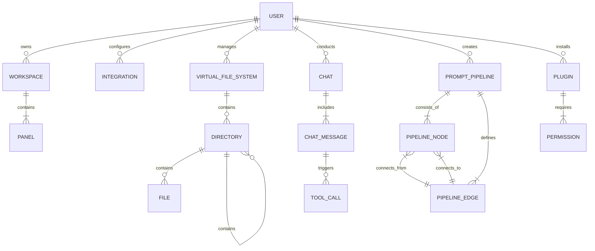

# DATABASE: BRAINLINK

**ID Documento**: BL-DB-001  
**Versão**: 1.0.0  
**Data**: 2025-03-19 04:10:28  
**Dependências**: BL-VC-001, BL-AT-001, BL-BE-001  

## Visão Geral de Dados

O Brainlink implementa uma arquitetura de dados híbrida e adaptativa, combinando armazenamento local e remoto para oferecer flexibilidade, performance e persistência. A estratégia de dados é projetada para funcionar em diferentes contextos: aplicação web, aplicação desktop e ambientes de desenvolvimento variados.

O sistema de dados do Brainlink é dividido em três camadas principais: armazenamento local (para persistência no dispositivo do usuário), armazenamento em nuvem (para sincronização entre dispositivos), e integrações com serviços externos (para extensão de funcionalidades). Esta abordagem multi-camadas permite que o aplicativo opere offline quando necessário, mantenha sincronização quando conectado, e se integre com ferramentas externas de desenvolvimento.

### Objetivos Principais do Sistema de Dados

1. **Persistência Resiliente**: Garantir que os dados críticos do usuário sejam mantidos mesmo em condições adversas
2. **Sincronização Eficiente**: Permitir que um usuário trabalhe em múltiplos dispositivos com mínima fricção
3. **Estrutura Flexível**: Suportar diferentes tipos de dados, desde configurações simples até projetos complexos
4. **Segurança e Privacidade**: Proteger dados sensíveis e respeitar configurações de privacidade do usuário
5. **Performance Otimizada**: Minimizar latência para operações frequentes com estratégias de cache inteligentes

## Tecnologias de Banco de Dados

### 1. Armazenamento Local

1. **IndexedDB** - Armazenamento principal no navegador
   - Para persistência de dados estruturados complexos
   - Suporte a operações transacionais
   - Capacidade para grande volume de dados (GB)
   - API assíncrona não-bloqueante

2. **LocalForage** - Camada de abstração
   - Simplificação da API de IndexedDB
   - Fallback automático para WebSQL e LocalStorage
   - Interface baseada em Promises
   - Suporte a múltiplos armazenamentos nomeados

3. **SQLite** (via Tauri/Electron) - Para aplicação desktop
   - Banco de dados relacional completo
   - Operações ACID em arquivos locais
   - Alta performance e confiabilidade
   - Suporte a migrações e esquemas

4. **File System Access API** - Acesso a arquivos e diretórios
   - Acesso controlado pelo usuário a arquivos locais
   - Persistência de permissões entre sessões
   - Operações de leitura e escrita em arquivos
   - Versão desktop com APIs nativas de sistema de arquivos

### 2. Armazenamento em Nuvem

1. **Supabase** - Backend-as-a-Service principal
   - PostgreSQL para dados estruturados
   - Row-Level Security (RLS) para controle de acesso
   - Sistema de realtime para sincronização
   - Storage para arquivos e mídia
   - Autenticação integrada com múltiplos providers

2. **GitHub / GitLab Storage** - Para código e projetos
   - Integração com sistemas de versionamento
   - Armazenamento de projetos como repositórios
   - Histórico completo de alterações
   - Suporte a branches e pull/merge requests

3. **Custom Storage API** - Abstração para múltiplos provedores
   - Interface unificada para diferentes backends
   - Suporte pluggable para Google Drive, Dropbox, etc.
   - Gerenciamento de credenciais e autorização
   - Sincronização bidirecional com detecção de conflitos

### 3. Camada de Cache e Sincronização

1. **SyncEngine** - Motor de sincronização customizado
   - Detecção e resolução de conflitos
   - Sincronização seletiva de dados
   - Estratégia offline-first com reconciliação
   - Operações incrementais para eficiência

2. **PouchDB / CouchDB** - Para sincronização avançada
   - Replicação bidirecional de dados
   - Resolução de conflitos baseada em CRDTs
   - Histórico de revisões
   - Suporte a filtros e sincronização parcial

## Modelo de Dados Completo

O modelo de dados do Brainlink é organizado em domínios funcionais, cada um com suas próprias entidades e relacionamentos:

### 1. Domínio de Usuário e Autenticação

```typescript
// Modelo de Usuário
interface User {
  id: string;                   // UUID único para o usuário
  email: string;                // Email do usuário (único)
  displayName: string;          // Nome de exibição
  avatarUrl?: string;           // URL para avatar do usuário
  createdAt: string;            // Data ISO de criação
  updatedAt: string;            // Data ISO de última atualização
  settings: UserSettings;       // Configurações do usuário
  integrations: Integration[];  // Integrações configuradas
}

// Configurações do Usuário
interface UserSettings {
  theme: 'light' | 'dark' | 'system';  // Tema da interface
  editorConfig: {                      // Configurações do editor de código
    fontSize: number;
    tabSize: number;
    fontFamily: string;
    lineHeight: number;
    wordWrap: boolean;
  };
  terminalConfig: {                    // Configurações do terminal
    fontSize: number;
    fontFamily: string;
    shellPath?: string;                // Para versão desktop
  };
  llmPreferences: {                    // Preferências de LLMs
    defaultProvider: string;
    defaultModel: string;
    defaultTemperature: number;
  };
  workspaceLayout?: {                  // Layout do workspace salvo
    panels: PanelConfig[];
  };
}

// Integrações externas
interface Integration {
  id: string;                        // ID único da integração
  provider: string;                  // Nome do provedor (github, vercel, etc)
  type: 'oauth' | 'apiKey' | 'other'; // Tipo de integração
  createdAt: string;                 // Data ISO de criação
  updatedAt: string;                 // Data ISO de última atualização
  metadata: Record<string, any>;     // Metadados específicos do provedor
  credentials: {                     // Credenciais criptografadas
    encrypted: string;
    iv: string;
  };
}
```

### 2. Domínio de Workspace e Painéis

```typescript
// Workspace (Ambiente de trabalho)
interface Workspace {
  id: string;                       // UUID único para o workspace
  userId: string;                   // ID do usuário proprietário
  name: string;                     // Nome do workspace
  description?: string;             // Descrição opcional
  type: 'personal' | 'project';     // Tipo de workspace
  createdAt: string;                // Data ISO de criação
  updatedAt: string;                // Data ISO de última atualização
  panels: Panel[];                  // Painéis do workspace
  layoutVersion: number;            // Versão do layout para migrações
  rootDirectories?: string[];       // Referências a diretórios raiz
  variables?: Record<string, string>; // Variáveis de ambiente
}

// Painel (Componente do Workspace)
interface Panel {
  id: string;                       // UUID único para o painel
  workspaceId: string;              // ID do workspace pai
  type: PanelType;                  // Tipo de painel (editor, terminal, etc)
  title: string;                    // Título exibido
  position: {                       // Posição na tela
    x: number;
    y: number;
    z: number;                      // Índice z para sobreposição
  };
  size: {                          // Tamanho do painel
    width: number;
    height: number;
    minWidth?: number;
    minHeight?: number;
    maxWidth?: number;
    maxHeight?: number;
  };
  state: Record<string, any>;       // Estado interno do painel
  visible: boolean;                 // Se está visível atualmente
}

// Tipos de painéis disponíveis
type PanelType = 
  | 'code-editor'
  | 'terminal'
  | 'chat'
  | 'preview'
  | 'file-explorer'
  | 'node-editor'
  | 'markdown'
  | 'pdf-viewer'
  | 'whiteboard'
  | 'graph'
  | 'custom';
```

### 3. Domínio de Arquivos e Projetos

```typescript
// Sistema de arquivos virtual
interface VirtualFileSystem {
  id: string;                    // ID único do sistema de arquivos
  userId: string;                // ID do usuário proprietário
  name: string;                  // Nome do sistema de arquivos
  type: 'local' | 'remote' | 'git'; // Tipo de sistema
  rootDirectory: Directory;      // Diretório raiz
  createdAt: string;             // Data ISO de criação
  updatedAt: string;             // Data ISO de última atualização
  metadata: Record<string, any>; // Metadados específicos do tipo
}

// Diretório
interface Directory {
  id: string;                    // ID único do diretório
  name: string;                  // Nome do diretório
  path: string;                  // Caminho completo
  parentId?: string;             // ID do diretório pai
  children: (File | Directory)[]; // Arquivos e subdiretórios
  createdAt: string;             // Data ISO de criação
  updatedAt: string;             // Data ISO de última atualização
  metadata: {                    // Metadados do diretório
    isExpanded?: boolean;        // Se está expandido na UI
    isHidden?: boolean;          // Se está oculto
    sourceControl?: {            // Informações de controle de versão
      status?: 'unchanged' | 'modified' | 'added' | 'deleted' | 'conflict';
    };
  };
}

// Arquivo
interface File {
  id: string;                    // ID único do arquivo
  name: string;                  // Nome do arquivo
  path: string;                  // Caminho completo
  parentId: string;              // ID do diretório pai
  type: string;                  // Tipo MIME do arquivo
  size: number;                  // Tamanho em bytes
  createdAt: string;             // Data ISO de criação
  updatedAt: string;             // Data ISO de última atualização
  content?: {                    // Conteúdo do arquivo (se carregado)
    text?: string;               // Para arquivos de texto
    binary?: Blob;               // Para arquivos binários
    base64?: string;             // Alternativa para binário
  };
  metadata: {                    // Metadados do arquivo
    lastOpened?: string;         // Data da última abertura
    isTemporary?: boolean;       // Se é um arquivo temporário
    isSynced?: boolean;          // Se está sincronizado
    sourceControl?: {            // Informações de controle de versão
      status?: 'unchanged' | 'modified' | 'added' | 'deleted' | 'conflict';
      diff?: string;             // Diff com a versão anterior
    };
  };
}
```

### 4. Domínio de LLM e IA

```typescript
// Modelo de Chat
interface Chat {
  id: string;                    // ID único da conversa
  userId: string;                // ID do usuário proprietário
  title: string;                 // Título da conversa
  createdAt: string;             // Data ISO de criação
  updatedAt: string;             // Data ISO de última atualização
  messages: ChatMessage[];       // Mensagens na conversa
  settings: {                    // Configurações desta conversa
    provider: string;            // Provedor do modelo (openai, anthropic, etc)
    model: string;               // Modelo específico
    temperature: number;         // Temperatura para geração
    maxTokens?: number;          // Tokens máximos para resposta
    systemPrompt?: string;       // Prompt de sistema específico
  };
}

// Mensagem de Chat
interface ChatMessage {
  id: string;                    // ID único da mensagem
  chatId: string;                // ID da conversa pai
  role: 'system' | 'user' | 'assistant' | 'tool'; // Papel da mensagem
  content: string;               // Conteúdo da mensagem
  createdAt: string;             // Data ISO de criação
  metadata?: {                   // Metadados opcionais
    tokens?: {                   // Contagem de tokens
      prompt?: number;
      completion?: number;
      total?: number;
    };
    model?: string;              // Modelo usado (pode variar em uma conversa)
    toolCalls?: ToolCall[];      // Chamadas de ferramentas
  };
}

// Chamada de Ferramenta
interface ToolCall {
  id: string;                    // ID único da chamada
  name: string;                  // Nome da ferramenta
  arguments: Record<string, any>; // Argumentos passados
  result?: any;                  // Resultado retornado
  status: 'pending' | 'success' | 'error'; // Status da chamada
  error?: string;                // Mensagem de erro (se houver)
}

// Definição de Ferramenta
interface Tool {
  name: string;                  // Nome da ferramenta
  description: string;           // Descrição para o LLM
  parameters: object;            // Esquema JSON dos parâmetros
  handler: (args: any) => Promise<any>; // Função que implementa a ferramenta
}

// Pipeline de prompts
interface PromptPipeline {
  id: string;                    // ID único do pipeline
  userId: string;                // ID do usuário proprietário
  name: string;                  // Nome do pipeline
  description?: string;          // Descrição opcional
  nodes: PipelineNode[];         // Nós do pipeline
  edges: PipelineEdge[];         // Conexões entre nós
  createdAt: string;             // Data ISO de criação
  updatedAt: string;             // Data ISO de última atualização
}

// Nó de Pipeline
interface PipelineNode {
  id: string;                    // ID único do nó
  type: NodeType;                // Tipo de nó
  position: { x: number; y: number }; // Posição no editor visual
  data: Record<string, any>;     // Dados específicos do tipo de nó
}

// Conexão entre Nós
interface PipelineEdge {
  id: string;                   // ID único da conexão
  source: string;               // ID do nó de origem
  target: string;               // ID do nó de destino
}
```

### 5. Domínio de Plugins

```typescript
// Plugin
interface Plugin {
  id: string;                   // ID único do plugin
  name: string;                 // Nome do plugin
  version: string;              // Versão semântica
  author: string;               // Autor do plugin
  description: string;          // Descrição do plugin
  homepage?: string;            // URL da página do plugin
  repository?: string;          // URL do repositório
  license?: string;             // Licença do plugin
  entryPoint: string;           // Ponto de entrada do código
  manifest: PluginManifest;     // Manifesto com metadados
  state: 'enabled' | 'disabled' | 'error'; // Estado atual
  permissions: Permission[];    // Permissões solicitadas
  createdAt: string;            // Data ISO de instalação
  updatedAt: string;            // Data ISO de última atualização
}

// Manifesto de Plugin
interface PluginManifest {
  name: string;                 // Nome do plugin
  version: string;              // Versão semântica
  minAppVersion: string;        // Versão mínima do Brainlink
  maxAppVersion?: string;       // Versão máxima compatível
  main: string;                 // Arquivo JS principal
  resources: string[];          // Recursos adicionais
  commands: Command[];          // Comandos registrados
  panels: PanelDefinition[];    // Definições de painéis
  tools: ToolDefinition[];      // Ferramentas para LLMs
  apiVersion: string;           // Versão da API de plugins
}

// Permissão de Plugin
interface Permission {
  type: PermissionType;         // Tipo de permissão
  scope?: string;               // Escopo específico
  granted: boolean;             // Se foi concedida pelo usuário
}

// Tipos de permissão
type PermissionType =
  | 'filesystem:read'
  | 'filesystem:write'
  | 'network:external'
  | 'llm:access'
  | 'workspace:modify'
  | 'terminal:execute'
  | 'storage:read'
  | 'storage:write';
```

## Esquemas e Relacionamentos

### Diagrama ER Conceitual



### Esquemas SQL (para PostgreSQL via Supabase)

```sql
-- Schema: users
CREATE TABLE users (
    id UUID PRIMARY KEY DEFAULT uuid_generate_v4(),
    email TEXT UNIQUE NOT NULL,
    display_name TEXT NOT NULL,
    avatar_url TEXT,
    created_at TIMESTAMP WITH TIME ZONE DEFAULT NOW(),
    updated_at TIMESTAMP WITH TIME ZONE DEFAULT NOW()
);

-- Schema: user_settings
CREATE TABLE user_settings (
    user_id UUID PRIMARY KEY REFERENCES users(id) ON DELETE CASCADE,
    settings JSONB NOT NULL DEFAULT '{}',
    created_at TIMESTAMP WITH TIME ZONE DEFAULT NOW(),
    updated_at TIMESTAMP WITH TIME ZONE DEFAULT NOW()
);

-- Schema: integrations
CREATE TABLE integrations (
    id UUID PRIMARY KEY DEFAULT uuid_generate_v4(),
    user_id UUID REFERENCES users(id) ON DELETE CASCADE,
    provider TEXT NOT NULL,
    type TEXT NOT NULL,
    metadata JSONB NOT NULL DEFAULT '{}',
    credentials JSONB NOT NULL,
    created_at TIMESTAMP WITH TIME ZONE DEFAULT NOW(),
    updated_at TIMESTAMP WITH TIME ZONE DEFAULT NOW(),
    
    UNIQUE(user_id, provider)
);

-- Schema: workspaces
CREATE TABLE workspaces (
    id UUID PRIMARY KEY DEFAULT uuid_generate_v4(),
    user_id UUID REFERENCES users(id) ON DELETE CASCADE,
    name TEXT NOT NULL,
    description TEXT,
    type TEXT NOT NULL,
    layout_version INTEGER NOT NULL DEFAULT 1,
    variables JSONB,
    created_at TIMESTAMP WITH TIME ZONE DEFAULT NOW(),
    updated_at TIMESTAMP WITH TIME ZONE DEFAULT NOW()
);

-- Schema: panels
CREATE TABLE panels (
    id UUID PRIMARY KEY DEFAULT uuid_generate_v4(),
    workspace_id UUID REFERENCES workspaces(id) ON DELETE CASCADE,
    type TEXT NOT NULL,
    title TEXT NOT NULL,
    position JSONB NOT NULL,
    size JSONB NOT NULL,
    state JSONB DEFAULT '{}',
    visible BOOLEAN NOT NULL DEFAULT true,
    created_at TIMESTAMP WITH TIME ZONE DEFAULT NOW(),
    updated_at TIMESTAMP WITH TIME ZONE DEFAULT NOW()
);

-- Schema: virtual_file_systems
CREATE TABLE virtual_file_systems (
    id UUID PRIMARY KEY DEFAULT uuid_generate_v4(),
    user_id UUID REFERENCES users(id) ON DELETE CASCADE,
    name TEXT NOT NULL,
    type TEXT NOT NULL,
    metadata JSONB NOT NULL DEFAULT '{}',
    created_at TIMESTAMP WITH TIME ZONE DEFAULT NOW(),
    updated_at TIMESTAMP WITH TIME ZONE DEFAULT NOW()
);

-- Schema: remote_directories
-- For directories stored in the cloud, local directories are handled differently
CREATE TABLE remote_directories (
    id UUID PRIMARY KEY DEFAULT uuid_generate_v4(),
    file_system_id UUID REFERENCES virtual_file_systems(id) ON DELETE CASCADE,
    name TEXT NOT NULL,
    path TEXT NOT NULL,
    parent_id UUID REFERENCES remote_directories(id) ON DELETE CASCADE,
    metadata JSONB NOT NULL DEFAULT '{}',
    created_at TIMESTAMP WITH TIME ZONE DEFAULT NOW(),
    updated_at TIMESTAMP WITH TIME ZONE DEFAULT NOW(),
    
    UNIQUE(file_system_id, path)
);

-- Schema: remote_files
-- For files stored in the cloud, local files are handled differently
CREATE TABLE remote_files (
    id UUID PRIMARY KEY DEFAULT uuid_generate_v4(),
    file_system_id UUID REFERENCES virtual_file_systems(id) ON DELETE CASCADE,
    directory_id UUID REFERENCES remote_directories(id) ON DELETE CASCADE,
    name TEXT NOT NULL,
    path TEXT NOT NULL,
    type TEXT NOT NULL,
    size INTEGER NOT NULL DEFAULT 0,
    metadata JSONB NOT NULL DEFAULT '{}',
    created_at TIMESTAMP WITH TIME ZONE DEFAULT NOW(),
    updated_at TIMESTAMP WITH TIME ZONE DEFAULT NOW(),
    
    UNIQUE(file_system_id, path)
);

-- Schema: chats
CREATE TABLE chats (
    id UUID PRIMARY KEY DEFAULT uuid_generate_v4(),
    user_id UUID REFERENCES users(id) ON DELETE CASCADE,
    title TEXT NOT NULL,
    settings JSONB NOT NULL DEFAULT '{}',
    created_at TIMESTAMP WITH TIME ZONE DEFAULT NOW(),
    updated_at TIMESTAMP WITH TIME ZONE DEFAULT NOW()
);

-- Schema: chat_messages
CREATE TABLE chat_messages (
    id UUID PRIMARY KEY DEFAULT uuid_generate_v4(),
    chat_id UUID REFERENCES chats(id) ON DELETE CASCADE,
    role TEXT NOT NULL,
    content TEXT NOT NULL,
    metadata JSONB,
    created_at TIMESTAMP WITH TIME ZONE DEFAULT NOW(),
    
    -- For efficient message ordering and paging
    sequence_num SERIAL
);

-- Schema: plugins
CREATE TABLE plugins (
    id UUID PRIMARY KEY DEFAULT uuid_generate_v4(),
    user_id UUID REFERENCES users(id) ON DELETE CASCADE,
    name TEXT NOT NULL,
    version TEXT NOT NULL,
    author TEXT NOT NULL,
    description TEXT NOT NULL,
    homepage TEXT,
    repository TEXT,
    license TEXT,
    entry_point TEXT NOT NULL,
    manifest JSONB NOT NULL,
    state TEXT NOT NULL,
    created_at TIMESTAMP WITH TIME ZONE DEFAULT NOW(),
    updated_at TIMESTAMP WITH TIME ZONE DEFAULT NOW()
);

-- Schema: plugin_permissions
CREATE TABLE plugin_permissions (
    id UUID PRIMARY KEY DEFAULT uuid_generate_v4(),
    plugin_id UUID REFERENCES plugins(id) ON DELETE CASCADE,
    type TEXT NOT NULL,
    scope TEXT,
    granted BOOLEAN NOT NULL DEFAULT false,
    created_at TIMESTAMP WITH TIME ZONE DEFAULT NOW(),
    updated_at TIMESTAMP WITH TIME ZONE DEFAULT NOW()
);

-- Schema: prompt_pipelines
CREATE TABLE prompt_pipelines (
    id UUID PRIMARY KEY DEFAULT uuid_generate_v4(),
    user_id UUID REFERENCES users(id) ON DELETE CASCADE,
    name TEXT NOT NULL,
    description TEXT,
    created_at TIMESTAMP WITH TIME ZONE DEFAULT NOW(),
    updated_at TIMESTAMP WITH TIME ZONE DEFAULT NOW()
);

-- Schema: pipeline_nodes
CREATE TABLE pipeline_nodes (
    id UUID PRIMARY KEY DEFAULT uuid_generate_v4(),
    pipeline_id UUID REFERENCES prompt_pipelines(id) ON DELETE CASCADE,
    type TEXT NOT NULL,
    position JSONB NOT NULL,
    data JSONB NOT NULL DEFAULT '{}',
    created_at TIMESTAMP WITH TIME ZONE DEFAULT NOW(),
    updated_at TIMESTAMP WITH TIME ZONE DEFAULT NOW()
);

-- Schema: pipeline_edges
CREATE TABLE pipeline_edges (
    id UUID PRIMARY KEY DEFAULT uuid_generate_v4(),
    pipeline_id UUID REFERENCES prompt_pipelines(id) ON DELETE CASCADE,
    source_id UUID REFERENCES pipeline_nodes(id) ON DELETE CASCADE,
    target_id UUID REFERENCES pipeline_nodes(id) ON DELETE CASCADE,
    created_at TIMESTAMP WITH TIME ZONE DEFAULT NOW(),
    
    UNIQUE(pipeline_id, source_id, target_id)
);

-- Row-Level Security Policies
-- Example of RLS for workspaces
ALTER TABLE workspaces ENABLE ROW LEVEL SECURITY;

CREATE POLICY workspace_user_access ON workspaces
    USING (user_id = auth.uid())
    WITH CHECK (user_id = auth.uid());
```

## Estratégias de Indexação

O Brainlink implementa estratégias de indexação otimizadas para os padrões de acesso mais comuns em cada contexto:

### 1. Índices para PostgreSQL (Supabase)

```sql
-- Eficiente busca de workspaces por usuário
CREATE INDEX idx_workspaces_user_id ON workspaces(user_id);

-- Eficiente busca de painéis por workspace
CREATE INDEX idx_panels_workspace_id ON panels(workspace_id);

-- Eficiente busca de mensagens por chat com ordenação
CREATE INDEX idx_chat_messages_chat_id_sequence ON chat_messages(chat_id, sequence_num);

-- Busca por tipo de arquivo em um sistema de arquivos
CREATE INDEX idx_remote_files_filesystem_type ON remote_files(file_system_id, type);

-- Busca por arquivos modificados recentemente
CREATE INDEX idx_remote_files_updated_at ON remote_files(updated_at DESC);

-- Busca full-text em conteúdo de chat
CREATE INDEX idx_chat_messages_content_fts ON chat_messages USING GIN (to_tsvector('english', content));

-- Busca eficiente de arquivos por caminho
CREATE INDEX idx_remote_files_path ON remote_files USING GIST (file_system_id, path gist_trgm_ops);
```

### 2. Índices para IndexedDB (Navegador)

```typescript
// Definição de índices no esquema IndexedDB
const dbPromise = openDB('brainlink-db', 1, {
  upgrade(db) {
    // Store: files
    const fileStore = db.createObjectStore('files', { keyPath: 'id' });
    
    // Índices para busca eficiente de arquivos
    fileStore.createIndex('by-path', 'path');
    fileStore.createIndex('by-parent', 'parentId');
    fileStore.createIndex('by-type', 'type');
    fileStore.createIndex('by-updated', 'updatedAt');
    
    // Store: workspaces
    const workspaceStore = db.createObjectStore('workspaces', { keyPath: 'id' });
    workspaceStore.createIndex('by-name', 'name');
    
    // Store: panels
    const panelStore = db.createObjectStore('panels', { keyPath: 'id' });
    panelStore.createIndex('by-workspace', 'workspaceId');
    panelStore.createIndex('by-type', 'type');
    
    // Store: chat_messages
    const messageStore = db.createObjectStore('chat_messages', { keyPath: 'id' });
    messageStore.createIndex('by-chat', 'chatId');
    messageStore.createIndex('by-chat-sequence', ['chatId', 'sequence']);
    
    // Store: sync_state
    const syncStore = db.createObjectStore('sync_state', { keyPath: 'id' });
    syncStore.createIndex('by-status', 'status');
    syncStore.createIndex('by-timestamp', 'timestamp');
  }
});
```

### 3. Índices para SQLite (Aplicação Desktop)

```sql
-- Criação de índices para SQLite na versão desktop
CREATE INDEX idx_files_path ON files(path);
CREATE INDEX idx_files_parent_id ON files(parent_id);
CREATE INDEX idx_files_type ON files(type);
CREATE INDEX idx_files_updated_at ON files(updated_at);

CREATE INDEX idx_directories_path ON directories(path);
CREATE INDEX idx_directories_parent_id ON directories(parent_id);

CREATE INDEX idx_workspaces_name ON workspaces(name);

CREATE INDEX idx_panels_workspace_id ON panels(workspace_id);
CREATE INDEX idx_panels_type ON panels(type);

CREATE INDEX idx_chat_messages_chat_id ON chat_messages(chat_id);
CREATE INDEX idx_chat_messages_chat_sequence ON chat_messages(chat_id, sequence_num);

-- Índice para busca full-text em mensagens
CREATE VIRTUAL TABLE fts_chat_messages USING fts5(
    content,
  content='chat_messages',
  content_rowid='id'
);

-- Trigger para manter a tabela FTS atualizada
CREATE TRIGGER chat_messages_ai AFTER INSERT ON chat_messages BEGIN
  INSERT INTO fts_chat_messages(rowid, content) VALUES (new.id, new.content);
END;

CREATE TRIGGER chat_messages_ad AFTER DELETE ON chat_messages BEGIN
  INSERT INTO fts_chat_messages(fts_chat_messages, rowid, content) VALUES ('delete', old.id, old.content);
END;

CREATE TRIGGER chat_messages_au AFTER UPDATE ON chat_messages BEGIN
  INSERT INTO fts_chat_messages(fts_chat_messages, rowid, content) VALUES ('delete', old.id, old.content);
  INSERT INTO fts_chat_messages(rowid, content) VALUES (new.id, new.content);
END;
```

## Estratégias de Sincronização

O Brainlink implementa um sistema de sincronização sofisticado para manter dados consistentes entre dispositivos e armazenamentos:

### 1. Motor de Sincronização

O motor de sincronização do Brainlink é projetado para ser:

1. **Offline-first**: Operações são registradas localmente primeiro, depois sincronizadas
2. **Bidirecional**: Dados podem ser atualizados em qualquer extremidade
3. **Resiliente a conflitos**: Estratégias inteligentes para resolução de conflitos
4. **Eficiente**: Sincronização incremental apenas de dados modificados

```typescript
// lib/sync/sync-engine.ts
import { coreService } from '@/lib/services/core';
import { db } from '@/lib/db/local-db';
import { apiClient } from '@/lib/api/client';
import type { SyncOperation, SyncStatus, SyncResult } from '@/types';

export class SyncEngine {
  private syncInProgress: boolean = false;
  private lastSyncTimestamp: number = 0;
  
  constructor() {
    coreService.registerService('sync', this);
    
    // Carregar última timestamp de sincronização
    this.initialize().catch(console.error);
  }
  
  private async initialize(): Promise<void> {
    const syncState = await db.get('meta', 'sync_state');
    if (syncState) {
      this.lastSyncTimestamp = syncState.lastSyncTimestamp;
    }
  }
  
  /**
   * Registra uma operação para sincronização posterior
   */
  async registerOperation(
    entity: string,
    operation: 'create' | 'update' | 'delete',
    id: string,
    data?: any
  ): Promise<void> {
    const timestamp = Date.now();
    
    await db.put('sync_queue', {
      id: `${entity}:${id}:${timestamp}`,
      entity,
      entityId: id,
      operation,
      data,
      timestamp,
      status: 'pending',
      retries: 0,
    });
    
    coreService.emit('sync:operation:registered', {
      entity,
      id,
      operation,
    });
    
    // Tentar sincronizar se estivermos online
    this.attemptSync().catch(console.error);
  }
  
  /**
   * Tentar sincronizar dados pendentes
   */
  async attemptSync(): Promise<SyncResult> {
    // Verificar se já está em andamento
    if (this.syncInProgress) {
      return { success: false, reason: 'sync_in_progress' };
    }
    
    try {
      this.syncInProgress = true;
      
      // Verificar estado da rede
      if (!navigator.onLine) {
        return { success: false, reason: 'offline' };
      }
      
      // Obter operações pendentes ordenadas por timestamp
      const pendingOps = await db.getAllFromIndex(
        'sync_queue',
        'by-status-timestamp',
        IDBKeyRange.only(['pending'])
      );
      
      if (pendingOps.length === 0) {
        // Verificar se há operações do servidor para receber
        await this.pullFromServer();
        return { success: true, syncedItems: 0 };
      }
      
      // Agrupar operações por entidade
      const opsByEntity = pendingOps.reduce((groups, op) => {
        if (!groups[op.entity]) {
          groups[op.entity] = [];
        }
        groups[op.entity].push(op);
        return groups;
      }, {} as Record<string, SyncOperation[]>);
      
      // Processar cada grupo de entidade
      for (const [entity, ops] of Object.entries(opsByEntity)) {
        await this.syncEntityOperations(entity, ops);
      }
      
      // Atualizar timestamp de sincronização
      this.lastSyncTimestamp = Date.now();
      await db.put('meta', {
        id: 'sync_state',
        lastSyncTimestamp: this.lastSyncTimestamp
      });
      
      // Buscar alterações do servidor
      await this.pullFromServer();
      
      return {
        success: true,
        syncedItems: pendingOps.length,
        timestamp: this.lastSyncTimestamp
      };
    } catch (error) {
      console.error('Sync error:', error);
      return {
        success: false,
        reason: 'error',
        error: error instanceof Error ? error.message : String(error)
      };
    } finally {
      this.syncInProgress = false;
    }
  }
  
  /**
   * Sincroniza operações de uma entidade específica
   */
  private async syncEntityOperations(
    entity: string,
    operations: SyncOperation[]
  ): Promise<void> {
    try {
      // Enviar operações para servidor em lote
      const response = await apiClient.post(`/api/sync/${entity}`, {
        operations: operations.map(op => ({
          id: op.entityId,
          operation: op.operation,
          data: op.data,
          timestamp: op.timestamp
        }))
      });
      
      // Processar resultados
      const results = response.data.results;
      
      for (let i = 0; i < operations.length; i++) {
        const op = operations[i];
        const result = results[i];
        
        if (result.success) {
          // Marcar como concluído
          await db.put('sync_queue', {
            ...op,
            status: 'completed',
            completedAt: Date.now()
          });
        } else {
          // Marcar como falha
          const updatedOp = {
            ...op,
            status: 'failed',
            retries: op.retries + 1,
            error: result.error
          };
          
          // Se ainda podemos tentar novamente
          if (updatedOp.retries < 5) {
            updatedOp.status = 'pending';
          }
          
          await db.put('sync_queue', updatedOp);
        }
      }
      
      coreService.emit('sync:entity:completed', {
        entity,
        count: operations.length
      });
    } catch (error) {
      console.error(`Error syncing ${entity}:`, error);
      
      // Marcar todas como pendentes para tentar novamente
      for (const op of operations) {
        await db.put('sync_queue', {
          ...op,
          retries: op.retries + 1,
          status: op.retries >= 5 ? 'failed' : 'pending',
          error: error instanceof Error ? error.message : String(error)
        });
      }
      
      throw error;
    }
  }
  
  /**
   * Busca alterações do servidor
   */
  private async pullFromServer(): Promise<void> {
    try {
      // Obter alterações desde última sincronização
      const response = await apiClient.get('/api/sync', {
        params: { since: this.lastSyncTimestamp }
      });
      
      const changes = response.data.changes;
      
      // Processar alterações por entidade
      for (const entityName in changes) {
        const entityChanges = changes[entityName];
        await this.processRemoteChanges(entityName, entityChanges);
      }
      
      coreService.emit('sync:pull:completed', {
        timestamp: this.lastSyncTimestamp
      });
    } catch (error) {
      console.error('Error pulling changes:', error);
      throw error;
    }
  }
  
  /**
   * Processa alterações remotas para uma entidade
   */
  private async processRemoteChanges(
    entity: string,
    changes: any[]
  ): Promise<void> {
    // Para cada alteração recebida
    for (const change of changes) {
      try {
        // Verificar se temos conflito com operações locais pendentes
        const pendingLocalOps = await db.getAllFromIndex(
          'sync_queue',
          'by-entity-id',
          IDBKeyRange.only([entity, change.id])
        );
        
        if (pendingLocalOps.length > 0) {
          // Temos um conflito - implementar estratégia de resolução
          await this.resolveConflict(entity, change, pendingLocalOps);
        } else {
          // Sem conflito, aplicar diretamente
          await this.applyRemoteChange(entity, change);
        }
      } catch (innerError) {
        console.error(`Error processing change for ${entity}/${change.id}:`, innerError);
        // Continuar com próximas alterações
      }
    }
  }
  
  /**
   * Aplica uma alteração remota ao banco de dados local
   */
  private async applyRemoteChange(
    entity: string,
    change: any
  ): Promise<void> {
    switch (change.operation) {
      case 'create':
      case 'update':
        await db.put(entity, change.data);
        break;
      
      case 'delete':
        await db.delete(entity, change.id);
        break;
      
      default:
        console.warn(`Unknown operation: ${change.operation}`);
    }
    
    coreService.emit('sync:remote:change', {
      entity,
      id: change.id,
      operation: change.operation
    });
  }
  
  /**
   * Resolve conflitos entre mudanças locais e remotas
   */
  private async resolveConflict(
    entity: string,
    remoteChange: any,
    localOps: SyncOperation[]
  ): Promise<void> {
    // Estratégia padrão: remote wins para simplificar o exemplo
    // Em produção, implementaríamos fields merging, 3-way merge, ou estratégias especiais por entidade
    
    // Aplicar alteração remota
    await this.applyRemoteChange(entity, remoteChange);
    
    // Marcar operações locais como resolvidas
    for (const op of localOps) {
      await db.put('sync_queue', {
        ...op,
        status: 'resolved_conflict',
        resolvedAt: Date.now()
      });
    }
    
    coreService.emit('sync:conflict:resolved', {
      entity,
      id: remoteChange.id,
      strategy: 'remote_wins'
    });
  }
}

// Inicializar o serviço de sincronização
export const syncEngine = new SyncEngine();
```

### 2. Estratégia de Sincronização Diferencial

Para arquivos e dados grandes, o Brainlink implementa sincronização diferencial para otimizar banda e processamento:

```typescript
// lib/sync/file-sync.ts
import { coreService } from '@/lib/services/core';
import { syncEngine } from './sync-engine';
import { generateDiff, applyDiff } from '@/lib/utils/diff';

export class FileSyncService {
  constructor() {
    coreService.registerService('file-sync', this);
  }
  
  /**
   * Sincroniza um arquivo usando diffs para eficiência
   */
  async syncFile(
    fileId: string, 
    content: string, 
    prevSyncedHash?: string
  ): Promise<void> {
    try {
      // Obter versão atual do servidor se temos hash de referência
      let serverContent = '';
      let serverHash = '';
      
      if (prevSyncedHash) {
        const response = await fetch(`/api/files/${fileId}`);
        if (response.ok) {
          serverContent = await response.text();
          serverHash = await this.hashContent(serverContent);
        }
      }
      
      // Se o conteúdo for idêntico, nada a fazer
      if (prevSyncedHash && prevSyncedHash === serverHash) {
        return;
      }
      
      // Se temos versão anterior para referência, enviar apenas o diff
      if (serverContent) {
        // Gerar diff entre versão do servidor e local
        const diff = generateDiff(serverContent, content);
        
        // Se o diff for pequeno comparado ao conteúdo completo, enviar diff
        if (diff.length < content.length * 0.5) {
          await fetch(`/api/files/${fileId}/diff`, {
            method: 'PATCH',
            headers: {
              'Content-Type': 'application/json',
            },
            body: JSON.stringify({
              baseHash: serverHash,
              diff,
            }),
          });
          
          return;
        }
      }
      
      // Caso contrário, enviar conteúdo completo
      await fetch(`/api/files/${fileId}`, {
        method: 'PUT',
        headers: {
          'Content-Type': 'text/plain',
        },
        body: content,
      });
    } catch (error) {
      console.error('Error syncing file:', error);
      
      // Registrar para sincronização posterior
      await syncEngine.registerOperation(
        'files', 
        'update', 
        fileId, 
        { content }
      );
    }
  }
  
  /**
   * Calcula hash do conteúdo para comparações eficientes
   */
  private async hashContent(content: string): Promise<string> {
    const encoder = new TextEncoder();
    const data = encoder.encode(content);
    const hashBuffer = await crypto.subtle.digest('SHA-256', data);
    
    const hashArray = Array.from(new Uint8Array(hashBuffer));
    return hashArray.map(b => b.toString(16).padStart(2, '0')).join('');
  }
}
```

## Migração de Dados

O Brainlink implementa um sistema de migração para lidar com atualizações de esquema e compatibilidade entre versões:

### 1. Sistema de Migração para IndexedDB

```typescript
// lib/db/migrations.ts
interface Migration {
  version: number;
  migrate: (db: IDBDatabase) => void;
}

// Lista de migrações por versão do banco
export const migrations: Migration[] = [
  {
    version: 2,
    migrate: (db) => {
      // Adicionar novo store para pipelines
      if (!db.objectStoreNames.contains('prompt_pipelines')) {
        const pipelineStore = db.createObjectStore('prompt_pipelines', { keyPath: 'id' });
        pipelineStore.createIndex('by-user', 'userId');
        pipelineStore.createIndex('by-updated', 'updatedAt');
      }
    }
  },
  {
    version: 3,
    migrate: (db) => {
      // Adicionar novo índice ao store de arquivos
      const fileStore = db.transaction('files', 'readwrite').objectStore('files');
      if (!fileStore.indexNames.contains('by-content-type')) {
        fileStore.createIndex('by-content-type', 'type');
      }
    }
  },
];

export async function migrateDatabase(db: IDBDatabase, oldVersion: number, newVersion: number): Promise<void> {
  console.log(`Migrating database from version ${oldVersion} to ${newVersion}`);
  
  // Aplicar apenas migrações necessárias em ordem
  const requiredMigrations = migrations
    .filter(m => m.version > oldVersion && m.version <= newVersion)
    .sort((a, b) => a.version - b.version);
    
  for (const migration of requiredMigrations) {
    console.log(`Applying migration to version ${migration.version}`);
    migration.migrate(db);
  }
}
```

### 2. Migração em PostgreSQL (Supabase)

Para migração de esquema em PostgreSQL, utilizamos o sistema de Migrations do Supabase adaptado para o Brainlink:

```typescript
// scripts/db/migrate.ts
import { createClient } from '@supabase/supabase-js';
import { promises as fs } from 'fs';
import path from 'path';

interface MigrationRecord {
  id: string;
  name: string;
  applied_at: string;
}

async function runMigration() {
  // Carregar variáveis de ambiente
  require('dotenv').config();
  
  const supabaseUrl = process.env.SUPABASE_URL;
  const supabaseServiceKey = process.env.SUPABASE_SERVICE_KEY;
  
  if (!supabaseUrl || !supabaseServiceKey) {
    console.error('Missing Supabase credentials');
    process.exit(1);
  }
  
  const supabase = createClient(supabaseUrl, supabaseServiceKey);
  
  // Verificar se a tabela de migrações existe
  const { data: existingTable } = await supabase
    .from('information_schema.tables')
    .select('table_name')
    .eq('table_name', 'migrations')
    .eq('table_schema', 'public');
    
  // Criar tabela de migrações se não existir
  if (!existingTable || existingTable.length === 0) {
    console.log('Creating migrations table...');
    
    await supabase.rpc('exec_sql', {
      sql_query: `
        CREATE TABLE public.migrations (
          id uuid PRIMARY KEY DEFAULT uuid_generate_v4(),
          name text NOT NULL UNIQUE,
          applied_at timestamp with time zone DEFAULT now()
        );
      `
    });
  }
  
  // Obter migrações aplicadas
  const { data: appliedMigrations, error: fetchError } = await supabase
    .from('migrations')
    .select('name')
    .order('applied_at', { ascending: true });
    
  if (fetchError) {
    console.error('Error fetching migrations:', fetchError);
    process.exit(1);
  }
  
  // Obter arquivos de migração
  const migrationsDir = path.join(__dirname, 'migrations');
  const migrationFiles = await fs.readdir(migrationsDir);
  
  const pendingMigrations = migrationFiles
    .filter(file => file.endsWith('.sql'))
    .filter(file => !appliedMigrations?.find(m => m.name === file));
    
  // Executar migrações pendentes em ordem
  for (const migrationFile of pendingMigrations.sort()) {
    console.log(`Applying migration: ${migrationFile}`);
    
    try {
      // Carregar SQL da migração
      const sql = await fs.readFile(path.join(migrationsDir, migrationFile), 'utf-8');
      
      // Executar em transação
      await supabase.rpc('exec_sql', {
        sql_query: `
          BEGIN;
          ${sql}
          INSERT INTO public.migrations (name) VALUES ('${migrationFile}');
          COMMIT;
        `
      });
      
      console.log(`✅ Migration ${migrationFile} applied successfully`);
    } catch (error) {
      console.error(`❌ Error applying migration ${migrationFile}:`, error);
      process.exit(1);
    }
  }
  
  console.log('All migrations applied successfully!');
}

runMigration().catch(console.error);
```

## Considerações de Segurança

O Brainlink implementa medidas robustas para proteger os dados do usuário:

### 1. Armazenamento Seguro de Credenciais

```typescript
// lib/security/credential-store.ts
import { coreService } from '@/lib/services/core';

export class CredentialStore {
  private readonly encryptionKey: CryptoKey | null = null;
  
  constructor() {
    coreService.registerService('credentials', this);
    this.initialize().catch(console.error);
  }
  
  private async initialize(): Promise<void> {
    try {
      // Tentar carregar chave existente ou gerar nova
      const storedKey = localStorage.getItem('encryption_key');
      
      if (storedKey) {
        // Importar chave existente
        const keyBuffer = this.base64ToBuffer(storedKey);
        this.encryptionKey = await window.crypto.subtle.importKey(
          'raw',
          keyBuffer,
          { name: 'AES-GCM' },
          false,
          ['encrypt', 'decrypt']
        );
      } else {
        // Gerar nova chave
        this.encryptionKey = await window.crypto.subtle.generateKey(
          { name: 'AES-GCM', length: 256 },
          true,
          ['encrypt', 'decrypt']
        );
        
        // Exportar e salvar
        const exportedKey = await window.crypto.subtle.exportKey(
          'raw',
          this.encryptionKey
        );
        
        localStorage.setItem(
          'encryption_key',
          this.bufferToBase64(exportedKey)
        );
      }
    } catch (error) {
      console.error('Error initializing credential store:', error);
    }
  }
  
  /**
   * Armazena credencial de forma segura
   */
  async storeCredential(
    serviceName: string, 
    identifier: string, 
    credential: string
  ): Promise<boolean> {
    try {
      if (!this.encryptionKey) {
        await this.initialize();
        if (!this.encryptionKey) {
          throw new Error('Encryption key not available');
        }
      }
      
      // Gerar IV aleatório
      const iv = window.crypto.getRandomValues(new Uint8Array(12));
      
      // Encriptar credencial
      const encoder = new TextEncoder();
      const dataBuffer = encoder.encode(credential);
      
      const encryptedData = await window.crypto.subtle.encrypt(
        { name: 'AES-GCM', iv },
        this.encryptionKey,
        dataBuffer
      );
      
      // Combinar IV e dados encriptados
      const ivAndData = new Uint8Array(iv.length + encryptedData.byteLength);
      ivAndData.set(iv, 0);
      ivAndData.set(new Uint8Array(encryptedData), iv.length);
      
      // Armazenar no IndexedDB ou localStorage de forma segura
      const key = `credential:${serviceName}:${identifier}`;
      
      localStorage.setItem(
        key,
        this.bufferToBase64(ivAndData)
      );
      
      return true;
    } catch (error) {
      console.error('Error storing credential:', error);
      return false;
    }
  }
  
  /**
   * Recupera credencial armazenada de forma segura
   */
  async getCredential(
    serviceName: string, 
    identifier: string
  ): Promise<string | null> {
    try {
      if (!this.encryptionKey) {
        await this.initialize();
        if (!this.encryptionKey) {
          return null;
        }
      }
      
      // Recuperar dados encriptados
      const key = `credential:${serviceName}:${identifier}`;
      const storedData = localStorage.getItem(key);
      
      if (!storedData) {
        return null;
      }
      
      // Decodificar base64
      const ivAndData = this.base64ToBuffer(storedData);
      
      // Separar IV e dados
      const iv = ivAndData.slice(0, 12);
      const encryptedData = ivAndData.slice(12);
      
      // Decriptar
      const decrypted = await window.crypto.subtle.decrypt(
        { name: 'AES-GCM', iv },
        this.encryptionKey,
        encryptedData
      );
      
      // Converter para string
      const decoder = new TextDecoder();
      return decoder.decode(decrypted);
    } catch (error) {
      console.error('Error retrieving credential:', error);
      return null;
    }
  }
  
  /**
   * Remove uma credencial armazenada
   */
  removeCredential(serviceName: string, identifier: string): boolean {
    try {
      const key = `credential:${serviceName}:${identifier}`;
      localStorage.removeItem(key);
      return true;
    } catch (error) {
      console.error('Error removing credential:', error);
      return false;
    }
  }
  
  /**
   * Utilitários para codificação/decodificação
   */
  private bufferToBase64(buffer: ArrayBuffer): string {
    const bytes = new Uint8Array(buffer);
    let binary = '';
    for (let i = 0; i < bytes.byteLength; i++) {
      binary += String.fromCharCode(bytes[i]);
    }
    return btoa(binary);
  }
  
  private base64ToBuffer(base64: string): Uint8Array {
    const binaryString = atob(base64);
    const bytes = new Uint8Array(binaryString.length);
    for (let i = 0; i < binaryString.length; i++) {
      bytes[i] = binaryString.charCodeAt(i);
    }
    return bytes;
  }
}

// Inicializar serviço de credenciais
export const credentialStore = new CredentialStore();
```

### 2. Políticas de Segurança para PostgreSQL

```sql
-- RLS para chaves de API sensíveis
CREATE POLICY api_keys_isolation ON api_keys
    USING (user_id = auth.uid())
    WITH CHECK (user_id = auth.uid());

-- RLS para chats e mensagens
CREATE POLICY chat_user_isolation ON chats
    USING (user_id = auth.uid())
    WITH CHECK (user_id = auth.uid());

CREATE POLICY chat_messages_isolation ON chat_messages
    USING (chat_id IN (
        SELECT id FROM chats WHERE user_id = auth.uid()
    ))
    WITH CHECK (chat_id IN (
        SELECT id FROM chats WHERE user_id = auth.uid()
    ));

-- Funções para criptografia de credenciais
CREATE EXTENSION IF NOT EXISTS pgcrypto;

CREATE OR REPLACE FUNCTION encrypt_credentials(
  credentials jsonb,
  user_encryption_key text
)
RETURNS jsonb AS $$
BEGIN
  RETURN jsonb_build_object(
    'encrypted', encode(
      pgp_sym_encrypt(
        credentials::text,
        user_encryption_key
      ),
      'base64'
    ),
    'iv', encode(gen_random_bytes(16), 'base64')
  );
END;
$$ LANGUAGE plpgsql SECURITY DEFINER;

CREATE OR REPLACE FUNCTION decrypt_credentials(
  encrypted_data jsonb,
  user_encryption_key text
)
RETURNS jsonb AS $$
BEGIN
  RETURN pgp_sym_decrypt(
    decode(encrypted_data->>'encrypted', 'base64'),
    user_encryption_key
  )::jsonb;
EXCEPTION
  WHEN OTHERS THEN
    RETURN NULL;
END;
$$ LANGUAGE plpgsql SECURITY DEFINER;

-- Trigger para auditar operações sensíveis
CREATE TABLE audit_logs (
  id UUID PRIMARY KEY DEFAULT uuid_generate_v4(),
  user_id UUID NOT NULL,
  action TEXT NOT NULL,
  resource_type TEXT NOT NULL,
  resource_id TEXT NOT NULL,
  timestamp TIMESTAMP WITH TIME ZONE DEFAULT NOW(),
  ip_address TEXT,
  user_agent TEXT
);

CREATE OR REPLACE FUNCTION audit_sensitive_operations()
RETURNS TRIGGER AS $$
BEGIN
  INSERT INTO audit_logs (
    user_id,
    action,
    resource_type,
    resource_id,
    ip_address,
    user_agent
  ) VALUES (
    auth.uid(),
    TG_OP,
    TG_TABLE_NAME,
    CASE
      WHEN TG_OP = 'DELETE' THEN OLD.id::text
      ELSE NEW.id::text
    END,
    current_setting('request.headers')::jsonb->>'x-forwarded-for',
    current_setting('request.headers')::jsonb->>'user-agent'
  );
  RETURN NULL;
END;
$$ LANGUAGE plpgsql SECURITY DEFINER;

-- Aplicar trigger a tabelas sensíveis
CREATE TRIGGER api_keys_audit
AFTER INSERT OR UPDATE OR DELETE ON api_keys
FOR EACH ROW EXECUTE PROCEDURE audit_sensitive_operations();

CREATE TRIGGER integrations_audit
AFTER INSERT OR UPDATE OR DELETE ON integrations
FOR EACH ROW EXECUTE PROCEDURE audit_sensitive_operations();
```

## Prompt de Implementação para Banco de Dados

Como desenvolvedor implementando o sistema de dados do Brainlink, você deve seguir estas diretrizes essenciais:

1. **Comece com um modelo de dados claro e bem definido**:
   - Defina interfaces TypeScript para todas as entidades principais do sistema
   - Crie esquemas Zod para validação de dados em runtime
   - Documente relações e restrições de integridade entre entidades

2. **Implemente camadas de abstração para acesso a dados**:
   - Desenvolva uma API de repositório unificada que funcione com diferentes backends
   - Encapsule a lógica de acesso a IndexedDB, SQLite e PostgreSQL em provedores especializados
   - Use padrões como Repository e Data Mapper para separar lógica de negócio da persistência

3. **Priorize segurança e privacidade**:
   - Armazene credenciais e tokens sensíveis sempre criptografados
   - Aplique Row-Level Security em tabelas Supabase consistentemente
   - Nunca armazene dados sensíveis em localStorage não criptografado
   - Implemente sanitização de entrada e validação de dados em todos os pontos de entrada

4. **Projete para sincronização eficiente**:
   - Desenvolva um sistema de rastreamento de mudanças para sincronização offline-first
   - Implemente detecção e resolução de conflitos robusta para edições concorrentes
   - Use carimbos de data/hora e versões para rastrear mudanças
   - Otimize a sincronização transmitindo apenas diferenças quando possível

5. **Otimize para performance**:
   - Implemente índices estratégicos para padrões de acesso comuns
   - Use técnicas de paginação e consultas eficientes para grandes conjuntos de dados
   - Utilize técnicas de cache em vários níveis para reduzir chamadas ao banco
   - Aplique lazy-loading para conteúdos grandes como arquivos e histórico de chat

6. **Projete para resiliência**:
   - Implemente transações ACID para operações críticas
   - Desenvolva estratégias de fallback quando serviços remotos estão indisponíveis
   - Aplique backoff exponencial para tentativas de operações falhas
   - Mantenha snapshots periódicos para recuperação em caso de corrupção

7. **Priorize migrações e evolução de esquema**:
   - Desenvolva migrações incrementais versionadas para todos os armazenamentos
   - Teste migrações com dados reais antes de implementá-las em produção
   - Mantenha compatibilidade retroativa quando possível
   - Documente mudanças de esquema e seu impacto

8. **Mantenha uma estratégia clara para cada tipo de dado**:
   - Configurações e preferências do usuário: sincronização rápida e frequente
   - Conteúdo de projetos e arquivos: sincronização seletiva e diferencial
   - Histórico de chat e interações: carregamento incremental e paginado
   - Dados temporários e cache: estratégias de expiração e limpeza

9. **Adote padrões consistentes de nomenclatura e organização**:
   - Use convenções claras para nomes de tabelas, campos e índices
   - Organize funções e triggers com nomes descritivos
   - Mantenha comentários explicativos para lógica complexa
   - Documente decisões arquiteturais importantes

10. **Implemente logging e monitoramento de desempenho**:
    - Adicione instrumentação para tempos de consulta e operações lentas
    - Mantenha métricas de uso de armazenamento e crescimento
    - Monitore falhas de sincronização e conflitos de dados
    - Implemente alarmes para condições anormais que precisam de intervenção

Ao implementar o sistema de banco de dados do Brainlink, lembre-se que a experiência do usuário depende criticamente da performance e confiabilidade da camada de dados. Priorize a experiência offline-first, garantindo que o usuário possa trabalhar mesmo com conexão instável, e sincronize de forma inteligente quando a conectividade for restaurada.

Projete cada esquema pensando em extensibilidade futura, adicionando campos para metadados e configurações que possam acomodar novos recursos sem migração completa. E finalmente, teste exaustivamente cenários de sincronização e recuperação para garantir resiliência diante de falhas.