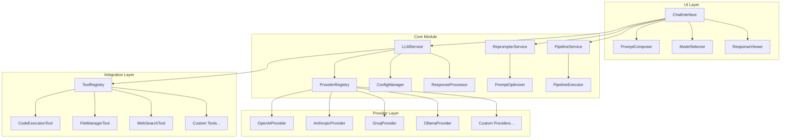

# LLMS E IA: BRAINLINK

**ID Documento**: BL-LLM-001  
**Versão**: 1.0.0  
**Data**: 2025-03-19 04:20:43  
**Dependências**: BL-VC-001, BL-AT-001, BL-BE-001  

## Visão Geral do Módulo de IA

O módulo de IA do Brainlink é projetado para fornecer uma interface unificada e extensível para interação com diversos modelos de linguagem (LLMs) e capacidades de inteligência artificial. Este módulo permite que usuários configurem, personalizem e interajam com múltiplos provedores de IA, desde serviços em nuvem como OpenAI, Anthropic e Groq, até modelos locais via Ollama e LM Studio.

A arquitetura do módulo de IA é construída para maximizar flexibilidade, eficiência e extensibilidade, permitindo adicionar novos modelos e capacidades com mínimas modificações no código principal. O sistema implementa recursos avançados como reprompter automático, pipelines de prompts, orquestração multi-LLM e integração profunda com todos os outros módulos da plataforma.

### Objetivos Principais do Módulo de IA

1. **Unificação de Interfaces**: Fornecer uma API consistente para todos os provedores de IA
2. **Extensibilidade**: Facilitar a adição de novos modelos e provedores
3. **Personalização**: Permitir configurações detalhadas e templates de prompts
4. **Otimização**: Maximizar a qualidade das respostas através de estratégias avançadas de prompting
5. **Integração**: Conectar capacidades de IA com todos os outros componentes da plataforma

## Arquitetura do Módulo de IA

### 1. Componentes Principais

A arquitetura do módulo de IA é organizada em várias camadas e componentes, cada um com responsabilidades específicas:



### 2. Fluxo de Dados

O fluxo típico de dados no módulo de IA segue este caminho:

1. **Entrada do Usuário**: O usuário insere um prompt na interface de chat
2. **Pré-processamento**: O prompt é opcionalmente otimizado pelo reprompter
3. **Roteamento**: O serviço LLM determina qual provedor e modelo usar
4. **Processamento**: O provedor adequado processa o prompt e gera uma resposta
5. **Pós-processamento**: A resposta é enriquecida, formatada e processada para ações
6. **Apresentação**: A resposta final é exibida ao usuário na interface
7. **Follow-up**: Eventuais ações de ferramentas são executadas conforme necessário

### 3. Detalhamento de Componentes

#### 3.1. LLMService (Serviço Central)

```typescript
// lib/services/llm.ts
import { coreService } from './core';
import type { LLMProvider, ChatOptions, ChatMessage, ChatResponse } from '@/types';

export class LLMService {
  private providers: Map<string, LLMProvider> = new Map();
  
  constructor() {
    coreService.registerService('llm', this);
  }
  
  /**
   * Registra um provedor de LLM
   */
  registerProvider(id: string, provider: LLMProvider): void {
    this.providers.set(id, provider);
    coreService.emit('llm:provider:registered', { id, name: provider.name });
  }
  
  /**
   * Obtém a lista de provedores disponíveis
   */
  getProviders(): LLMProvider[] {
    return Array.from(this.providers.values());
  }
  
  /**
   * Obtém um provedor específico
   */
  getProvider(id: string): LLMProvider {
    const provider = this.providers.get(id);
    if (!provider) {
      throw new Error(`LLM provider ${id} not found`);
    }
    return provider;
  }
  
  /**
   * Envia um prompt para o LLM e obtém resposta completa
   */
  async chat(
    providerId: string,
    messages: ChatMessage[],
    options: ChatOptions
  ): Promise<ChatResponse> {
    const provider = this.getProvider(providerId);
    return await provider.chat(messages, options);
  }
  
  /**
   * Envia um prompt para o LLM com streaming de resposta
   */
  async streamChat(
    providerId: string,
    messages: ChatMessage[],
    options: ChatOptions,
    callbacks: {
      onStart?: (id: string) => void;
      onToken?: (token: string) => void;
      onToolCall?: (toolCall: any) => void;
      onComplete?: (response: ChatResponse) => void;
      onError?: (error: Error) => void;
    }
  ): Promise<void> {
    const provider = this.getProvider(providerId);
    
    try {
      // Verificar se o provider suporta streaming
      if (!provider.streamChat) {
        // Fallback para não-streaming
        const response = await provider.chat(messages, options);
        callbacks.onStart?.(response.id);
        
        // Simular streaming enviando tokens um a um
        if (callbacks.onToken && response.message.content) {
          // Simular streaming enviando caracteres um por vez
          const tokens = response.message.content.split('');
          for (const token of tokens) {
            callbacks.onToken(token);
            // Pequeno delay para simular streaming
            await new Promise(resolve => setTimeout(resolve, 10));
          }
        }
        
        callbacks.onComplete?.(response);
      } else {
        // Usar streaming nativo do provider
        await provider.streamChat(messages, options, callbacks);
      }
    } catch (error) {
      callbacks.onError?.(error instanceof Error ? error : new Error(String(error)));
    }
  }
  
  /**
   * Determina automaticamente o melhor modelo para uma tarefa
   */
  async selectBestModel(
    task: string,
    preferences: {
      preferredProvider?: string;
      preferLocal?: boolean;
      maxCost?: number;
    } = {}
  ): Promise<{ providerId: string; model: string }> {
    // Implementação de seleção inteligente de modelo baseada na tarefa
    // e preferências do usuário...
    
    // Por padrão, usar configuração padrão do usuário
    // ou OpenAI GPT-3.5 Turbo como fallback
    return {
      providerId: preferences.preferredProvider || 'openai',
      model: 'gpt-3.5-turbo',
    };
  }
}
```

#### 3.2. Provedores de LLM

```typescript
// Exemplo de implementação do provedor OpenAI
// lib/llm/providers/openai.ts
import OpenAI from 'openai';
import { LLMProvider, ChatMessage, ChatOptions, ChatResponse } from '@/types';

export const createOpenAIProvider = (): LLMProvider => {
  return {
    id: 'openai',
    name: 'OpenAI',
    models: [
      { id: 'gpt-4o', name: 'GPT-4o', contextSize: 128000 },
      { id: 'gpt-4-turbo', name: 'GPT-4 Turbo', contextSize: 128000 },
      { id: 'gpt-3.5-turbo', name: 'GPT-3.5 Turbo', contextSize: 16385 },
    ],
    requiresApiKey: true,
    
    async chat(messages: ChatMessage[], options: ChatOptions): Promise<ChatResponse> {
      const client = new OpenAI({ apiKey: options.apiKey || process.env.OPENAI_API_KEY });
      
      try {
        const completion = await client.chat.completions.create({
          model: options.model,
          messages: messages.map(m => ({
            role: m.role,
            content: m.content,
            name: m.name,
            tool_calls: m.toolCalls,
          })),
          temperature: options.temperature || 0.7,
          max_tokens: options.maxTokens,
          tools: options.tools,
        });
        
        const choice = completion.choices[0];
        
        return {
          id: completion.id,
          message: {
            role: 'assistant',
            content: choice.message.content || '',
            toolCalls: choice.message.tool_calls?.map(tc => ({
              id: tc.id,
              name: tc.function.name,
              arguments: JSON.parse(tc.function.arguments),
            })),
          },
          usage: completion.usage ? {
            promptTokens: completion.usage.prompt_tokens,
            completionTokens: completion.usage.completion_tokens,
            totalTokens: completion.usage.total_tokens,
          } : undefined,
        };
      } catch (error) {
        console.error('OpenAI API error:', error);
        throw new Error(`OpenAI API error: ${error instanceof Error ? error.message : String(error)}`);
      }
    },
    
    async streamChat(
      messages: ChatMessage[],
      options: ChatOptions,
      callbacks: {
        onStart?: (id: string) => void;
        onToken?: (token: string) => void;
        onToolCall?: (toolCall: any) => void;
        onComplete?: (response: ChatResponse) => void;
      }
    ): Promise<void> {
      const client = new OpenAI({ apiKey: options.apiKey || process.env.OPENAI_API_KEY });
      
      try {
        const stream = await client.chat.completions.create({
          model: options.model,
          messages: messages.map(m => ({
            role: m.role,
            content: m.content,
            name: m.name,
          })),
          temperature: options.temperature || 0.7,
          max_tokens: options.maxTokens,
          stream: true,
          tools: options.tools,
        });
        
        let responseId: string | undefined;
        let fullContent = '';
        let toolCalls: any[] = [];
        
        for await (const chunk of stream) {
          // Capturar ID da resposta
          if (!responseId && chunk.id) {
            responseId = chunk.id;
            callbacks.onStart?.(responseId);
          }
          
          // Processar deltas de conteúdo
          const content = chunk.choices[0]?.delta?.content || '';
          if (content) {
            fullContent += content;
            callbacks.onToken?.(content);
          }
          
          // Processar tool calls
          if (chunk.choices[0]?.delta?.tool_calls) {
            const deltaTool = chunk.choices[0].delta.tool_calls[0];
            
            // Iniciar nova tool call
            if (deltaTool.index === 0 && deltaTool.id) {
              toolCalls.push({
                id: deltaTool.id,
                name: deltaTool.function?.name || '',
                arguments: deltaTool.function?.arguments || '',
              });
            } else if (toolCalls.length > 0) {
              // Atualizar tool call existente
              const currentTool = toolCalls[toolCalls.length - 1];
              
              if (deltaTool.function?.name) {
                currentTool.name += deltaTool.function.name;
              }
              
              if (deltaTool.function?.arguments) {
                currentTool.arguments += deltaTool.function.arguments;
              }
            }
          }
        }
        
        // Processar tool calls (parsing argumentos JSON)
        const processedToolCalls = toolCalls.map(tc => ({
          id: tc.id,
          name: tc.name,
          arguments: tc.arguments ? JSON.parse(tc.arguments) : {},
        }));
        
        // Callback final com resposta completa
        if (responseId) {
          callbacks.onComplete?.({
            id: responseId,
            message: {
              role: 'assistant',
              content: fullContent,
              toolCalls: processedToolCalls.length > 0 ? processedToolCalls : undefined,
            },
          });
        }
      } catch (error) {
        console.error('OpenAI Streaming API error:', error);
        throw new Error(`OpenAI Streaming API error: ${error instanceof Error ? error.message : String(error)}`);
      }
    },
  };
};
```

#### 3.3. Reprompter (Otimizador de Prompts)

```typescript
// lib/services/reprompter.ts
import { coreService } from './core';
import { LLMService } from './llm';
import type { RepromptOptions, RepromptResult } from '@/types';

interface PromptTemplate {
  id: string;
  name: string;
  description: string;
  template: string;
  variables: string[];
}

export class ReprompterService {
  private llmService: LLMService;
  private templates: Map<string, PromptTemplate> = new Map();
  
  constructor(llmService: LLMService) {
    this.llmService = llmService;
    coreService.registerService('reprompter', this);
    
    // Registrar templates padrão
    this.registerDefaultTemplates();
  }
  
  /**
   * Registra templates padrão
   */
  private registerDefaultTemplates(): void {
    this.registerTemplate({
      id: 'general-improvement',
      name: 'Melhoria Geral',
      description: 'Melhora a clareza e eficácia do prompt',
      template: `Você é um especialista em otimização de prompts. 
Por favor, melhore o seguinte prompt para ser mais claro, específico e eficaz:

PROMPT ORIGINAL:
{{prompt}}

Seu prompt otimizado deve:
1. Ser mais claro e específico
2. Eliminar ambiguidades
3. Adicionar detalhes relevantes
4. Ter uma estrutura mais efetiva

PROMPT OTIMIZADO:`,
      variables: ['prompt']
    });
    
    this.registerTemplate({
      id: 'code-improvement',
      name: 'Melhoria de Código',
      description: 'Otimiza prompts para geração de código',
      template: `Você é um especialista em criação de prompts para geração de código.
Por favor, melhore o seguinte prompt para obter código de melhor qualidade:

PROMPT ORIGINAL:
{{prompt}}

Seu prompt otimizado deve:
1. Especificar linguagem de programação e versão
2. Definir claramente os requisitos funcionais
3. Incluir exemplos de entrada/saída quando relevante
4. Especificar o estilo de código desejado e padrões

PROMPT OTIMIZADO:`,
      variables: ['prompt']
    });
    
    // Mais templates...
  }
  
  /**
   * Registra um novo template
   */
  registerTemplate(template: PromptTemplate): void {
    this.templates.set(template.id, template);
  }
  
  /**
   * Lista templates disponíveis
   */
  getTemplates(): PromptTemplate[] {
    return Array.from(this.templates.values());
  }
  
  /**
   * Aplica um template a um prompt
   */
  applyTemplate(
    templateId: string,
    variables: Record<string, string>
  ): string {
    const template = this.templates.get(templateId);
    if (!template) {
      throw new Error(`Template ${templateId} not found`);
    }
    
    let result = template.template;
    for (const [key, value] of Object.entries(variables)) {
      result = result.replace(new RegExp(`{{${key}}}`, 'g'), value);
    }
    
    return result;
  }
  
  /**
   * Otimiza um prompt usando heurísticas ou IA
   */
  async optimizePrompt(
    prompt: string,
    options: RepromptOptions = {}
  ): Promise<RepromptResult> {
    if (options.templateId) {
      // Usar template predefinido
      const optimized = this.applyTemplate(options.templateId, { 
        prompt,
        ...options.variables
      });
      
      return {
        original: prompt,
        optimized,
        changes: [{
          type: 'template',
          description: `Applied template: ${options.templateId}`
        }]
      };
    }
    
    // Usar IA para otimizar o prompt
    const mode = options.mode || 'auto';
    
    try {
      const systemPrompt = `Você é um especialista em otimização de prompts para LLMs.
Melhore o prompt do usuário para:
1. Ser mais claro e específico
2. Eliminar ambiguidades
3. Estruturar melhor a informação
4. Obter respostas mais precisas

Analise o prompt cuidadosamente e sugira uma versão melhorada.
Retorne um JSON com:
{
  "optimized": "O prompt otimizado",
  "changes": [{"type": "clarification"|"structure"|"specificity"|"context", "description": "Descrição da mudança"}]
}`;

      const response = await this.llmService.chat('openai', [
        { role: 'system', content: systemPrompt },
        { role: 'user', content: `Meu prompt: "${prompt}"` }
      ], {
        model: 'gpt-3.5-turbo',
        temperature: 0.3,
      });
      
      try {
        // Tentar extrair JSON da resposta
        const content = response.message.content || '';
        const jsonMatch = content.match(/```json\n([\s\S]*?)\n```/) || 
                          content.match(/```\n([\s\S]*?)\n```/) ||
                          content.match(/\{[\s\S]*\}/);
                          
        let parsed;
        if (jsonMatch) {
          parsed = JSON.parse(jsonMatch[0]);
        } else {
          parsed = JSON.parse(content);
        }
        
        return {
          original: prompt,
          optimized: parsed.optimized || content,
          changes: parsed.changes || [{
            type: 'auto',
            description: 'Automatic optimization'
          }]
        };
      } catch (parseError) {
        // Fallback se não conseguir extrair JSON
        return {
          original: prompt,
          optimized: response.message.content || prompt,
          changes: [{
            type: 'auto',
            description: 'Automatic optimization (JSON parsing failed)'
          }]
        };
      }
    } catch (error) {
      console.error('Error optimizing prompt:', error);
      return {
        original: prompt,
        optimized: prompt,
        changes: []
      };
    }
  }
}
```

#### 3.4. Pipeline de Prompts

```typescript
// lib/services/pipeline.ts
import { coreService } from './core';
import { v4 as uuidv4 } from 'uuid';
import type { PromptPipeline, PipelineNode, PipelineEdge, PipelineExecutionResult } from '@/types';

export class PipelineService {
  private pipelines: Map<string, PromptPipeline> = new Map();
  private nodeHandlers: Map<string, (node: PipelineNode, input: string) => Promise<string>> = new Map();
  
  constructor() {
    coreService.registerService('pipeline', this);
    
    // Registrar handlers padrão para os tipos de nós
    this.registerDefaultNodeHandlers();
  }
  
  /**
   * Registra handlers padrão para tipos de nós
   */
  private registerDefaultNodeHandlers(): void {
    // Handler para nó de LLM
    this.registerNodeHandler('llm', async (node, input) => {
      const llmService = coreService.getService<any>('llm');
      const config = node.data || {};
      
      const response = await llmService.chat(
        config.provider || 'openai',
        [
          ...(config.systemPrompt ? [{ role: 'system', content: config.systemPrompt }] : []),
          { role: 'user', content: input }
        ],
        {
          model: config.model || 'gpt-3.5-turbo',
          temperature: config.temperature || 0.7,
        }
      );
      
      return response.message.content || '';
    });
    
    // Handler para nó de reprompter
    this.registerNodeHandler('reprompter', async (node, input) => {
      const reprompterService = coreService.getService<any>('reprompter');
      const config = node.data || {};
      
      const result = await reprompterService.optimizePrompt(input, {
        mode: config.mode || 'auto',
        templateId: config.templateId,
      });
      
      return result.optimized;
    });
    
    // Handler para nó de transformação
    this.registerNodeHandler('transform', async (node, input) => {
      const config = node.data || {};
      const transformType = config.transformType || 'passthrough';
      
      switch (transformType) {
        case 'uppercase':
          return input.toUpperCase();
        case 'lowercase':
          return input.toLowerCase();
        case 'trim':
          return input.trim();
        case 'extract':
          try {
            const regex = new RegExp(config.pattern || '', 'g');
            const matches = Array.from(input.matchAll(regex));
            return matches.map(m => m[0]).join('\n');
          } catch (error) {
            return input;
          }
        case 'replace':
          try {
            const regex = new RegExp(config.search || '', 'g');
            return input.replace(regex, config.replace || '');
          } catch (error) {
            return input;
          }
        case 'passthrough':
        default:
          return input;
      }
    });
    
    // Handler para nó condicional
    this.registerNodeHandler('conditional', async (node, input) => {
      const config = node.data || {};
      const condition = config.condition || '';
      
      // Avaliar a condição
      let result = false;
      
      if (condition.includes('{{input}}')) {
        // Condição baseada no input
        try {
          const evalStr = condition.replace(/\{\{input\}\}/g, JSON.stringify(input));
          result = eval(evalStr);
        } catch (error) {
          console.error('Error evaluating condition:', error);
        }
      } else {
        // Condição como LLM
        try {
          const llmService = coreService.getService<any>('llm');
          const response = await llmService.chat(
            'openai',
            [
              {
                role: 'system',
                content: `Avalie se a seguinte entrada atende à condição: "${condition}". 
                Responda apenas com "true" ou "false".`
              },
              { role: 'user', content: input }
            ],
            {
              model: 'gpt-3.5-turbo',
              temperature: 0.1,
            }
          );
          
          const content = response.message.content || '';
          result = content.toLowerCase().includes('true');
        } catch (error) {
          console.error('Error evaluating condition via LLM:', error);
        }
      }
      
      // Retornar resultado baseado na avaliação da condição
      return result ? 
        (config.trueOutput || input) : 
        (config.falseOutput || input);
    });
  }
  
  /**
   * Registra um handler para um tipo específico de nó
   */
  registerNodeHandler(
    nodeType: string,
    handler: (node: PipelineNode, input: string) => Promise<string>
  ): void {
    this.nodeHandlers.set(nodeType, handler);
    coreService.emit('pipeline:handler:registered', { nodeType });
  }
  
  /**
   * Cria um novo pipeline
   */
  createPipeline(name: string, description?: string): PromptPipeline {
    const id = uuidv4();
    const pipeline: PromptPipeline = {
      id,
      name,
      description,
      nodes: [],
      edges: [],
      createdAt: new Date().toISOString(),
      updatedAt: new Date().toISOString(),
    };
    
    this.pipelines.set(id, pipeline);
    return pipeline;
  }
  
  /**
   * Obtém um pipeline pelo ID
   */
  getPipeline(id: string): PromptPipeline | undefined {
    return this.pipelines.get(id);
  }
  
  /**
   * Lista todos os pipelines
   */
  getPipelines(): PromptPipeline[] {
    return Array.from(this.pipelines.values());
  }
  
  /**
   * Atualiza um pipeline existente
   */
  updatePipeline(id: string, updates: Partial<PromptPipeline>): PromptPipeline {
    const pipeline = this.getPipeline(id);
    if (!pipeline) {
      throw new Error(`Pipeline ${id} not found`);
    }
    
    const updated = {
      ...pipeline,
      ...updates,
      id, // Garantir que o ID não seja alterado
      updatedAt: new Date().toISOString(),
    };
    
    this.pipelines.set(id, updated);
    return updated;
  }
  
  /**
   * Remove um pipeline
   */
  deletePipeline(id: string): boolean {
    return this.pipelines.delete(id);
  }
  
  /**
   * Executa um pipeline
   */
  async executePipeline(
    pipelineId: string, 
    initialInput: string,
    options: {
      onProgress?: (progress: number, nodeId: string) => void;
      onNodeComplete?: (nodeId: string, output: string) => void;
      onError?: (error: Error, nodeId: string) => void;
    } = {}
  ): Promise<PipelineExecutionResult> {
    const pipeline = this.getPipeline(pipelineId);
    if (!pipeline) {
      throw new Error(`Pipeline ${pipelineId} not found`);
    }
    
    const startTime = Date.now();
    const nodeOutputs = new Map<string, string>();
    const { nodes, edges } = pipeline;
    
    // Construir gráfico de dependências
    const incomingEdges = new Map<string, string[]>();
    const outgoingEdges = new Map<string, string[]>();
    
    for (const edge of edges) {
      // Mapear entradas para cada nó
      if (!incomingEdges.has(edge.target)) {
        incomingEdges.set(edge.target, []);
      }
           incomingEdges.get(edge.target)!.push(edge.source);
      
      // Mapear saídas para cada nó
      if (!outgoingEdges.has(edge.source)) {
        outgoingEdges.set(edge.source, []);
      }
      outgoingEdges.get(edge.source)!.push(edge.target);
    }
    
    // Encontrar nós de entrada (sem arestas de entrada)
    const entryNodes = nodes.filter(node => 
      !incomingEdges.has(node.id) || incomingEdges.get(node.id)?.length === 0
    );
    
    if (entryNodes.length === 0) {
      throw new Error('Pipeline não possui nós de entrada');
    }
    
    // Mapear nós por ID para acesso rápido
    const nodesById = new Map(nodes.map(node => [node.id, node]));
    
    // Controlar nós prontos para execução e nós processados
    const readyNodes = [...entryNodes];
    const processedNodes = new Set<string>();
    const totalNodes = nodes.length;
    
    try {
      // Loop principal de execução
      while (readyNodes.length > 0) {
        const currentNode = readyNodes.shift()!;
        const nodeId = currentNode.id;
        
        // Obter entrada para o nó atual
        let nodeInput = initialInput;
        
        // Se não for um nó de entrada, combinar resultados dos nós anteriores
        const incomingNodeIds = incomingEdges.get(nodeId) || [];
        if (incomingNodeIds.length > 0) {
          if (currentNode.type === 'combiner') {
            // Nó combinador - juntar todas as entradas
            nodeInput = incomingNodeIds
              .map(id => nodeOutputs.get(id) || '')
              .join('\n\n');
          } else {
            // Nós padrão - usar o resultado do primeiro nó conectado
            nodeInput = nodeOutputs.get(incomingNodeIds[0]) || initialInput;
          }
        }
        
        try {
          // Executar o nó
          const handler = this.nodeHandlers.get(currentNode.type);
          if (!handler) {
            throw new Error(`Handler para nó do tipo ${currentNode.type} não encontrado`);
          }
          
          // Executar o handler do nó
          const output = await handler(currentNode, nodeInput);
          
          // Armazenar resultado
          nodeOutputs.set(nodeId, output);
          
          // Marcar como processado
          processedNodes.add(nodeId);
          
          // Notificar progresso
          const progress = processedNodes.size / totalNodes;
          options.onProgress?.(progress, nodeId);
          options.onNodeComplete?.(nodeId, output);
          
          // Verificar nós subsequentes que podem ser executados agora
          const nextNodeIds = outgoingEdges.get(nodeId) || [];
          for (const nextId of nextNodeIds) {
            const dependencyIds = incomingEdges.get(nextId) || [];
            const allDependenciesMet = dependencyIds.every(id => 
              processedNodes.has(id)
            );
            
            if (allDependenciesMet && !processedNodes.has(nextId)) {
              const nextNode = nodesById.get(nextId);
              if (nextNode) {
                readyNodes.push(nextNode);
              }
            }
          }
        } catch (error) {
          options.onError?.(
            error instanceof Error ? error : new Error(String(error)),
            nodeId
          );
          
          // Continuar com outros nós mesmo em caso de erro
          processedNodes.add(nodeId);
        }
      }
      
      // Encontrar nós de saída (sem conexões de saída)
      const exitNodeIds = Array.from(nodesById.keys()).filter(id => 
        !outgoingEdges.has(id) || outgoingEdges.get(id)?.length === 0
      );
      
      // Se não há nós de saída explícitos, usar todos os nós processados
      const resultNodeIds = exitNodeIds.length > 0 
        ? exitNodeIds 
        : Array.from(processedNodes);
      
      // Coletar resultados finais
      const results = resultNodeIds.map(id => ({
        nodeId: id,
        output: nodeOutputs.get(id) || '',
        node: nodesById.get(id)
      }));
      
      // Tempo total de execução
      const endTime = Date.now();
      const executionTime = endTime - startTime;
      
      return {
        success: true,
        results,
        nodeOutputs: Object.fromEntries(nodeOutputs),
        executionTime,
      };
    } catch (error) {
      return {
        success: false,
        error: error instanceof Error ? error.message : String(error),
        nodeOutputs: Object.fromEntries(nodeOutputs),
        executionTime: Date.now() - startTime,
      };
    }
  }
}
```

### 4. Integração de Ferramentas e Agentes

O sistema de ferramentas do Brainlink permite que os LLMs interajam com funcionalidades do sistema e serviços externos, expandindo suas capacidades para além da geração de texto.

```typescript
// lib/services/tool.ts
import { coreService } from './core';
import { v4 as uuidv4 } from 'uuid';
import type { Tool, ToolDefinition, ToolCallResult } from '@/types';

export class ToolService {
  private tools: Map<string, Tool> = new Map();
  
  constructor() {
    coreService.registerService('tool', this);
    
    // Registrar ferramentas padrão
    this.registerDefaultTools();
  }
  
  /**
   * Registra ferramentas padrão do sistema
   */
  private registerDefaultTools(): void {
    // Ferramenta: Execução de código
    this.registerTool({
      name: 'execute_code',
      description: 'Executa código em uma linguagem de programação especificada',
      parameters: {
        type: 'object',
        properties: {
          language: {
            type: 'string',
            description: 'Linguagem de programação (js, python, etc.)',
          },
          code: {
            type: 'string',
            description: 'Código a ser executado',
          },
        },
        required: ['language', 'code'],
      },
      handler: async (args) => {
        const executorService = coreService.getService<any>('executor');
        
        const result = await executorService.executeCode(
          args.language,
          args.code
        );
        
        return {
          success: result.success,
          output: result.output,
          result: result.result,
          error: result.error,
        };
      }
    });
    
    // Ferramenta: Busca de arquivos
    this.registerTool({
      name: 'search_files',
      description: 'Busca arquivos no workspace por nome ou conteúdo',
      parameters: {
        type: 'object',
        properties: {
          query: {
            type: 'string',
            description: 'Termo de busca (nome do arquivo ou conteúdo)',
          },
          fileType: {
            type: 'string',
            description: 'Tipo de arquivo opcional (ex: .js, .md)',
          },
          limit: {
            type: 'number',
            description: 'Número máximo de resultados (padrão: 10)',
          },
        },
        required: ['query'],
      },
      handler: async (args) => {
        const fileService = coreService.getService<any>('file');
        
        const results = await fileService.searchFiles({
          query: args.query,
          fileType: args.fileType,
          limit: args.limit || 10,
        });
        
        return {
          success: true,
          count: results.length,
          files: results.map(file => ({
            name: file.name,
            path: file.path,
            size: file.size,
            lastModified: file.lastModified,
          }))
        };
      }
    });
    
    // Ferramenta: Leitura de arquivo
    this.registerTool({
      name: 'read_file',
      description: 'Lê o conteúdo de um arquivo',
      parameters: {
        type: 'object',
        properties: {
          path: {
            type: 'string',
            description: 'Caminho do arquivo a ser lido',
          },
        },
        required: ['path'],
      },
      handler: async (args) => {
        const fileService = coreService.getService<any>('file');
        
        try {
          const content = await fileService.readFile(args.path);
          
          return {
            success: true,
            content,
            path: args.path,
          };
        } catch (error) {
          return {
            success: false,
            error: error instanceof Error ? error.message : String(error),
            path: args.path,
          };
        }
      }
    });
    
    // Ferramenta: Gravação de arquivo
    this.registerTool({
      name: 'write_file',
      description: 'Escreve conteúdo em um arquivo',
      parameters: {
        type: 'object',
        properties: {
          path: {
            type: 'string',
            description: 'Caminho do arquivo a ser escrito',
          },
          content: {
            type: 'string',
            description: 'Conteúdo a ser escrito no arquivo',
          },
          createIfNotExists: {
            type: 'boolean',
            description: 'Se deve criar o arquivo caso não exista',
          },
        },
        required: ['path', 'content'],
      },
      handler: async (args) => {
        const fileService = coreService.getService<any>('file');
        
        try {
          await fileService.writeFile(
            args.path, 
            args.content, 
            { create: args.createIfNotExists !== false }
          );
          
          return {
            success: true,
            path: args.path,
          };
        } catch (error) {
          return {
            success: false,
            error: error instanceof Error ? error.message : String(error),
            path: args.path,
          };
        }
      }
    });
    
    // Mais ferramentas...
  }
  
  /**
   * Registra uma nova ferramenta
   */
  registerTool(tool: Tool): void {
    this.tools.set(tool.name, tool);
    coreService.emit('tool:registered', { name: tool.name });
  }
  
  /**
   * Lista todas as ferramentas disponíveis
   */
  getTools(): Tool[] {
    return Array.from(this.tools.values());
  }
  
  /**
   * Obtém uma ferramenta pelo nome
   */
  getTool(name: string): Tool | undefined {
    return this.tools.get(name);
  }
  
  /**
   * Obtém definições de ferramentas para uso com LLMs
   */
  getToolDefinitions(): ToolDefinition[] {
    return this.getTools().map(tool => ({
      type: 'function',
      function: {
        name: tool.name,
        description: tool.description,
        parameters: tool.parameters,
      }
    }));
  }
  
  /**
   * Executa uma chamada de ferramenta
   */
  async executeToolCall(
    name: string,
    args: any
  ): Promise<ToolCallResult> {
    const tool = this.getTool(name);
    
    if (!tool) {
      return {
        id: uuidv4(),
        name,
        success: false,
        error: `Ferramenta '${name}' não encontrada`,
      };
    }
    
    try {
      // Executar a ferramenta
      const result = await tool.handler(args);
      
      return {
        id: uuidv4(),
        name,
        success: true,
        result,
      };
    } catch (error) {
      return {
        id: uuidv4(),
        name,
        success: false,
        error: error instanceof Error ? error.message : String(error),
      };
    }
  }
  
  /**
   * Processa múltiplas chamadas de ferramentas de uma resposta de LLM
   */
  async processToolCalls(toolCalls: any[]): Promise<ToolCallResult[]> {
    const results = [];
    
    for (const call of toolCalls) {
      const result = await this.executeToolCall(
        call.name,
        call.arguments
      );
      
      results.push(result);
    }
    
    return results;
  }
}
```

## Componentes de UI para Interação com LLMs

### 1. ChatInterface

O componente de chat é a principal interface para interação com os LLMs, permitindo conversas naturais e comandos avançados:

```tsx
// components/llm/ChatInterface.tsx
import { useState, useRef, useEffect } from 'react';
import { useVirtual } from 'react-virtual';
import { useChat } from '@/hooks/useChat';
import { MessageInput } from './MessageInput';
import { MessageBubble } from './MessageBubble';
import { ModelSelector } from './ModelSelector';
import { Button } from '../ui/button';
import { Spinner } from '../ui/spinner';
import { Icon } from '../ui/icon';
import { ChatMessage, LLMProvider, LLMModel } from '@/types';

interface ChatInterfaceProps {
  chatId?: string;
  initialMessages?: ChatMessage[];
  initialProvider?: string;
  initialModel?: string;
  showModelSelector?: boolean;
  toolsEnabled?: boolean;
  fullHeight?: boolean;
  onChatCreated?: (chatId: string) => void;
}

export const ChatInterface = ({
  chatId,
  initialMessages = [],
  initialProvider = 'openai',
  initialModel = 'gpt-3.5-turbo',
  showModelSelector = true,
  toolsEnabled = true,
  fullHeight = false,
  onChatCreated,
}: ChatInterfaceProps) => {
  // Acesso aos serviços de chat
  const { 
    messages,
    isLoading,
    activeProvider,
    activeModel,
    error,
    streamingMessage,
    sendMessage,
    setProvider,
    setModel,
    availableProviders,
    availableModels,
    chatId: activeChatId,
    toolResults,
    regenerateMessage,
    stopGeneration,
  } = useChat({
    chatId,
    initialMessages,
    initialProvider,
    initialModel,
    toolsEnabled,
    onChatCreated,
  });
  
  // Referência ao container de mensagens para rolagem
  const containerRef = useRef<HTMLDivElement>(null);
  
  // Configuração de virtualização para mensagens (performance)
  const rowVirtualizer = useVirtual({
    size: messages.length,
    parentRef: containerRef,
    estimateSize: useCallback(() => 100, []),
    overscan: 5,
  });
  
  // Input de mensagem
  const [input, setInput] = useState('');
  
  // Efeito para rolagem automática para o final
  useEffect(() => {
    if (containerRef.current && messages.length > 0) {
      const scrollToBottom = () => {
        if (containerRef.current) {
          containerRef.current.scrollTop = containerRef.current.scrollHeight;
        }
      };
      
      scrollToBottom();
    }
  }, [messages, streamingMessage]);
  
  // Handler para envio de mensagens
  const handleSendMessage = async () => {
    if (!input.trim() || isLoading) return;
    
    await sendMessage(input.trim());
    setInput('');
  };
  
  // Handler para tecla Enter no input
  const handleKeyDown = (e: React.KeyboardEvent) => {
    if (e.key === 'Enter' && !e.shiftKey) {
      e.preventDefault();
      handleSendMessage();
    }
  };
  
  return (
    <div className={`flex flex-col ${fullHeight ? 'h-full' : ''} bg-white dark:bg-gray-900 rounded-lg overflow-hidden border border-gray-200 dark:border-gray-800`}>
      {/* Cabeçalho */}
      <div className="p-4 border-b border-gray-200 dark:border-gray-800 flex items-center justify-between">
        <h3 className="text-lg font-medium">Chat</h3>
        
        {/* Seletor de modelo (opcional) */}
        {showModelSelector && (
          <ModelSelector
            providers={availableProviders}
            models={availableModels}
            selectedProvider={activeProvider}
            selectedModel={activeModel}
            onProviderChange={setProvider}
            onModelChange={setModel}
          />
        )}
      </div>
      
      {/* Container de mensagens */}
      <div 
        ref={containerRef} 
        className="flex-1 overflow-y-auto p-4 space-y-4"
        style={{ height: fullHeight ? undefined : '400px' }}
      >
        <div
          style={{
            height: `${rowVirtualizer.totalSize}px`,
            width: '100%',
            position: 'relative',
          }}
        >
          {rowVirtualizer.virtualItems.map(virtualRow => {
            const message = messages[virtualRow.index];
            return (
              <div
                key={virtualRow.index}
                style={{
                  position: 'absolute',
                  top: 0,
                  left: 0,
                  width: '100%',
                  height: virtualRow.size,
                  transform: `translateY(${virtualRow.start}px)`,
                }}
              >
                <MessageBubble
                  message={message}
                  isStreaming={streamingMessage?.id === message.id}
                  streamingContent={
                    streamingMessage?.id === message.id
                      ? streamingMessage.content
                      : undefined
                  }
                  toolResults={
                    message.role === 'assistant' && message.id
                      ? toolResults[message.id]
                      : undefined
                  }
                  onRegenerate={
                    message.role === 'assistant'
                      ? () => regenerateMessage(message.id)
                      : undefined
                  }
                />
              </div>
            );
          })}
        </div>
        
        {/* Indicador de digitação durante streaming */}
        {isLoading && !streamingMessage && (
          <div className="flex items-center space-x-2 text-gray-500">
            <Spinner size="sm" />
            <span>Gerando resposta...</span>
          </div>
        )}
        
        {/* Mensagem de erro */}
        {error && (
          <div className="p-3 rounded-lg bg-red-50 text-red-700 dark:bg-red-900/20 dark:text-red-400">
            <div className="flex items-center">
              <Icon name="alertCircle" className="mr-2" />
              <span>Erro: {error}</span>
            </div>
          </div>
        )}
      </div>
      
      {/* Área de input */}
      <div className="p-4 border-t border-gray-200 dark:border-gray-800">
        <form onSubmit={(e) => { e.preventDefault(); handleSendMessage(); }}>
          <div className="flex space-x-2">
            <MessageInput
              value={input}
              onChange={setInput}
              onKeyDown={handleKeyDown}
              placeholder="Digite sua mensagem..."
              disabled={isLoading}
              className="flex-1"
            />
            
            {isLoading ? (
              <Button 
                type="button" 
                variant="ghost" 
                onClick={stopGeneration}
                title="Parar geração"
              >
                <Icon name="square" />
              </Button>
            ) : (
              <Button 
                type="submit" 
                disabled={!input.trim() || isLoading}
                title="Enviar mensagem"
              >
                <Icon name="send" />
              </Button>
            )}
          </div>
        </form>
      </div>
    </div>
  );
};
```

### 2. LLM Config Panel

Painel para configuração avançada de LLMs, permitindo ajuste fino de parâmetros e configurações:

```tsx
// components/llm/LLMConfigPanel.tsx
import { useState, useEffect } from 'react';
import { Tabs, TabsContent, TabsList, TabsTrigger } from '../ui/tabs';
import { Card, CardContent, CardHeader, CardTitle } from '../ui/card';
import { Label } from '../ui/label';
import { Input } from '../ui/input';
import { Slider } from '../ui/slider';
import { Switch } from '../ui/switch';
import { Button } from '../ui/button';
import { ApiKeyInput } from './ApiKeyInput';
import { Select, SelectContent, SelectItem, SelectTrigger, SelectValue } from '../ui/select';
import { IconButton } from '../ui/icon-button';
import { Icon } from '../ui/icon';
import type { LLMProvider, LLMModel, LLMSettings } from '@/types';
import { useLLMConfig } from '@/hooks/useLLMConfig';

interface LLMConfigPanelProps {
  onSettingsChange?: (settings: LLMSettings) => void;
  initialSettings?: Partial<LLMSettings>;
}

export const LLMConfigPanel = ({
  onSettingsChange,
  initialSettings = {},
}: LLMConfigPanelProps) => {
  const { 
    providers,
    models,
    settings,
    loadSettings,
    saveSettings,
    saveApiKey,
    testConnection,
    hasApiKey,
    isTestingConnection,
    connectionStatus,
  } = useLLMConfig();
  
  // Estado local para as configurações atuais
  const [currentSettings, setCurrentSettings] = useState<LLMSettings>({
    provider: 'openai',
    model: 'gpt-3.5-turbo',
    temperature: 0.7,
    maxTokens: undefined,
    topP: 1,
    frequencyPenalty: 0,
    presencePenalty: 0,
    systemPrompt: '',
    streaming: true,
    ...initialSettings,
  });
  
  // Estado para chave de API temporária
  const [apiKey, setApiKey] = useState<string>('');
  
  // Efeito para carregar as configurações salvas
  useEffect(() => {
    loadSettings().then(savedSettings => {
      if (savedSettings) {
        setCurrentSettings(prev => ({
          ...prev,
          ...savedSettings,
        }));
      }
    });
  }, [loadSettings]);
  
  // Efeito para notificar mudanças nas configurações
  useEffect(() => {
    onSettingsChange?.(currentSettings);
  }, [currentSettings, onSettingsChange]);
  
  // Handler para mudança de provedor
  const handleProviderChange = (provider: string) => {
    // Encontrar o primeiro modelo disponível para este provedor
    const availableModels = models.filter(m => m.provider === provider);
    const firstModel = availableModels[0]?.id || '';
    
    setCurrentSettings(prev => ({
      ...prev,
      provider,
      model: firstModel,
    }));
  };
  
  // Handler para mudança de configuração
  const handleSettingChange = <K extends keyof LLMSettings>(
    setting: K, 
    value: LLMSettings[K]
  ) => {
    setCurrentSettings(prev => ({
      ...prev,
      [setting]: value,
    }));
  };
  
  // Handler para salvar configurações
  const handleSaveSettings = async () => {
    await saveSettings(currentSettings);
    
    // Se temos uma chave de API, salvá-la também
    if (apiKey) {
      await saveApiKey(currentSettings.provider, apiKey);
      setApiKey('');
    }
  };
  
  // Filtrar modelos para o provedor atual
  const currentProviderModels = models.filter(
    m => m.provider === currentSettings.provider
  );
  
  return (
    <Card className="w-full">
      <CardHeader>
        <CardTitle className="flex items-center justify-between">
          <span>Configurações de IA</span>
          <div className="flex items-center space-x-2">
            <Button 
              variant="outline" 
              size="sm"
              onClick={handleSaveSettings}
            >
              <Icon name="save" className="mr-1 w-4 h-4" />
              Salvar
            </Button>
            
            <IconButton
              icon="refresh"
              variant="ghost"
              size="sm"
              onClick={() => loadSettings()}
              aria-label="Recarregar configurações"
            />
          </div>
        </CardTitle>
      </CardHeader>
      
      <CardContent>
        <Tabs defaultValue="model">
          <TabsList className="mb-4">
            <TabsTrigger value="model">Modelo</TabsTrigger>
            <TabsTrigger value="parameters">Parâmetros</TabsTrigger>
            <TabsTrigger value="api">API & Conexão</TabsTrigger>
            <TabsTrigger value="advanced">Avançado</TabsTrigger>
          </TabsList>
          
          {/* Tab: Seleção de Modelo */}
          <TabsContent value="model">
            <div className="space-y-4">
              {/* Seleção de Provedor */}
              <div>
                <Label htmlFor="provider">Provedor</Label>
                <Select
                  value={currentSettings.provider}
                  onValueChange={handleProviderChange}
                >
                  <SelectTrigger id="provider">
                    <SelectValue placeholder="Selecionar provedor" />
                  </SelectTrigger>
                  <SelectContent>
                    {providers.map(provider => (
                      <SelectItem 
                        key={provider.id} 
                        value={provider.id}
                      >
                        {provider.name}
                      </SelectItem>
                    ))}
                  </SelectContent>
                </Select>
              </div>
              
              {/* Seleção de Modelo */}
              <div>
                <Label htmlFor="model">Modelo</Label>
                <Select
                  value={currentSettings.model}
                  onValueChange={(value) => handleSettingChange('model', value)}
                >
                  <SelectTrigger id="model">
                    <SelectValue placeholder="Selecionar modelo" />
                  </SelectTrigger>
                  <SelectContent>
                    {currentProviderModels.map(model => (
                      <SelectItem 
                        key={model.id} 
                        value={model.id}
                      >
                        {model.name}
                        {model.contextSize && (
                          <span className="ml-2 text-xs text-gray-500">
                            ({Math.round(model.contextSize/1000)}K)
                          </span>
                        )}
                      </SelectItem>
                    ))}
                  </SelectContent>
                </Select>
              </div>
              
              {/* Sistema de Prompt */}
              <div>
                <Label htmlFor="systemPrompt">Prompt de Sistema</Label>
                <textarea
                  id="systemPrompt"
                  value={currentSettings.systemPrompt}
                  onChange={(e) => handleSettingChange('systemPrompt', e.target.value)}
                  className="w-full h-32 p-2 border border-gray-300 dark:border-gray-700 rounded-md"
                  placeholder="Instruções para o modelo (opcional)"
                />
              </div>
            </div>
          </TabsContent>
          
          {/* Tab: Parâmetros */}
          <TabsContent value="parameters">
            <div className="space-y-6">
              {/* Temperature */}
              <div>
                <div className="flex items-center justify-between">
                  <Label htmlFor="temperature">Temperatura</Label>
                  <span className="text-sm text-gray-500">
                    {currentSettings.temperature.toFixed(2)}
                  </span>
                </div>
                <Slider
                  id="temperature"
                  value={[currentSettings.temperature]}
                  min={0}
                  max={2}
                  step={0.01}
                  onValueChange={([value]) => handleSettingChange('temperature', value)}
                  className="mt-2"
                />
                <div className="flex justify-between text-xs text-gray-500 mt-1">
                  <span>Determinístico</span>
                  <span>Criativo</span>
                </div>
              </div>
              
              {/* Max Tokens */}
              <div>
                <div className="flex items-center justify-between">
                  <Label htmlFor="maxTokens">Tokens Máximos</Label>
                  <span className="text-sm text-gray-500">
                    {currentSettings.maxTokens || 'Auto'}
                  </span>
                </div>
                <div className="flex items-center mt-2">
                  <Slider
                    id="maxTokens"
                    value={[currentSettings.maxTokens || 0]}
                    min={0}
                    max={8000}
                    step={1}
                    onValueChange={([value]) => handleSettingChange('maxTokens', value || undefined)}
                    className="flex-1 mr-3"
                    disabled={!currentSettings.maxTokens}
                  />
                  <Switch
                    checked={!currentSettings.maxTokens}
                    onCheckedChange={(checked) => handleSettingChange('maxTokens', checked ? undefined : 4000)}
                  />
                  <span className="ml-2 text-sm">Auto</span>
                </div>
              </div>
              
              {/* Top P */}
              <div>
                <div className="flex items-center justify-between">
                                    <Label htmlFor="topP">Top P</Label>
                  <span className="text-sm text-gray-500">
                    {currentSettings.topP.toFixed(2)}
                  </span>
                </div>
                <Slider
                  id="topP"
                  value={[currentSettings.topP]}
                  min={0}
                  max={1}
                  step={0.01}
                  onValueChange={([value]) => handleSettingChange('topP', value)}
                  className="mt-2"
                />
              </div>
              
              {/* Frequency Penalty */}
              <div>
                <div className="flex items-center justify-between">
                  <Label htmlFor="frequencyPenalty">Penalidade de Frequência</Label>
                  <span className="text-sm text-gray-500">
                    {currentSettings.frequencyPenalty.toFixed(2)}
                  </span>
                </div>
                <Slider
                  id="frequencyPenalty"
                  value={[currentSettings.frequencyPenalty]}
                  min={0}
                  max={2}
                  step={0.01}
                  onValueChange={([value]) => handleSettingChange('frequencyPenalty', value)}
                  className="mt-2"
                />
              </div>
              
              {/* Presence Penalty */}
              <div>
                <div className="flex items-center justify-between">
                  <Label htmlFor="presencePenalty">Penalidade de Presença</Label>
                  <span className="text-sm text-gray-500">
                    {currentSettings.presencePenalty.toFixed(2)}
                  </span>
                </div>
                <Slider
                  id="presencePenalty"
                  value={[currentSettings.presencePenalty]}
                  min={0}
                  max={2}
                  step={0.01}
                  onValueChange={([value]) => handleSettingChange('presencePenalty', value)}
                  className="mt-2"
                />
              </div>
            </div>
          </TabsContent>
          
          {/* Tab: API & Conexão */}
          <TabsContent value="api">
            <div className="space-y-4">
              {/* API Key */}
              <div>
                <Label htmlFor="apiKey">Chave API ({currentSettings.provider})</Label>
                <ApiKeyInput
                  id="apiKey"
                  value={apiKey}
                  onChange={setApiKey}
                  placeholder={hasApiKey(currentSettings.provider) ? "••••••••" : "Inserir chave API"}
                />
                <p className="text-xs text-gray-500 mt-1">
                  {hasApiKey(currentSettings.provider) 
                    ? "Uma chave API já está configurada para este provedor." 
                    : "Insira sua chave API para usar este provedor."}
                </p>
              </div>
              
              {/* Teste de Conexão */}
              <div>
                <Button
                  variant="outline"
                  onClick={() => testConnection(currentSettings.provider, apiKey)}
                  disabled={isTestingConnection}
                  className="w-full"
                >
                  {isTestingConnection && (
                    <span className="animate-spin mr-2">
                      <Icon name="loader" size={16} />
                    </span>
                  )}
                  Testar Conexão
                </Button>
                
                {connectionStatus && (
                  <div className={`
                    mt-2 p-2 rounded-md text-sm
                    ${connectionStatus.success 
                      ? 'bg-green-50 text-green-700 dark:bg-green-900/20 dark:text-green-500' 
                      : 'bg-red-50 text-red-700 dark:bg-red-900/20 dark:text-red-400'}
                  `}>
                    {connectionStatus.success ? (
                      <div className="flex items-center">
                        <Icon name="checkCircle" className="mr-1" size={14} />
                        <span>Conexão bem sucedida! Modelo disponível: {connectionStatus.model}</span>
                      </div>
                    ) : (
                      <div className="flex items-center">
                        <Icon name="xCircle" className="mr-1" size={14} />
                        <span>Falha na conexão: {connectionStatus.error}</span>
                      </div>
                    )}
                  </div>
                )}
              </div>
              
              {/* Streaming */}
              <div className="flex items-center space-x-2">
                <Switch
                  id="streaming"
                  checked={currentSettings.streaming}
                  onCheckedChange={(checked) => handleSettingChange('streaming', checked)}
                />
                <Label htmlFor="streaming">Habilitar streaming de resposta</Label>
              </div>
            </div>
          </TabsContent>
          
          {/* Tab: Avançado */}
          <TabsContent value="advanced">
            <div className="space-y-4">
              {/* Presets / Templates */}
              <div>
                <Label>Presets</Label>
                <div className="grid grid-cols-2 gap-2 mt-2">
                  <Button 
                    variant="outline" 
                    size="sm"
                    onClick={() => setCurrentSettings({
                      ...currentSettings,
                      temperature: 0.2,
                      topP: 0.95,
                      frequencyPenalty: 0,
                      presencePenalty: 0,
                    })}
                  >
                    <Icon name="sparkles" className="mr-1 w-4 h-4" />
                    Preciso
                  </Button>
                  
                  <Button 
                    variant="outline" 
                    size="sm"
                    onClick={() => setCurrentSettings({
                      ...currentSettings,
                      temperature: 0.7,
                      topP: 1,
                      frequencyPenalty: 0,
                      presencePenalty: 0,
                    })}
                  >
                    <Icon name="settings" className="mr-1 w-4 h-4" />
                    Balanceado
                  </Button>
                  
                  <Button 
                    variant="outline" 
                    size="sm"
                    onClick={() => setCurrentSettings({
                      ...currentSettings,
                      temperature: 1.2,
                      topP: 1,
                      frequencyPenalty: 0.5,
                      presencePenalty: 0.2,
                    })}
                  >
                    <Icon name="palette" className="mr-1 w-4 h-4" />
                    Criativo
                  </Button>
                  
                  <Button 
                    variant="outline" 
                    size="sm"
                    onClick={() => setCurrentSettings({
                      ...currentSettings,
                      temperature: 1.5,
                      topP: 1,
                      frequencyPenalty: 1,
                      presencePenalty: 0.5,
                    })}
                  >
                    <Icon name="wand" className="mr-1 w-4 h-4" />
                    Experimental
                  </Button>
                </div>
              </div>
              
              {/* System Prompt Templates */}
              <div>
                <Label>Templates de Prompt de Sistema</Label>
                <div className="grid grid-cols-1 gap-2 mt-2">
                  <Button 
                    variant="outline" 
                    size="sm"
                    onClick={() => handleSettingChange('systemPrompt', 
                      'Você é um assistente útil, educado e preciso. ' +
                      'Responda as perguntas da forma mais precisa possível, ' +
                      'utilizando os dados fornecidos. Se você não souber a resposta, ' +
                      'diga que não sabe em vez de tentar adivinhar.'
                    )}
                  >
                    <Icon name="bot" className="mr-1 w-4 h-4" />
                    Assistente Padrão
                  </Button>
                  
                  <Button 
                    variant="outline" 
                    size="sm"
                    onClick={() => handleSettingChange('systemPrompt', 
                      'Você é um assistente de programação especializado. ' +
                      'Forneça código claro, eficiente e bem comentado. ' +
                      'Explique a lógica por trás de suas soluções e destaque ' +
                      'possíveis problemas ou otimizações.'
                    )}
                  >
                    <Icon name="code" className="mr-1 w-4 h-4" />
                    Desenvolvedor
                  </Button>
                  
                  <Button 
                    variant="outline" 
                    size="sm"
                    onClick={() => handleSettingChange('systemPrompt', 
                      'Você é um especialista em explicar conceitos complexos ' +
                      'de forma simples e didática. Use analogias, exemplos ' +
                      'e explicações passo a passo para tornar os tópicos ' +
                      'acessíveis a qualquer pessoa.'
                    )}
                  >
                    <Icon name="graduationCap" className="mr-1 w-4 h-4" />
                    Educador
                  </Button>
                </div>
              </div>
              
              {/* Logging e Debug */}
              <div className="flex items-center space-x-2">
                <Switch
                  id="debug"
                  checked={currentSettings.debug}
                  onCheckedChange={(checked) => handleSettingChange('debug', checked)}
                />
                <Label htmlFor="debug">Habilitar logs de depuração</Label>
              </div>
            </div>
          </TabsContent>
        </Tabs>
      </CardContent>
    </Card>
  );
};
```

### 3. Prompt Builder

Ferramenta para construção e refinamento de prompts utilizando templates e otimização:

```tsx
// components/llm/PromptBuilder.tsx
import { useState, useCallback } from 'react';
import { useReprompter } from '@/hooks/useReprompter';
import { Card, CardContent, CardHeader, CardTitle, CardFooter } from '../ui/card';
import { Button } from '../ui/button';
import { Textarea } from '../ui/textarea';
import { Label } from '../ui/label';
import { Select, SelectContent, SelectItem, SelectTrigger, SelectValue } from '../ui/select';
import { Icon } from '../ui/icon';
import { Spinner } from '../ui/spinner';
import { Tabs, TabsContent, TabsList, TabsTrigger } from '../ui/tabs';
import type { RepromptResult, PromptTemplate } from '@/types';

interface PromptBuilderProps {
  onPromptReady?: (prompt: string) => void;
  initialPrompt?: string;
  templates?: PromptTemplate[];
}

export const PromptBuilder = ({
  onPromptReady,
  initialPrompt = '',
  templates = [],
}: PromptBuilderProps) => {
  // Estados para gerenciar o prompt
  const [prompt, setPrompt] = useState(initialPrompt);
  const [optimizedPrompt, setOptimizedPrompt] = useState<string>('');
  const [activeTab, setActiveTab] = useState<'build' | 'optimize' | 'history'>('build');
  const [selectedTemplate, setSelectedTemplate] = useState<string>('');
  const [templateVariables, setTemplateVariables] = useState<Record<string, string>>({});
  const [optimizationHistory, setOptimizationHistory] = useState<RepromptResult[]>([]);
  
  // Hook para serviço de reprompter
  const { optimizePrompt, isOptimizing, templates: systemTemplates } = useReprompter();
  
  // Combinar templates do sistema com templates personalizados
  const allTemplates = [...systemTemplates, ...templates];
  
  // Handler para selecionar um template
  const handleTemplateSelect = useCallback((templateId: string) => {
    setSelectedTemplate(templateId);
    
    // Resetar variáveis do template
    const template = allTemplates.find(t => t.id === templateId);
    if (template) {
      const newVariables: Record<string, string> = {};
      template.variables.forEach(variable => {
        newVariables[variable] = '';
      });
      setTemplateVariables(newVariables);
    }
  }, [allTemplates]);
  
  // Handler para atualizar variáveis do template
  const handleVariableChange = (variable: string, value: string) => {
    setTemplateVariables(prev => ({
      ...prev,
      [variable]: value,
    }));
  };
  
  // Aplicar template para gerar prompt
  const applyTemplate = () => {
    const template = allTemplates.find(t => t.id === selectedTemplate);
    if (!template) return;
    
    let result = template.template;
    
    // Substituir variáveis
    for (const [key, value] of Object.entries(templateVariables)) {
      result = result.replace(new RegExp(`{{${key}}}`, 'g'), value);
    }
    
    setPrompt(result);
  };
  
  // Otimizar prompt atual
  const handleOptimize = async (mode: 'auto' | 'clarify' | 'expand' | 'structure' = 'auto') => {
    if (!prompt.trim()) return;
    
    try {
      const result = await optimizePrompt(prompt, { mode });
      setOptimizedPrompt(result.optimized);
      setOptimizationHistory(prev => [result, ...prev]);
      setActiveTab('optimize');
    } catch (error) {
      console.error('Error optimizing prompt:', error);
    }
  };
  
  // Usar o prompt otimizado
  const useOptimizedPrompt = () => {
    setPrompt(optimizedPrompt);
    setOptimizedPrompt('');
    setActiveTab('build');
  };
  
  // Finalizar e enviar o prompt
  const handleFinalize = () => {
    onPromptReady?.(activeTab === 'optimize' && optimizedPrompt ? optimizedPrompt : prompt);
  };
  
  return (
    <Card className="w-full">
      <CardHeader>
        <CardTitle className="flex items-center justify-between">
          <span>Construtor de Prompts</span>
          <Button onClick={handleFinalize}>
            <Icon name="check" className="mr-2" />
            Finalizar Prompt
          </Button>
        </CardTitle>
      </CardHeader>
      
      <CardContent>
        <Tabs value={activeTab} onValueChange={value => setActiveTab(value as any)}>
          <TabsList className="mb-4">
            <TabsTrigger value="build">Construir</TabsTrigger>
            <TabsTrigger value="optimize">Otimizar</TabsTrigger>
            <TabsTrigger value="history">Histórico</TabsTrigger>
          </TabsList>
          
          {/* Tab Construir */}
          <TabsContent value="build">
            <div className="space-y-4">
              {/* Seleção de Template */}
              <div className="grid grid-cols-4 gap-4">
                <div className="col-span-3">
                  <Label htmlFor="template">Template</Label>
                  <Select
                    value={selectedTemplate}
                    onValueChange={handleTemplateSelect}
                  >
                    <SelectTrigger id="template">
                      <SelectValue placeholder="Selecionar um template" />
                    </SelectTrigger>
                    <SelectContent>
                      {allTemplates.map(template => (
                        <SelectItem key={template.id} value={template.id}>
                          {template.name}
                        </SelectItem>
                      ))}
                    </SelectContent>
                  </Select>
                </div>
                
                <div className="flex items-end">
                  <Button 
                    variant="outline" 
                    className="w-full"
                    onClick={applyTemplate}
                    disabled={!selectedTemplate}
                  >
                    <Icon name="play" className="mr-2" />
                    Aplicar
                  </Button>
                </div>
              </div>
              
              {/* Variáveis do Template */}
              {selectedTemplate && (
                <div className="bg-gray-50 dark:bg-gray-900 p-4 rounded-md">
                  <h4 className="font-medium mb-3">Variáveis do Template</h4>
                  <div className="space-y-3">
                    {allTemplates
                      .find(t => t.id === selectedTemplate)?.variables
                      .map(variable => (
                        <div key={variable}>
                          <Label htmlFor={`var-${variable}`}>{variable}</Label>
                          <Textarea
                            id={`var-${variable}`}
                            value={templateVariables[variable] || ''}
                            onChange={e => handleVariableChange(variable, e.target.value)}
                            rows={2}
                          />
                        </div>
                      ))}
                  </div>
                </div>
              )}
              
              {/* Editor de Prompt */}
              <div>
                <Label htmlFor="prompt">Prompt</Label>
                <Textarea
                  id="prompt"
                  value={prompt}
                  onChange={e => setPrompt(e.target.value)}
                  placeholder="Digite seu prompt aqui..."
                  rows={6}
                  className="text-sm font-mono"
                />
              </div>
              
              {/* Ações de Prompt */}
              <div className="flex justify-between">
                <div>
                  <Button
                    variant="secondary"
                    onClick={() => handleOptimize('auto')}
                    disabled={!prompt.trim() || isOptimizing}
                  >
                    <Icon name="sparkles" className="mr-2" />
                    Otimizar
                  </Button>
                </div>
                
                <div className="flex space-x-2">
                  <Button
                    variant="outline"
                    size="sm"
                    onClick={() => setPrompt('')}
                  >
                    <Icon name="trash" className="mr-1" size={14} />
                    Limpar
                  </Button>
                </div>
              </div>
            </div>
          </TabsContent>
          
          {/* Tab Otimizar */}
          <TabsContent value="optimize">
            <div className="space-y-4">
              {/* Botões de Otimização */}
              <div className="flex flex-wrap gap-2">
                <Button
                  variant="outline"
                  size="sm"
                  onClick={() => handleOptimize('auto')}
                  disabled={isOptimizing}
                >
                  <Icon name="sparkles" className="mr-1" size={14} />
                  Auto
                </Button>
                
                <Button
                  variant="outline"
                  size="sm"
                  onClick={() => handleOptimize('clarify')}
                  disabled={isOptimizing}
                >
                  <Icon name="lightbulb" className="mr-1" size={14} />
                  Clarificar
                </Button>
                
                <Button
                  variant="outline"
                  size="sm"
                  onClick={() => handleOptimize('expand')}
                  disabled={isOptimizing}
                >
                  <Icon name="maximize" className="mr-1" size={14} />
                  Expandir
                </Button>
                
                <Button
                  variant="outline"
                  size="sm"
                  onClick={() => handleOptimize('structure')}
                  disabled={isOptimizing}
                >
                  <Icon name="listTree" className="mr-1" size={14} />
                  Estruturar
                </Button>
              </div>
              
              {/* Comparação de Prompts */}
              <div className="grid grid-cols-2 gap-4">
                <div>
                  <Label>Prompt Original</Label>
                  <div className="border border-gray-200 dark:border-gray-800 rounded-md p-3 h-64 overflow-auto text-sm font-mono bg-gray-50 dark:bg-gray-900">
                    {prompt}
                  </div>
                </div>
                
                <div>
                  <Label>Prompt Otimizado</Label>
                  <div className="border border-gray-200 dark:border-gray-800 rounded-md p-3 h-64 overflow-auto text-sm font-mono bg-gray-50 dark:bg-gray-900">
                    {isOptimizing ? (
                      <div className="flex items-center justify-center h-full">
                        <div className="flex flex-col items-center space-y-2">
                          <Spinner />
                          <span className="text-sm text-gray-500">Otimizando...</span>
                        </div>
                      </div>
                    ) : (
                      optimizedPrompt
                    )}
                  </div>
                </div>
              </div>
              
              {/* Mudanças Aplicadas */}
              {optimizationHistory.length > 0 && (
                <div>
                  <Label>Mudanças Aplicadas</Label>
                  <div className="bg-gray-50 dark:bg-gray-900 p-3 rounded-md">
                    <ul className="space-y-1">
                      {optimizationHistory[0].changes.map((change, i) => (
                        <li key={i} className="text-sm flex items-center">
                          <span className={`
                            w-2 h-2 rounded-full mr-2
                            ${change.type === 'clarification' ? 'bg-blue-500' :
                              change.type === 'structure' ? 'bg-purple-500' :
                              change.type === 'specificity' ? 'bg-green-500' :
                              change.type === 'auto' ? 'bg-amber-500' : 'bg-gray-500'}
                          `}></span>
                          {change.description}
                        </li>
                      ))}
                    </ul>
                  </div>
                </div>
              )}
              
              {/* Ações */}
              <div className="flex justify-end space-x-2">
                <Button 
                  variant="outline"
                  onClick={() => setActiveTab('build')}
                >
                  <Icon name="arrowLeft" className="mr-1" size={14} />
                  Voltar
                </Button>
                
                <Button 
                  onClick={useOptimizedPrompt}
                  disabled={!optimizedPrompt || isOptimizing}
                >
                  <Icon name="check" className="mr-1" size={14} />
                  Usar Otimizado
                </Button>
              </div>
            </div>
          </TabsContent>
          
          {/* Tab Histórico */}
          <TabsContent value="history">
            <div className="space-y-4">
              {optimizationHistory.length === 0 ? (
                <div className="text-center py-8 text-gray-500">
                  <Icon name="history" className="mx-auto mb-2" size={32} />
                  <p>Nenhuma otimização no histórico</p>
                </div>
              ) : (
                <div className="space-y-4">
                  {optimizationHistory.map((result, index) => (
                    <Card key={index}>
                      <CardHeader className="py-3">
                        <CardTitle className="text-base flex items-center justify-between">
                          <span>Otimização #{optimizationHistory.length - index}</span>
                          <span className="text-xs text-gray-500">
                            {new Date().toLocaleString()}
                          </span>
                        </CardTitle>
                      </CardHeader>
                      <CardContent className="py-2">
                        <div className="space-y-2">
                          <div className="text-sm">
                            <strong className="font-medium">Original:</strong>
                            <div className="border rounded-md p-2 mt-1 text-xs font-mono line-clamp-2">
                              {result.original}
                            </div>
                          </div>
                          <div className="text-sm">
                            <strong className="font-medium">Otimizado:</strong>
                            <div className="border rounded-md p-2 mt-1 text-xs font-mono line-clamp-2">
                              {result.optimized}
                            </div>
                          </div>
                        </div>
                      </CardContent>
                      <CardFooter className="py-2">
                        <Button 
                          variant="outline" 
                          size="sm"
                          className="w-full"
                          onClick={() => {
                            setPrompt(result.optimized);
                            setActiveTab('build');
                          }}
                        >
                          <Icon name="redo" className="mr-1" size={14} />
                          Restaurar
                        </Button>
                      </CardFooter>
                    </Card>
                  ))}
                </div>
              )}
            </div>
          </TabsContent>
        </Tabs>
      </CardContent>
    </Card>
  );
};
```

### 4. Node Editor (Visual Pipelines)

Interface visual para construção de pipelines de prompts:

```tsx
// components/llm/NodeEditor.tsx
import { useCallback } from 'react';
import ReactFlow, {
  MiniMap,
  Controls,
  Background,
  useNodesState,
  useEdgesState,
  addEdge,
  Connection,
  Edge,
  NodeTypes,
} from 'reactflow';
import 'reactflow/dist/style.css';
import { v4 as uuidv4 } from 'uuid';
import { Button } from '../ui/button';
import { Icon } from '../ui/icon';
import { usePipelineStore } from '@/hooks/usePipelineStore';
import { LLMNode } from './nodes/LLMNode';
import { InputNode } from './nodes/InputNode';
import { OutputNode } from './nodes/OutputNode';
import { TransformNode } from './nodes/TransformNode';
import { ConditionalNode } from './nodes/ConditionalNode';
import { CombinerNode } from './nodes/CombinerNode';

// Definição dos tipos de nós personalizados
const nodeTypes: NodeTypes = {
  llm: LLMNode,
  input: InputNode,
  output: OutputNode,
  transform: TransformNode,
  conditional: ConditionalNode,
  combiner: CombinerNode,
};

interface NodeEditorProps {
  pipelineId?: string;
  onSave?: (pipelineId: string) => void;
  readOnly?: boolean;
}

export const NodeEditor = ({
  pipelineId,
  onSave,
  readOnly = false,
}: NodeEditorProps) => {
  // Hooks para gerenciamento de nós e arestas
  const [nodes, setNodes, onNodesChange] = useNodesState([]);
  const [edges, setEdges, onEdgesChange] = useEdgesState([]);
  
  // Store de pipeline para persistência
  const {
    savePipeline,
    loadPipeline,
    executePipeline,
    isExecuting,
    executionResults,
  } = usePipelineStore();
  
  // Carregar pipeline quando o ID muda
  useEffect(() => {
    if (pipelineId) {
      const pipeline = loadPipeline(pipelineId);
      if (pipeline) {
        setNodes(pipeline.nodes);
        setEdges(pipeline.edges);
      }
    }
  }, [pipelineId, loadPipeline, setNodes, setEdges]);
  
  // Handler para conexão de nós
  const onConnect = useCallback(
    (connection: Connection) => {
      setEdges(eds => addEdge({
        ...connection,
        animated: true,
        style: { stroke: '#2563eb' },
      }, eds));
    },
    [setEdges]
  );
  
  // Handler para adicionar novo nó
  const onAddNode = (type: string) => {
    const nodeConfig = {
      input: {
        type: 'input',
        data: { label: 'Input', value: '' },
        position: { x: 100, y: 100 },
      },
      llm: {
        type: 'llm',
        data: {
          label: 'LLM',
          provider: 'openai',
          model: 'gpt-3.5-turbo',
          systemPrompt: '',
        },
        position: { x: 300, y: 100 },
      },
      output: {
        type: 'output',
        data: { label: 'Output' },
        position: { x: 500, y: 100 },
      },
      transform: {
        type: 'transform',
        data: {
          label: 'Transform',
          transformType: 'passthrough',
          search: '',
          replace: '',
          pattern: '',
        },
        position: { x: 300, y: 200 },
      },
      conditional: {
        type: 'conditional',
        data: {
          label: 'Conditional',
          condition: '',
          trueOutput: '',
          falseOutput: '',
        },
        position: { x: 300, y: 300 },
      },
      combiner: {
        type: 'combiner',
        data: { label: 'Combiner' },
        position: { x: 300, y: 400 },
      },
    };
    
    const config = nodeConfig[type as keyof typeof nodeConfig];
    
    setNodes(nds => [
      ...nds,
      {
        id: uuidv4(),
        ...config,
        data: {
          ...config.data,
          onUpdate: (nodeId: string, newData: any) => {
            setNodes(ns => ns.map(n => {
              if (n.id === nodeId) {
                return { ...n, data: { ...n.data, ...newData } };
              }
              return n;
            }));
          },
        },
      },
    ]);
  };
  
  // Handler para salvar pipeline
  const handleSavePipeline = useCallback(() => {
    const id = pipelineId || uuidv4();
    const name = `Pipeline ${new Date().toLocaleString()}`;
    
    savePipeline({
      id,
      name,
      nodes,
      edges,
      createdAt: new Date().toISOString(),
      updatedAt: new Date().toISOString(),
    });
    
    onSave?.(id);
  }, [pipelineId, nodes, edges, savePipeline, onSave]);
  
  // Handler para executar pipeline
    const handleExecutePipeline = useCallback(() => {
    if (pipelineId) {
      executePipeline(pipelineId, {
        onNodeExecution: (nodeId, output) => {
          // Atualizar o estado visual dos nós durante execução
          setNodes(ns => ns.map(n => {
            if (n.id === nodeId) {
              return {
                ...n,
                data: {
                  ...n.data,
                  result: output,
                  isExecuted: true,
                }
              };
            }
            return n;
          }));
        }
      });
    }
  }, [pipelineId, executePipeline, setNodes]);

  return (
    <div className="flex flex-col h-full">
      {/* Barra de ferramentas */}
      <div className="p-2 border-b border-gray-200 dark:border-gray-800 flex justify-between">
        <div className="flex space-x-1">
          <Button 
            variant="ghost" 
            size="sm" 
            onClick={() => onAddNode('input')}
            disabled={readOnly}
          >
            <Icon name="plus" className="mr-1" size={14} />
            Input
          </Button>
          
          <Button 
            variant="ghost" 
            size="sm" 
            onClick={() => onAddNode('llm')}
            disabled={readOnly}
          >
            <Icon name="plus" className="mr-1" size={14} />
            LLM
          </Button>
          
          <Button 
            variant="ghost" 
            size="sm" 
            onClick={() => onAddNode('transform')}
            disabled={readOnly}
          >
            <Icon name="plus" className="mr-1" size={14} />
            Transform
          </Button>
          
          <Button 
            variant="ghost" 
            size="sm" 
            onClick={() => onAddNode('conditional')}
            disabled={readOnly}
          >
            <Icon name="plus" className="mr-1" size={14} />
            Conditional
          </Button>
          
          <Button 
            variant="ghost" 
            size="sm" 
            onClick={() => onAddNode('combiner')}
            disabled={readOnly}
          >
            <Icon name="plus" className="mr-1" size={14} />
            Combiner
          </Button>
          
          <Button 
            variant="ghost" 
            size="sm" 
            onClick={() => onAddNode('output')}
            disabled={readOnly}
          >
            <Icon name="plus" className="mr-1" size={14} />
            Output
          </Button>
        </div>
        
        <div className="flex space-x-2">
          <Button 
            variant="outline" 
            size="sm"
            onClick={handleSavePipeline}
            disabled={readOnly}
          >
            <Icon name="save" className="mr-1" size={14} />
            Salvar
          </Button>
          
          <Button 
            variant="primary" 
            size="sm"
            onClick={handleExecutePipeline}
            disabled={isExecuting || !pipelineId}
          >
            {isExecuting ? (
              <span className="animate-spin mr-1">
                <Icon name="loader" size={14} />
              </span>
            ) : (
              <Icon name="play" className="mr-1" size={14} />
            )}
            Executar
          </Button>
        </div>
      </div>
      
      {/* Editor de Fluxo */}
      <div className="flex-1">
        <ReactFlow
          nodes={nodes}
          edges={edges}
          onNodesChange={onNodesChange}
          onEdgesChange={onEdgesChange}
          onConnect={onConnect}
          nodeTypes={nodeTypes}
          fitView
          proOptions={{ hideAttribution: true }}
          snapToGrid
          snapGrid={[15, 15]}
          defaultViewport={{ x: 0, y: 0, zoom: 1 }}
          zoomOnScroll={!readOnly}
          panOnScroll={!readOnly}
          nodesDraggable={!readOnly}
          nodesConnectable={!readOnly}
          elementsSelectable={!readOnly}
        >
          <Background />
          <Controls />
          <MiniMap />
        </ReactFlow>
      </div>
      
      {/* Resultados da Execução */}
      {executionResults && (
        <div className="border-t border-gray-200 dark:border-gray-800 p-2">
          <div className="flex items-center justify-between mb-2">
            <h4 className="text-sm font-medium">Resultados da Execução</h4>
            <span className="text-xs text-gray-500">
              Tempo: {(executionResults.executionTime / 1000).toFixed(2)}s
            </span>
          </div>
          
          {executionResults.success ? (
            <div className="grid grid-cols-2 gap-2">
              {executionResults.results?.slice(0, 2).map((result, i) => (
                <div 
                  key={i} 
                  className="border border-gray-200 dark:border-gray-800 rounded p-2 text-sm overflow-auto max-h-32"
                >
                  <div className="font-medium mb-1 text-xs text-gray-500">
                    {result.node?.data?.label || `Nó ${result.nodeId}`}
                  </div>
                  <div className="font-mono text-xs whitespace-pre-wrap">
                    {result.output}
                  </div>
                </div>
              ))}
            </div>
          ) : (
            <div className="text-red-500 text-sm p-2 bg-red-50 dark:bg-red-900/20 rounded">
              Erro: {executionResults.error}
            </div>
          )}
        </div>
      )}
    </div>
  );
};
```

## Integrações e Extensões

### 1. Sistema de Extensions para LLMs

O Brainlink implementa um sistema extensível de ferramentas específicas para LLMs, permitindo estender sua funcionalidade com novos recursos:

```typescript
// lib/llm/extensions.ts
import { coreService } from '@/lib/services/core';
import { v4 as uuidv4 } from 'uuid';
import type { LLMExtension, LLMExtensionDefinition } from '@/types';

export class LLMExtensionManager {
  private extensions: Map<string, LLMExtension> = new Map();
  
  constructor() {
    coreService.registerService('llm-extensions', this);
  }
  
  /**
   * Registra uma nova extensão
   */
  registerExtension(extension: LLMExtension): string {
    const id = extension.id || uuidv4();
    const extensionWithId = { ...extension, id };
    this.extensions.set(id, extensionWithId);
    
    coreService.emit('llm:extension:registered', {
      id,
      name: extension.name,
      type: extension.type,
    });
    
    return id;
  }
  
  /**
   * Obtém todas as extensões registradas
   */
  getExtensions(): LLMExtension[] {
    return Array.from(this.extensions.values());
  }
  
  /**
   * Obtém extensões por tipo
   */
  getExtensionsByType(type: string): LLMExtension[] {
    return this.getExtensions().filter(ext => ext.type === type);
  }
  
  /**
   * Obtém uma extensão por ID
   */
  getExtension(id: string): LLMExtension | undefined {
    return this.extensions.get(id);
  }
  
  /**
   * Remove uma extensão
   */
  unregisterExtension(id: string): boolean {
    const existed = this.extensions.delete(id);
    
    if (existed) {
      coreService.emit('llm:extension:unregistered', { id });
    }
    
    return existed;
  }
  
  /**
   * Obtém definições de extensões para uso com LLMs
   */
  getExtensionDefinitions(): LLMExtensionDefinition[] {
    return this.getExtensions().map(extension => ({
      id: extension.id,
      name: extension.name,
      description: extension.description,
      type: extension.type,
      options: extension.options || {},
    }));
  }
  
  /**
   * Aplica uma extensão a um prompt
   */
  async applyExtension(
    extensionId: string,
    input: string,
    options?: Record<string, any>
  ): Promise<string> {
    const extension = this.getExtension(extensionId);
    
    if (!extension || !extension.apply) {
      throw new Error(`Extensão ${extensionId} não encontrada ou inválida`);
    }
    
    try {
      return await extension.apply(input, options || {});
    } catch (error) {
      console.error(`Error applying extension ${extensionId}:`, error);
      throw error;
    }
  }
}

// Inicializar o gerenciador de extensões
export const llmExtensionManager = new LLMExtensionManager();

// Registrar extensões padrão
export function registerDefaultExtensions(): void {
  // Extensão: Code Formatter
  llmExtensionManager.registerExtension({
    name: 'Code Formatter',
    description: 'Formata blocos de código em diferentes linguagens',
    type: 'post-processor',
    options: {
      languages: ['javascript', 'python', 'typescript', 'html', 'css', 'json'],
      indentSize: 2,
    },
    apply: async (input: string) => {
      // Implementação básica que identifica blocos de código e os formata
      return input.replace(
        /```(\w+)?\n([\s\S]*?)\n```/g,
        (match, lang, code) => {
          try {
            // Aqui entraria a lógica real de formatação específica para cada linguagem
            const formattedCode = code.trim();
            return `\`\`\`${lang || ''}\n${formattedCode}\n\`\`\``;
          } catch (e) {
            // Em caso de erro, retornar o bloco original
            return match;
          }
        }
      );
    },
  });
  
  // Extensão: Citation Generator
  llmExtensionManager.registerExtension({
    name: 'Citation Generator',
    description: 'Adiciona citações a respostas com conteúdo factual',
    type: 'post-processor',
    apply: async (input: string) => {
      // Simulação de adição de citações
      // Na implementação real, isso consultaria uma base de conhecimento
      if (input.includes('fact:') || input.includes('according to')) {
        return input + '\n\nReferences:\n1. Example Source (2024). "Title", Publisher.\n';
      }
      return input;
    },
  });
  
  // Extensão: Template Engine
  llmExtensionManager.registerExtension({
    name: 'Template Engine',
    description: 'Processa templates com variáveis dinâmicas',
    type: 'pre-processor',
    apply: async (input: string, options: Record<string, any>) => {
      // Substituir variáveis de template
      let processed = input;
      
      if (options.variables) {
        for (const [key, value] of Object.entries(options.variables)) {
          processed = processed.replace(
            new RegExp(`\\{\\{\\s*${key}\\s*\\}\\}`, 'g'), 
            String(value)
          );
        }
      }
      
      return processed;
    },
  });
}
```

### 2. Integração com VsCode

Integração do sistema de LLM com o editor de código:

```typescript
// lib/integrations/vscode.ts
import * as monaco from 'monaco-editor';
import { coreService } from '@/lib/services/core';
import { LLMService } from '@/lib/services/llm';

export class VsCodeIntegration {
  private llmService: LLMService;
  
  constructor() {
    this.llmService = coreService.getService<LLMService>('llm');
    this.registerCompletionProvider();
    this.registerInlineChat();
  }
  
  /**
   * Registra provedor de autocompleções baseado em LLM
   */
  private registerCompletionProvider(): void {
    // Registrando para linguagens comuns
    const languages = ['javascript', 'typescript', 'python', 'html', 'css', 'markdown'];
    
    languages.forEach(language => {
      monaco.languages.registerCompletionItemProvider(language, {
        provideCompletionItems: async (model, position) => {
          try {
            // Obter contexto do código
            const textUntilPosition = model.getValueInRange({
              startLineNumber: 1,
              startColumn: 1,
              endLineNumber: position.lineNumber,
              endColumn: position.column,
            });
            
            const lineContent = model.getLineContent(position.lineNumber);
            const wordUntilPosition = lineContent.substring(0, position.column);
            
            // Se a linha estiver vazia ou tiver apenas espaços, não sugerir
            if (!wordUntilPosition.trim()) {
              return { suggestions: [] };
            }
            
            // Contexto limitado para performance
            const codeContext = this.getCodeContext(model, position, 20);
            
            // Solicitar completions ao LLM
            const response = await this.llmService.chat('openai', [
              {
                role: 'system',
                content: `Você é um assistente de programação especializado em ${language}. Sua tarefa é completar o código de forma precisa e contextualmente relevante. Forneça apenas o código de conclusão, sem explicações. O código deve ser uma continuação natural do que já foi escrito.`
              },
              {
                role: 'user',
                content: `Complete o seguinte código ${language}. Forneça apenas o texto de continuação (máximo 50 caracteres), não o código inteiro:\n\n${codeContext}\n\nCódigo até a posição atual: ${textUntilPosition}`
              }
            ], {
              model: 'gpt-3.5-turbo',
              temperature: 0.2,
              maxTokens: 50,
            });
            
            const completion = response.message.content?.trim() || '';
            
            // Criar item de completação
            return {
              suggestions: [
                {
                  label: completion,
                  kind: monaco.languages.CompletionItemKind.Snippet,
                  insertText: completion,
                  range: {
                    startLineNumber: position.lineNumber,
                    startColumn: position.column,
                    endLineNumber: position.lineNumber,
                    endColumn: position.column,
                  },
                  detail: 'AI Suggestion',
                  sortText: '0', // Prioridade alta
                },
              ],
            };
          } catch (error) {
            console.error('Error providing completion:', error);
            return { suggestions: [] };
          }
        },
        triggerCharacters: ['.', '(', '{', '[', ':', ' ', '\n'],
      });
    });
  }
  
  /**
   * Registra funcionalidade de chat inline
   */
  private registerInlineChat(): void {
    // Adicionar comando personalizado para o VS Code
    monaco.editor.addAction({
      id: 'ai.inline-chat',
      label: 'AI: Chat Inline',
      keybindings: [
        monaco.KeyMod.CtrlCmd | monaco.KeyMod.Alt | monaco.KeyCode.KeyI
      ],
      run: (editor) => {
        // Obter seleção atual ou linha
        const selection = editor.getSelection();
        const model = editor.getModel();
        
        if (!model || !selection) return;
        
        const selectedText = model.getValueInRange(selection);
        const cursorPosition = selection.getStartPosition();
        
        // Criar widget de chat inline
        this.createInlineChatWidget(editor, cursorPosition, selectedText);
      },
    });
  }
  
  /**
   * Cria widget de chat inline na posição do cursor
   */
  private createInlineChatWidget(
    editor: monaco.editor.IStandaloneCodeEditor,
    position: monaco.Position,
    contextCode: string
  ): void {
    // Criar elemento de widget
    const widget = document.createElement('div');
    widget.className = 'monaco-inline-chat-widget';
    
    // Criar interface de chat inline
    widget.innerHTML = `
      <div class="inline-chat-header">
        <span class="inline-chat-title">AI Assistant</span>
        <button class="inline-chat-close">×</button>
      </div>
      <div class="inline-chat-messages"></div>
      <div class="inline-chat-input-container">
        <input class="inline-chat-input" placeholder="Ask a question about the code..." />
        <button class="inline-chat-send">Send</button>
      </div>
    `;
    
    // Funcionalidade do widget de chat
    const messagesContainer = widget.querySelector('.inline-chat-messages')!;
    const inputField = widget.querySelector('.inline-chat-input') as HTMLInputElement;
    const sendButton = widget.querySelector('.inline-chat-send')!;
    const closeButton = widget.querySelector('.inline-chat-close')!;
    
    // Adicionar mensagem inicial com contexto do código
    this.addMessage(messagesContainer, 'system', `Contexto: ${contextCode.length} caracteres de código selecionado`);
    
    // Event listeners
    sendButton.addEventListener('click', () => {
      const question = inputField.value.trim();
      if (question) {
        this.handleQuestion(messagesContainer, question, contextCode);
        inputField.value = '';
      }
    });
    
    inputField.addEventListener('keydown', (event) => {
      if (event.key === 'Enter') {
        sendButton.click();
      }
    });
    
    closeButton.addEventListener('click', () => {
      editor.removeOverlayWidget(overlayWidget);
    });
    
    // Criar overlay widget
    const overlayWidget: monaco.editor.IOverlayWidget = {
      getId: () => 'ai.inline-chat',
      getDomNode: () => widget,
      getPosition: () => {
        return {
          preference: monaco.editor.OverlayWidgetPositionPreference.BOTTOM_RIGHT_CORNER,
        };
      },
    };
    
    // Adicionar ao editor
    editor.addOverlayWidget(overlayWidget);
    
    // Focar no campo de input
    setTimeout(() => inputField.focus(), 100);
  }
  
  /**
   * Processa uma pergunta sobre o código
   */
  private async handleQuestion(
    container: Element,
    question: string,
    codeContext: string
  ): Promise<void> {
    // Adicionar pergunta ao chat
    this.addMessage(container, 'user', question);
    
    // Adicionar indicador de carregamento
    const loadingMessage = this.addMessage(container, 'assistant', 'Gerando resposta...');
    
    try {
      // Enviar para o LLM
      const response = await this.llmService.chat('openai', [
        {
          role: 'system',
          content: 'Você é um assistente de programação especializado. Analise o código e responda a pergunta de forma clara e concisa.'
        },
        {
          role: 'user',
          content: `Código:\n\`\`\`\n${codeContext}\n\`\`\`\n\nPergunta: ${question}`
        }
      ], {
        model: 'gpt-3.5-turbo',
        temperature: 0.3,
      });
      
      // Substituir indicador de carregamento pela resposta
      loadingMessage.textContent = response.message.content || 'Não foi possível gerar uma resposta.';
    } catch (error) {
      loadingMessage.textContent = `Erro: ${error instanceof Error ? error.message : 'Falha ao gerar resposta'}`;
      loadingMessage.classList.add('error');
    }
  }
  
  /**
   * Adiciona mensagem ao container de chat
   */
  private addMessage(
    container: Element, 
    role: 'user' | 'assistant' | 'system', 
    content: string
  ): HTMLElement {
    const messageDiv = document.createElement('div');
    messageDiv.className = `inline-chat-message ${role}`;
    messageDiv.textContent = content;
    container.appendChild(messageDiv);
    
    // Scroll para a mensagem
    container.scrollTop = container.scrollHeight;
    
    return messageDiv;
  }
  
  /**
   * Obtém contexto do código ao redor da posição
   */
  private getCodeContext(
    model: monaco.editor.ITextModel,
    position: monaco.Position,
    lines: number
  ): string {
    const startLine = Math.max(1, position.lineNumber - Math.floor(lines / 2));
    const endLine = Math.min(model.getLineCount(), position.lineNumber + Math.floor(lines / 2));
    
    return model.getValueInRange({
      startLineNumber: startLine,
      startColumn: 1,
      endLineNumber: endLine,
      endColumn: model.getLineMaxColumn(endLine),
    });
  }
}

// Inicializar integração
export function initVsCodeIntegration(): VsCodeIntegration {
  return new VsCodeIntegration();
}
```

## Estratégias de Otimização para LLMs

### 1. Prompt Engineering Avançado

O Brainlink implementa estratégias avançadas de prompt engineering para maximizar a qualidade das saídas dos LLMs:

```typescript
// lib/llm/prompt-strategies.ts
import type { ChatMessage } from '@/types';

/**
 * Estratégias específicas de prompt para diferentes casos de uso
 */
export const PromptStrategies = {
  /**
   * Estratégia para geração de código de alta qualidade
   */
  codeGeneration: (language: string, requirement: string, context?: string): ChatMessage[] => {
    return [
      {
        role: 'system',
        content: `Você é um experiente desenvolvedor de software especializado em ${language}.
Seu trabalho é gerar código de alta qualidade, seguindo as melhores práticas:

1. Código limpo e bem estruturado
2. Nomes de variáveis e funções descritivos
3. Comentários úteis, apenas quando necessário
4. Tratamento adequado de erros
5. Otimização e eficiência
6. Padrões de codificação modernos para ${language}

Forneça apenas o código com comentários relevantes, sem explicações adicionais antes ou depois.`
      },
      {
        role: 'user',
        content: `${requirement}${context ? `\n\nContexto adicional:\n${context}` : ''}`
      }
    ];
  },
  
  /**
   * Estratégia para explicação de código
   */
  codeExplanation: (code: string, detailLevel: 'basic' | 'detailed' = 'detailed'): ChatMessage[] => {
    return [
      {
        role: 'system',
        content: `Você é um professor especializado em programação que explica código de forma ${
          detailLevel === 'basic' ? 'simples e direta' : 'detalhada e educativa'
        }.

${detailLevel === 'basic' ? `
Forneça uma explicação concisa que:
1. Descreva o propósito geral do código
2. Mencione apenas os principais componentes
3. Seja direto e breve
` : `
Forneça uma explicação detalhada que:
4. Descreva o propósito geral do código
5. Explique a lógica seção por seção
6. Destaque padrões e técnicas importantes
7. Mencione possíveis problemas ou melhorias
8. Explique decisões arquiteturais notáveis
`}`
      },
      {
        role: 'user',
        content: `Explique o seguinte código:\n\`\`\`\n${code}\n\`\`\``
      }
    ];
  },
  
  /**
   * Estratégia para brainstorming técnico
   */
  technicalBrainstorming: (topic: string, constraints?: string[]): ChatMessage[] => {
    return [
      {
        role: 'system',
        content: `Você é um especialista em inovação técnica e arquitetura de software.
Sua função é gerar ideias criativas, porém tecnicamente viáveis para resolver problemas.

Siga esta estrutura para o brainstorming:
1. Redefina o desafio para garantir compreensão completa
2. Apresente 3-5 abordagens diferentes (não apenas variações da mesma ideia)
3. Para cada abordagem, liste prós e contras
4. Considere aspectos técnicos, incluindo escalabilidade e manutenção
${constraints?.length ? `5. Respeite as seguintes restrições:\n${constraints.map(c => `   - ${c}`).join('\n')}` : ''}`
      },
      {
        role: 'user',
        content: `Faça um brainstorming técnico sobre: ${topic}`
      }
    ];
  },
  
  /**
   * Estratégia para análise de código e refatoração
   */
  codeReview: (code: string, focus: string[] = []): ChatMessage[] => {
    return [
      {
        role: 'system',
        content: `Você é um revisor de código expert com anos de experiência em boas práticas de desenvolvimento.
Sua análise deve ser detalhada, específica e acionável.

Estruture sua revisão da seguinte forma:
1. Resumo geral do código (2-3 frases)
2. Problemas críticos (segurança, bugs lógicos, problemas de desempenho)
3. Problemas estilísticos e de legibilidade 
4. Sugestões de refatoração com exemplos concretos
${focus.length ? `5. Concentre-se especialmente nos seguintes aspectos:\n${focus.map(f => `   - ${f}`).join('\n')}` : ''}`
      },
      {
        role: 'user',
        content: `Revise este código:\n\`\`\`\n${code}\n\`\`\``
      }
    ];
  },
  
  /**
   * Estratégia para debugging assistido
   */
  debugging: (code: string, error: string, context?: string): ChatMessage[] => {
    return [
      {
        role: 'system',
        content: `Você é um expert em debugging que ajuda desenvolvedores a resolver problemas em seu código.

Siga esta abordagem estruturada:
1. Identifique a causa raiz do problema (não apenas o sintoma)
2. Explique por que o erro está ocorrendo em termos simples
3. Forneça uma solução específica com o código corrigido
4. Adicione uma breve explicação sobre como evitar problemas semelhantes no futuro`
      },
      {
        role: 'user',
        content: `Estou enfrentando o seguinte erro: "${error}"

Meu código:
\`\`\`
${code}
\`\`\`

${context ? `Contexto adicional: ${context}` : ''}

Por favor, ajude-me a identificar e corrigir o problema.`
      }
    ];
  },
  
  /**
   * Estratégia para tradução entre linguagens de programação
   */
  codeTranslation: (sourceCode: string, sourceLanguage: string, targetLanguage: string): ChatMessage[] => {
    return [
      {
        role: 'system',
        content: `Você é um expert em múltiplas linguagens de programação, especializado em traduzir código entre diferentes linguagens.

Para esta tradução de ${sourceLanguage} para ${targetLanguage}:
1. Mantenha a mesma funcionalidade e lógica
2. Utilize padrões idiomáticos nativos do ${targetLanguage}
3. Adapte bibliotecas e APIs para equivalentes apropriados
4. Preserve nomes de variáveis e funções quando possível
5. Adicione comentários para explicar decisões de tradução não triviais
6. Assegure que o código resultante seja funcional e eficiente

Forneça apenas o código traduzido, sem explicação adicional.`
      },
      {
        role: 'user',
        content: `Traduza este código de ${sourceLanguage} para ${targetLanguage}:

\`\`\`${sourceLanguage}
${sourceCode}
\`\`\``
      }
    ];
  },
  
  /**
   * Estratégia para documentação de código
   */
  codeDocumentation: (code: string, style: 'jsdoc' | 'docstring' | 'markdown' = 'jsdoc'): ChatMessage[] => {
    const styleGuides = {
      jsdoc: 'Utilize formato JSDoc com tags (@param, @returns, etc.)',
      docstring: 'Utilize docstrings no estilo da linguagem (Python, etc.)',
      markdown: 'Crie documentação em Markdown formatada e estruturada'
    };
    
    return [
      {
        role: 'system',
        content: `Você é um especialista em documentação de código, focado em criar documentação clara e útil.

Siga estas diretrizes:
1. ${styleGuides[style]}
2. Documente o propósito de cada função/classe/módulo
3. Descreva parâmetros, tipos e valores de retorno
4. Mencione exceções ou casos especiais
5. Mantenha a documentação concisa mas completa
6. Documente apenas o que é necessário entender para usar o código

Forneça apenas a documentação, sem modificar o código original.`
      },
      {
        role: 'user',
        content: `Crie documentação para este código no estilo ${style}:

\`\`\`
${code}
\`\`\``
      }
    ];
  }
};
```

### 2. Chunks e WindingText

Algoritmos para processar textos grandes como contexto para LLMs:

```typescript
// lib/llm/text-processing.ts
import { marked } from 'marked';
import { encode } from 'gpt-tokenizer';

interface ChunkOptions {
  maxTokens: number;
  overlap?: number;
  preserveStructure?: boolean;
}

interface TextChunk {
    text: string;
  tokens: number;
  index: number;
}

export class TextProcessor {
  /**
   * Divide texto grande em chunks que respeitam o limite de tokens do LLM
   */
  static chunkText(
    text: string,
    options: ChunkOptions
  ): TextChunk[] {
    const { maxTokens, overlap = 200, preserveStructure = true } = options;
    
    if (preserveStructure) {
      // Dividir por estrutura (parágrafos, seções, etc)
      return this.chunkByStructure(text, maxTokens, overlap);
    } else {
      // Dividir por tamanho fixo
      return this.chunkBySize(text, maxTokens, overlap);
    }
  }
  
  /**
   * Divide texto respeitando estruturas naturais como parágrafos
   */
  private static chunkByStructure(
    text: string,
    maxTokens: number,
    overlap: number
  ): TextChunk[] {
    // Primeiro identificar unidades estruturais
    const sections = this.extractSections(text);
    const chunks: TextChunk[] = [];
    
    let currentChunk = '';
    let currentTokens = 0;
    let chunkIndex = 0;
    let lastAddedContent = '';
    
    // Criar chunks por seções
    for (const section of sections) {
      const sectionTokens = encode(section).length;
      
      // Se a seção sozinha excede o limite, subdividi-la
      if (sectionTokens > maxTokens) {
        // Finalizar chunk atual se não estiver vazio
        if (currentTokens > 0) {
          chunks.push({
            text: currentChunk,
            tokens: currentTokens,
            index: chunkIndex++,
          });
          
          currentChunk = '';
          
          // Adicionar conteúdo de sobreposição do chunk anterior
          if (overlap > 0 && lastAddedContent) {
            const overlapText = this.extractOverlap(lastAddedContent, overlap);
            currentChunk = overlapText;
            currentTokens = encode(overlapText).length;
          } else {
            currentTokens = 0;
          }
        }
        
        // Dividir a seção grande em pedaços menores
        const subChunks = this.chunkBySize(section, maxTokens, overlap);
        chunks.push(...subChunks.map((chunk, i) => ({
          ...chunk,
          index: chunkIndex + i,
        })));
        
        chunkIndex += subChunks.length;
        currentChunk = '';
        currentTokens = 0;
        lastAddedContent = subChunks[subChunks.length - 1].text;
        
        continue;
      }
      
      // Se adicionar esta seção excede o limite, finalizar chunk atual
      if (currentTokens + sectionTokens > maxTokens) {
        chunks.push({
          text: currentChunk,
          tokens: currentTokens,
          index: chunkIndex++,
        });
        
        // Iniciar novo chunk com sobreposição
        if (overlap > 0) {
          const overlapText = this.extractOverlap(currentChunk, overlap);
          currentChunk = overlapText;
          currentTokens = encode(overlapText).length;
        } else {
          currentChunk = '';
          currentTokens = 0;
        }
      }
      
      // Adicionar seção ao chunk atual
      currentChunk += section;
      currentTokens += sectionTokens;
      lastAddedContent = section;
    }
    
    // Adicionar o último chunk se não estiver vazio
    if (currentTokens > 0) {
      chunks.push({
        text: currentChunk,
        tokens: currentTokens,
        index: chunkIndex,
      });
    }
    
    return chunks;
  }
  
  /**
   * Divide texto por tamanho fixo sem respeitar estrutura
   */
  private static chunkBySize(
    text: string,
    maxTokens: number,
    overlap: number
  ): TextChunk[] {
    const tokens = encode(text);
    const chunks: TextChunk[] = [];
    
    let startIdx = 0;
    let chunkIndex = 0;
    
    while (startIdx < tokens.length) {
      // Calcular fim do chunk atual
      const endIdx = Math.min(startIdx + maxTokens, tokens.length);
      
      // Decodificar chunk para texto
      const chunkTokens = tokens.slice(startIdx, endIdx);
      const chunkText = this.decodeTokens(chunkTokens);
      
      // Adicionar chunk
      chunks.push({
        text: chunkText,
        tokens: chunkTokens.length,
        index: chunkIndex++,
      });
      
      // Próximo ponto de início, considerando sobreposição
      startIdx = endIdx - overlap;
      
      // Garantir que avançamos pelo menos um token
      if (startIdx <= 0 || startIdx >= tokens.length) {
        break;
      }
    }
    
    return chunks;
  }
  
  /**
   * Recombina chunks processados em um texto único
   */
  static mergeChunks(
    chunks: { text: string; index: number }[],
    removeOverlaps: boolean = true
  ): string {
    // Ordenar chunks por índice
    const sortedChunks = [...chunks].sort((a, b) => a.index - b.index);
    
    if (!removeOverlaps) {
      // Concatenação simples se não preocupar com sobreposições
      return sortedChunks.map(chunk => chunk.text).join('\n');
    }
    
    // Implementação mais sofisticada para remover sobreposições
    // usando algo como algoritmo de diff/merge
    // Esta é uma versão simplificada
    
    if (sortedChunks.length === 0) return '';
    if (sortedChunks.length === 1) return sortedChunks[0].text;
    
    let result = sortedChunks[0].text;
    
    for (let i = 1; i < sortedChunks.length; i++) {
      const currentChunk = sortedChunks[i].text;
      const previousChunk = result;
      
      // Encontrar possível sobreposição no final do resultado atual
      // e início do chunk atual
      const overlapSize = this.findOverlapSize(previousChunk, currentChunk);
      
      // Adicionar apenas a parte não sobreposta
      result += currentChunk.substring(overlapSize);
    }
    
    return result;
  }
  
  /**
   * Implementação de Winding Text para contexto dinâmico
   */
  static createWindingText(
    query: string,
    documents: { text: string; id: string }[],
    maxTokens: number
  ): { text: string; usedDocuments: string[] } {
    // Estimar tokens da query
    const queryTokens = encode(query).length;
    const availableTokens = maxTokens - queryTokens - 100; // Margem de segurança
    
    if (availableTokens <= 0) {
      return { text: '', usedDocuments: [] };
    }
    
    // Calcular relevância por documento
    // Em produção, usaria um modelo de embeddings
    // Aqui usamos uma aproximação simples
    const scoredDocuments = documents.map(doc => ({
      ...doc,
      score: this.calculateRelevance(query, doc.text),
    })).sort((a, b) => b.score - a.score);
    
    // Algoritmo de Winding Text
    const usedDocuments: string[] = [];
    let remainingTokens = availableTokens;
    let windingText = '';
    
    // Primeiro, adicionar partes dos documentos mais relevantes
    for (const doc of scoredDocuments) {
      if (remainingTokens <= 0) break;
      
      // Calcular quanto do documento podemos incluir
      const docTokens = encode(doc.text).length;
      const tokensToUse = Math.min(docTokens, remainingTokens);
      
      if (tokensToUse < 50) continue; // Muito pequeno para ser útil
      
      // Extrair parte do documento
      let excerpt = '';
      if (tokensToUse >= docTokens) {
        excerpt = doc.text;
      } else {
        // Extração smart: pegar do início e possivelmente fim
        const startTokens = Math.floor(tokensToUse * 0.7); // 70% do início
        const endTokens = tokensToUse - startTokens; // Resto do final
        
        const startText = this.decodeTokens(encode(doc.text).slice(0, startTokens));
        let endText = '';
        
        if (endTokens > 50) { // Se vale a pena incluir do final
          endText = '...\n' + this.decodeTokens(
            encode(doc.text).slice(-endTokens)
          );
        }
        
        excerpt = startText + endText;
      }
      
      // Adicionar ao texto final
      windingText += `[Document ${usedDocuments.length + 1}: ${doc.id}]\n${excerpt}\n\n`;
      
      // Atualizar contadores
      remainingTokens -= tokensToUse;
      usedDocuments.push(doc.id);
    }
    
    return {
      text: windingText,
      usedDocuments,
    };
  }
  
  /**
   * Extrair seções estruturais de um texto
   */
  private static extractSections(text: string): string[] {
    // Verificar se o texto é markdown
    if (text.match(/^#+\s|^-\s|^>\s|\*\*|__|\[.*\]\(.*\)/m)) {
      try {
        // Usar o parser Markdown para extrair estrutura
        const tokens = marked.lexer(text);
        return this.flattenMarkdownTokens(tokens);
      } catch (error) {
        console.warn('Failed to parse as markdown:', error);
      }
    }
    
    // Fallback: dividir por linhas em branco (parágrafos)
    return text
      .split(/\n\s*\n/)
      .map(p => p.trim())
      .filter(p => p.length > 0)
      .map(p => p + '\n\n');
  }
  
  /**
   * Processar tokens markdown para extrair seções
   */
  private static flattenMarkdownTokens(tokens: marked.Token[]): string[] {
    const sections: string[] = [];
    let currentSection = '';
    
    for (const token of tokens) {
      // Verificar se devemos iniciar nova seção
      const shouldStartNewSection = 
        token.type === 'heading' || 
        token.type === 'hr' ||
        (token.type === 'list' && currentSection.trim().length > 0);
      
      if (shouldStartNewSection && currentSection.trim()) {
        sections.push(currentSection);
        currentSection = '';
      }
      
      // Processar token atual
      if (token.type === 'heading') {
        const heading = token as marked.Tokens.Heading;
        currentSection += '#'.repeat(heading.depth) + ' ' + heading.text + '\n\n';
      } 
      else if (token.type === 'paragraph') {
        currentSection += token.text + '\n\n';
      }
      else if (token.type === 'list') {
        const list = token as marked.Tokens.List;
        currentSection += this.processListItems(list.items, list.ordered) + '\n\n';
      }
      else if (token.type === 'code') {
        const code = token as marked.Tokens.Code;
        currentSection += '```' + (code.lang || '') + '\n' + code.text + '\n```\n\n';
      }
      else if (token.type === 'blockquote') {
        const quote = token as marked.Tokens.BlockquoteToken;
        // Recursivamente processar tokens dentro da citação
        const innerSections = this.flattenMarkdownTokens(quote.tokens);
        currentSection += innerSections.map(s => '> ' + s.replace(/\n/g, '\n> ')).join('\n') + '\n\n';
      }
      else if (token.type === 'html') {
        currentSection += token.text + '\n\n';
      }
      else if (token.type === 'hr') {
        currentSection += '---\n\n';
      }
      else if (token.type === 'space') {
        currentSection += '\n';
      }
    }
    
    // Adicionar última seção se não vazia
    if (currentSection.trim()) {
      sections.push(currentSection);
    }
    
    return sections;
  }
  
  /**
   * Processar itens de lista markdown
   */
  private static processListItems(items: marked.Tokens.ListItemToken[], ordered: boolean): string {
    return items.map((item, index) => {
      // Obter texto do item combinando todos os tokens internos
      let text = '';
      
      if (item.tokens) {
        for (const token of item.tokens) {
          if (token.type === 'text') {
            text += token.text;
          } else if (token.type === 'paragraph') {
            text += token.text;
          } else if (token.type === 'list') {
            const sublist = token as marked.Tokens.List;
            // Processar recursivamente sublistas
            text += '\n' + this.processListItems(sublist.items, sublist.ordered)
              .split('\n')
              .map(line => '  ' + line)
              .join('\n');
          }
        }
      }
      
      const prefix = ordered ? `${index + 1}. ` : '- ';
      return prefix + text;
    }).join('\n');
  }
  
  /**
   * Encontra o tamanho da sobreposição entre final do primeiro texto
   * e início do segundo
   */
  private static findOverlapSize(text1: string, text2: string): number {
    const minLength = Math.min(text1.length, text2.length);
    let maxOverlap = 0;
    
    // Iniciar com sobreposições maiores e ir reduzindo
    for (let overlapSize = Math.min(minLength, 500); overlapSize > 20; overlapSize--) {
      const end1 = text1.slice(-overlapSize);
      const start2 = text2.slice(0, overlapSize);
      
      if (end1 === start2) {
        maxOverlap = overlapSize;
        break;
      }
    }
    
    return maxOverlap;
  }
  
  /**
   * Extrai texto para sobreposição
   */
  private static extractOverlap(text: string, tokenCount: number): string {
    const tokens = encode(text);
    const startIdx = Math.max(0, tokens.length - tokenCount);
    return this.decodeTokens(tokens.slice(startIdx));
  }
  
  /**
   * Decodifica tokens para texto
   * Esta é uma aproximação simples; em produção, usaria um tokenizador real
   */
  private static decodeTokens(tokens: number[]): string {
    // Nota: Esta é uma aproximação simplificada
    // Em produção, usaríamos o decodificador real do tokenizador
        // Como não temos acesso ao decodificador direto do tokenizador,
    // isso seria substituído pela implementação correta
    return "<<Texto decodificado dos tokens>>";
  }
  
  /**
   * Calcula relevância simples entre query e documento
   */
  private static calculateRelevance(query: string, document: string): number {
    // Em produção, usaríamos cosine similarity com embeddings
    // Esta é uma aproximação simples baseada em palavras-chave
    
    const queryTerms = query.toLowerCase().split(/\s+/).filter(t => t.length > 3);
    let score = 0;
    
    for (const term of queryTerms) {
      // Contagem de ocorrências
      const regex = new RegExp(term, 'gi');
      const matches = document.match(regex);
      if (matches) {
        score += matches.length;
      }
    }
    
    // Normalizar pela extensão do documento
    return score / Math.sqrt(document.length);
  }
}
```

## Prompt de Implementação para LLMs e IA

Como desenvolvedor implementando o módulo de LLMs e IA do Brainlink, você deve seguir estas diretrizes essenciais:

1. **Implemente uma camada de abstração para provedores de IA**:
   - Crie uma interface unificada que funcione com diferentes provedores (OpenAI, Anthropic, Groq)
   - Abstraia detalhes específicos de cada API em implementações específicas
   - Suporte tanto completions síncronas quanto streaming de tokens
   - Implemente fallbacks inteligentes quando um provedor não estiver disponível

2. **Desenvolva o sistema de otimização de prompts**:
   - Crie o `ReprompterService` para melhorar automaticamente prompts
   - Implemente diferentes estratégias de otimização para casos de uso diversos
   - Construa um sistema de templates com variáveis dinâmicas
   - Permita extensão com novos templates personalizados

3. **Construa a plataforma de pipelines de prompts**:
   - Implemente o sistema visual de nós e arestas
   - Crie handlers para diferentes tipos de nós (LLM, transformação, condicional)
   - Desenvolva o motor de execução de fluxos
   - Implemente persistência e compartilhamento de pipelines

4. **Aperfeiçoe o sistema de ferramentas (tools)**:
   - Implemente o registro e discovery de ferramentas
   - Crie sistema de validação e execução segura
   - Desenvolva ferramentas core para acesso a arquivos, execução de código e integração com APIs
   - Adicione suporte para chamada de ferramentas durante streaming

5. **Otimize para contextos grandes e complexos**:
   - Implemente algoritmos inteligentes de chunking para textos longos
   - Desenvolva a estratégia de Winding Text para priorização de conteúdo relevante
   - Crie mecanismos para preservar estrutura durante divisão de textos
   - Otimize o uso de tokens com sobreposições controladas

6. **Integre profundamente com o ambiente de desenvolvimento**:
   - Conecte LLMs com o editor de código para autocompletions e inline chat
   - Implemente AI-assisted code reviews e explicações
   - Desenvolva assistência contextual para debugging e refatoração
   - Crie extensões específicas para diferentes linguagens de programação

7. **Construa interfaces de usuário ricas**:
   - Desenvolva componentes reutilizáveis para chat, configuração e visualização
   - Crie o editor visual de pipelines com drag-and-drop
   - Implemente visualização em tempo real do processamento de prompts
   - Adicione ferramentas para debugging e visualização de tokens

8. **Implemente estratégias avançadas de engenharia de prompts**:
   - Crie prompt templates otimizados para diferentes tarefas
   - Desenvolva métodos específicos para geração de código de alta qualidade
   - Implemente técnicas de Chain-of-Thought e raciocínio estruturado
   - Otimize estratégias para diferentes modelos e tamanhos de contexto

Ao implementar o módulo de IA do Brainlink, foque na combinação de flexibilidade e simplicidade. Os usuários devem poder acessar recursos avançados sem complexidade desnecessária, enquanto desenvolvedores avançados devem ter acesso à customização profunda. Mantenha a implementação modular para facilitar testes e garantir que novos modelos e técnicas possam ser adicionados com mínimo esforço.