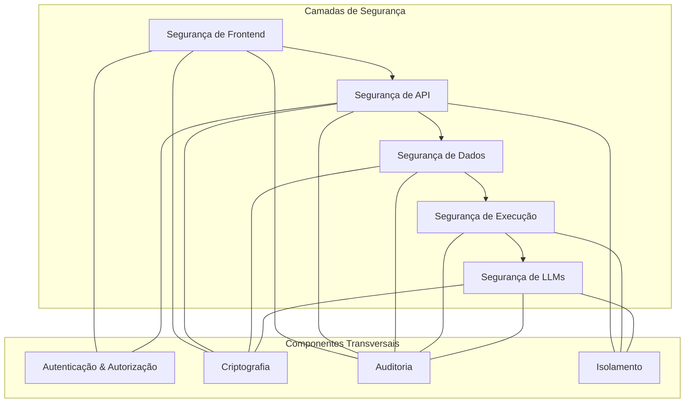

# SEGURANÇA: BRAINLINK

**ID Documento**: BL-SEC-001  
**Versão**: 1.0.0  
**Data**: 2025-03-19 04:35:00  
**Dependências**: BL-VC-001, BL-AT-001, BL-BE-001, BL-DB-001, BL-LLM-001  

## Visão Geral de Segurança

A segurança no Brainlink é um aspecto fundamental da plataforma, projetada para proteger dados sensíveis, código privado, credenciais e garantir a execução segura de código em ambientes controlados. A arquitetura de segurança implementa o princípio de defesa em profundidade, aplicando múltiplas camadas de proteção para mitigar diferentes tipos de ameaças.

A estratégia de segurança abrange proteção de dados em repouso e em trânsito, isolamento de código executado, gerenciamento seguro de credenciais, controles de acesso granulares, e prevenção contra técnicas de prompt injection e data leakage nos modelos de IA.

### Objetivos Principais de Segurança

1. **Proteção de Dados**: Garantir confidencialidade e integridade de todos os dados do usuário
2. **Isolamento de Execução**: Executar código em ambientes sandbox seguros
3. **Gerenciamento de Credenciais**: Proteger tokens, chaves API e senhas
4. **Controles de Acesso**: Implementar autorização granular para recursos
5. **Mitigação de Ataques**: Proteger contra vulnerabilidades específicas de IA e execução de código

## Arquitetura de Segurança

### 1. Visão Geral Arquitetural



### 2. Princípios de Segurança

O Brainlink segue princípios de segurança sólidos em todo seu desenho e implementação:

1. **Defesa em Profundidade**: Múltiplas camadas de controles de segurança
2. **Privilégio Mínimo**: Componentes operam com o mínimo de permissões necessárias
3. **Segurança por Design**: Considerações de segurança integradas desde o início do desenvolvimento
4. **Falha Segura**: Em caso de erro, o sistema falha de maneira que preserva a segurança
5. **Desconfiança Completa**: Todas as entradas são consideradas potencialmente maliciosas

## Segurança da Autenticação

### 1. Sistema de Autenticação

O Brainlink implementa um sistema de autenticação robusto usando NextAuth.js com múltiplos provedores e mecanismos de autenticação:

```typescript
// pages/api/auth/[...nextauth].ts
import NextAuth from 'next-auth';
import GithubProvider from 'next-auth/providers/github';
import GoogleProvider from 'next-auth/providers/google';
import CredentialsProvider from 'next-auth/providers/credentials';
import { PrismaAdapter } from '@next-auth/prisma-adapter';
import { compare } from 'bcryptjs';
import { prisma } from '@/lib/db/prisma';

export default NextAuth({
  adapter: PrismaAdapter(prisma),
  
  providers: [
    GithubProvider({
      clientId: process.env.GITHUB_ID,
      clientSecret: process.env.GITHUB_SECRET,
      profile(profile) {
        return {
          id: profile.id.toString(),
          name: profile.name || profile.login,
          email: profile.email,
          image: profile.avatar_url,
        };
      },
    }),
    
    GoogleProvider({
      clientId: process.env.GOOGLE_CLIENT_ID,
      clientSecret: process.env.GOOGLE_CLIENT_SECRET,
    }),
    
    CredentialsProvider({
      name: 'credentials',
      credentials: {
        email: { label: 'Email', type: 'email' },
        password: { label: 'Password', type: 'password' },
      },
      async authorize(credentials) {
        if (!credentials?.email || !credentials?.password) {
          throw new Error('Email and password required');
        }
        
        const user = await prisma.user.findUnique({
          where: { email: credentials.email },
        });
        
        if (!user || !user.hashedPassword) {
          throw new Error('Email does not exist or invalid login method');
        }
        
        const isValidPassword = await compare(
          credentials.password,
          user.hashedPassword
        );
        
        if (!isValidPassword) {
          throw new Error('Invalid password');
        }
        
        return user;
      },
    }),
  ],
  
  session: {
    strategy: 'jwt',
    maxAge: 30 * 24 * 60 * 60, // 30 dias
  },
  
  jwt: {
    secret: process.env.NEXTAUTH_JWT_SECRET,
  },
  
  secret: process.env.NEXTAUTH_SECRET,
  
  callbacks: {
    async jwt({ token, user, account }) {
      // Persistir dados importantes no token
      if (user) {
        token.id = user.id;
        token.role = user.role;
        
        if (account) {
          token.provider = account.provider;
          token.access_token = account.access_token;
        }
      }
      
      return token;
    },
    
    async session({ session, token }) {
      // Passar dados importantes para a sessão
      if (session.user) {
        session.user.id = token.id as string;
        session.user.role = token.role as string;
      }
      
      session.provider = token.provider as string;
      
      return session;
    },
  },
  
  debug: process.env.NODE_ENV === 'development',
  
  pages: {
    signIn: '/auth/signin',
    error: '/auth/error',
  },
});
```

### 2. 2FA e Autenticação Forte

Implementação de segundo fator de autenticação usando TOTP (Time-based One-Time Password):

```typescript
// lib/security/mfa.ts
import { authenticator } from 'otplib';
import { prisma } from '@/lib/db/prisma';
import QRCode from 'qrcode';

export class MFAService {
  /**
   * Gera uma chave secreta para TOTP e salva para o usuário
   */
  static async setupMFA(userId: string): Promise<{
    secret: string;
    qrCodeUrl: string;
  }> {
    const secret = authenticator.generateSecret();
    const user = await prisma.user.findUnique({
      where: { id: userId },
      select: { email: true },
    });
    
    if (!user) {
      throw new Error('User not found');
    }
    
    // Salvar chave secreta criptografada
    await prisma.userSecurity.upsert({
      where: { userId },
      update: { mfaSecret: secret, mfaEnabled: false },
      create: { userId, mfaSecret: secret, mfaEnabled: false },
    });
    
    // Gerar URI TOTP para QR Code
    const otpauth = authenticator.keyuri(
      user.email,
      'Brainlink',
      secret
    );
    
    // Converter para QR Code formato data URL
    const qrCodeUrl = await QRCode.toDataURL(otpauth);
    
    return { secret, qrCodeUrl };
  }
  
  /**
   * Verifica um código TOTP fornecido pelo usuário
   */
  static async verifyTOTP(
    userId: string,
    token: string
  ): Promise<boolean> {
    const userSecurity = await prisma.userSecurity.findUnique({
      where: { userId },
    });
    
    if (!userSecurity || !userSecurity.mfaSecret) {
      return false;
    }
    
    return authenticator.verify({
      token,
      secret: userSecurity.mfaSecret,
    });
  }
  
  /**
   * Ativa 2FA para o usuário após verificação bem-sucedida
   */
  static async enableMFA(
    userId: string,
    token: string
  ): Promise<boolean> {
    const isValid = await this.verifyTOTP(userId, token);
    
    if (!isValid) {
      return false;
    }
    
    await prisma.userSecurity.update({
      where: { userId },
      data: { mfaEnabled: true },
    });
    
    return true;
  }
  
  /**
   * Desativa 2FA para o usuário
   */
  static async disableMFA(userId: string): Promise<void> {
    await prisma.userSecurity.update({
      where: { userId },
      data: { mfaEnabled: false },
    });
  }
  
  /**
   * Verifica se 2FA está ativado para o usuário
   */
  static async isMFAEnabled(userId: string): Promise<boolean> {
    const userSecurity = await prisma.userSecurity.findUnique({
      where: { userId },
    });
    
    return Boolean(userSecurity?.mfaEnabled);
  }
  
  /**
   * Gera códigos de backup para o usuário
   */
  static async generateBackupCodes(userId: string): Promise<string[]> {
    // Gerar 10 códigos aleatórios
    const codes = Array.from({ length: 10 }, () => 
      Math.random().toString(36).substring(2, 8) +
      Math.random().toString(36).substring(2, 8)
    );
    
    // Salvar hashes dos códigos
    await prisma.userSecurity.update({
      where: { userId },
      data: {
        backupCodes: JSON.stringify(codes),
      },
    });
    
    return codes;
  }
  
  /**
   * Verifica e consome um código de backup
   */
  static async verifyAndConsumeBackupCode(
        userId: string,
    code: string
  ): Promise<boolean> {
    const userSecurity = await prisma.userSecurity.findUnique({
      where: { userId },
    });
    
    if (!userSecurity?.backupCodes) {
      return false;
    }
    
    // Verificar código
    const codes = JSON.parse(userSecurity.backupCodes) as string[];
    const index = codes.indexOf(code);
    
    if (index === -1) {
      return false; // Código não encontrado ou já usado
    }
    
    // Remover código usado
    codes.splice(index, 1);
    
    // Atualizar lista de códigos
    await prisma.userSecurity.update({
      where: { userId },
      data: {
        backupCodes: JSON.stringify(codes),
      },
    });
    
    return true;
  }
}
```

## Proteção de Dados

### 1. Criptografia em Repouso

O Brainlink implementa criptografia em repouso para dados sensíveis usando algoritmos de criptografia de alto nível:

```typescript
// lib/security/encryption.ts
import { randomBytes, createCipheriv, createDecipheriv } from 'crypto';
import { promisify } from 'util';

const randomBytesAsync = promisify(randomBytes);

export class EncryptionService {
  private readonly algorithm = 'aes-256-gcm';
  private readonly keyLength = 32; // 256 bits
  private readonly tagLength = 16; // 128 bits para autenticação

  constructor(private masterKey: Buffer) {}
  
  /**
   * Inicializa serviço de criptografia com chave mestra da aplicação
   */
  static async initialize(secretKey?: string): Promise<EncryptionService> {
    // Usar chave fornecida ou gerar uma nova
    const masterKey = secretKey
      ? Buffer.from(secretKey, 'hex')
      : await randomBytesAsync(32);
      
    return new EncryptionService(masterKey);
  }

  /**
   * Criptografa dados com chave derivada específica para o contexto
   */
  async encrypt(
    data: string | object,
    context: string // Identificador de contexto para derivação de chave
  ): Promise<{
    encrypted: string;
    iv: string;
    tag: string;
  }> {
    // Preparar dados
    const dataString = typeof data === 'string' ? data : JSON.stringify(data);
    
    // Gerar IV (nonce)
    const iv = await randomBytesAsync(12);
    
    // Derivar chave baseada no contexto
    const derivedKey = await this.deriveKey(context);
    
    // Criptografar
    const cipher = createCipheriv(this.algorithm, derivedKey, iv, {
      authTagLength: this.tagLength,
    });
    
    const encryptedBuffer = Buffer.concat([
      cipher.update(dataString, 'utf8'),
      cipher.final(),
    ]);
    
    // Obter tag de autenticação
    const authTag = cipher.getAuthTag();
    
    return {
      encrypted: encryptedBuffer.toString('base64'),
      iv: iv.toString('base64'),
      tag: authTag.toString('base64'),
    };
  }

  /**
   * Descriptografa dados usando a mesma chave derivada do contexto
   */
  async decrypt(
    encryptedData: {
      encrypted: string;
      iv: string;
      tag: string;
    },
    context: string, // Mesmo contexto usado na criptografia
    asJson = false
  ): Promise<string | object> {
    try {
      // Converter de base64
      const encryptedBuffer = Buffer.from(encryptedData.encrypted, 'base64');
      const iv = Buffer.from(encryptedData.iv, 'base64');
      const authTag = Buffer.from(encryptedData.tag, 'base64');
      
      // Derivar a mesma chave baseada no contexto
      const derivedKey = await this.deriveKey(context);
      
      // Descriptografar
      const decipher = createDecipheriv(this.algorithm, derivedKey, iv, {
        authTagLength: this.tagLength,
      });
      
      // Definir tag de autenticação para verificação
      decipher.setAuthTag(authTag);
      
      const decryptedBuffer = Buffer.concat([
        decipher.update(encryptedBuffer),
        decipher.final(),
      ]);
      
      const decryptedString = decryptedBuffer.toString('utf8');
      
      // Converter para JSON se necessário
      if (asJson) {
        return JSON.parse(decryptedString);
      }
      
      return decryptedString;
    } catch (error) {
      throw new Error(`Decryption failed: ${error instanceof Error ? error.message : 'unknown error'}`);
    }
  }

  /**
   * Deriva chave específica para o contexto usando HKDF
   * (implementação simplificada)
   */
  private async deriveKey(context: string): Promise<Buffer> {
    const crypto = require('crypto');
    
    // Em produção, usaríamos uma implementação completa de HKDF
    // Esta é uma versão simplificada para o exemplo
    const hmac = crypto.createHmac('sha256', this.masterKey);
    hmac.update(context);
    
    return hmac.digest();
  }
}

// Inicializar serviço de criptografia na aplicação
let encryptionService: EncryptionService;

export async function initializeEncryption(): Promise<void> {
  encryptionService = await EncryptionService.initialize(
    process.env.ENCRYPTION_MASTER_KEY
  );
}

export function getEncryptionService(): EncryptionService {
  if (!encryptionService) {
    throw new Error('Encryption service not initialized');
  }
  
  return encryptionService;
}
```

### 2. Criptografia em Trânsito

Todas as comunicações do Brainlink são protegidas usando TLS 1.3 e HTTPS. Além disso, implementamos HSTS para garantir que todas as conexões usem HTTPS:

```typescript
// middleware.ts
import { NextRequest, NextResponse } from 'next/server';
import { getToken } from 'next-auth/jwt';

export async function middleware(req: NextRequest) {
  const response = NextResponse.next();
  
  // Aplicar cabeçalhos de segurança em todas as respostas
  const headers = response.headers;
  
  // HSTS - Forçar HTTPS
  headers.set(
    'Strict-Transport-Security',
    'max-age=63072000; includeSubDomains; preload'
  );
  
  // Content Security Policy
  headers.set(
    'Content-Security-Policy',
    constructCSP()
  );
  
  // Prevenir clickjacking
  headers.set('X-Frame-Options', 'DENY');
  
  // Prevenir MIME sniffing
  headers.set('X-Content-Type-Options', 'nosniff');
  
  // Referrer Policy
  headers.set('Referrer-Policy', 'strict-origin-when-cross-origin');
  
  // Desabilitar cache para conteúdo autenticado
  if (req.nextUrl.pathname.startsWith('/api/') ||
      req.nextUrl.pathname.startsWith('/workspace/')) {
    headers.set('Cache-Control', 'no-store, max-age=0');
  }
  
  // Permissões para recursos específicos
  headers.set(
    'Permissions-Policy',
    'camera=(), microphone=(), geolocation=(), interest-cohort=()'
  );
  
  // Verificação de autenticação para rotas protegidas
  if (isProtectedRoute(req.nextUrl.pathname)) {
    const token = await getToken({
      req,
      secret: process.env.NEXTAUTH_SECRET,
    });
    
    if (!token) {
      const url = new URL('/auth/signin', req.url);
      url.searchParams.set('callbackUrl', req.url);
      return NextResponse.redirect(url);
    }
    
    // Verificar necessidade de 2FA
    if (requiresMFA(req.nextUrl.pathname)) {
      const mfaVerified = token.mfaVerified as boolean;
      
      if (!mfaVerified) {
        const url = new URL('/auth/verify-mfa', req.url);
        url.searchParams.set('callbackUrl', req.url);
        return NextResponse.redirect(url);
      }
    }
  }
  
  return response;
}

// Configurar em quais rotas o middleware deve ser executado
export const config = {
  matcher: [
    '/((?!_next/static|_next/image|favicon.ico|assets/).*)',
  ],
};

// Construir política CSP
function constructCSP(): string {
  // Política de segurança de conteúdo baseada em lista branca
  return "default-src 'self'; " +
         "script-src 'self' 'unsafe-eval' https://trusted-cdn.com; " +
         "style-src 'self' 'unsafe-inline' https://trusted-cdn.com; " +
         "img-src 'self' data: blob: https://*.githubusercontent.com; " +
         "font-src 'self' data: https://trusted-cdn.com; " +
         "connect-src 'self' https://api.openai.com https://*.supabase.co; " +
         "frame-src 'none'; " +
         "object-src 'none'; " +
         "base-uri 'self'; " +
         "form-action 'self';";
}

// Verificar se é uma rota protegida
function isProtectedRoute(pathname: string): boolean {
  const protectedPaths = [
    '/workspace',
    '/settings',
    '/api/workspace',
    '/api/user',
    '/api/llm',
  ];
  
  return protectedPaths.some(path => pathname.startsWith(path));
}

// Verificar se a rota requer verificação MFA
function requiresMFA(pathname: string): boolean {
  const mfaRequiredPaths = [
    '/settings/security',
    '/settings/api-keys',
    '/api/user/security',
  ];
  
  return mfaRequiredPaths.some(path => pathname.startsWith(path));
}
```

### 3. Tokenização de Dados Sensíveis

Para dados especialmente sensíveis como chaves de API, tokens e credenciais, utilizamos tokenização segura:

```typescript
// lib/security/tokenizer.ts
import { getEncryptionService } from './encryption';
import { randomBytes } from 'crypto';
import { prisma } from '@/lib/db/prisma';

export class TokenizationService {
  /**
   * Tokeniza um valor sensível
   */
  static async tokenize(
    value: string,
    userId: string,
    type: string,
    metadata?: Record<string, any>
  ): Promise<string> {
    // Gerar token aleatório único
    const token = randomBytes(16).toString('hex');
    
    // Criptografar o valor sensível
    const encryptionService = getEncryptionService();
    const encrypted = await encryptionService.encrypt(
      value,
      `token:${userId}:${type}`
    );
    
    // Armazenar no banco de dados
    await prisma.tokenizedValue.create({
      data: {
        token,
        encryptedValue: encrypted.encrypted,
        iv: encrypted.iv,
        tag: encrypted.tag,
        userId,
        type,
        metadata: metadata || {},
        createdAt: new Date(),
      },
    });
    
    return token;
  }
  
  /**
   * Recupera o valor original a partir de um token
   */
  static async detokenize(
    token: string,
    userId: string,
    type: string
  ): Promise<string> {
    // Buscar registro do token
    const record = await prisma.tokenizedValue.findFirst({
      where: {
        token,
        userId,
        type,
      },
    });
    
    if (!record) {
      throw new Error('Token not found');
    }
    
    // Descriptografar o valor
    const encryptionService = getEncryptionService();
    const value = await encryptionService.decrypt(
      {
        encrypted: record.encryptedValue,
        iv: record.iv,
        tag: record.tag,
      },
      `token:${userId}:${type}`
    ) as string;
    
    return value;
  }
  
  /**
   * Revoga um token, removendo-o do sistema
   */
  static async revokeToken(
    token: string,
    userId: string
  ): Promise<boolean> {
    try {
      await prisma.tokenizedValue.deleteMany({
        where: {
          token,
          userId,
        },
      });
      
      return true;
    } catch (error) {
      console.error('Error revoking token:', error);
      return false;
    }
  }
  
  /**
   * Lista tokens disponíveis para um usuário (sem mostrar valores)
   */
  static async listTokens(
    userId: string,
    type?: string
  ): Promise<Array<{
    token: string;
    type: string;
    createdAt: Date;
    metadata: Record<string, any>;
  }>> {
    const records = await prisma.tokenizedValue.findMany({
      where: {
        userId,
        ...(type ? { type } : {}),
      },
      select: {
        token: true,
        type: true,
        createdAt: true,
        metadata: true,
      },
    });
    
    return records;
  }
}
```

## Execução Segura e Sandboxing

### 1. Sistema de Sandbox para Execução de Código

O Brainlink implementa um sistema de sandbox para execução segura de código:

```typescript
// lib/sandbox/executor.ts
import { Worker } from 'worker_threads';
import { v4 as uuidv4 } from 'uuid';
import path from 'path';
import fs from 'fs/promises';
import os from 'os';

interface ExecutionOptions {
  timeoutMs?: number;
  memoryLimitMb?: number;
  allowedModules?: string[];
  environment?: Record<string, string>;
}

interface ExecutionResult {
  success: boolean;
  output: string;
  error?: string;
  duration: number;
  memoryUsage?: number;
}

export class CodeExecutor {
  private readonly tempDir: string;
  
  constructor() {
    // Criar diretório temporário para arquivos de execução
    this.tempDir = path.join(os.tmpdir(), 'brainlink-sandbox');
    this.initTempDir().catch(console.error);
  }
  
  private async initTempDir(): Promise<void> {
    try {
      await fs.mkdir(this.tempDir, { recursive: true });
    } catch (error) {
      console.error('Failed to create temp directory:', error);
    }
  }
  
  /**
   * Executa código em um ambiente sandbox com isolamento
   */
  async execute(
    language: string,
    code: string,
    options: ExecutionOptions = {}
  ): Promise<ExecutionResult> {
    const executionId = uuidv4();
    const startTime = Date.now();
    
        // Configurar opções padrão
    const timeoutMs = options.timeoutMs || 5000;
    const memoryLimitMb = options.memoryLimitMb || 100;
    const allowedModules = options.allowedModules || ['lodash', 'moment'];
    
    try {
      // Preparar arquivo temporário para execução
      const filePath = await this.prepareExecutionFile(executionId, language, code);
      
      // Criar worker isolado para execução
      const worker = new Worker(path.join(__dirname, 'worker.js'), {
        workerData: {
          filePath,
          language,
          allowedModules,
          environment: options.environment || {},
          memoryLimitMb,
        },
      });
      
      // Configurar timeout
      const timeoutId = setTimeout(() => {
        worker.terminate();
      }, timeoutMs);
      
      // Aguardar resultado
      const result = await new Promise<ExecutionResult>((resolve, reject) => {
        worker.on('message', (message) => {
          clearTimeout(timeoutId);
          resolve(message as ExecutionResult);
        });
        
        worker.on('error', (err) => {
          clearTimeout(timeoutId);
          reject(err);
        });
        
        worker.on('exit', (code) => {
          clearTimeout(timeoutId);
          if (code !== 0) {
            resolve({
              success: false,
              output: '',
              error: `Worker exited with code ${code}`,
              duration: Date.now() - startTime,
            });
          }
        });
      });
      
      // Limpar arquivos temporários
      await this.cleanup(executionId);
      
      return result;
    } catch (error) {
      return {
        success: false,
        output: '',
        error: `Execution error: ${error instanceof Error ? error.message : 'Unknown error'}`,
        duration: Date.now() - startTime,
      };
    }
  }
  
  /**
   * Prepara arquivo temporário para execução
   */
  private async prepareExecutionFile(
    executionId: string,
    language: string,
    code: string
  ): Promise<string> {
    const extension = this.getFileExtension(language);
    const filePath = path.join(this.tempDir, `${executionId}${extension}`);
    
    // Escrever código no arquivo
    await fs.writeFile(filePath, code);
    
    return filePath;
  }
  
  /**
   * Limpa arquivos temporários após execução
   */
  private async cleanup(executionId: string): Promise<void> {
    try {
      // Encontrar todos os arquivos relacionados a esta execução
      const files = await fs.readdir(this.tempDir);
      const targetFiles = files.filter(file => file.startsWith(executionId));
      
      // Remover cada arquivo
      for (const file of targetFiles) {
        await fs.unlink(path.join(this.tempDir, file));
      }
    } catch (error) {
      console.warn('Error during cleanup:', error);
    }
  }
  
  /**
   * Obtém extensão de arquivo para a linguagem
   */
  private getFileExtension(language: string): string {
    const extensionMap: Record<string, string> = {
      javascript: '.js',
      typescript: '.ts',
      python: '.py',
      ruby: '.rb',
      php: '.php',
      java: '.java',
      go: '.go',
      rust: '.rs',
      c: '.c',
      cpp: '.cpp',
    };
    
    return extensionMap[language.toLowerCase()] || '.txt';
  }
}
```

O worker isolado que executa o código:

```typescript
// lib/sandbox/worker.js
const { workerData, parentPort } = require('worker_threads');
const { execSync } = require('child_process');
const fs = require('fs');
const path = require('path');
const vm = require('vm');

// Receber dados do worker principal
const {
  filePath,
  language,
  allowedModules,
  environment,
  memoryLimitMb,
} = workerData;

// Monitoramento de uso de memória
const startMemory = process.memoryUsage().heapUsed;
let output = '';
let error = null;

try {
  // Configurar variáveis de ambiente
  for (const [key, value] of Object.entries(environment || {})) {
    process.env[key] = value;
  }
  
  // Configurar monitoramento de memória
  const memoryLimit = (memoryLimitMb || 100) * 1024 * 1024; // MB para bytes
  
  const interval = setInterval(() => {
    const memoryUsed = process.memoryUsage().heapUsed - startMemory;
    if (memoryUsed > memoryLimit) {
      clearInterval(interval);
      throw new Error(`Memory limit exceeded: ${Math.round(memoryUsed / 1024 / 1024)} MB used`);
    }
  }, 100);
  
  // Executar o código de acordo com a linguagem
  switch (language.toLowerCase()) {
    case 'javascript':
      output = executeJavaScript(filePath, allowedModules);
      break;
    case 'python':
      output = executePython(filePath);
      break;
    case 'typescript':
      output = executeTypeScript(filePath);
      break;
    // Adicionar outras linguagens conforme necessário...
    default:
      throw new Error(`Unsupported language: ${language}`);
  }
  
  clearInterval(interval);
} catch (err) {
  error = err.message || 'Unknown execution error';
}

// Calcular uso de memória
const endMemory = process.memoryUsage().heapUsed;
const memoryUsed = endMemory - startMemory;

// Enviar resultado para o thread principal
parentPort.postMessage({
  success: !error,
  output: output || '',
  error: error,
  memoryUsage: Math.round(memoryUsed / 1024), // KB
  duration: 0, // Será preenchido no executor principal
});

/**
 * Executa código JavaScript em um sandbox
 */
function executeJavaScript(filePath, allowedModules) {
  // Criar contexto restrito para execução
  const sandbox = vm.createContext({
    console: {
      log: (...args) => {
        output += args.join(' ') + '\n';
      },
      error: (...args) => {
        output += 'ERROR: ' + args.join(' ') + '\n';
      },
      warn: (...args) => {
        output += 'WARNING: ' + args.join(' ') + '\n';
      },
    },
    require: (moduleName) => {
      if (allowedModules.includes(moduleName)) {
        return require(moduleName);
      } else {
        throw new Error(`Module '${moduleName}' is not allowed`);
      }
    },
    Buffer,
    setTimeout,
    clearTimeout,
    setInterval,
    clearInterval,
  });
  
  // Ler código do arquivo
  const code = fs.readFileSync(filePath, 'utf8');
  
  // Executar no contexto sandbox
  const script = new vm.Script(code);
  script.runInContext(sandbox, { timeout: 3000 });
  
  return output;
}

/**
 * Executa código Python em um processo isolado
 */
function executePython(filePath) {
  return execSync(`python -u "${filePath}"`, {
    encoding: 'utf8',
    timeout: 5000,
    maxBuffer: 1024 * 1024, // 1 MB
    env: {
      ...process.env,
      PYTHONPATH: process.env.PYTHONPATH || '',
    },
  });
}

/**
 * Executa código TypeScript via ts-node
 */
function executeTypeScript(filePath) {
  // Verificar se ts-node está instalado
  try {
    require.resolve('ts-node');
  } catch (e) {
    throw new Error('ts-node is not available for TypeScript execution');
  }
  
  return execSync(`npx ts-node "${filePath}"`, {
    encoding: 'utf8',
    timeout: 5000,
    maxBuffer: 1024 * 1024, // 1 MB
  });
}
```

### 2. Política de Segurança para Execução de Código

```typescript
// lib/security/execution-policy.ts
import { prisma } from '@/lib/db/prisma';

export interface ExecutionPolicy {
  id: string;
  name: string;
  allowedLanguages: string[];
  allowedModules: string[];
  maxExecutionTimeMs: number;
  maxMemoryMb: number;
  allowFileSystem: boolean;
  allowNetworkAccess: boolean;
  environmentVariables: Record<string, string>;
}

export class SecurityPolicyService {
  /**
   * Obtém política para um contexto específico
   */
  static async getPolicyForContext(
    userId: string,
    context: {
      workspace?: string;
      plugin?: string;
      source: 'user' | 'llm' | 'plugin' | 'system';
    }
  ): Promise<ExecutionPolicy> {
    // Buscar políticas específicas para este contexto
    const userPolicy = await prisma.executionPolicy.findFirst({
      where: {
        userId,
        contextType: context.source,
        ...(context.workspace ? { workspaceId: context.workspace } : {}),
        ...(context.plugin ? { pluginId: context.plugin } : {}),
      },
    });
    
    // Se não encontrar política específica, usar política padrão do usuário
    if (!userPolicy) {
      return this.getDefaultPolicy(context.source);
    }
    
    // Converter para o formato da política
    return {
      id: userPolicy.id,
      name: userPolicy.name,
      allowedLanguages: userPolicy.allowedLanguages as string[],
      allowedModules: userPolicy.allowedModules as string[],
      maxExecutionTimeMs: userPolicy.maxExecutionTimeMs,
      maxMemoryMb: userPolicy.maxMemoryMb,
      allowFileSystem: userPolicy.allowFileSystem,
      allowNetworkAccess: userPolicy.allowNetworkAccess,
      environmentVariables: userPolicy.environmentVariables as Record<string, string>,
    };
  }
  
  /**
   * Obtém política padrão baseada na origem
   */
  static getDefaultPolicy(source: 'user' | 'llm' | 'plugin' | 'system'): ExecutionPolicy {
    const basePolicy = {
      id: `default-${source}`,
      name: `Default ${source.toUpperCase()} Policy`,
      maxExecutionTimeMs: 5000,
      maxMemoryMb: 100,
      environmentVariables: {},
    };
    
    switch (source) {
      case 'user':
        return {
          ...basePolicy,
          allowedLanguages: ['javascript', 'typescript', 'python', 'ruby'],
          allowedModules: ['lodash', 'moment', 'axios', 'fs', 'path'],
          allowFileSystem: true,
          allowNetworkAccess: true,
        };
        
      case 'plugin':
        return {
          ...basePolicy,
          allowedLanguages: ['javascript', 'typescript'],
          allowedModules: ['lodash', 'moment', 'axios'],
          allowFileSystem: false,
          allowNetworkAccess: true,
        };
        
      case 'llm':
        return {
          ...basePolicy,
          allowedLanguages: ['javascript', 'python'],
          allowedModules: ['lodash', 'moment'],
          allowFileSystem: false,
          allowNetworkAccess: false,
        };
        
      case 'system':
        return {
          ...basePolicy,
          allowedLanguages: ['javascript', 'typescript', 'python', 'ruby', 'go'],
          allowedModules: ['*'], // Todos módulos permitidos
          allowFileSystem: true,
          allowNetworkAccess: true,
          maxExecutionTimeMs: 30000,
          maxMemoryMb: 500,
        };
        
      default:
        return {
          ...basePolicy,
          allowedLanguages: ['javascript'],
          allowedModules: [],
          allowFileSystem: false,
          allowNetworkAccess: false,
        };
    }
  }
  
  /**
   * Valida se a execução é permitida pela política
   */
  static validateExecution(
    policy: ExecutionPolicy,
    request: {
      language: string;
      requestedModules: string[];
      requestedFileAccess: boolean;
      requestedNetworkAccess: boolean;
    }
  ): { allowed: boolean; reason?: string } {
    // Verificar linguagem
    if (!policy.allowedLanguages.includes(request.language.toLowerCase())) {
      return {
        allowed: false,
        reason: `Language '${request.language}' is not allowed by policy`,
      };
    }
    
    // Verificar módulos
    if (!policy.allowedModules.includes('*')) {
      for (const module of request.requestedModules) {
        if (!policy.allowedModules.includes(module)) {
          return {
            allowed: false,
            reason: `Module '${module}' is not allowed by policy`,
          };
        }
      }
    }
    
    // Verificar acesso ao sistema de arquivos
    if (request.requestedFileAccess && !policy.allowFileSystem) {
      return {
        allowed: false,
        reason: 'File system access is not allowed by policy',
      };
    }
    
    // Verificar acesso à rede
    if (request.requestedNetworkAccess && !policy.allowNetworkAccess) {
      return {
        allowed: false,
        reason: 'Network access is not allowed by policy',
      };
    }
    
    return { allowed: true };
  }
}
```

## Segurança de LLMs

### 1. Prevenção de Prompt Injection

```typescript
// lib/security/prompt-sanitizer.ts
import { getEncryptionService } from './encryption';
import { createHash } from 'crypto';

export class PromptSanitizer {
  // Identificadores especiais para delimitar conteúdo seguro
  private static readonly START_MARKER = '###SECURE_CONTENT_START###';
  private static readonly END_MARKER = '###SECURE_CONTENT_END###';
  
  /**
   * Sanitiza um prompt para prevenir injeções
   */
  static sanitizePrompt(prompt: string): string {
    // Remover sequências de escape potencialmente maliciosas
    let sanitized = prompt
      // Remover controle de caracteres Unicode
      .replace(/[\u0000-\u001F\u007F-\u009F]/g, '')
      // Neutralizar marcadores de delimitação que podem existir
      .replace(new RegExp(this.START_MARKER, 'g'), '')
      .replace(new RegExp(this.END_MARKER, 'g'), '')
      // Neutralizar tentativas de injeção comuns
      .replace(/system:/gi, 'syst em:')
      .replace(/user:/gi, 'us er:')
      .replace(/assistant:/gi, 'assist ant:')
      .replace(/function:/gi, 'funct ion:');
      
    return sanitized;
  }
  
  /**
   * Protege conteúdo sensível dentro de prompts
   */
    static async protectSensitiveContent(
    content: string,
    sensitiveData: {
      key: string;
      value: string;
    }[]
  ): Promise<string> {
    let protectedContent = content;
    
    // Substituir cada item sensível por um token protegido
    for (const data of sensitiveData) {
      // Gerar hash para identificação
      const hash = createHash('sha256')
        .update(data.key + data.value)
        .digest('hex')
        .substring(0, 16);
      
      // Criptografar o valor
      const encryptionService = getEncryptionService();
      const encrypted = await encryptionService.encrypt(
        data.value,
        `prompt:${data.key}:${hash}`
      );
      
      // Criar token protegido
      const protectedToken = `${this.START_MARKER}${hash}${this.END_MARKER}`;
      
      // Substituir no conteúdo
      protectedContent = protectedContent.replace(
        new RegExp(data.value.replace(/[.*+?^${}()|[\]\\]/g, '\\$&'), 'g'),
        protectedToken
      );
      
      // Armazenar mapeamento para recuperação posterior
      await this.storeProtectedMapping(hash, encrypted);
    }
    
    return protectedContent;
  }
  
  /**
   * Recupera conteúdo protegido em respostas
   */
  static async unprotectContent(content: string): Promise<string> {
    let unprotectedContent = content;
    const pattern = new RegExp(
      `${this.START_MARKER}([a-f0-9]{16})${this.END_MARKER}`,
      'g'
    );
    
    // Encontrar todos os tokens protegidos
    const matches = [...content.matchAll(pattern)];
    
    for (const match of matches) {
      const hash = match[1];
      
      // Recuperar valor original
      const originalValue = await this.retrieveProtectedValue(hash);
      
      if (originalValue) {
        // Substituir de volta no conteúdo
        unprotectedContent = unprotectedContent.replace(
          `${this.START_MARKER}${hash}${this.END_MARKER}`,
          originalValue
        );
      }
    }
    
    return unprotectedContent;
  }
  
  /**
   * Armazena mapeamento de hash para valor criptografado
   */
  private static async storeProtectedMapping(
    hash: string,
    encryptedData: {
      encrypted: string;
      iv: string;
      tag: string;
    }
  ): Promise<void> {
    // Em produção, usaríamos cache distribuído como Redis
    // Esta é uma implementação simplificada com cache em memória
    
    if (!global.protectedValuesCache) {
      global.protectedValuesCache = new Map();
    }
    
    global.protectedValuesCache.set(hash, encryptedData);
    
    // Definir expiração (1 hora)
    setTimeout(() => {
      if (global.protectedValuesCache) {
        global.protectedValuesCache.delete(hash);
      }
    }, 60 * 60 * 1000);
  }
  
  /**
   * Recupera valor protegido a partir do hash
   */
  private static async retrieveProtectedValue(hash: string): Promise<string | null> {
    if (!global.protectedValuesCache) {
      return null;
    }
    
    const encryptedData = global.protectedValuesCache.get(hash);
    if (!encryptedData) {
      return null;
    }
    
    try {
      const encryptionService = getEncryptionService();
      const decrypted = await encryptionService.decrypt(
        encryptedData,
        `prompt:*:${hash}`
      );
      
      return decrypted as string;
    } catch (error) {
      console.error('Failed to decrypt protected content:', error);
      return null;
    }
  }
  
  /**
   * Detecta possíveis tentativas de prompt injection
   */
  static detectInjectionAttempts(prompt: string): {
    safe: boolean;
    detections: string[];
  } {
    const detections = [];
    
    // Padrões comuns de injeção
    const patterns = [
      {
        pattern: /ignore previous instructions|disregard [a-z\s]+ above|forget [a-z\s]+ instructions/i,
        description: 'Attempt to override system instructions',
      },
      {
        pattern: /(system:|user:|assistant:) (?!.*\1)/i,
        description: 'Attempt to impersonate role',
      },
      {
        pattern: /'\s*\+\s*'|\"\s*\+\s*\"|`\s*\+\s*`|\\n|\\r/,
        description: 'String manipulation attempt',
      },
      {
        pattern: /exec|eval|setTimeout|Function\(|constructor\s*\(/i,
        description: 'Code execution attempt',
      },
    ];
    
    // Verificar cada padrão
    for (const { pattern, description } of patterns) {
      if (pattern.test(prompt)) {
        detections.push(description);
      }
    }
    
    return {
      safe: detections.length === 0,
      detections,
    };
  }
}
```

### 2. Configurações de Acesso a LLMs

```typescript
// lib/security/llm-access.ts
import { prisma } from '@/lib/db/prisma';

interface LLMAccessPolicy {
  userId: string;
  maxTokensPerMinute: number;
  maxTokensPerDay: number;
  allowedProviders: string[];
  allowedModels: Record<string, string[]>;
  systemPromptProtection: boolean;
  sensitiveDataHandling: 'allow' | 'redact' | 'block';
  toolPermissions: Record<string, boolean>;
}

export class LLMAccessManager {
  /**
   * Obtém política de acesso a LLMs para um usuário
   */
  static async getUserPolicy(userId: string): Promise<LLMAccessPolicy> {
    // Buscar política do banco de dados
    const userPolicy = await prisma.llmAccessPolicy.findUnique({
      where: { userId },
    });
    
    // Se não encontrar, usar política padrão
    if (!userPolicy) {
      return this.getDefaultPolicy(userId);
    }
    
    return {
      userId,
      maxTokensPerMinute: userPolicy.maxTokensPerMinute,
      maxTokensPerDay: userPolicy.maxTokensPerDay,
      allowedProviders: userPolicy.allowedProviders as string[],
      allowedModels: userPolicy.allowedModels as Record<string, string[]>,
      systemPromptProtection: userPolicy.systemPromptProtection,
      sensitiveDataHandling: userPolicy.sensitiveDataHandling as 'allow' | 'redact' | 'block',
      toolPermissions: userPolicy.toolPermissions as Record<string, boolean>,
    };
  }
  
  /**
   * Obtém política padrão para novos usuários
   */
  static getDefaultPolicy(userId: string): LLMAccessPolicy {
    return {
      userId,
      maxTokensPerMinute: 10000,
      maxTokensPerDay: 1000000,
      allowedProviders: ['openai', 'anthropic', 'local'],
      allowedModels: {
        openai: ['gpt-3.5-turbo', 'gpt-4'],
        anthropic: ['claude-instant', 'claude-2'],
        local: ['*'],
      },
      systemPromptProtection: true,
      sensitiveDataHandling: 'redact',
      toolPermissions: {
        'file_read': true,
        'file_write': false,
        'code_execution': true,
        'web_search': true,
        'api_call': false,
        'tool_installation': false,
      },
    };
  }
  
  /**
   * Verifica se o usuário pode usar um determinado modelo
   */
  static async canUseModel(
    userId: string,
    provider: string,
    model: string
  ): Promise<boolean> {
    const policy = await this.getUserPolicy(userId);
    
    // Verificar se o provedor é permitido
    if (!policy.allowedProviders.includes(provider)) {
      return false;
    }
    
    // Verificar se o modelo é permitido para este provedor
    const allowedModels = policy.allowedModels[provider];
    
    if (!allowedModels) {
      return false;
    }
    
    return allowedModels.includes('*') || allowedModels.includes(model);
  }
  
  /**
   * Registra uso de tokens para controle de limite de uso
   */
  static async recordTokenUsage(
    userId: string,
    tokens: number
  ): Promise<{
    allowed: boolean;
    remainingMinute: number;
    remainingDay: number;
  }> {
    const policy = await this.getUserPolicy(userId);
    
    // Obter uso atual
    const now = new Date();
    const startOfDay = new Date(
      now.getFullYear(),
      now.getMonth(),
      now.getDate()
    );
    const startOfMinute = new Date(
      now.getFullYear(),
      now.getMonth(),
      now.getDate(),
      now.getHours(),
      now.getMinutes()
    );
    
    const usageMinute = await prisma.tokenUsage.findFirst({
      where: {
        userId,
        timestamp: { gte: startOfMinute },
      },
      select: {
        tokens: true,
      },
    });
    
    const usageDay = await prisma.tokenUsage.groupBy({
      by: ['userId'],
      where: {
        userId,
        timestamp: { gte: startOfDay },
      },
      _sum: {
        tokens: true,
      },
    });
    
    const tokensUsedMinute = usageMinute?.tokens || 0;
    const tokensUsedDay = usageDay[0]?._sum.tokens || 0;
    
    // Verificar limites
    const remainingMinute = policy.maxTokensPerMinute - tokensUsedMinute;
    const remainingDay = policy.maxTokensPerDay - tokensUsedDay;
    
    if (tokens > remainingMinute || tokens > remainingDay) {
      return {
        allowed: false,
        remainingMinute,
        remainingDay,
      };
    }
    
    // Registrar uso
    await prisma.tokenUsage.create({
      data: {
        userId,
        tokens,
        timestamp: now,
      },
    });
    
    return {
      allowed: true,
      remainingMinute: remainingMinute - tokens,
      remainingDay: remainingDay - tokens,
    };
  }
  
  /**
   * Verifica se o usuário pode usar determinada ferramenta
   */
  static async canUseTool(
    userId: string,
    toolName: string
  ): Promise<boolean> {
    const policy = await this.getUserPolicy(userId);
    return Boolean(policy.toolPermissions[toolName]);
  }
}
```

## Monitoramento e Auditoria

### 1. Sistema de Auditoria de Segurança

```typescript
// lib/security/audit.ts
import { prisma } from '@/lib/db/prisma';
import { getClientIp } from '@/lib/utils/network';
import { NextApiRequest } from 'next';
import { getToken } from 'next-auth/jwt';

export enum AuditAction {
  LOGIN_SUCCESS = 'LOGIN_SUCCESS',
  LOGIN_FAILURE = 'LOGIN_FAILURE',
  LOGOUT = 'LOGOUT',
  MFA_ENABLED = 'MFA_ENABLED',
  MFA_DISABLED = 'MFA_DISABLED',
  API_KEY_CREATED = 'API_KEY_CREATED',
  API_KEY_DELETED = 'API_KEY_DELETED',
  PASSWORD_CHANGED = 'PASSWORD_CHANGED',
  EMAIL_CHANGED = 'EMAIL_CHANGED',
  ACCOUNT_CREATED = 'ACCOUNT_CREATED',
  ACCOUNT_DELETED = 'ACCOUNT_DELETED',
  PERMISSION_GRANTED = 'PERMISSION_GRANTED',
  PERMISSION_REVOKED = 'PERMISSION_REVOKED',
  SENSITIVE_DATA_ACCESS = 'SENSITIVE_DATA_ACCESS',
  LLM_PROMPT_FLAGGED = 'LLM_PROMPT_FLAGGED',
  CODE_EXECUTION = 'CODE_EXECUTION',
  FILE_UPLOAD = 'FILE_UPLOAD',
  FILE_DOWNLOAD = 'FILE_DOWNLOAD',
  SYSTEM_SETTING_CHANGED = 'SYSTEM_SETTING_CHANGED',
}

export interface AuditLogEntry {
  userId?: string;
  action: AuditAction;
  resourceType?: string;
  resourceId?: string;
  details?: Record<string, any>;
  status: 'success' | 'failure';
  ipAddress?: string;
  userAgent?: string;
}

export class AuditLogger {
  /**
   * Registra uma entrada de auditoria
   */
  static async log(entry: AuditLogEntry): Promise<void> {
    try {
      await prisma.auditLog.create({
        data: {
          userId: entry.userId,
          action: entry.action,
          resourceType: entry.resourceType,
          resourceId: entry.resourceId,
          details: entry.details || {},
          status: entry.status,
          ipAddress: entry.ipAddress,
          userAgent: entry.userAgent,
          timestamp: new Date(),
        },
      });
    } catch (error) {
      console.error('Error logging audit entry:', error);
    }
  }
  
  /**
   * Registra entrada de auditoria a partir de contexto de requisição API
   */
  static async logFromRequest(
    req: NextApiRequest,
    action: AuditAction,
    options: {
      resourceType?: string;
      resourceId?: string;
      details?: Record<string, any>;
      status?: 'success' | 'failure';
    } = {}
  ): Promise<void> {
    try {
      // Extrair informações do usuário do token JWT
      const token = await getToken({ req });
      const userId = token?.sub as string;
      
      // Extrair informações da requisição
      const ipAddress = getClientIp(req);
      const userAgent = req.headers['user-agent'];
      
      await this.log({
        userId,
        action,
        resourceType: options.resourceType,
        resourceId: options.resourceId,
        details: options.details,
        status: options.status || 'success',
        ipAddress,
        userAgent,
      });
    } catch (error) {
      console.error('Error logging audit from request:', error);
    }
  }
  
  /**
   * Busca entradas de auditoria com filtros
   */
  static async search(filters: {
    userId?: string;
    actions?: AuditAction[];
    resourceType?: string;
    resourceId?: string;
    startDate?: Date;
    endDate?: Date;
    status?: 'success' | 'failure';
    ipAddress?: string;
    limit?: number;
    offset?: number;
  }): Promise<{
    logs: any[];
    total: number;
  }> {
    const {
            userId,
      actions,
      resourceType,
      resourceId,
      startDate,
      endDate,
      status,
      ipAddress,
      limit = 100,
      offset = 0,
    } = filters;
    
    // Construir objeto de filtro
    const where: any = {};
    
    if (userId) {
      where.userId = userId;
    }
    
    if (actions && actions.length > 0) {
      where.action = { in: actions };
    }
    
    if (resourceType) {
      where.resourceType = resourceType;
    }
    
    if (resourceId) {
      where.resourceId = resourceId;
    }
    
    if (startDate || endDate) {
      where.timestamp = {};
      
      if (startDate) {
        where.timestamp.gte = startDate;
      }
      
      if (endDate) {
        where.timestamp.lte = endDate;
      }
    }
    
    if (status) {
      where.status = status;
    }
    
    if (ipAddress) {
      where.ipAddress = ipAddress;
    }
    
    // Executar consulta de contagem
    const total = await prisma.auditLog.count({ where });
    
    // Executar consulta principal
    const logs = await prisma.auditLog.findMany({
      where,
      orderBy: { timestamp: 'desc' },
      take: limit,
      skip: offset,
    });
    
    return { logs, total };
  }
  
  /**
   * Obtém resumo de atividades suspeitas
   */
  static async getSuspiciousActivitySummary(
    userId?: string,
    days = 7
  ): Promise<{
    loginFailures: number;
    unusualLocations: string[];
    sensitiveActions: any[];
  }> {
    const startDate = new Date();
    startDate.setDate(startDate.getDate() - days);
    
    // Filtrar por usuário se especificado
    const userFilter = userId ? { userId } : {};
    
    // 1. Login failures
    const loginFailures = await prisma.auditLog.count({
      where: {
        ...userFilter,
        action: AuditAction.LOGIN_FAILURE,
        timestamp: { gte: startDate },
      },
    });
    
    // 2. Acessos de locais incomuns (baseado em IP)
    const ipResults = await prisma.$queryRaw`
      SELECT DISTINCT ip_address 
      FROM audit_log 
      WHERE timestamp >= ${startDate} 
        AND ip_address IS NOT NULL
        AND ip_address NOT IN (
          SELECT DISTINCT ip_address
          FROM audit_log
          WHERE action = ${AuditAction.LOGIN_SUCCESS}
            AND timestamp < ${startDate}
            ${userId ? `AND user_id = ${userId}` : ''}
        )
        ${userId ? `AND user_id = ${userId}` : ''}
    `;
    
    const unusualLocations = (ipResults as { ip_address: string }[]).map(r => r.ip_address);
    
    // 3. Ações sensíveis
    const sensitiveActions = await prisma.auditLog.findMany({
      where: {
        ...userFilter,
        action: {
          in: [
            AuditAction.API_KEY_CREATED,
            AuditAction.PERMISSION_GRANTED,
            AuditAction.SENSITIVE_DATA_ACCESS,
            AuditAction.MFA_DISABLED,
            AuditAction.PASSWORD_CHANGED,
            AuditAction.EMAIL_CHANGED,
          ],
        },
        timestamp: { gte: startDate },
      },
      orderBy: { timestamp: 'desc' },
    });
    
    return {
      loginFailures,
      unusualLocations,
      sensitiveActions,
    };
  }
}
```

### 2. Detecção de Anomalias

```typescript
// lib/security/anomaly-detection.ts
import { prisma } from '@/lib/db/prisma';
import { AuditAction } from './audit';
import { getGeoLocation } from '@/lib/utils/geo';
import { notifySecurityAlert } from '@/lib/notifications/security';

// Tipos de anomalias detectadas
export enum AnomalyType {
  UNUSUAL_LOGIN_LOCATION = 'UNUSUAL_LOGIN_LOCATION',
  BRUTEFORCE_ATTEMPT = 'BRUTEFORCE_ATTEMPT',
  UNUSUAL_API_USAGE = 'UNUSUAL_API_USAGE',
  SENSITIVE_DATA_ACCESS = 'SENSITIVE_DATA_ACCESS',
  PERMISSION_ESCALATION = 'PERMISSION_ESCALATION',
  UNUSUAL_CODE_EXECUTION = 'UNUSUAL_CODE_EXECUTION',
  UNUSUAL_FILE_ACCESS = 'UNUSUAL_FILE_ACCESS',
}

export class AnomalyDetector {
  /**
   * Analisa logs de auditoria para detectar anomalias
   */
  static async detectAnomalies(
    userId: string,
    action: AuditAction,
    context: {
      ipAddress?: string;
      resourceType?: string;
      resourceId?: string;
      details?: Record<string, any>;
    }
  ): Promise<{
    anomalies: AnomalyType[];
    risk: 'low' | 'medium' | 'high';
  }> {
    const anomalies: AnomalyType[] = [];
    
    // Executar detectores específicos
    if (context.ipAddress) {
      const locationAnomaly = await this.detectUnusualLocation(userId, context.ipAddress);
      if (locationAnomaly) {
        anomalies.push(AnomalyType.UNUSUAL_LOGIN_LOCATION);
      }
    }
    
    if ([AuditAction.LOGIN_FAILURE].includes(action)) {
      const bruteForceAnomaly = await this.detectBruteForce(userId, context.ipAddress);
      if (bruteForceAnomaly) {
        anomalies.push(AnomalyType.BRUTEFORCE_ATTEMPT);
      }
    }
    
    if (action === AuditAction.PERMISSION_GRANTED) {
      const escalationAnomaly = await this.detectPermissionEscalation(
        userId, 
        context.resourceType, 
        context.resourceId
      );
      if (escalationAnomaly) {
        anomalies.push(AnomalyType.PERMISSION_ESCALATION);
      }
    }
    
    if (action === AuditAction.SENSITIVE_DATA_ACCESS) {
      const dataAccessAnomaly = await this.detectSensitiveDataAccessAnomaly(
        userId, 
        context.resourceType, 
        context.resourceId
      );
      if (dataAccessAnomaly) {
        anomalies.push(AnomalyType.SENSITIVE_DATA_ACCESS);
      }
    }
    
    if (action === AuditAction.CODE_EXECUTION) {
      const codeAnomaly = await this.detectUnusualCodeExecution(
        userId, 
        context.details
      );
      if (codeAnomaly) {
        anomalies.push(AnomalyType.UNUSUAL_CODE_EXECUTION);
      }
    }
    
    // Determinar nível de risco
    let risk: 'low' | 'medium' | 'high' = 'low';
    
    if (anomalies.length >= 2) {
      risk = 'high';
    } else if (anomalies.length === 1) {
      // Algumas anomalias são automaticamente de alto risco
      if ([
        AnomalyType.BRUTEFORCE_ATTEMPT,
        AnomalyType.PERMISSION_ESCALATION
      ].some(a => anomalies.includes(a))) {
        risk = 'high';
      } else {
        risk = 'medium';
      }
    }
    
    // Se houver anomalias de alto risco, enviar notificação
    if (risk === 'high') {
      await this.notifySecurityAnomalies(userId, anomalies, context);
    }
    
    // Registrar anomalias detectadas
    if (anomalies.length > 0) {
      await this.logAnomalies(userId, anomalies, risk, context);
    }
    
    return { anomalies, risk };
  }
  
  /**
   * Detecta login de localização incomum
   */
  private static async detectUnusualLocation(
    userId: string,
    ipAddress?: string
  ): Promise<boolean> {
    if (!ipAddress) {
      return false;
    }
    
    // Obter histórico de IPs do usuário
    const previousLogins = await prisma.auditLog.findMany({
      where: {
        userId,
        action: AuditAction.LOGIN_SUCCESS,
        ipAddress: { not: null },
      },
      select: { ipAddress: true },
      distinct: ['ipAddress'],
    });
    
    const knownIps = previousLogins
      .map(log => log.ipAddress)
      .filter(Boolean) as string[];
    
    // Se é o primeiro login, não é considerado anômalo
    if (knownIps.length === 0) {
      return false;
    }
    
    // Se o IP já foi usado antes, não é anômalo
    if (knownIps.includes(ipAddress)) {
      return false;
    }
    
    // Verificar localização geográfica
    try {
      const currentLocation = await getGeoLocation(ipAddress);
      
      // Verificar se já existe login do mesmo país/região
      let hasLoginFromSameArea = false;
      
      for (const knownIp of knownIps) {
        const knownLocation = await getGeoLocation(knownIp);
        
        if (knownLocation.countryCode === currentLocation.countryCode) {
          hasLoginFromSameArea = true;
          break;
        }
      }
      
      return !hasLoginFromSameArea;
    } catch {
      // Se não conseguir verificar localização, ser conservador
      return true;
    }
  }
  
  /**
   * Detecta tentativas de força bruta
   */
  private static async detectBruteForce(
    userId: string,
    ipAddress?: string
  ): Promise<boolean> {
    const timeWindow = new Date();
    timeWindow.setMinutes(timeWindow.getMinutes() - 10);
    
    // Contar falhas de login recentes
    const filter: any = {
      action: AuditAction.LOGIN_FAILURE,
      timestamp: { gte: timeWindow },
    };
    
    // Filtrar por usuário ou IP (o que estiver disponível)
    if (userId) {
      filter.userId = userId;
    } else if (ipAddress) {
      filter.ipAddress = ipAddress;
    } else {
      return false;
    }
    
    const failureCount = await prisma.auditLog.count({
      where: filter,
    });
    
    // Limiar de detecção: 5+ falhas em 10 minutos
    return failureCount >= 5;
  }
  
  /**
   * Detecta anomalias de escalação de privilégios
   */
  private static async detectPermissionEscalation(
    userId: string,
    resourceType?: string,
    resourceId?: string
  ): Promise<boolean> {
    // Verificar permissões concedidas recentemente
    const timeWindow = new Date();
    timeWindow.setHours(timeWindow.getHours() - 24);
    
    const permissionChanges = await prisma.auditLog.count({
      where: {
        userId,
        action: AuditAction.PERMISSION_GRANTED,
        timestamp: { gte: timeWindow },
      },
    });
    
    // Verificar se é admin
    const user = await prisma.user.findUnique({
      where: { id: userId },
      select: { role: true },
    });
    
    // Se não é admin e recebeu várias permissões recentemente: anomalia
    return permissionChanges >= 3 && user?.role !== 'admin';
  }
  
  /**
   * Detecta anomalias de acesso a dados sensíveis
   */
  private static async detectSensitiveDataAccessAnomaly(
    userId: string,
    resourceType?: string,
    resourceId?: string
  ): Promise<boolean> {
    // Implementação específica para dados sensíveis...
    return false; // Placeholder
  }
  
  /**
   * Detecta execuções de código incomuns
   */
  private static async detectUnusualCodeExecution(
    userId: string,
    details?: Record<string, any>
  ): Promise<boolean> {
    if (!details) return false;
    
    const suspiciousPatterns = [
      /process\.env/i,
      /require\(['"](crypto|fs|child_process|http)/i,
      /eval\(/i,
      /fetch\(['"]https?:\/\/(?!api\.openai\.com|api\.github\.com)/i,
      /os\.(exec|spawn)/i,
    ];
    
    // Verificar código contra padrões suspeitos
    const code = details.code || '';
    
    for (const pattern of suspiciousPatterns) {
      if (pattern.test(code)) {
        return true;
      }
    }
    
    return false;
  }
  
  /**
   * Registra anomalias detectadas
   */
  private static async logAnomalies(
    userId: string,
    anomalies: AnomalyType[],
    risk: 'low' | 'medium' | 'high',
    context: Record<string, any>
  ): Promise<void> {
    for (const anomaly of anomalies) {
      await prisma.securityAlert.create({
        data: {
          userId,
          anomalyType: anomaly,
          riskLevel: risk,
          ipAddress: context.ipAddress,
          details: {
            ...context,
            detectedAt: new Date().toISOString(),
          },
          status: 'open',
          createdAt: new Date(),
        },
      });
    }
  }
  
  /**
   * Notifica sobre anomalias de segurança
   */
  private static async notifySecurityAnomalies(
    userId: string,
    anomalies: AnomalyType[],
    context: Record<string, any>
  ): Promise<void> {
    // Buscar detalhes do usuário
    const user = await prisma.user.findUnique({
      where: { id: userId },
      select: { email: true, name: true },
    });
    
    if (!user) return;
    
    // Enviar notificação
    await notifySecurityAlert({
      userId,
      email: user.email,
      name: user.name || 'User',
      anomalies,
      ipAddress: context.ipAddress,
      timestamp: new Date(),
      details: context,
    });
  }
}
```

## Prompt de Implementação para Segurança

Como desenvolvedor implementando o sistema de segurança do Brainlink, você deve seguir estas diretrizes essenciais:

1. **Adote uma abordagem de segurança por design**:
   - Considere riscos de segurança desde o início do desenvolvimento
   - Implemente validações em todas as camadas (cliente, API, banco de dados)
   - Siga o princípio do privilégio mínimo em todas as operações
   - Documente considerações e decisões de segurança

2. **Implemente autenticação robusta**:
      - Configure o NextAuth com múltiplos provedores e proteções adequadas
   - Implemente autenticação de dois fatores (2FA) usando TOTP
   - Aplique proteções contra força bruta e credential stuffing
   - Gerencie sessões com segurança, com expiração e revogação apropriadas

2. **Proteja dados sensíveis**:
   - Implemente o EncryptionService para criptografia de dados em repouso
   - Use algoritmos de criptografia modernos e fortes (AES-256-GCM)
   - Aplique tokenização para credenciais e senhas de API
   - Separe dados de diferentes usuários com isolamento adequado
   - Implemente rotação de chaves e segredos

3. **Garanta comunicações seguras**:
   - Configure TLS 1.3 e HTTPS para toda comunicação externa
   - Implemente cabeçalhos de segurança HTTP (CSP, HSTS, X-Frame-Options)
   - Aplique políticas de CORS rigorosas para APIs e recursos
   - Use tokens assinados para autenticação stateless

4. **Desenvolva sandboxes seguros para execução de código**:
   - Implemente isolamento de processos para execução de código de usuário
   - Aplique limites de recursos (CPU, memória, tempo, rede)
   - Siga as políticas de execução baseadas no contexto do usuário
   - Audite e monitore todas as execuções de código

5. **Mitigue riscos específicos de LLMs**:
   - Implemente o PromptSanitizer para prevenir prompt injection
   - Desenvolva proteções contra exfiltração de dados via LLMs
   - Use técnicas de rate limiting específicas para uso de IA
   - Aplique políticas de acesso granular a diferentes modelos

6. **Implemente auditoria e monitoramento**:
   - Registre todas as ações sensíveis no AuditLogger
   - Desenvolva o sistema de detecção de anomalias
   - Configure alertas para atividades suspeitas
   - Mantenha logs seguros e à prova de manipulação

7. **Desenvolva controles de acesso granulares**:
   - Implemente RBAC (Role-Based Access Control) para funcionalidades
   - Aplique verificações de autorização em todas as rotas e recursos
   - Mantenha o princípio de menor privilégio em todas as operações
   - Implemente separação de responsabilidades para operações críticas

8. **Estabeleça práticas seguras de desenvolvimento**:
   - Não faça hardcoding de segredos no código-fonte
   - Valide todas as entradas do usuário antes de processá-las
   - Siga práticas de programação defensiva em todo o código
   - Mantenha dependências atualizadas e monitore por vulnerabilidades

Ao implementar o sistema de segurança do Brainlink, lembre-se que a segurança é um processo contínuo, não um estado final. Desenhe sistemas que possam ser auditados, atualizados e aprimorados à medida que novos riscos e ameaças surgem. Implemente defesa em profundidade, com múltiplas camadas de proteção, e considere sempre o pior cenário possível ao projetar controles de segurança.