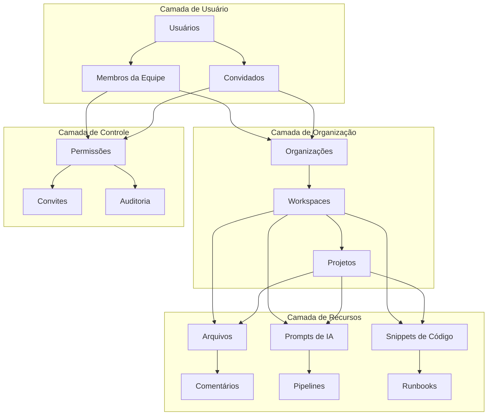

# COLABORAÇÃO E COMPARTILHAMENTO: BRAINLINK

**ID Documento**: BL-CO-001  
**Versão**: 1.0.0  
**Data**: 2025-03-19 04:50:00  
**Dependências**: BL-VC-001, BL-AT-001, BL-BE-001, BL-DB-001, BL-LLM-001, BL-SEC-001

## Visão Geral da Colaboração

A funcionalidade de colaboração no Brainlink permite que múltiplos usuários trabalhem juntos em projetos, compartilhem recursos, e mantenham um fluxo de trabalho colaborativo eficiente. O sistema é projetado para habilitar colaboração em tempo real, controle de acesso granular, comunicação integrada, e compartilhamento contextual de conhecimento.

O módulo de colaboração abrange workspaces compartilhados, comunicação entre membros da equipe, compartilhamento de recursos como prompts e pipelines de IA, e sistemas de gerenciamento de permissões que garantem tanto segurança quanto flexibilidade.

### Objetivos Principais da Colaboração

1. **Workspaces Compartilhados**: Ambientes de trabalho colaborativos para equipes
2. **Controle de Acesso Granular**: Permissões precisas para recursos compartilhados
3. **Comunicação Integrada**: Ferramentas de mensagens e comentários contextuais
4. **Compartilhamento de Conhecimento**: Distribuição eficiente de recursos de IA e insights
5. **Rastreamento de Atividades**: Acompanhamento de contribuições e mudanças de equipe

## Arquitetura de Colaboração

### 1. Visão Geral Arquitetural



### 2. Modelo de Colaboração

O Brainlink implementa um modelo de colaboração baseado em três níveis principais: Organizações, Workspaces e Projetos, com um sistema granular de permissões associado:

```typescript
// lib/types/collaboration.ts
export interface Organization {
  id: string;
  name: string;
  slug: string;
  logoUrl?: string;
  createdAt: string;
  updatedAt: string;
  ownerId: string;
  settings: OrganizationSettings;
}

export interface OrganizationSettings {
  allowPublicSharing: boolean;
  defaultMemberRole: MemberRole;
  requireEmailVerification: boolean;
  enableAudit: boolean;
  allowGuestAccess: boolean;
  singleSignOn?: {
    enabled: boolean;
    providers: string[];
  };
}

export interface Workspace {
  id: string;
  name: string;
  slug: string;
  description?: string;
  organizationId: string;
  isPrivate: boolean;
  createdAt: string;
  updatedAt: string;
  createdById: string;
  avatarUrl?: string;
  settings: WorkspaceSettings;
}

export interface WorkspaceSettings {
  defaultResourcePermission: ResourcePermission;
  allowAnonymousViewers: boolean;
  enableChat: boolean;
  enablePromptLibrary: boolean;
  enableActivityFeed: boolean;
}

export interface Project {
  id: string;
  name: string;
  description?: string;
  workspaceId: string;
  isArchived: boolean;
  createdAt: string;
  updatedAt: string;
  createdById: string;
  settings: ProjectSettings;
}

export interface ProjectSettings {
  aiModels: string[];
  executionEnvironments: string[];
  defaultBranch: string;
  enableVersioning: boolean;
}

export enum MemberRole {
  OWNER = 'owner',
  ADMIN = 'admin',
  MEMBER = 'member',
  GUEST = 'guest',
  VIEWER = 'viewer',
}

export type ResourcePermission = 'view' | 'comment' | 'edit' | 'manage';

export interface Member {
  id: string;
  userId: string;
  name: string;
  email: string;
  avatarUrl?: string;
  role: MemberRole;
  addedAt: string;
  addedById: string;
  lastActive?: string;
}

export interface ResourceShare {
  id: string;
  resourceType: 'file' | 'prompt' | 'pipeline' | 'snippet' | 'folder';
  resourceId: string;
  permission: ResourcePermission;
  sharedWith: 'organization' | 'workspace' | 'project' | 'user' | 'public';
  targetId?: string; // ID da org, workspace, projeto ou usuário
  createdById: string;
  createdAt: string;
  expiresAt?: string;
  accessCount: number;
}

export interface Invitation {
  id: string;
  email: string;
  organizationId: string;
  workspaceId?: string;
  projectId?: string;
  role: MemberRole;
  invitedById: string;
  invitedAt: string;
  expiresAt: string;
  status: 'pending' | 'accepted' | 'declined' | 'expired';
  message?: string;
}
```

## Sistema de Permissões

### 1. Controle de Acesso por Recurso

O Brainlink implementa um sistema de controle de acesso baseado em recursos (RBAC) para garantir segurança com flexibilidade:

```typescript
// lib/collaboration/permissions.ts
import { prisma } from '@/lib/db/prisma';
import type { ResourcePermission, MemberRole } from '@/types';

interface ResourceAccessQuery {
  userId: string;
  resourceType: 'file' | 'prompt' | 'pipeline' | 'snippet' | 'folder' | 'workspace' | 'project';
  resourceId: string;
}

// Mapeamento de papéis para permissões implícitas
const rolePermissions: Record<MemberRole, ResourcePermission[]> = {
  'owner': ['view', 'comment', 'edit', 'manage'],
  'admin': ['view', 'comment', 'edit', 'manage'],
  'member': ['view', 'comment', 'edit'],
  'guest': ['view', 'comment'],
  'viewer': ['view'],
};

export class PermissionService {
  /**
   * Verifica se um usuário tem uma permissão específica para um recurso
   */
  static async hasPermission(
    userId: string,
    resourceType: string,
    resourceId: string,
    requiredPermission: ResourcePermission
  ): Promise<boolean> {
    // Verificar permissão direta no recurso
    const directPermission = await this.getDirectResourcePermission(
      userId, resourceType, resourceId
    );
    
    if (directPermission) {
      return this.checkPermissionLevel(directPermission, requiredPermission);
    }
    
    // Verificar permissão no contêiner pai (projeto, workspace, org)
    const containerPermission = await this.getContainerPermission(
      userId, resourceType, resourceId
    );
    
    if (containerPermission) {
      return this.checkPermissionLevel(containerPermission, requiredPermission);
    }
    
    // Verificar se o recurso é público
    const isPublic = await this.isResourcePublic(resourceType, resourceId);
    if (isPublic && requiredPermission === 'view') {
      return true;
    }
    
    return false;
  }
  
  /**
   * Obtém a permissão direta no recurso
   */
  private static async getDirectResourcePermission(
    userId: string,
    resourceType: string,
    resourceId: string
  ): Promise<ResourcePermission | null> {
    // Buscar permissão direta no recurso
    const share = await prisma.resourceShare.findFirst({
      where: {
        resourceType,
        resourceId,
        sharedWith: 'user',
        targetId: userId,
      },
    });
    
    return share?.permission as ResourcePermission || null;
  }
  
  /**
   * Obtém permissão do contêiner (projeto, workspace, org)
   */
  private static async getContainerPermission(
    userId: string,
    resourceType: string,
    resourceId: string
  ): Promise<ResourcePermission | null> {
    // Determinar hierarquia de contêiner para o recurso
    const containerInfo = await this.getResourceContainer(resourceType, resourceId);
    
    if (!containerInfo) {
      return null;
    }
    
    // Verificar papel do usuário nos contêineres
    const { projectId, workspaceId, organizationId } = containerInfo;
    
    // Verificar membros do projeto
    if (projectId) {
      const projectMember = await prisma.projectMember.findFirst({
        where: {
          projectId,
          userId,
        },
      });
      
      if (projectMember) {
        return this.getHighestPermissionForRole(projectMember.role as MemberRole);
      }
    }
    
    // Verificar membros do workspace
    if (workspaceId) {
      const workspaceMember = await prisma.workspaceMember.findFirst({
        where: {
          workspaceId,
          userId,
        },
      });
      
      if (workspaceMember) {
        return this.getHighestPermissionForRole(workspaceMember.role as MemberRole);
      }
    }
    
    // Verificar membros da organização
    if (organizationId) {
      const orgMember = await prisma.organizationMember.findFirst({
        where: {
          organizationId,
          userId,
        },
      });
      
      if (orgMember) {
        return this.getHighestPermissionForRole(orgMember.role as MemberRole);
      }
    }
    
    return null;
  }
  
  /**
   * Verifica se um recurso é público
   */
  private static async isResourcePublic(
    resourceType: string,
    resourceId: string
  ): Promise<boolean> {
    // Verificar compartilhamentos públicos
    const publicShare = await prisma.resourceShare.findFirst({
      where: {
        resourceType,
        resourceId,
        sharedWith: 'public',
      },
    });
    
    if (publicShare) {
      return true;
    }
    
    // Verificar configuração do contêiner
    const containerInfo = await this.getResourceContainer(resourceType, resourceId);
    
    if (!containerInfo) {
      return false;
    }
    
    // Verificar se o workspace permite visualizadores anônimos
    if (containerInfo.workspaceId) {
      const workspace = await prisma.workspace.findUnique({
        where: { id: containerInfo.workspaceId },
        select: { settings: true },
      });
      
      if (workspace?.settings?.allowAnonymousViewers) {
        return true;
      }
    }
    
    return false;
  }
  
  /**
   * Obtém informações de contêiner para um recurso
   */
  private static async getResourceContainer(
    resourceType: string,
    resourceId: string
  ): Promise<{
    projectId?: string;
    workspaceId?: string;
    organizationId?: string;
  } | null> {
    // Diferentes consultas para diferentes tipos de recursos
    switch (resourceType) {
            case 'file':
        const file = await prisma.file.findUnique({
          where: { id: resourceId },
          select: { 
            projectId: true,
            project: {
              select: {
                workspaceId: true,
                workspace: {
                  select: { organizationId: true }
                }
              }
            }
          },
        });
        
        if (!file) return null;
        
        return {
          projectId: file.projectId,
          workspaceId: file.project?.workspaceId,
          organizationId: file.project?.workspace?.organizationId,
        };
        
      case 'prompt':
      case 'pipeline':
        const aiResource = await prisma.aiResource.findUnique({
          where: { id: resourceId },
          select: {
            workspaceId: true,
            workspace: {
              select: { organizationId: true }
            }
          },
        });
        
        if (!aiResource) return null;
        
        return {
          workspaceId: aiResource.workspaceId,
          organizationId: aiResource.workspace?.organizationId,
        };
        
      case 'project':
        const project = await prisma.project.findUnique({
          where: { id: resourceId },
          select: {
            workspaceId: true,
            workspace: {
              select: { organizationId: true }
            }
          },
        });
        
        if (!project) return null;
        
        return {
          workspaceId: project.workspaceId,
          organizationId: project.workspace?.organizationId,
        };
        
      case 'workspace':
        const workspace = await prisma.workspace.findUnique({
          where: { id: resourceId },
          select: { organizationId: true }
        });
        
        if (!workspace) return null;
        
        return {
          workspaceId: resourceId,
          organizationId: workspace.organizationId,
        };
        
      default:
        return null;
    }
  }
  
  /**
   * Verifica se um nível de permissão inclui outro
   */
  private static checkPermissionLevel(
    granted: ResourcePermission,
    required: ResourcePermission
  ): boolean {
    const levels: ResourcePermission[] = ['view', 'comment', 'edit', 'manage'];
    
    const grantedLevel = levels.indexOf(granted);
    const requiredLevel = levels.indexOf(required);
    
    return grantedLevel >= requiredLevel;
  }
  
  /**
   * Obtém a maior permissão disponível para um papel
   */
  private static getHighestPermissionForRole(
    role: MemberRole
  ): ResourcePermission {
    const permissions = rolePermissions[role];
    return permissions[permissions.length - 1];
  }
  
  /**
   * Concede permissão a um usuário para um recurso
   */
  static async grantPermission(
    grantedById: string,
    params: {
      resourceType: string;
      resourceId: string;
      permission: ResourcePermission;
      sharedWith: 'organization' | 'workspace' | 'project' | 'user' | 'public';
      targetId?: string;
      expiresAt?: Date;
    }
  ): Promise<boolean> {
    // Verificar se o concessor tem permissão para gerenciar o recurso
    const canManage = await this.hasPermission(
      grantedById, 
      params.resourceType, 
      params.resourceId, 
      'manage'
    );
    
    if (!canManage) {
      throw new Error('Insufficient permissions to share this resource');
    }
    
    try {
      // Criar ou atualizar compartilhamento
      await prisma.resourceShare.upsert({
        where: {
          resourceType_resourceId_sharedWith_targetId: {
            resourceType: params.resourceType,
            resourceId: params.resourceId,
            sharedWith: params.sharedWith,
            targetId: params.targetId || '',
          },
        },
        update: {
          permission: params.permission,
          expiresAt: params.expiresAt,
        },
        create: {
          resourceType: params.resourceType,
          resourceId: params.resourceId,
          permission: params.permission,
          sharedWith: params.sharedWith,
          targetId: params.targetId || '',
          createdById: grantedById,
          createdAt: new Date().toISOString(),
          expiresAt: params.expiresAt?.toISOString(),
          accessCount: 0,
        },
      });
      
      return true;
    } catch (error) {
      console.error('Error granting permission:', error);
      return false;
    }
  }
  
  /**
   * Revoga permissão de um usuário para um recurso
   */
  static async revokePermission(
    revokedById: string,
    params: {
      resourceType: string;
      resourceId: string;
      sharedWith: 'organization' | 'workspace' | 'project' | 'user' | 'public';
      targetId?: string;
    }
  ): Promise<boolean> {
    // Verificar se o revogador tem permissão para gerenciar o recurso
    const canManage = await this.hasPermission(
      revokedById, 
      params.resourceType, 
      params.resourceId, 
      'manage'
    );
    
    if (!canManage) {
      throw new Error('Insufficient permissions to revoke sharing');
    }
    
    try {
      // Remover compartilhamento
      await prisma.resourceShare.delete({
        where: {
          resourceType_resourceId_sharedWith_targetId: {
            resourceType: params.resourceType,
            resourceId: params.resourceId,
            sharedWith: params.sharedWith,
            targetId: params.targetId || '',
          },
        },
      });
      
      return true;
    } catch (error) {
      console.error('Error revoking permission:', error);
      return false;
    }
  }
  
  /**
   * Lista todas as permissões de um recurso
   */
  static async listResourcePermissions(
    resourceType: string,
    resourceId: string
  ): Promise<any[]> {
    const shares = await prisma.resourceShare.findMany({
      where: {
        resourceType,
        resourceId,
      },
      include: {
        targetUser: {
          select: {
            id: true,
            name: true,
            email: true,
            image: true,
          },
        },
      },
    });
    
    return shares;
  }
}
```

### 2. Convites e Membros

Sistema de gerenciamento de convites e membros para colaboração:

```typescript
// lib/collaboration/members.ts
import { prisma } from '@/lib/db/prisma';
import { sendInvitationEmail } from '@/lib/email/templates';
import { v4 as uuidv4 } from 'uuid';
import type { MemberRole } from '@/types';

interface InvitationParams {
  email: string;
  role: MemberRole;
  organizationId: string;
  workspaceId?: string;
  projectId?: string;
  invitedById: string;
  message?: string;
  expiryDays?: number;
}

interface AddMemberParams {
  userId: string;
  role: MemberRole;
  organizationId: string;
  workspaceId?: string;
  projectId?: string;
  addedById: string;
}

export class MemberService {
  /**
   * Cria um convite para um usuário se juntar à organização/workspace/projeto
   */
  static async createInvitation(params: InvitationParams): Promise<{
    success: boolean;
    invitation?: any;
    error?: string;
  }> {
    try {
      // Verificar permissões
      // (presumindo que verificação adequada já ocorreu na camada de controle)
      
      // Verificar se o convite já existe
      const existingInvite = await prisma.invitation.findFirst({
        where: {
          email: params.email,
          organizationId: params.organizationId,
          workspaceId: params.workspaceId,
          projectId: params.projectId,
          status: 'pending',
        },
      });
      
      if (existingInvite) {
        return {
          success: false,
          error: 'An invitation for this email already exists',
        };
      }
      
      // Verificar se o usuário já é membro
      const existingUser = await prisma.user.findFirst({
        where: { email: params.email },
      });
      
      if (existingUser) {
        // Verificar se já é membro da organização
        const isMember = await prisma.organizationMember.findFirst({
          where: {
            userId: existingUser.id,
            organizationId: params.organizationId,
          },
        });
        
        if (isMember) {
          return {
            success: false,
            error: 'User is already a member of this organization',
          };
        }
      }
      
      // Criar convite
      const expiryDays = params.expiryDays || 7;
      const expiresAt = new Date();
      expiresAt.setDate(expiresAt.getDate() + expiryDays);
      
      const invitation = await prisma.invitation.create({
        data: {
          id: uuidv4(),
          email: params.email,
          organizationId: params.organizationId,
          workspaceId: params.workspaceId,
          projectId: params.projectId,
          role: params.role,
          invitedById: params.invitedById,
          invitedAt: new Date().toISOString(),
          expiresAt: expiresAt.toISOString(),
          status: 'pending',
          message: params.message,
        },
      });
      
      // Enviar email de convite
      await sendInvitationEmail({
        email: params.email,
        invitationId: invitation.id,
        invitedBy: await this.getUserName(params.invitedById),
        organizationName: await this.getOrganizationName(params.organizationId),
        workspaceName: params.workspaceId
          ? await this.getWorkspaceName(params.workspaceId)
          : undefined,
        projectName: params.projectId
          ? await this.getProjectName(params.projectId)
          : undefined,
        role: params.role,
        message: params.message,
        expiresAt: expiresAt,
      });
      
      return {
        success: true,
        invitation,
      };
    } catch (error) {
      console.error('Error creating invitation:', error);
      return {
        success: false,
        error: `Failed to create invitation: ${error instanceof Error ? error.message : 'unknown error'}`,
      };
    }
  }
  
  /**
   * Aceita um convite e adiciona o usuário como membro
   */
  static async acceptInvitation(
    invitationId: string,
    userId: string
  ): Promise<{
    success: boolean;
    error?: string;
  }> {
    try {
      // Obter convite
      const invitation = await prisma.invitation.findUnique({
        where: { id: invitationId },
      });
      
      if (!invitation) {
        return {
          success: false,
          error: 'Invitation not found',
        };
      }
      
      // Verificar status
      if (invitation.status !== 'pending') {
        return {
          success: false,
          error: `Invitation has already been ${invitation.status}`,
        };
      }
      
      // Verificar expiração
      if (new Date(invitation.expiresAt) < new Date()) {
        await prisma.invitation.update({
          where: { id: invitationId },
          data: { status: 'expired' },
        });
        
        return {
          success: false,
          error: 'Invitation has expired',
        };
      }
      
      // Verificar email do usuário
      const user = await prisma.user.findUnique({
        where: { id: userId },
        select: { email: true },
      });
      
      if (!user || user.email !== invitation.email) {
        return {
          success: false,
          error: 'You are not the invited user',
        };
      }
      
      // Iniciar transação para adicionar usuário e atualizar convite
      await prisma.$transaction(async (prisma) => {
        // Adicionar à organização
        await prisma.organizationMember.create({
          data: {
            userId,
            organizationId: invitation.organizationId,
            role: invitation.role as MemberRole,
            addedAt: new Date().toISOString(),
            addedById: invitation.invitedById,
          },
        });
        
        // Adicionar ao workspace, se aplicável
        if (invitation.workspaceId) {
          await prisma.workspaceMember.create({
            data: {
              userId,
              workspaceId: invitation.workspaceId,
              role: invitation.role as MemberRole,
              addedAt: new Date().toISOString(),
              addedById: invitation.invitedById,
            },
          });
        }
        
        // Adicionar ao projeto, se aplicável
        if (invitation.projectId) {
          await prisma.projectMember.create({
            data: {
              userId,
              projectId: invitation.projectId,
              role: invitation.role as MemberRole,
              addedAt: new Date().toISOString(),
              addedById: invitation.invitedById,
            },
          });
        }
        
        // Atualizar status do convite
        await prisma.invitation.update({
          where: { id: invitationId },
          data: { status: 'accepted' },
        });
      });
      
      return { success: true };
    } catch (error) {
      console.error('Error accepting invitation:', error);
      return {
        success: false,
        error: `Failed to accept invitation: ${error instanceof Error ? error.message : 'unknown error'}`,
      };
    }
  }
  
  /**
   * Adiciona um usuário diretamente como membro
   */
  static async addMember(params: AddMemberParams): Promise<{
    success: boolean;
    error?: string;
  }> {
    try {
      // Verificar se já é membro
      if (params.organizationId) {
        const existingMember = await prisma.organizationMember.findFirst({
          where: {
            userId: params.userId,
            organizationId: params.organizationId,
          },
        });
        
        if (existingMember) {
          return {
            success: false,
            error: 'User is already a member of this organization',
          };
        }
      }
      
      // Adicionar membro aos níveis apropriados
      await prisma.$transaction(async (prisma) => {
        // Adicionar à organização
        if (params.organizationId) {
          await prisma.organizationMember.create({
            data: {
              userId: params.userId,
              organizationId: params.organizationId,
              role: params.role,
              addedAt: new Date().toISOString(),
              addedById: params.addedById,
            },
          });
        }
        
        // Adicionar ao workspace, se aplicável
        if (params.workspaceId) {
          await prisma.workspaceMember.create({
            data: {              userId: params.userId,
              workspaceId: params.workspaceId,
              role: params.role,
              addedAt: new Date().toISOString(),
              addedById: params.addedById,
            },
          });
        }
        
        // Adicionar ao projeto, se aplicável
        if (params.projectId) {
          await prisma.projectMember.create({
            data: {
              userId: params.userId,
              projectId: params.projectId,
              role: params.role,
              addedAt: new Date().toISOString(),
              addedById: params.addedById,
            },
          });
        }
      });
      
      return { success: true };
    } catch (error) {
      console.error('Error adding member:', error);
      return {
        success: false,
        error: `Failed to add member: ${error instanceof Error ? error.message : 'unknown error'}`,
      };
    }
  }
  
  /**
   * Atualiza a função de um membro
   */
  static async updateMemberRole(
    updatedById: string,
    params: {
      userId: string;
      role: MemberRole;
      organizationId?: string;
      workspaceId?: string;
      projectId?: string;
    }
  ): Promise<{
    success: boolean;
    error?: string;
  }> {
    try {
      if (params.organizationId) {
        // Verificar se o atualizador tem permissão na organização
        const updaterRole = await this.getUserRoleInOrganization(
          updatedById, 
          params.organizationId
        );
        
        // Apenas owner e admin podem atualizar funções
        if (updaterRole !== 'owner' && updaterRole !== 'admin') {
          return {
            success: false,
            error: 'Insufficient permissions to update member roles',
          };
        }
        
        // Owner não pode ser rebaixado por ninguém exceto ele mesmo
        if (params.userId !== updatedById) {
          const targetRole = await this.getUserRoleInOrganization(
            params.userId,
            params.organizationId
          );
          
          if (targetRole === 'owner') {
            return {
              success: false,
              error: 'Cannot change role of the organization owner',
            };
          }
        }
        
        // Não permitir que admins promovam outros a owner
        if (updaterRole === 'admin' && params.role === 'owner') {
          return {
            success: false,
            error: 'Only the owner can promote members to owner',
          };
        }
        
        // Atualizar função na organização
        await prisma.organizationMember.update({
          where: {
            userId_organizationId: {
              userId: params.userId,
              organizationId: params.organizationId,
            },
          },
          data: { role: params.role },
        });
      }
      
      // Lógica similar para workspace e project
      if (params.workspaceId) {
        await prisma.workspaceMember.update({
          where: {
            userId_workspaceId: {
              userId: params.userId,
              workspaceId: params.workspaceId,
            },
          },
          data: { role: params.role },
        });
      }
      
      if (params.projectId) {
        await prisma.projectMember.update({
          where: {
            userId_projectId: {
              userId: params.userId,
              projectId: params.projectId,
            },
          },
          data: { role: params.role },
        });
      }
      
      return { success: true };
    } catch (error) {
      console.error('Error updating member role:', error);
      return {
        success: false,
        error: `Failed to update member role: ${error instanceof Error ? error.message : 'unknown error'}`,
      };
    }
  }
  
  /**
   * Remove um membro
   */
  static async removeMember(
    removedById: string,
    params: {
      userId: string;
      organizationId?: string;
      workspaceId?: string;
      projectId?: string;
    }
  ): Promise<{
    success: boolean;
    error?: string;
  }> {
    try {
      // Verificações de permissão e lógica similar à atualização de função
      
      if (params.organizationId) {
        // Verificar se está tentando remover o owner
        const memberRole = await this.getUserRoleInOrganization(
          params.userId,
          params.organizationId
        );
        
        if (memberRole === 'owner') {
          return {
            success: false,
            error: 'Cannot remove the organization owner',
          };
        }
        
        // Remover da organização
        await prisma.organizationMember.delete({
          where: {
            userId_organizationId: {
              userId: params.userId,
              organizationId: params.organizationId,
            },
          },
        });
        
        // Também remover de todos os workspaces desta organização
        await prisma.workspaceMember.deleteMany({
          where: {
            userId: params.userId,
            workspace: {
              organizationId: params.organizationId,
            },
          },
        });
        
        // E de todos os projetos destes workspaces
        await prisma.projectMember.deleteMany({
          where: {
            userId: params.userId,
            project: {
              workspace: {
                organizationId: params.organizationId,
              },
            },
          },
        });
      } else if (params.workspaceId) {
        // Remover do workspace
        await prisma.workspaceMember.delete({
          where: {
            userId_workspaceId: {
              userId: params.userId,
              workspaceId: params.workspaceId,
            },
          },
        });
        
        // Remover de todos os projetos deste workspace
        await prisma.projectMember.deleteMany({
          where: {
            userId: params.userId,
            project: {
              workspaceId: params.workspaceId,
            },
          },
        });
      } else if (params.projectId) {
        // Remover do projeto
        await prisma.projectMember.delete({
          where: {
            userId_projectId: {
              userId: params.userId,
              projectId: params.projectId,
            },
          },
        });
      }
      
      return { success: true };
    } catch (error) {
      console.error('Error removing member:', error);
      return {
        success: false,
        error: `Failed to remove member: ${error instanceof Error ? error.message : 'unknown error'}`,
      };
    }
  }
  
  /**
   * Lista membros de uma organização, workspace ou projeto
   */
  static async listMembers(params: {
    organizationId?: string;
    workspaceId?: string;
    projectId?: string;
  }): Promise<any[]> {
    if (params.organizationId) {
      return prisma.organizationMember.findMany({
        where: { organizationId: params.organizationId },
        include: {
          user: {
            select: {
              id: true,
              name: true,
              email: true,
              image: true,
            },
          },
        },
      });
    } else if (params.workspaceId) {
      return prisma.workspaceMember.findMany({
        where: { workspaceId: params.workspaceId },
        include: {
          user: {
            select: {
              id: true,
              name: true,
              email: true,
              image: true,
            },
          },
        },
      });
    } else if (params.projectId) {
      return prisma.projectMember.findMany({
        where: { projectId: params.projectId },
        include: {
          user: {
            select: {
              id: true,
              name: true,
              email: true,
              image: true,
            },
          },
        },
      });
    }
    
    return [];
  }
  
  /**
   * Lista convites pendentes
   */
  static async listPendingInvitations(params: {
    organizationId?: string;
    workspaceId?: string;
    projectId?: string;
  }): Promise<any[]> {
    return prisma.invitation.findMany({
      where: {
        status: 'pending',
        organizationId: params.organizationId,
        workspaceId: params.workspaceId,
        projectId: params.projectId,
      },
      include: {
        invitedBy: {
          select: {
            id: true,
            name: true,
            email: true,
            image: true,
          },
        },
      },
    });
  }
  
  /**
   * Utilitário para obter função de um usuário na organização
   */
  private static async getUserRoleInOrganization(
    userId: string,
    organizationId: string
  ): Promise<MemberRole | null> {
    const member = await prisma.organizationMember.findUnique({
      where: {
        userId_organizationId: {
          userId,
          organizationId,
        },
      },
      select: { role: true },
    });
    
    return member?.role as MemberRole || null;
  }
  
  /**
   * Utilitários auxiliares para nomes
   */
  private static async getUserName(userId: string): Promise<string> {
    const user = await prisma.user.findUnique({
      where: { id: userId },
      select: { name: true },
    });
    
    return user?.name || 'Unknown User';
  }
  
  private static async getOrganizationName(organizationId: string): Promise<string> {
    const org = await prisma.organization.findUnique({
      where: { id: organizationId },
      select: { name: true },
    });
    
    return org?.name || 'Unknown Organization';
  }
  
  private static async getWorkspaceName(workspaceId: string): Promise<string> {
    const workspace = await prisma.workspace.findUnique({
      where: { id: workspaceId },
      select: { name: true },
    });
    
    return workspace?.name || 'Unknown Workspace';
  }
  
  private static async getProjectName(projectId: string): Promise<string> {
    const project = await prisma.project.findUnique({
      where: { id: projectId },
      select: { name: true },
    });
    
    return project?.name || 'Unknown Project';
  }
}
```

## Compartilhamento de Recursos

### 1. Sistema de Links de Compartilhamento

```typescript
// lib/collaboration/sharing.ts
import { prisma } from '@/lib/db/prisma';
import { v4 as uuidv4 } from 'uuid';
import { PermissionService } from './permissions';
import type { ResourcePermission } from '@/types';

interface SharingLinkParams {
  resourceType: 'file' | 'prompt' | 'pipeline' | 'snippet' | 'folder';
  resourceId: string;
  createdById: string;
  permission?: ResourcePermission;
  expiresAt?: Date;
  password?: string;
  allowAnonymous?: boolean;
}

interface SharingLinkAccess {
  linkId: string;
  accessedById?: string;
  accessedAt: Date;
  ipAddress?: string;
  userAgent?: string;
}

export class SharingService {
  /**
   * Cria um link de compartilhamento
   */
  static async createSharingLink(params: SharingLinkParams): Promise<{
    success: boolean;
    link?: any;
    error?: string;
  }> {
    try {
      // Verificar permissões
      const canManage = await PermissionService.hasPermission(
        params.createdById,
        params.resourceType,
        params.resourceId,
        'manage'
      );
      
      if (!canManage) {
        return {
          success: false,
          error: 'Insufficient permissions to create sharing link',
        };
      }
      
      // Gerar token único
      const linkId = uuidv4();
      
      // Criar link
      const sharingLink = await prisma.sharingLink.create({
        data: {
          id: linkId,
          token: this.generateShortToken(),
          resourceType: params.resourceType,
          resourceId: params.resourceId,
          permission: params.permission || 'view',
          createdById: params.createdById,
          createdAt: new Date().toISOString(),
          expiresAt: params.expiresAt?.toISOString(),
          password: params.password,
          allowAnonymous: params.allowAnonymous || false,
          accessCount: 0,
          lastAccessedAt: null,
        },
      });
      
      return {
        success: true,
        link: sharingLink,
      };
    } catch (error) {
      console.error('Error creating sharing link:', error);
      return {
        success: false,
        error: `Failed to create sharing link: ${error instanceof Error ? error.message : 'unknown error'}`,
      };
    }
  }
  
  /**
   * Acessa um recurso via link de compartilhamento
   */
  static async accessSharingLink(
    token: string,
    params: {
      userId?: string;
      password?: string;
      ipAddress?: string;
      userAgent?: string;
    }
  ): Promise<{
    success: boolean;
    resource?: any;
    error?: string;
  }> {
    try {
      // Buscar link pelo token
      const link = await prisma.sharingLink.findFirst({
        where: { token },
      });
      
      if (!link) {
        return {
          success: false,
          error: 'Sharing link not found',
        };
      }
      
      // Verificar expiração
      if (link.expiresAt && new Date(link.expiresAt) < new Date()) {
        return {
          success: false,
          error: 'Sharing link has expired',
        };
      }
      
      // Verificar senha, se definida
      if (link.password && link.password !== params.password) {
        return {
          success: false,
          error: 'Invalid password',
        };
      }
      
      // Verificar acesso anônimo
      if (!link.allowAnonymous && !params.userId) {
        return {
          success: false,
          error: 'Authentication required to access this resource',
        };
      }
      
      // Registrar acesso
      await this.recordLinkAccess({
        linkId: link.id,
        accessedById: params.userId,
        accessedAt: new Date(),
        ipAddress: params.ipAddress,
        userAgent: params.userAgent,
      });
      
      // Buscar recurso
      const resource = await this.getResourceById(
        link.resourceType,
        link.resourceId
      );
      
      if (!resource) {
        return {
          success: false,
          error: 'Resource not found or deleted',
        };
      }
      
      return {
        success: true,
        resource: {
          ...resource,
          accessPermission: link.permission,
        },
      };
    } catch (error) {
      console.error('Error accessing sharing link:', error);
      return {
        success: false,
        error: `Failed to access sharing link: ${error instanceof Error ? error.message : 'unknown error'}`,
      };
    }
  }
  
  /**
   * Revoga um link de compartilhamento
   */
  static async rev
    /**
   * Revoga um link de compartilhamento
   */
  static async revokeSharingLink(
    linkId: string,
    userId: string
  ): Promise<{
    success: boolean;
    error?: string;
  }> {
    try {
      // Buscar link
      const link = await prisma.sharingLink.findUnique({
        where: { id: linkId },
      });
      
      if (!link) {
        return {
          success: false,
          error: 'Sharing link not found',
        };
      }
      
      // Verificar permissões
      const canManage = await PermissionService.hasPermission(
        userId,
        link.resourceType,
        link.resourceId,
        'manage'
      );
      
      if (!canManage && link.createdById !== userId) {
        return {
          success: false,
          error: 'Insufficient permissions to revoke this sharing link',
        };
      }
      
      // Remover link
      await prisma.sharingLink.delete({
        where: { id: linkId },
      });
      
      return { success: true };
    } catch (error) {
      console.error('Error revoking sharing link:', error);
      return {
        success: false,
        error: `Failed to revoke sharing link: ${error instanceof Error ? error.message : 'unknown error'}`,
      };
    }
  }
  
  /**
   * Lista links de compartilhamento de um recurso
   */
  static async listSharingLinks(
    resourceType: string,
    resourceId: string,
    userId: string
  ): Promise<{
    success: boolean;
    links?: any[];
    error?: string;
  }> {
    try {
      // Verificar permissões
      const canView = await PermissionService.hasPermission(
        userId,
        resourceType,
        resourceId,
        'view'
      );
      
      if (!canView) {
        return {
          success: false,
          error: 'Insufficient permissions to view sharing links',
        };
      }
      
      // Buscar links
      const links = await prisma.sharingLink.findMany({
        where: {
          resourceType,
          resourceId,
        },
        include: {
          createdBy: {
            select: {
              id: true,
              name: true,
              email: true,
              image: true,
            },
          },
        },
        orderBy: { createdAt: 'desc' },
      });
      
      return {
        success: true,
        links,
      };
    } catch (error) {
      console.error('Error listing sharing links:', error);
      return {
        success: false,
        error: `Failed to list sharing links: ${error instanceof Error ? error.message : 'unknown error'}`,
      };
    }
  }
  
  /**
   * Registra acesso a um link de compartilhamento
   */
  private static async recordLinkAccess(access: SharingLinkAccess): Promise<void> {
    try {
      // Registrar acesso
      await prisma.linkAccess.create({
        data: {
          linkId: access.linkId,
          accessedById: access.accessedById,
          accessedAt: access.accessedAt.toISOString(),
          ipAddress: access.ipAddress,
          userAgent: access.userAgent,
        },
      });
      
      // Atualizar contagem de acessos e timestamp
      await prisma.sharingLink.update({
        where: { id: access.linkId },
        data: {
          accessCount: { increment: 1 },
          lastAccessedAt: access.accessedAt.toISOString(),
        },
      });
    } catch (error) {
      console.error('Error recording link access:', error);
    }
  }
  
  /**
   * Busca recurso pelo ID e tipo
   */
  private static async getResourceById(
    resourceType: string,
    resourceId: string
  ): Promise<any | null> {
    // Buscar recurso específico baseado no tipo
    switch (resourceType) {
      case 'file':
        return prisma.file.findUnique({
          where: { id: resourceId },
          include: {
            project: {
              select: {
                id: true,
                name: true,
                workspace: {
                  select: {
                    id: true,
                    name: true,
                  },
                },
              },
            },
          },
        });
        
      case 'prompt':
        return prisma.prompt.findUnique({
          where: { id: resourceId },
          include: {
            workspace: {
              select: {
                id: true,
                name: true,
              },
            },
          },
        });
        
      case 'pipeline':
        return prisma.pipeline.findUnique({
          where: { id: resourceId },
          include: {
            workspace: {
              select: {
                id: true,
                name: true,
              },
            },
          },
        });
        
      case 'snippet':
        return prisma.codeSnippet.findUnique({
          where: { id: resourceId },
        });
        
      case 'folder':
        return prisma.folder.findUnique({
          where: { id: resourceId },
          include: {
            project: {
              select: {
                id: true,
                name: true,
                workspace: {
                  select: {
                    id: true,
                    name: true,
                  },
                },
              },
            },
          },
        });
        
      default:
        return null;
    }
  }
  
  /**
   * Gera um token curto para compartilhamento
   */
  private static generateShortToken(): string {
    // Gerar string aleatória de 8 caracteres
    const chars = 'ABCDEFGHIJKLMNOPQRSTUVWXYZabcdefghijklmnopqrstuvwxyz0123456789';
    let result = '';
    
    for (let i = 0; i < 8; i++) {
      result += chars.charAt(Math.floor(Math.random() * chars.length));
    }
    
    return result;
  }
}
```

### 2. Biblioteca Compartilhada de Prompts e Pipelines

```typescript
// lib/collaboration/library.ts
import { prisma } from '@/lib/db/prisma';
import { PermissionService } from './permissions';
import type { ResourcePermission } from '@/types';

interface LibraryItemBase {
  name: string;
  description?: string;
  tags?: string[];
  isPublic?: boolean;
  workspaceId?: string;
}

interface PromptItem extends LibraryItemBase {
  content: string;
  model?: string;
  parameters?: Record<string, any>;
}

interface PipelineItem extends LibraryItemBase {
  nodes: any[];
  edges: any[];
  settings?: Record<string, any>;
}

export class LibraryService {
  /**
   * Adiciona um prompt à biblioteca
   */
  static async addPrompt(
    userId: string,
    prompt: PromptItem
  ): Promise<{
    success: boolean;
    promptId?: string;
    error?: string;
  }> {
    try {
      // Verificar permissões, se associado a workspace
      if (prompt.workspaceId) {
        const canEdit = await PermissionService.hasPermission(
          userId,
          'workspace',
          prompt.workspaceId,
          'edit'
        );
        
        if (!canEdit) {
          return {
            success: false,
            error: 'Insufficient permissions to add prompt to this workspace',
          };
        }
      }
      
      // Criar prompt
      const createdPrompt = await prisma.prompt.create({
        data: {
          name: prompt.name,
          description: prompt.description || '',
          content: prompt.content,
          tags: prompt.tags || [],
          model: prompt.model || 'gpt-3.5-turbo',
          parameters: prompt.parameters || {},
          isPublic: prompt.isPublic || false,
          workspaceId: prompt.workspaceId,
          createdById: userId,
          createdAt: new Date().toISOString(),
          updatedAt: new Date().toISOString(),
          useCount: 0,
        },
      });
      
      return {
        success: true,
        promptId: createdPrompt.id,
      };
    } catch (error) {
      console.error('Error adding prompt to library:', error);
      return {
        success: false,
        error: `Failed to add prompt: ${error instanceof Error ? error.message : 'unknown error'}`,
      };
    }
  }
  
  /**
   * Adiciona um pipeline à biblioteca
   */
  static async addPipeline(
    userId: string,
    pipeline: PipelineItem
  ): Promise<{
    success: boolean;
    pipelineId?: string;
    error?: string;
  }> {
    try {
      // Verificar permissões, se associado a workspace
      if (pipeline.workspaceId) {
        const canEdit = await PermissionService.hasPermission(
          userId,
          'workspace',
          pipeline.workspaceId,
          'edit'
        );
        
        if (!canEdit) {
          return {
            success: false,
            error: 'Insufficient permissions to add pipeline to this workspace',
          };
        }
      }
      
      // Criar pipeline
      const createdPipeline = await prisma.pipeline.create({
        data: {
          name: pipeline.name,
          description: pipeline.description || '',
          nodes: pipeline.nodes,
          edges: pipeline.edges,
          tags: pipeline.tags || [],
          settings: pipeline.settings || {},
          isPublic: pipeline.isPublic || false,
          workspaceId: pipeline.workspaceId,
          createdById: userId,
          createdAt: new Date().toISOString(),
          updatedAt: new Date().toISOString(),
          executeCount: 0,
        },
      });
      
      return {
        success: true,
        pipelineId: createdPipeline.id,
      };
    } catch (error) {
      console.error('Error adding pipeline to library:', error);
      return {
        success: false,
        error: `Failed to add pipeline: ${error instanceof Error ? error.message : 'unknown error'}`,
      };
    }
  }
  
  /**
   * Busca itens da biblioteca (prompts e pipelines)
   */
  static async searchLibrary(
    userId: string,
    params: {
      query?: string;
      tags?: string[];
      type?: 'prompt' | 'pipeline' | 'all';
      workspaceId?: string;
      includePublic?: boolean;
      limit?: number;
      offset?: number;
    }
  ): Promise<{
    success: boolean;
    items?: {
      prompts: any[];
      pipelines: any[];
    };
    total?: {
      prompts: number;
      pipelines: number;
    };
    error?: string;
  }> {
    try {
      const {
        query,
        tags,
        type = 'all',
        workspaceId,
        includePublic = true,
        limit = 20,
        offset = 0,
      } = params;
      
      // Construir filtro base
      const baseFilter: any = {};
      
      // Adicionar filtro de texto se definido
      if (query) {
        baseFilter.OR = [
          { name: { contains: query, mode: 'insensitive' } },
          { description: { contains: query, mode: 'insensitive' } },
        ];
      }
      
      // Filtrar por tags se definidas
      if (tags && tags.length > 0) {
        baseFilter.tags = {
          hasSome: tags,
        };
      }
      
      // Filtros de acesso
      const accessFilter: any = {
        OR: [
          // Recursos criados pelo usuário
          { createdById: userId },
        ],
      };
      
      // Adicionar recursos de workspaces com acesso
      if (workspaceId) {
        // Se workspaceId for especificado, filtrar apenas por este workspace
        accessFilter.OR.push({
          workspaceId,
        });
      } else {
        // Caso contrário, incluir todos os workspaces onde o usuário é membro
        const userWorkspaces = await prisma.workspaceMember.findMany({
          where: { userId },
          select: { workspaceId: true },
        });
        
        if (userWorkspaces.length > 0) {
          accessFilter.OR.push({
            workspaceId: {
              in: userWorkspaces.map(w => w.workspaceId),
            },
          });
        }
      }
      
      // Incluir recursos públicos se solicitado
      if (includePublic) {
        accessFilter.OR.push({ isPublic: true });
      }
      
      // Combinar filtros
      const fullFilter = {
        ...baseFilter,
        ...accessFilter,
      };
      
      // Resultado a retornar
      const result: {
        prompts: any[];
        pipelines: any[];
      } = {
        prompts: [],
        pipelines: [],
      };
      
      const totals: {
        prompts: number;
        pipelines: number;
      } = {
        prompts: 0,
        pipelines: 0,
      };
      
      // Buscar prompts se solicitado
      if (type === 'all' || type === 'prompt') {
        [result.prompts, totals.prompts] = await Promise.all([
          prisma.prompt.findMany({
            where: fullFilter,
            include: {
              createdBy: {
                select: {
                  id: true,
                  name: true,
                  image: true,
                },
              },
              workspace: {
                select: {
                  id: true,
                  name: true,
                },
              },
            },
            orderBy: { updatedAt: 'desc' },
            take: limit,
            skip: offset,
          }),
          prisma.prompt.count({ where: fullFilter }),
        ]);
      }
      
      // Buscar pipelines se solicitado
      if (type === 'all' || type === 'pipeline') {
        [result.pipelines, totals.pipelines] = await Promise.all([
          prisma.pipeline.findMany({
            where: fullFilter,
            include: {
              createdBy: {
                select: {
                  id: true,
                  name: true,
                  image: true,
                },
              },
              workspace: {
                select: {
                  id: true,
                  name: true,
                },
              },
            },
            orderBy: { updatedAt: 'desc' },
            take: limit,
            skip: offset,
          }),
          prisma.pipeline.count({ where: fullFilter }),
        ]);
      }
      
      return {
        success: true,
        items: result,
        total: totals,
      };
    } catch (error) {
      console.error('Error searching library:', error);
      return {
        success: false,
        error: `Failed to search library: ${error instanceof Error ? error.message : 'unknown error'}`,
      };
    }
  }
  
  /**
   * Obtém recomendações personalizadas da biblioteca
   */
  static async getRecommendations(
    userId: string,
    params: {
      workspaceId?: string;
      limit?: number
            userId: string,
      params: {
        workspaceId?: string;
        limit?: number;
        context?: string;
      }
  ): Promise<{
    success: boolean;
    recommendations?: {
      prompts: any[];
      pipelines: any[];
    };
    error?: string;
  }> {
    try {
      const { workspaceId, limit = 10, context } = params;
      
      // Obter histórico de uso do usuário
      const recentPromptUsage = await prisma.promptUsage.findMany({
        where: { userId },
        orderBy: { usedAt: 'desc' },
        take: 20,
        select: { promptId: true },
      });
      
      const recentPipelineUsage = await prisma.pipelineExecution.findMany({
        where: { userId },
        orderBy: { startedAt: 'desc' },
        take: 20,
        select: { pipelineId: true },
      });
      
      // IDs de itens recentemente usados
      const recentPromptIds = recentPromptUsage.map(p => p.promptId);
      const recentPipelineIds = recentPipelineUsage.map(p => p.pipelineId);
      
      // Filtrar por workspace, se especificado
      const workspaceFilter = workspaceId ? { workspaceId } : {};
      
      // Encontrar tags frequentemente usadas pelo usuário
      const userTags = await this.getUserPreferredTags(userId);
      
      // Obter recomendações contextuais se contexto fornecido
      let contextualFilter = {};
      if (context) {
        contextualFilter = {
          OR: [
            { name: { contains: context, mode: 'insensitive' } },
            { description: { contains: context, mode: 'insensitive' } },
            { tags: { hasSome: context.split(/\s+/).filter(t => t.length > 3) } },
          ],
        };
      }
      
      // Buscar prompts recomendados
      const recommendedPrompts = await prisma.prompt.findMany({
        where: {
          ...workspaceFilter,
          ...contextualFilter,
          OR: [
            // Itens populares
            { useCount: { gt: 5 } },
            // Itens com tags preferidas
            { tags: { hasSome: userTags } },
          ],
          // Excluir itens recentemente usados
          id: { notIn: recentPromptIds },
        },
        orderBy: [
          { useCount: 'desc' },
          { updatedAt: 'desc' },
        ],
        take: limit,
        include: {
          createdBy: {
            select: {
              id: true,
              name: true,
              image: true,
            },
          },
          workspace: {
            select: {
              id: true,
              name: true,
            },
          },
        },
      });
      
      // Buscar pipelines recomendados
      const recommendedPipelines = await prisma.pipeline.findMany({
        where: {
          ...workspaceFilter,
          ...contextualFilter,
          OR: [
            // Itens populares
            { executeCount: { gt: 5 } },
            // Itens com tags preferidas
            { tags: { hasSome: userTags } },
          ],
          // Excluir itens recentemente usados
          id: { notIn: recentPipelineIds },
        },
        orderBy: [
          { executeCount: 'desc' },
          { updatedAt: 'desc' },
        ],
        take: limit,
        include: {
          createdBy: {
            select: {
              id: true,
              name: true,
              image: true,
            },
          },
          workspace: {
            select: {
              id: true,
              name: true,
            },
          },
        },
      });
      
      return {
        success: true,
        recommendations: {
          prompts: recommendedPrompts,
          pipelines: recommendedPipelines,
        },
      };
    } catch (error) {
      console.error('Error getting recommendations:', error);
      return {
        success: false,
        error: `Failed to get recommendations: ${error instanceof Error ? error.message : 'unknown error'}`,
      };
    }
  }
  
  /**
   * Registra uso de um prompt
   */
  static async recordPromptUsage(
    userId: string,
    promptId: string
  ): Promise<void> {
    try {
      // Registrar uso
      await prisma.promptUsage.create({
        data: {
          userId,
          promptId,
          usedAt: new Date().toISOString(),
        },
      });
      
      // Incrementar contagem de uso
      await prisma.prompt.update({
        where: { id: promptId },
        data: { useCount: { increment: 1 } },
      });
    } catch (error) {
      console.error('Error recording prompt usage:', error);
    }
  }
  
  /**
   * Registra execução de um pipeline
   */
  static async recordPipelineExecution(
    userId: string,
    pipelineId: string,
    success: boolean
  ): Promise<void> {
    try {
      // Registrar execução
      await prisma.pipelineExecution.create({
        data: {
          userId,
          pipelineId,
          startedAt: new Date().toISOString(),
          success,
        },
      });
      
      // Incrementar contagem de execução
      await prisma.pipeline.update({
        where: { id: pipelineId },
        data: { executeCount: { increment: 1 } },
      });
    } catch (error) {
      console.error('Error recording pipeline execution:', error);
    }
  }
  
  /**
   * Extrai tags preferidas do usuário baseado em histórico
   */
  private static async getUserPreferredTags(
    userId: string
  ): Promise<string[]> {
    // Buscar prompts e pipelines usados recentemente
    const recentPrompts = await prisma.promptUsage.findMany({
      where: { userId },
      orderBy: { usedAt: 'desc' },
      take: 50,
      include: {
        prompt: {
          select: { tags: true },
        },
      },
    });
    
    const recentPipelines = await prisma.pipelineExecution.findMany({
      where: { userId },
      orderBy: { startedAt: 'desc' },
      take: 50,
      include: {
        pipeline: {
          select: { tags: true },
        },
      },
    });
    
    // Contar frequência de tags
    const tagCounts: Record<string, number> = {};
    
    // Processar tags de prompts
    recentPrompts.forEach(usage => {
      if (usage.prompt?.tags) {
        usage.prompt.tags.forEach(tag => {
          tagCounts[tag] = (tagCounts[tag] || 0) + 1;
        });
      }
    });
    
    // Processar tags de pipelines
    recentPipelines.forEach(execution => {
      if (execution.pipeline?.tags) {
        execution.pipeline.tags.forEach(tag => {
          tagCounts[tag] = (tagCounts[tag] || 0) + 1;
        });
      }
    });
    
    // Obter as tags mais frequentes
    return Object.entries(tagCounts)
      .sort((a, b) => b[1] - a[1])
      .slice(0, 10)
      .map(([tag]) => tag);
  }
}
```

## Comunicação Integrada

### 1. Comentários e Discussões

```typescript
// lib/collaboration/comments.ts
import { prisma } from '@/lib/db/prisma';
import { PermissionService } from './permissions';
import { v4 as uuidv4 } from 'uuid';

interface CommentData {
  content: string;
  resourceType: string;
  resourceId: string;
  userId: string;
  parentId?: string;
  position?: {
    line?: number;
    column?: number;
    selection?: {
      start: number;
      end: number;
    };
  };
  metadata?: Record<string, any>;
}

interface CommentUpdate {
  commentId: string;
  content: string;
  userId: string;
  metadata?: Record<string, any>;
}

export class CommentService {
  /**
   * Adiciona um comentário a um recurso
   */
  static async addComment(data: CommentData): Promise<{
    success: boolean;
    comment?: any;
    error?: string;
  }> {
    try {
      // Verificar permissões
      const canComment = await PermissionService.hasPermission(
        data.userId,
        data.resourceType,
        data.resourceId,
        'comment'
      );
      
      if (!canComment) {
        return {
          success: false,
          error: 'Insufficient permissions to comment on this resource',
        };
      }
      
      // Verificar se é resposta a outro comentário
      if (data.parentId) {
        const parentComment = await prisma.comment.findUnique({
          where: { id: data.parentId },
        });
        
        if (!parentComment) {
          return {
            success: false,
            error: 'Parent comment not found',
          };
        }
        
        // Garantir que a resposta está no mesmo recurso
        if (
          parentComment.resourceType !== data.resourceType ||
          parentComment.resourceId !== data.resourceId
        ) {
          return {
            success: false,
            error: 'Parent comment belongs to a different resource',
          };
        }
      }
      
      // Criar comentário
      const comment = await prisma.comment.create({
        data: {
          id: uuidv4(),
          content: data.content,
          resourceType: data.resourceType,
          resourceId: data.resourceId,
          parentId: data.parentId,
          userId: data.userId,
          createdAt: new Date().toISOString(),
          updatedAt: new Date().toISOString(),
          position: data.position || null,
          metadata: data.metadata || {},
          isDeleted: false,
          isResolved: false,
        },
        include: {
          user: {
            select: {
              id: true,
              name: true,
              email: true,
              image: true,
            },
          },
        },
      });
      
      return {
        success: true,
        comment,
      };
    } catch (error) {
      console.error('Error adding comment:', error);
      return {
        success: false,
        error: `Failed to add comment: ${error instanceof Error ? error.message : 'unknown error'}`,
      };
    }
  }
  
  /**
   * Atualiza um comentário existente
   */
  static async updateComment(data: CommentUpdate): Promise<{
    success: boolean;
    comment?: any;
    error?: string;
  }> {
    try {
      // Buscar comentário
      const comment = await prisma.comment.findUnique({
        where: { id: data.commentId },
      });
      
      if (!comment) {
        return {
          success: false,
          error: 'Comment not found',
        };
      }
      
      // Verificar se o usuário é o autor
      if (comment.userId !== data.userId) {
        // Verificar se tem permissões de gerenciamento no recurso
        const canManage = await PermissionService.hasPermission(
          data.userId,
          comment.resourceType,
          comment.resourceId,
          'manage'
        );
        
        if (!canManage) {
          return {
            success: false,
            error: 'Only the comment author or resource managers can update comments',
          };
        }
      }
      
      // Atualizar comentário
      const updatedComment = await prisma.comment.update({
        where: { id: data.commentId },
        data: {
          content: data.content,
          updatedAt: new Date().toISOString(),
          metadata: {
            ...comment.metadata,
            ...data.metadata,
            edit: {
              editedAt: new Date().toISOString(),
              editedById: data.userId,
            },
          },
        },
        include: {
          user: {
            select: {
              id: true,
              name: true,
              email: true,
              image: true,
            },
          },
        },
      });
      
      return {
        success: true,
        comment: updatedComment,
      };
    } catch (error) {
      console.error('Error updating comment:', error);
      return {
        success: false,
        error: `Failed to update comment: ${error instanceof Error ? error.message : 'unknown error'}`,
      };
    }
  }
  
  /**
   * Marca um comentário como resolvido ou reaberto
   */
  static async resolveComment(
    commentId: string,
    userId: string,
    resolved: boolean
  ): Promise<{
    success: boolean;
    comment?: any;
    error?: string;
  }> {
    try {
      // Buscar comentário
      const comment = await prisma.comment.findUnique({
        where: { id: commentId },
      });
      
      if (!comment) {
        return {
          success: false,
          error: 'Comment not found',
        };
      }
      
      // Verificar permissões
      const canComment = await PermissionService.hasPermission(
        userId,
        comment.resourceType,
        comment.resourceId,
        'comment'
      );
      
      if (!canComment) {
        return {
          success: false,
          error: 'Insufficient permissions to resolve comments on this resource',
        };
      }
      
      // Atualizar status de resolução
      const updatedComment = await prisma.comment.update({
        where: { id: commentId },
        data: {
          isResolved: resolved,
          metadata: {
            ...comment.metadata,
            resolution: {
              resolvedAt: resolved ? new Date().toISOString() : null,
              resolvedById: resolved ? userId : null,
            },
          },
        },
        include: {
          user: {
            select: {
              id: true,
              name: true,
              email: true,
              image: true,
            },
          },
        },
      });
      
      return {
        success: true,
        comment: updatedComment,
      };
    } catch (error) {
      console.error('Error resolving comment:', error);
      return {
        success: false,
        error: `Failed to resolve comment: ${error instanceof Error ? error.message : 'unknown error'}`,
      };
    }
  }
  
  /**
   * Remove um comentário (marcando como deletado)
   */
  static async deleteComment(
    commentId: string,
    userId: string
  ): Promise<{
    success: boolean;
    error?: string;
  }> {
    try {
      // Buscar comentário
      const comment = await prisma.comment.findUnique({
        where: { id: commentId },
      });
      
      if (!comment) {
        return {
          success: false,
          error: 'Comment not found',
        };
      }
      
      // Verificar se o usuário é o autor ou tem permissões de gerenciamento
      if (comment.userId !== userId) {
        const canManage = await PermissionService.hasPermission(
          userId,
          comment.
                    userId,
          comment.resourceType,
          comment.resourceId,
          'manage'
        );
        
        if (!canManage) {
          return {
            success: false,
            error: 'Only the comment author or resource managers can delete comments',
          };
        }
      }
      
      // Marcar comentário como deletado (soft delete)
      await prisma.comment.update({
        where: { id: commentId },
        data: {
          isDeleted: true,
          content: '[This comment has been deleted]',
          metadata: {
            ...comment.metadata,
            deletion: {
              deletedAt: new Date().toISOString(),
              deletedById: userId,
              originalContent: comment.content,
            },
          },
        },
      });
      
      return { success: true };
    } catch (error) {
      console.error('Error deleting comment:', error);
      return {
        success: false,
        error: `Failed to delete comment: ${error instanceof Error ? error.message : 'unknown error'}`,
      };
    }
  }
  
  /**
   * Lista comentários de um recurso
   */
  static async listComments(
    resourceType: string,
    resourceId: string,
    userId: string,
    options: {
      includeResolved?: boolean;
      parentId?: string;
    } = {}
  ): Promise<{
    success: boolean;
    comments?: any[];
    error?: string;
  }> {
    try {
      // Verificar permissões
      const canView = await PermissionService.hasPermission(
        userId,
        resourceType,
        resourceId,
        'view'
      );
      
      if (!canView) {
        return {
          success: false,
          error: 'Insufficient permissions to view comments on this resource',
        };
      }
      
      // Construir filtro
      const filter: any = {
        resourceType,
        resourceId,
      };
      
      // Filtrar por comentários resolvidos/não resolvidos
      if (!options.includeResolved) {
        filter.isResolved = false;
      }
      
      // Filtrar por comentários de nível superior ou respostas
      if (options.parentId) {
        filter.parentId = options.parentId;
      } else {
        filter.parentId = null; // Apenas comentários de nível superior
      }
      
      // Buscar comentários
      const comments = await prisma.comment.findMany({
        where: filter,
        orderBy: { createdAt: 'asc' },
        include: {
          user: {
            select: {
              id: true,
              name: true,
              email: true,
              image: true,
            },
          },
          _count: {
            select: {
              replies: true,
            },
          },
        },
      });
      
      return {
        success: true,
        comments,
      };
    } catch (error) {
      console.error('Error listing comments:', error);
      return {
        success: false,
        error: `Failed to list comments: ${error instanceof Error ? error.message : 'unknown error'}`,
      };
    }
  }
  
  /**
   * Conta comentários não resolvidos por recurso
   */
  static async countUnresolvedComments(
    resourceType: string,
    resourceIds: string[],
    userId: string
  ): Promise<{
    success: boolean;
    counts?: Record<string, number>;
    error?: string;
  }> {
    try {
      // Verificar permissões para cada recurso
      const accessibleResourceIds = [];
      
      for (const resourceId of resourceIds) {
        const canView = await PermissionService.hasPermission(
          userId,
          resourceType,
          resourceId,
          'view'
        );
        
        if (canView) {
          accessibleResourceIds.push(resourceId);
        }
      }
      
      if (accessibleResourceIds.length === 0) {
        return {
          success: true,
          counts: {},
        };
      }
      
      // Contar comentários não resolvidos
      const commentCounts = await prisma.comment.groupBy({
        by: ['resourceId'],
        where: {
          resourceType,
          resourceId: { in: accessibleResourceIds },
          isResolved: false,
          isDeleted: false,
        },
        _count: {
          id: true,
        },
      });
      
      // Formatar resultado
      const counts: Record<string, number> = {};
      
      for (const count of commentCounts) {
        counts[count.resourceId] = count._count.id;
      }
      
      // Adicionar zero para recursos sem comentários
      for (const resourceId of accessibleResourceIds) {
        if (!counts[resourceId]) {
          counts[resourceId] = 0;
        }
      }
      
      return {
        success: true,
        counts,
      };
    } catch (error) {
      console.error('Error counting unresolved comments:', error);
      return {
        success: false,
        error: `Failed to count comments: ${error instanceof Error ? error.message : 'unknown error'}`,
      };
    }
  }
}
```

### 2. Sistema de Mensagens e Notificações

```typescript
// lib/collaboration/messaging.ts
import { prisma } from '@/lib/db/prisma';
import { v4 as uuidv4 } from 'uuid';
import { MemberService } from './members';
import { sendNotificationEmail } from '@/lib/email/templates';
import { NextApiRequest } from 'next';

interface MessageData {
  content: string;
  senderId: string;
  channelType: 'workspace' | 'project' | 'direct';
  channelId: string;
  metadata?: Record<string, any>;
  mentions?: string[];
}

export class MessagingService {
  /**
   * Envia uma mensagem para um canal
   */
  static async sendMessage(data: MessageData): Promise<{
    success: boolean;
    message?: any;
    error?: string;
  }> {
    try {
      // Verificar permissões para o canal
      const canAccess = await this.canAccessChannel(
        data.senderId,
        data.channelType,
        data.channelId
      );
      
      if (!canAccess) {
        return {
          success: false,
          error: 'You do not have access to this channel',
        };
      }
      
      // Criar mensagem
      const message = await prisma.message.create({
        data: {
          id: uuidv4(),
          content: data.content,
          senderId: data.senderId,
          channelType: data.channelType,
          channelId: data.channelId,
          sentAt: new Date().toISOString(),
          metadata: data.metadata || {},
          mentions: data.mentions || [],
          isEdited: false,
          isDeleted: false,
        },
        include: {
          sender: {
            select: {
              id: true,
              name: true,
              email: true,
              image: true,
            },
          },
        },
      });
      
      // Processar menções e enviar notificações
      if (data.mentions && data.mentions.length > 0) {
        await this.processMentions(
          message.id,
          data.mentions,
          data.senderId,
          data.channelType,
          data.channelId
        );
      }
      
      return {
        success: true,
        message,
      };
    } catch (error) {
      console.error('Error sending message:', error);
      return {
        success: false,
        error: `Failed to send message: ${error instanceof Error ? error.message : 'unknown error'}`,
      };
    }
  }
  
  /**
   * Edita uma mensagem existente
   */
  static async editMessage(
    messageId: string,
    userId: string,
    newContent: string,
    newMetadata?: Record<string, any>
  ): Promise<{
    success: boolean;
    message?: any;
    error?: string;
  }> {
    try {
      // Buscar mensagem
      const message = await prisma.message.findUnique({
        where: { id: messageId },
      });
      
      if (!message) {
        return {
          success: false,
          error: 'Message not found',
        };
      }
      
      // Verificar se o usuário é o remetente
      if (message.senderId !== userId) {
        return {
          success: false,
          error: 'Only the sender can edit this message',
        };
      }
      
      // Atualizar mensagem
      const updatedMessage = await prisma.message.update({
        where: { id: messageId },
        data: {
          content: newContent,
          metadata: {
            ...message.metadata,
            ...newMetadata,
            editHistory: [
              ...(message.metadata?.editHistory || []),
              {
                previousContent: message.content,
                editedAt: new Date().toISOString(),
              },
            ],
          },
          isEdited: true,
        },
        include: {
          sender: {
            select: {
              id: true,
              name: true,
              email: true,
              image: true,
            },
          },
        },
      });
      
      return {
        success: true,
        message: updatedMessage,
      };
    } catch (error) {
      console.error('Error editing message:', error);
      return {
        success: false,
        error: `Failed to edit message: ${error instanceof Error ? error.message : 'unknown error'}`,
      };
    }
  }
  
  /**
   * Remove uma mensagem (soft delete)
   */
  static async deleteMessage(
    messageId: string,
    userId: string
  ): Promise<{
    success: boolean;
    error?: string;
  }> {
    try {
      // Buscar mensagem
      const message = await prisma.message.findUnique({
        where: { id: messageId },
      });
      
      if (!message) {
        return {
          success: false,
          error: 'Message not found',
        };
      }
      
      // Verificar se o usuário é o remetente ou tem permissões de gerenciamento
      if (message.senderId !== userId) {
        const canManage = await this.hasChannelManagementPermission(
          userId,
          message.channelType,
          message.channelId
        );
        
        if (!canManage) {
          return {
            success: false,
            error: 'Only the sender or channel managers can delete this message',
          };
        }
      }
      
      // Marcar mensagem como deletada (soft delete)
      await prisma.message.update({
        where: { id: messageId },
        data: {
          isDeleted: true,
          content: '[This message has been deleted]',
          metadata: {
            ...message.metadata,
            deletion: {
              deletedAt: new Date().toISOString(),
              deletedById: userId,
              originalContent: message.content,
            },
          },
        },
      });
      
      return { success: true };
    } catch (error) {
      console.error('Error deleting message:', error);
      return {
        success: false,
        error: `Failed to delete message: ${error instanceof Error ? error.message : 'unknown error'}`,
      };
    }
  }
  
  /**
   * Lista mensagens de um canal
   */
  static async listMessages(
    userId: string,
    channelType: 'workspace' | 'project' | 'direct',
    channelId: string,
    options: {
      limit?: number;
      before?: string;
      includeDeleted?: boolean;
    } = {}
  ): Promise<{
    success: boolean;
    messages?: any[];
    error?: string;
  }> {
    try {
      // Verificar acesso ao canal
      const canAccess = await this.canAccessChannel(
        userId,
        channelType,
        channelId
      );
      
      if (!canAccess) {
        return {
          success: false,
          error: 'You do not have access to this channel',
        };
      }
      
      // Configurar opções de consulta
      const limit = options.limit || 50;
      const filter: any = {
        channelType,
        channelId,
      };
      
      // Filtrar mensagens deletadas se necessário
      if (!options.includeDeleted) {
        filter.isDeleted = false;
      }
      
      // Filtrar por cursor de paginação
      if (options.before) {
        const beforeMessage = await prisma.message.findUnique({
          where: { id: options.before },
          select: { sentAt: true },
        });
        
        if (beforeMessage) {
          filter.sentAt = {
            lt: beforeMessage.sentAt,
          };
        }
      }
      
      // Buscar mensagens
      const messages = await prisma.message.findMany({
        where: filter,
        orderBy: { sentAt: 'desc' },
        take: limit,
        include: {
          sender: {
            select: {
              id: true,
              name: true,
              email: true,
              image: true,
            },
          },
          reactions: {
            include: {
              user: {
                select: {
                  id: true,
                  name: true,
                  image: true,
                },
              },
            },
          },
        },
      });
      
      return {
        success: true,
        messages: messages.reverse(), // Reverter para ordem cronológica
      };
    } catch (error) {
      console.error('Error listing messages:', error);
      return {
        success: false,
        error: `Failed to list messages: ${error instanceof Error ? error.message : 'unknown error'}`,
      };
    }
  }
  
  /**
   * Adiciona uma reação a uma mensagem
   */
  static async addReaction(
    messageId: string,
    userId: string,
    emoji: string
  ): Promise<{
    success: boolean;
    reaction?: any;
    error?: string;
  }> {
    try {
      // Buscar mensagem
      const message = await prisma.message.findUnique({
        where: { id: messageId },
        select: {
          channelType: true,
          channelId: true,
        },
      });
      
      if (!message) {
        return {
          success: false,
          error: 'Message not found',
        };
      }
      
      // Verificar acesso ao canal
      const canAccess = await this.canAccessChannel(
        userId,
        message.channelType,
        message.channelId
      );
      
      if (!canAccess) {
        return {
          success: false,
          error: 'You do not have access to this channel',
        };
      }
      
      // Criar ou atualizar reação
      const reaction = await prisma.messageReaction.upsert({
        where: {
          messageId_userId_emoji: {
            messageId,
            userId,
            emoji,
          },
        },
        update: {}, // Sem mudanças se já existir
        create: {
          messageId,
          userId,
          emoji,
          createdAt: new Date().toISOString(),
        },
        include: {
          user: {
            select: {
              id: true,
              name: true,
              image: true,
            },
          },
        },
      });
      
      return {
        success: true,
        reaction,
      };
       } catch (error) {
      console.error('Error adding reaction:', error);
      return {
        success: false,
        error: `Failed to add reaction: ${error instanceof Error ? error.message : 'unknown error'}`,
      };
    }
  }
  
  /**
   * Remove uma reação de uma mensagem
   */
  static async removeReaction(
    messageId: string,
    userId: string,
    emoji: string
  ): Promise<{
    success: boolean;
    error?: string;
  }> {
    try {
      // Verificar se a reação existe
      const reaction = await prisma.messageReaction.findUnique({
        where: {
          messageId_userId_emoji: {
            messageId,
            userId,
            emoji,
          },
        },
      });
      
      if (!reaction) {
        return {
          success: false,
          error: 'Reaction not found',
        };
      }
      
      // Remover reação
      await prisma.messageReaction.delete({
        where: {
          messageId_userId_emoji: {
            messageId,
            userId,
            emoji,
          },
        },
      });
      
      return { success: true };
    } catch (error) {
      console.error('Error removing reaction:', error);
      return {
        success: false,
        error: `Failed to remove reaction: ${error instanceof Error ? error.message : 'unknown error'}`,
      };
    }
  }
  
  /**
   * Marca mensagens como lidas até um ponto
   */
  static async markChannelRead(
    userId: string,
    channelType: 'workspace' | 'project' | 'direct',
    channelId: string,
    lastReadMessageId?: string
  ): Promise<{
    success: boolean;
    error?: string;
  }> {
    try {
      // Verificar acesso ao canal
      const canAccess = await this.canAccessChannel(
        userId,
        channelType,
        channelId
      );
      
      if (!canAccess) {
        return {
          success: false,
          error: 'You do not have access to this channel',
        };
      }
      
      // Determinar timestamp da última mensagem lida
      let lastReadAt: string;
      
      if (lastReadMessageId) {
        const message = await prisma.message.findUnique({
          where: { id: lastReadMessageId },
          select: { sentAt: true },
        });
        
        if (!message) {
          return {
            success: false,
            error: 'Message not found',
          };
        }
        
        lastReadAt = message.sentAt;
      } else {
        // Se não especificado, marcar todas como lidas
        lastReadAt = new Date().toISOString();
      }
      
      // Atualizar ou criar registro de leitura
      await prisma.channelRead.upsert({
        where: {
          userId_channelType_channelId: {
            userId,
            channelType,
            channelId,
          },
        },
        update: {
          lastReadAt,
        },
        create: {
          userId,
          channelType,
          channelId,
          lastReadAt,
        },
      });
      
      return { success: true };
    } catch (error) {
      console.error('Error marking channel as read:', error);
      return {
        success: false,
        error: `Failed to mark channel as read: ${error instanceof Error ? error.message : 'unknown error'}`,
      };
    }
  }
  
  /**
   * Obtém contagem de mensagens não lidas por canal
   */
  static async getUnreadCounts(
    userId: string,
    channels: {
      channelType: 'workspace' | 'project' | 'direct';
      channelId: string;
    }[]
  ): Promise<{
    success: boolean;
    counts?: Record<string, number>;
    error?: string;
  }> {
    try {
      const result: Record<string, number> = {};
      
      for (const { channelType, channelId } of channels) {
        // Verificar acesso ao canal
        const canAccess = await this.canAccessChannel(
          userId,
          channelType,
          channelId
        );
        
        if (!canAccess) {
          continue; // Pular canais sem acesso
        }
        
        // Buscar último registro de leitura
        const channelRead = await prisma.channelRead.findUnique({
          where: {
            userId_channelType_channelId: {
              userId,
              channelType,
              channelId,
            },
          },
          select: { lastReadAt: true },
        });
        
        const lastReadAt = channelRead?.lastReadAt || new Date(0).toISOString();
        
        // Contar mensagens não lidas
        const unreadCount = await prisma.message.count({
          where: {
            channelType,
            channelId,
            sentAt: { gt: lastReadAt },
            senderId: { not: userId }, // Não contar próprias mensagens
            isDeleted: false,
          },
        });
        
        // Adicionar ao resultado
        const key = `${channelType}:${channelId}`;
        result[key] = unreadCount;
      }
      
      return {
        success: true,
        counts: result,
      };
    } catch (error) {
      console.error('Error getting unread counts:', error);
      return {
        success: false,
        error: `Failed to get unread counts: ${error instanceof Error ? error.message : 'unknown error'}`,
      };
    }
  }
  
  /**
   * Processa menções em uma mensagem
   */
  private static async processMentions(
    messageId: string,
    mentions: string[],
    senderId: string,
    channelType: string,
    channelId: string
  ): Promise<void> {
    try {
      // Buscar informações do canal para notificação
      let channelName = '';
      const isDirectMessage = channelType === 'direct';
      
      switch (channelType) {
        case 'workspace':
          const workspace = await prisma.workspace.findUnique({
            where: { id: channelId },
            select: { name: true },
          });
          
          channelName = workspace?.name || 'Workspace';
          break;
          
        case 'project':
          const project = await prisma.project.findUnique({
            where: { id: channelId },
            select: { name: true },
          });
          
          channelName = project?.name || 'Project';
          break;
          
        case 'direct':
          channelName = 'Direct Message';
          break;
      }
      
      // Buscar informações do remetente
      const sender = await prisma.user.findUnique({
        where: { id: senderId },
        select: { name: true, email: true },
      });
      
      const senderName = sender?.name || 'A user';
      
      // Processar cada menção
      for (const userId of mentions) {
        if (userId === senderId) continue; // Ignorar auto-menções
        
        // Verificar se usuário tem acesso ao canal
        const canAccess = await this.canAccessChannel(userId, channelType, channelId);
        if (!canAccess && !isDirectMessage) continue;
        
        // Criar notificação
        await prisma.notification.create({
          data: {
            userId,
            type: 'mention',
            title: `${senderName} mentioned you`,
            message: `${senderName} mentioned you in ${channelName}`,
            sourceType: 'message',
            sourceId: messageId,
            metadata: {
              channelType,
              channelId,
              messageId,
            },
            isRead: false,
            createdAt: new Date().toISOString(),
          },
        });
        
        // Buscar preferências do usuário para envio de email
        const user = await prisma.user.findUnique({
          where: { id: userId },
          select: {
            email: true,
            name: true,
            settings: true,
          },
        });
        
        if (
          user?.email &&
          user?.settings?.notifications?.emailForMentions !== false
        ) {
          // Enviar email de notificação
          await sendNotificationEmail({
            email: user.email,
            name: user.name || 'User',
            title: `${senderName} mentioned you in ${channelName}`,
            message: `${senderName} mentioned you in a message in ${channelName}. Click to view the message.`,
            actionUrl: `/app/messages/${channelType}/${channelId}?message=${messageId}`,
            actionText: 'View Message',
          });
        }
      }
    } catch (error) {
      console.error('Error processing mentions:', error);
    }
  }
  
  /**
   * Verifica se um usuário pode acessar um canal
   */
  private static async canAccessChannel(
    userId: string,
    channelType: string,
    channelId: string
  ): Promise<boolean> {
    try {
      switch (channelType) {
        case 'workspace':
          // Verificar se é membro do workspace
          const workspaceMember = await prisma.workspaceMember.findFirst({
            where: {
              userId,
              workspaceId: channelId,
            },
          });
          
          return !!workspaceMember;
          
        case 'project':
          // Verificar se é membro do projeto ou do workspace pai
          const projectMember = await prisma.projectMember.findFirst({
            where: {
              userId,
              projectId: channelId,
            },
          });
          
          if (projectMember) {
            return true;
          }
          
          // Verificar se é membro do workspace pai
          const project = await prisma.project.findUnique({
            where: { id: channelId },
            select: { workspaceId: true },
          });
          
          if (project) {
            const workspaceMember = await prisma.workspaceMember.findFirst({
              where: {
                userId,
                workspaceId: project.workspaceId,
              },
            });
            
            return !!workspaceMember;
          }
          
          return false;
          
        case 'direct':
          // Para mensagens diretas, verificar se o usuário é participante
          const participants = channelId.split(':');
          return participants.includes(userId);
          
        default:
          return false;
      }
    } catch (error) {
      console.error('Error checking channel access:', error);
      return false;
    }
  }
  
  /**
   * Verifica se um usuário tem permissões de gerenciamento em um canal
   */
  private static async hasChannelManagementPermission(
    userId: string,
    channelType: string,
    channelId: string
  ): Promise<boolean> {
    try {
      switch (channelType) {
        case 'workspace':
          // Verificar se é admin ou owner do workspace
          const workspaceMember = await prisma.workspaceMember.findFirst({
            where: {
              userId,
              workspaceId: channelId,
            },
            select: { role: true },
          });
          
          return (
            workspaceMember?.role === 'owner' || workspaceMember?.role === 'admin'
          );
          
        case 'project':
          // Verificar se é admin ou owner do projeto
          const projectMember = await prisma.projectMember.findFirst({
            where: {
              userId,
              projectId: channelId,
            },
            select: { role: true },
          });
          
          if (
            projectMember?.role === 'owner' ||
            projectMember?.role === 'admin'
          ) {
            return true;
          }
          
          // Verificar se é admin ou owner do workspace pai
          const project = await prisma.project.findUnique({
            where: { id: channelId },
            select: { workspaceId: true },
          });
          
          if (project) {
            const workspaceMember = await prisma.workspaceMember.findFirst({
              where: {
                userId,
                workspaceId: project.workspaceId,
              },
              select: { role: true },
            });
            
            return (
              workspaceMember?.role === 'owner' ||
              workspaceMember?.role === 'admin'
            );
          }
          
          return false;
          
        case 'direct':
          // Para mensagens diretas, não há gerentes específicos
          return false;
          
        default:
          return false;
      }
    } catch (error) {
      console.error('Error checking channel management permission:', error);
      return false;
    }
  }
}
```

## Feed de Atividades

### 1. Sistema de Rastreamento de Atividades

```typescript
// lib/collaboration/activity.ts
import { prisma } from '@/lib/db/prisma';

export enum ActivityType {
  // Atividades de organização e workspace
  WORKSPACE_CREATED = 'workspace_created',
  WORKSPACE_UPDATED = 'workspace_updated',
  PROJECT_CREATED = 'project_created',
  PROJECT_UPDATED = 'project_updated',
  
  // Atividades de recursos
  FILE_CREATED = 'file_created',
  FILE_UPDATED = 'file_updated',
  FILE_DELETED = 'file_deleted',
  PROMPT_CREATED = 'prompt_created',
  PROMPT_UPDATED = 'prompt_updated',
  PIPELINE_CREATED = 'pipeline_created',
  PIPELINE_UPDATED = 'pipeline_updated',
  PIPELINE_EXECUTED = 'pipeline_executed',
  
  // Atividades de colaboração
  MEMBER_JOINED = 'member_joined',
  MEMBER_ROLE_CHANGED = 'member_role_changed',
  COMMENT_ADDED = 'comment_added',
  RESOURCE_SHARED = 'resource_shared',
  
  // Atividades de IA
  AI_INSIGHT_CREATED = 'ai_insight_created',
  AI_ANALYSIS_COMPLETED = 'ai_analysis_completed',
}

interface ActivityData {
  type: ActivityType;
  userId: string;
  organizationId?: string;
  workspaceId?: string;
  projectId?: string;
  resourceType?: string;
  resourceId?: string;
  title: string;
  description?: string;
  metadata?: Record<string, any>;
}

export class ActivityService {
  /**
   * Registra uma atividade
   */
  static async logActivity(data: ActivityData): Promise<void> {
    try {
      await prisma.activity.create({
        data: {
          type: data.type,
          userId: data.userId,
          organizationId: data.organizationId,
          workspaceId: data.workspaceId,
          projectId: data.projectId,
          resourceType: data.resourceType,
          resourceId: data.resourceId,
          title: data.title,
          description: data.description || '',
          metadata: data.metadata || {},
          timestamp: new Date().toISOString(),
        },
      });
    } catch (error) {
      console.error('Error logging activity:', error);
    }
  }
  
  /**
   * Obtém feed de atividades filtrado
   */
  static async getActivityFeed(
    userId: string,
    filters: {
           organizationId?: string;
      workspaceId?: string;
      projectId?: string;
      resourceType?: string;
      resourceId?: string;
      types?: ActivityType[];
      startDate?: Date;
      endDate?: Date;
      limit?: number;
      offset?: number;
    }
  ): Promise<{
    success: boolean;
    activities?: any[];
    total?: number;
    error?: string;
  }> {
    try {
      // Verificar acesso aos dados solicitados
      if (
        !await this.canAccessActivityData(
          userId,
          filters.organizationId,
          filters.workspaceId,
          filters.projectId
        )
      ) {
        return {
          success: false,
          error: 'Insufficient permissions to access this activity feed',
        };
      }
      
      // Construir filtro
      const filter: any = {};
      
      // Filtrar por organização, workspace ou projeto
      if (filters.organizationId) {
        filter.organizationId = filters.organizationId;
      }
      
      if (filters.workspaceId) {
        filter.workspaceId = filters.workspaceId;
      }
      
      if (filters.projectId) {
        filter.projectId = filters.projectId;
      }
      
      // Filtrar por tipo de recurso e ID
      if (filters.resourceType) {
        filter.resourceType = filters.resourceType;
      }
      
      if (filters.resourceId) {
        filter.resourceId = filters.resourceId;
      }
      
      // Filtrar por tipos de atividade
      if (filters.types && filters.types.length > 0) {
        filter.type = { in: filters.types };
      }
      
      // Filtrar por intervalo de datas
      if (filters.startDate || filters.endDate) {
        filter.timestamp = {};
        
        if (filters.startDate) {
          filter.timestamp.gte = filters.startDate.toISOString();
        }
        
        if (filters.endDate) {
          filter.timestamp.lte = filters.endDate.toISOString();
        }
      }
      
      // Definir configurações de paginação
      const limit = filters.limit || 50;
      const offset = filters.offset || 0;
      
      // Buscar atividades
      const [activities, total] = await Promise.all([
        prisma.activity.findMany({
          where: filter,
          orderBy: { timestamp: 'desc' },
          take: limit,
          skip: offset,
          include: {
            user: {
              select: {
                id: true,
                name: true,
                email: true,
                image: true,
              },
            },
          },
        }),
        prisma.activity.count({ where: filter }),
      ]);
      
      return {
        success: true,
        activities,
        total,
      };
    } catch (error) {
      console.error('Error fetching activity feed:', error);
      return {
        success: false,
        error: `Failed to fetch activity feed: ${error instanceof Error ? error.message : 'unknown error'}`,
      };
    }
  }
  
  /**
   * Obtém contagem de atividades agrupadas
   */
  static async getActivityCounts(
    userId: string,
    filters: {
      organizationId?: string;
      workspaceId?: string;
      projectId?: string;
      startDate?: Date;
      endDate?: Date;
      groupBy: 'type' | 'user' | 'day';
    }
  ): Promise<{
    success: boolean;
    counts?: Record<string, number>;
    error?: string;
  }> {
    try {
      // Verificar acesso aos dados solicitados
      if (
        !await this.canAccessActivityData(
          userId,
          filters.organizationId,
          filters.workspaceId,
          filters.projectId
        )
      ) {
        return {
          success: false,
          error: 'Insufficient permissions to access activity data',
        };
      }
      
      // Construir filtro base
      const filter: any = {};
      
      // Filtrar por organização, workspace ou projeto
      if (filters.organizationId) {
        filter.organizationId = filters.organizationId;
      }
      
      if (filters.workspaceId) {
        filter.workspaceId = filters.workspaceId;
      }
      
      if (filters.projectId) {
        filter.projectId = filters.projectId;
      }
      
      // Filtrar por intervalo de datas
      if (filters.startDate || filters.endDate) {
        filter.timestamp = {};
        
        if (filters.startDate) {
          filter.timestamp.gte = filters.startDate.toISOString();
        }
        
        if (filters.endDate) {
          filter.timestamp.lte = filters.endDate.toISOString();
        }
      }
      
      // Executar agrupamento específico
      let results;
      
      switch (filters.groupBy) {
        case 'type':
          // Agrupar por tipo de atividade
          results = await prisma.activity.groupBy({
            by: ['type'],
            where: filter,
            _count: { id: true },
          });
          
          return {
            success: true,
            counts: Object.fromEntries(
              results.map(r => [r.type, r._count.id])
            ),
          };
          
        case 'user':
          // Agrupar por usuário
          results = await prisma.activity.groupBy({
            by: ['userId'],
            where: filter,
            _count: { id: true },
          });
          
          return {
            success: true,
            counts: Object.fromEntries(
              results.map(r => [r.userId, r._count.id])
            ),
          };
          
        case 'day':
          // Agrupar por dia (usando SQL bruto para formatação de data)
          // Note: Esta implementação específica depende do banco de dados
          // Aqui assumimos PostgreSQL, outros bancos precisariam de sintaxe diferente
          const dayResults = await prisma.$queryRaw`
            SELECT 
              DATE_TRUNC('day', "timestamp"::timestamp) as day,
              COUNT(*) as count
            FROM 
              "Activity"
            WHERE 
              ${filter}
            GROUP BY 
              DATE_TRUNC('day', "timestamp"::timestamp)
            ORDER BY 
              day DESC
          `;
          
          return {
            success: true,
            counts: Object.fromEntries(
              (dayResults as any[]).map(r => [
                r.day.toISOString().split('T')[0],
                parseInt(r.count)
              ])
            ),
          };
          
        default:
          return {
            success: false,
            error: 'Invalid groupBy parameter',
          };
      }
    } catch (error) {
      console.error('Error getting activity counts:', error);
      return {
        success: false,
        error: `Failed to get activity counts: ${error instanceof Error ? error.message : 'unknown error'}`,
      };
    }
  }
  
  /**
   * Verifica se um usuário tem acesso a dados de atividade
   */
  private static async canAccessActivityData(
    userId: string,
    organizationId?: string,
    workspaceId?: string,
    projectId?: string
  ): Promise<boolean> {
    try {
      // Se não houver filtros específicos, permitir (dados pessoais)
      if (!organizationId && !workspaceId && !projectId) {
        return true;
      }
      
      // Verificar acesso à organização
      if (organizationId) {
        const orgMember = await prisma.organizationMember.findFirst({
          where: {
            userId,
            organizationId,
          },
        });
        
        if (!orgMember) {
          return false;
        }
      }
      
      // Verificar acesso ao workspace
      if (workspaceId) {
        const workspaceMember = await prisma.workspaceMember.findFirst({
          where: {
            userId,
            workspaceId,
          },
        });
        
        if (!workspaceMember) {
          // Verificar se é membro da organização pai com papel de admin ou owner
          const workspace = await prisma.workspace.findUnique({
            where: { id: workspaceId },
            select: { organizationId: true },
          });
          
          if (workspace) {
            const orgMember = await prisma.organizationMember.findFirst({
              where: {
                userId,
                organizationId: workspace.organizationId,
                role: { in: ['admin', 'owner'] },
              },
            });
            
            if (!orgMember) {
              return false;
            }
          } else {
            return false;
          }
        }
      }
      
      // Verificar acesso ao projeto
      if (projectId) {
        const projectMember = await prisma.projectMember.findFirst({
          where: {
            userId,
            projectId,
          },
        });
        
        if (!projectMember) {
          // Verificar se é membro do workspace pai
          const project = await prisma.project.findUnique({
            where: { id: projectId },
            select: { workspaceId: true },
          });
          
          if (project) {
            const workspaceMember = await prisma.workspaceMember.findFirst({
              where: {
                userId,
                workspaceId: project.workspaceId,
              },
            });
            
            if (!workspaceMember) {
              return false;
            }
          } else {
            return false;
          }
        }
      }
      
      return true;
    } catch (error) {
      console.error('Error checking activity data access:', error);
      return false;
    }
  }
}
```

### 2. Dashboard de Colaboração

```typescript
// lib/collaboration/insights.ts
import { prisma } from '@/lib/db/prisma';
import { ActivityType } from './activity';

interface CollaborationInsight {
  key: string;
  label: string;
  value: number | string | Record<string, any>;
  change?: number;
  changeLabel?: string;
  metadata?: Record<string, any>;
}

export class InsightsService {
  /**
   * Obtém insights de colaboração para um workspace
   */
  static async getWorkspaceInsights(
    userId: string,
    workspaceId: string,
    timeframe: 'day' | 'week' | 'month' = 'week'
  ): Promise<{
    success: boolean;
    insights?: CollaborationInsight[];
    error?: string;
  }> {
    try {
      // Verificar acesso ao workspace
      const canAccess = await this.canAccessWorkspace(userId, workspaceId);
      
      if (!canAccess) {
        return {
          success: false,
          error: 'Insufficient permissions to access workspace insights',
        };
      }
      
      // Calcular período de tempo
      const now = new Date();
      const startDate = new Date(now);
      
      switch (timeframe) {
        case 'day':
          startDate.setDate(startDate.getDate() - 1);
          break;
        case 'week':
          startDate.setDate(startDate.getDate() - 7);
          break;
        case 'month':
          startDate.setMonth(startDate.getMonth() - 1);
          break;
      }
      
      // Período anterior para comparação
      const previousStartDate = new Date(startDate);
      
      switch (timeframe) {
        case 'day':
          previousStartDate.setDate(previousStartDate.getDate() - 1);
          break;
        case 'week':
          previousStartDate.setDate(previousStartDate.getDate() - 7);
          break;
        case 'month':
          previousStartDate.setMonth(previousStartDate.getMonth() - 1);
          break;
      }
      
      // Coletar dados para insights
      const insights: CollaborationInsight[] = [];
      
      // 1. Total de atividades
      const [activityCount, previousActivityCount] = await Promise.all([
        prisma.activity.count({
          where: {
            workspaceId,
            timestamp: {
              gte: startDate.toISOString(),
            },
          },
        }),
        prisma.activity.count({
          where: {
            workspaceId,
            timestamp: {
              gte: previousStartDate.toISOString(),
              lt: startDate.toISOString(),
            },
          },
        }),
      ]);
      
      const activityChange = previousActivityCount > 0
        ? ((activityCount - previousActivityCount) / previousActivityCount) * 100
        : 0;
      
      insights.push({
        key: 'total_activities',
        label: 'Total Activities',
        value: activityCount,
        change: activityChange,
        changeLabel: `${activityChange >= 0 ? '+' : ''}${activityChange.toFixed(1)}% vs previous ${timeframe}`,
      });
      
      // 2. Membros ativos
      const [activeMembers, previousActiveMembers] = await Promise.all([
        prisma.activity.groupBy({
          by: ['userId'],
          where: {
            workspaceId,
            timestamp: {
              gte: startDate.toISOString(),
            },
          },
          _count: true,
        }),
        prisma.activity.groupBy({
          by: ['userId'],
          where: {
            workspaceId,
            timestamp: {
              gte: previousStartDate.toISOString(),
              lt: startDate.toISOString(),
            },
          },
          _count: true,
        }),
      ]);
      
      const activeMembersCount = activeMembers.length;
      const previousActiveMembersCount = previousActiveMembers.length;
      
      const memberChange = previousActiveMembersCount > 0
        ? ((activeMembersCount - previousActiveMembersCount) / previousActiveMembersCount) * 100
        : 0;
      
      insights.push({
        key: 'active_members',
        label: 'Active Members',
        value: activeMembersCount,
        change: memberChange,
        changeLabel: `${memberChange >= 0 ? '+' : ''}${memberChange.toFixed(1)}% vs previous ${timeframe}`,
      });
      
      // 3. Comentários e discussões
      const [commentCount, previousCommentCount] = await Promise.all([
        prisma.comment.count({
          where: {
            resourceId: workspaceId,
            resourceType: 'workspace',
            createdAt: {
              gte: startDate.toISOString(),
            },
          },
        }),
        prisma.comment.count({
          where: {
            resourceId: workspaceId,
            resourceType: 'workspace',
            createdAt: {
              gte: previousStartDate.toISOString(),
              lt: startDate.toISOString(),
            },
          },
        }),
      ]);
      
      const commentChange = previousCommentCount > 0
        ? ((commentCount - previousCommentCount) / previousCommentCount) * 100
        : 0;
      
      insights.push({
        key: 'comments',
        label: 'Comments',
        value: commentCount,
        change: commentChange,
        changeLabel: `${commentChange >= 0 ? '+' : ''}${commentChange.toFixed(1)}% vs previous ${timeframe}`,
      });
      
            // 4. Principais colaboradores
      const topContributors = await prisma.activity.groupBy({
        by: ['userId'],
        where: {
          workspaceId,
          timestamp: {
            gte: startDate.toISOString(),
          },
        },
        _count: {
          id: true,
        },
        orderBy: {
          _count: {
            id: 'desc',
          },
        },
        take: 5,
      });
      
      // Buscar nomes de usuários
      const userIds = topContributors.map(c => c.userId);
      const users = await prisma.user.findMany({
        where: {
          id: { in: userIds },
        },
        select: {
          id: true,
          name: true,
          email: true,
          image: true,
        },
      });
      
      const usersMap = Object.fromEntries(
        users.map(user => [user.id, user])
      );
      
      insights.push({
        key: 'top_contributors',
        label: 'Top Contributors',
        value: topContributors.map(c => ({
          userId: c.userId,
          user: usersMap[c.userId] || { name: 'Unknown User' },
          count: c._count.id,
        })),
      });
      
      // 5. Tipos de atividades mais comuns
      const activityTypes = await prisma.activity.groupBy({
        by: ['type'],
        where: {
          workspaceId,
          timestamp: {
            gte: startDate.toISOString(),
          },
        },
        _count: {
          id: true,
        },
        orderBy: {
          _count: {
            id: 'desc',
          },
        },
      });
      
      insights.push({
        key: 'activity_breakdown',
        label: 'Activity Breakdown',
        value: Object.fromEntries(
          activityTypes.map(a => [a.type, a._count.id])
        ),
      });
      
      // 6. Recursos mais comentados
      const topDiscussedResources = await prisma.comment.groupBy({
        by: ['resourceType', 'resourceId'],
        where: {
          createdAt: {
            gte: startDate.toISOString(),
          },
          // Filtrar comentários para recursos no workspace
          OR: [
            { resourceId: workspaceId },
            {
              resource: {
                workspaceId,
              },
            },
          ],
        },
        _count: {
          id: true,
        },
        orderBy: {
          _count: {
            id: 'desc',
          },
        },
        take: 5,
      });
      
      // Buscar nomes de recursos
      const resourceNames = await Promise.all(
        topDiscussedResources.map(async (resource) => {
          try {
            switch (resource.resourceType) {
              case 'file':
                const file = await prisma.file.findUnique({
                  where: { id: resource.resourceId },
                  select: { name: true },
                });
                return {
                  resourceType: resource.resourceType,
                  resourceId: resource.resourceId,
                  name: file?.name || 'Unknown File',
                  count: resource._count.id,
                };
                
              case 'prompt':
                const prompt = await prisma.prompt.findUnique({
                  where: { id: resource.resourceId },
                  select: { name: true },
                });
                return {
                  resourceType: resource.resourceType,
                  resourceId: resource.resourceId,
                  name: prompt?.name || 'Unknown Prompt',
                  count: resource._count.id,
                };
                
              case 'pipeline':
                const pipeline = await prisma.pipeline.findUnique({
                  where: { id: resource.resourceId },
                  select: { name: true },
                });
                return {
                  resourceType: resource.resourceType,
                  resourceId: resource.resourceId,
                  name: pipeline?.name || 'Unknown Pipeline',
                  count: resource._count.id,
                };
                
              default:
                return {
                  resourceType: resource.resourceType,
                  resourceId: resource.resourceId,
                  name: `${resource.resourceType} ${resource.resourceId}`,
                  count: resource._count.id,
                };
            }
          } catch (error) {
            console.error('Error fetching resource name:', error);
            return {
              resourceType: resource.resourceType,
              resourceId: resource.resourceId,
              name: `${resource.resourceType} ${resource.resourceId}`,
              count: resource._count.id,
            };
          }
        })
      );
      
      insights.push({
        key: 'discussed_resources',
        label: 'Most Discussed Resources',
        value: resourceNames,
      });
      
      return {
        success: true,
        insights,
      };
    } catch (error) {
      console.error('Error generating workspace insights:', error);
      return {
        success: false,
        error: `Failed to generate insights: ${error instanceof Error ? error.message : 'unknown error'}`,
      };
    }
  }
  
  /**
   * Obtém insights de colaboração para um usuário
   */
  static async getUserCollaborationInsights(
    userId: string,
    timeframe: 'day' | 'week' | 'month' = 'week'
  ): Promise<{
    success: boolean;
    insights?: CollaborationInsight[];
    error?: string;
  }> {
    try {
      // Calcular período de tempo
      const now = new Date();
      const startDate = new Date(now);
      
      switch (timeframe) {
        case 'day':
          startDate.setDate(startDate.getDate() - 1);
          break;
        case 'week':
          startDate.setDate(startDate.getDate() - 7);
          break;
        case 'month':
          startDate.setMonth(startDate.getMonth() - 1);
          break;
      }
      
      // Coletar dados para insights
      const insights: CollaborationInsight[] = [];
      
      // 1. Contagem total de atividades do usuário
      const activityCount = await prisma.activity.count({
        where: {
          userId,
          timestamp: {
            gte: startDate.toISOString(),
          },
        },
      });
      
      insights.push({
        key: 'user_activities',
        label: 'Your Activities',
        value: activityCount,
      });
      
      // 2. Workspaces com mais atividades
      const topWorkspaces = await prisma.activity.groupBy({
        by: ['workspaceId'],
        where: {
          userId,
          workspaceId: { not: null },
          timestamp: {
            gte: startDate.toISOString(),
          },
        },
        _count: {
          id: true,
        },
        orderBy: {
          _count: {
            id: 'desc',
          },
        },
        take: 5,
      });
      
      // Buscar nomes de workspaces
      const workspaceIds = topWorkspaces
        .map(w => w.workspaceId)
        .filter(Boolean) as string[];
      
      const workspaces = await prisma.workspace.findMany({
        where: {
          id: { in: workspaceIds },
        },
        select: {
          id: true,
          name: true,
        },
      });
      
      const workspacesMap = Object.fromEntries(
        workspaces.map(workspace => [workspace.id, workspace])
      );
      
      insights.push({
        key: 'top_workspaces',
        label: 'Your Most Active Workspaces',
        value: topWorkspaces.map(w => ({
          workspaceId: w.workspaceId,
          workspace: workspacesMap[w.workspaceId as string] || { name: 'Unknown Workspace' },
          count: w._count.id,
        })),
      });
      
      // 3. Tipos de atividades mais comuns
      const activityTypes = await prisma.activity.groupBy({
        by: ['type'],
        where: {
          userId,
          timestamp: {
            gte: startDate.toISOString(),
          },
        },
        _count: {
          id: true,
        },
        orderBy: {
          _count: {
            id: 'desc',
          },
        },
      });
      
      insights.push({
        key: 'user_activity_types',
        label: 'Your Activity Types',
        value: Object.fromEntries(
          activityTypes.map(a => [a.type, a._count.id])
        ),
      });
      
      // 4. Comentários feitos
      const commentCount = await prisma.comment.count({
        where: {
          userId,
          createdAt: {
            gte: startDate.toISOString(),
          },
        },
      });
      
      insights.push({
        key: 'user_comments',
        label: 'Your Comments',
        value: commentCount,
      });
      
      // 5. Relações de colaboração (usuários com quem mais interagiu)
      // Baseado em comentários em recursos comuns
      const userComments = await prisma.comment.findMany({
        where: {
          userId,
          createdAt: {
            gte: startDate.toISOString(),
          },
        },
        select: {
          resourceType: true,
          resourceId: true,
        },
      });
      
      // Agregar recursos comentados
      const resourceKeys = userComments.map(
        c => `${c.resourceType}:${c.resourceId}`
      );
      
      // Buscar outros comentários nos mesmos recursos
      const relatedComments = await prisma.comment.findMany({
        where: {
          userId: { not: userId },
          OR: userComments.map(c => ({
            resourceType: c.resourceType,
            resourceId: c.resourceId,
          })),
          createdAt: {
            gte: startDate.toISOString(),
          },
        },
        select: {
          userId: true,
          resourceType: true,
          resourceId: true,
        },
      });
      
      // Contar colaboradores frequentes
      const collaboratorCounts: Record<string, number> = {};
      
      for (const comment of relatedComments) {
        const collaboratorId = comment.userId;
        collaboratorCounts[collaboratorId] = (collaboratorCounts[collaboratorId] || 0) + 1;
      }
      
      // Ordenar colaboradores por frequência
      const topCollaborators = Object.entries(collaboratorCounts)
        .sort((a, b) => b[1] - a[1])
        .slice(0, 5);
      
      // Buscar detalhes dos colaboradores
      const collaboratorIds = topCollaborators.map(c => c[0]);
      const collaboratorUsers = await prisma.user.findMany({
        where: {
          id: { in: collaboratorIds },
        },
        select: {
          id: true,
          name: true,
          email: true,
          image: true,
        },
      });
      
      const collaboratorsMap = Object.fromEntries(
        collaboratorUsers.map(user => [user.id, user])
      );
      
      insights.push({
        key: 'top_collaborators',
        label: 'People You Collaborate With',
        value: topCollaborators.map(([userId, count]) => ({
          userId,
          user: collaboratorsMap[userId] || { name: 'Unknown User' },
          count,
        })),
      });
      
      return {
        success: true,
        insights,
      };
    } catch (error) {
      console.error('Error generating user collaboration insights:', error);
      return {
        success: false,
        error: `Failed to generate insights: ${error instanceof Error ? error.message : 'unknown error'}`,
      };
    }
  }
  
  /**
   * Verifica se um usuário pode acessar um workspace
   */
  private static async canAccessWorkspace(
    userId: string,
    workspaceId: string
  ): Promise<boolean> {
    try {
      // Verificar se é membro do workspace
      const workspaceMember = await prisma.workspaceMember.findFirst({
        where: {
          userId,
          workspaceId,
        },
      });
      
      if (workspaceMember) {
        return true;
      }
      
      // Verificar se é membro da organização com papel de admin ou owner
      const workspace = await prisma.workspace.findUnique({
        where: { id: workspaceId },
        select: { organizationId: true },
      });
      
      if (workspace) {
        const orgMember = await prisma.organizationMember.findFirst({
          where: {
            userId,
            organizationId: workspace.organizationId,
            role: { in: ['admin', 'owner'] },
          },
        });
        
        return !!orgMember;
      }
      
      return false;
    } catch (error) {
      console.error('Error checking workspace access:', error);
      return false;
    }
  }
}
```

## Prompt de Implementação para Colaboração

Como desenvolvedor implementando o sistema de colaboração do Brainlink, você deve seguir estas diretrizes essenciais:

1. **Priorize a experiência de colaboração em tempo real**:
   - Implemente WebSockets para atualizações em tempo real
   - Use Prisma para transações atômicas em operações multiusuário
   - Garanta que notificações e atualizações sejam entregues imediatamente
   - Considere o uso de tecnologias como LiveBlocks para colaboração em tempo real

2. **Desenvolva controle de acesso granular**:
   - Implemente completamente o sistema de controle baseado em recursos (RBAC)
   - Garanta que verificações de permissão ocorram em todas as operações
   - Respeite a hierarquia organizacional (organização → workspace → projeto)
   - Use cache de permissões quando apropriado para melhorar performance

3. **Projete UI/UX para colaboração eficiente**:
   - Crie interfaces intuitivas para compartilhamento e convites
   - Implemente notificações claras e acionáveis
   - Desenvolva componentes para mostrar presença e atividade de usuários
   - Forneça feedback visual instantâneo para ações colaborativas

4. **Otimize para escalabilidade**:
   - Projete queries eficientes que suportem grandes volumes de dados
   - Implemente paginação e carregamento gradual para feeds e históricos
   - Use indices de banco de dados apropriados para consultas frequentes
   - Considere particionamento de dados por organização para escalabilidade

5. **Integre com outros sistemas**:
   - Conecte eventos de colaboração com o sistema de notificações
   - Integre permissões com o sistema de segurança da aplicação
   - Sincronize atividades com o serviço de auditoria
   - Utilize webhooks para integrações externas quando necessário

Lembre-se que a colaboração é o elemento central do Brainlink, permitindo que equipes aproveitem ao máximo os recursos de IA. Priorize sempre uma experiência fluida e segura, com feedback claro e imediato para todas as ações do usuário. Teste exaustivamente cenários multiusuário para garantir que o sistema se comporte corretamente sobdiferentes condições de carga e uso.

## Implementação na Interface de Usuário

A experiência de colaboração no Brainlink é construída com os seguintes componentes de UI principais:

```tsx
// components/collaboration/MembersPanel.tsx
import { useState, useEffect } from 'react';
import { useWorkspace } from '@/hooks/workspace';
import { Avatar, Button, Input, Select, Dialog } from '@/components/ui';
import { PlusIcon, MailIcon, ShieldIcon } from '@/components/icons';
import { MemberRole } from '@/lib/types';
import { MemberService } from '@/lib/collaboration/members';
import { useNotification } from '@/hooks/notification';
import { useMutation, useQuery, useQueryClient } from '@tanstack/react-query';
import { formatDistanceToNow } from 'date-fns';

export default function MembersPanel() {
  const { workspace, isAdmin, isOwner } = useWorkspace();
  const queryClient = useQueryClient();
  const [showInviteDialog, setShowInviteDialog] = useState(false);
  const { showNotification } = useNotification();
  
  // Estado do formulário de convite
  const [email, setEmail] = useState('');
  const [role, setRole] = useState<MemberRole>('member');
  const [message, setMessage] = useState('');
  
  // Buscar membros e convites
  const { data: members = [], isLoading: isLoadingMembers } = useQuery({
    queryKey: ['workspace-members', workspace?.id],
    queryFn: async () => {
      if (!workspace?.id) return [];
      
      const response = await MemberService.listMembers({
        workspaceId: workspace.id,
      });
      
      return response || [];
    },
    enabled: !!workspace?.id,
  });
  
  const { data: invitations = [], isLoading: isLoadingInvitations } = useQuery({
    queryKey: ['workspace-invitations', workspace?.id],
    queryFn: async () => {
      if (!workspace?.id) return [];
      
      const response = await MemberService.listPendingInvitations({
        workspaceId: workspace.id,
      });
      
      return response || [];
    },
    enabled: !!workspace?.id && (isAdmin || isOwner),
  });
  
  // Mutação para enviar convite
  const sendInviteMutation = useMutation({
    mutationFn: async () => {
      if (!workspace?.id) return;
      
      return MemberService.createInvitation({
        email,
        role,
        organizationId: workspace.organizationId,
        workspaceId: workspace.id,
        message,
      });
    },
    onSuccess: () => {
      queryClient.invalidateQueries({
        queryKey: ['workspace-invitations', workspace?.id],
      });
      setShowInviteDialog(false);
      showNotification({
        title: 'Invitation sent',
        message: `An invitation has been sent to ${email}`,
        type: 'success',
      });
      
      // Limpar formulário
      setEmail('');
      setRole('member');
      setMessage('');
    },
    onError: (error) => {
      showNotification({
        title: 'Failed to send invitation',
        message: error.message || 'There was an error sending the invitation',
        type: 'error',
      });
    },
  });
  
  // Mutação para atualizar função de membro
  const updateRoleMutation = useMutation({
    mutationFn: async ({ userId, newRole }: { userId: string; newRole: MemberRole }) => {
      if (!workspace?.id) return;
      
      return MemberService.updateMemberRole({
        userId,
        role: newRole,
        workspaceId: workspace.id,
      });
    },
    onSuccess: () => {
      queryClient.invalidateQueries({
        queryKey: ['workspace-members', workspace?.id],
      });
      showNotification({
        title: 'Role updated',
        message: 'Member role has been updated successfully',
        type: 'success',
      });
    },
    onError: (error) => {
      showNotification({
        title: 'Failed to update role',
        message: error.message || 'There was an error updating the member role',
        type: 'error',
      });
    },
  });
  
  // Mutação para remover membro
  const removeMemberMutation = useMutation({
    mutationFn: async (userId: string) => {
      if (!workspace?.id) return;
      
      return MemberService.removeMember({
        userId,
        workspaceId: workspace.id,
      });
    },
    onSuccess: () => {
      queryClient.invalidateQueries({
        queryKey: ['workspace-members', workspace?.id],
      });
      showNotification({
        title: 'Member removed',
        message: 'The member has been removed from this workspace',
        type: 'success',
      });
    },
    onError: (error) => {
      showNotification({
        title: 'Failed to remove member',
        message: error.message || 'There was an error removing the member',
        type: 'error',
      });
    },
  });
  
  // Mutação para cancelar convite
  const cancelInviteMutation = useMutation({
    mutationFn: async (invitationId: string) => {
      // Implementação para cancelar convite
    },
    onSuccess: () => {
      queryClient.invalidateQueries({
        queryKey: ['workspace-invitations', workspace?.id],
      });
      showNotification({
        title: 'Invitation canceled',
        message: 'The invitation has been canceled',
        type: 'success',
      });
    },
    onError: (error) => {
      showNotification({
        title: 'Failed to cancel invitation',
        message: error.message || 'There was an error canceling the invitation',
        type: 'error',
      });
    },
  });
  
  // Função para enviar convite
  const handleSendInvite = () => {
    if (!email) {
      showNotification({
        title: 'Missing email',
        message: 'Please enter an email address',
        type: 'error',
      });
      return;
    }
    
    sendInviteMutation.mutate();
  };
  
  return (
    <div className="space-y-6">
      <div className="flex justify-between items-center">
        <h2 className="text-xl font-semibold">Workspace Members</h2>
        
        {(isAdmin || isOwner) && (
          <Button
            onClick={() => setShowInviteDialog(true)}
            icon={<PlusIcon className="h-4 w-4" />}
          >
            Invite Member
          </Button>
        )}
      </div>
      
      {/* Lista de membros */}
      <div className="space-y-4">
        <h3 className="text-md font-medium text-gray-500">
          Members ({members.length})
        </h3>
        
        {isLoadingMembers ? (
          <div className="animate-pulse">
            {[1, 2, 3].map(i => (
              <div key={i} className="h-12 bg-gray-100 my-2 rounded"></div>
            ))}
          </div>
        ) : (
          <div className="divide-y">
            {members.map(member => (
              <div key={member.id} className="py-3 flex justify-between items-center">
                <div className="flex items-center space-x-3">
                  <Avatar 
                    src={member.user.image} 
                    alt={member.user.name}
                    fallback={member.user.name.substring(0, 2)}
                  />
                  <div>
                    <div className="font-medium">{member.user.name}</div>
                    <div className="text-sm text-gray-500">{member.user.email}</div>
                  </div>
                </div>
                
                <div className="flex items-center space-x-3">
                  {(isAdmin || isOwner) ? (
                    <Select 
                      value={member.role}
                      onChange={(e) => updateRoleMutation.mutate({ 
                        userId: member.userId, 
                        newRole: e.target.value as MemberRole 
                      })}
                      disabled={
                        member.role === 'owner' || 
                        (!isOwner && member.role === 'admin')
                      }
                      options={[
                        { value: 'owner', label: 'Owner' },
                        { value: 'admin', label: 'Admin' },
                        { value: 'member', label: 'Member' },
                        { value: 'guest', label: 'Guest' },
                      ]}
                    />
                  ) : (
                    <span className="px-2 py-1 text-xs bg-gray-100 rounded">
                      {member.role.charAt(0).toUpperCase() + member.role.slice(1)}
                    </span>
                  )}
                  
                  {(isAdmin || isOwner) && member.role !== 'owner' && (
                    <Button
                      variant="ghost"
                      color="danger"
                      onClick={() => {
                        if (confirm(`Are you sure you want to remove ${member.user.name}?`)) {
                          removeMemberMutation.mutate(member.userId);
                        }
                      }}
                    >
                      Remove
                    </Button>
                  )}
                </div>
              </div>
            ))}
          </div>
        )}
      </div>
      
      {/* Lista de convites pendentes */}
      {(isAdmin || isOwner) && (
        <div className="space-y-4 mt-8">
          <h3 className="text-md font-medium text-gray-500">
            Pending Invitations ({invitations.length})
          </h3>
          
          {isLoadingInvitations ? (
            <div className="animate-pulse">
              {[1, 2].map(i => (
                <div key={i} className="h-10 bg-gray-100 my-2 rounded"></div>
              ))}
            </div>
          ) : (
            <div className="divide-y">
              {invitations.map(invitation => (
                <div key={invitation.id} className="py-3 flex justify-between items-center">
                  <div>
                    <div className="font-medium">{invitation.email}</div>
                    <div className="text-sm text-gray-500">
                      Invited {formatDistanceToNow(new Date(invitation.invitedAt))} ago
                      by {invitation.invitedBy.name}
                    </div>
                  </div>
                  
                  <div className="flex items-center space-x-3">
                    <span className="px-2 py-1 text-xs bg-gray-100 rounded">
                      {invitation.role.charAt(0).toUpperCase() + invitation.role.slice(1)}
                    </span>
                    
                    <Button
                      variant="ghost"
                      color="danger"
                      onClick={() => cancelInviteMutation.mutate(invitation.id)}
                    >
                      Cancel
                    </Button>
                  </div>
                </div>
              ))}
              
              {invitations.length === 0 && (
                <div className="py-3 text-sm text-gray-500">
                  No pending invitations
                </div>
              )}
            </div>
          )}
        </div>
      )}
      
      {/* Diálogo de convite */}
      <Dialog
        isOpen={showInviteDialog}
        onClose={() => setShowInviteDialog(false)}
        title="Invite Member to Workspace"
      >
        <div className="space-y-4 py-4">
          <div>
            <label className="block text-sm font-medium mb-1">
              Email Address
            </label>
            <Input
              type="email"
              value={email}
              onChange={(e) => setEmail(e.target.value)}
              placeholder="colleague@example.com"
              icon={<MailIcon className="h-4 w-4 text-gray-400" />}
              fullWidth
            />
          </div>
          
          <div>
            <label className="block text-sm font-medium mb-1">
              Role
            </label>
            <Select
              value={role}
              onChange={(e) => setRole(e.target.value as MemberRole)}
              icon={<ShieldIcon className="h-4 w-4 text-gray-400" />}
              options={[
                { 
                  value: 'admin', 
                  label: 'Admin - Can manage workspace settings and members' 
                },
                { 
                  value: 'member', 
                  label: 'Member - Can create and edit workspace content' 
                },
                { 
                  value: 'guest', 
                  label: 'Guest - Can view and comment on content' 
                },
              ]}
              fullWidth
            />
          </div>
          
          <div>
            <label className="block text-sm font-medium mb-1">
              Personal Message (Optional)
            </label>
            <Input
              as="textarea"
              value={message}
              onChange={(e) => setMessage(e.target.value)}
              placeholder="Add a personal message to your invitation..."
              rows={3}
              fullWidth
            />
          </div>
        </div>
        
        <div className="flex justify-end space-x-2 mt-4">
          <Button
            variant="secondary"
            onClick={() => setShowInviteDialog(false)}
          >
            Cancel
          </Button>
          <Button
            onClick={handleSendInvite}
            loading={sendInviteMutation.isPending}
          >
            Send Invitation
          </Button>
        </div>
      </Dialog>
    </div>
  );
}
```

```tsx
// components/collaboration/SharingModal.tsx
import { useState, useEffect } from 'react';
import { Dialog, Button, Select, Input, Switch, Tabs } from '@/components/ui';
import { LinkIcon, LockIcon, GlobeIcon, UserGroupIcon } from '@/components/icons';
import { usePermissions } from '@/hooks/permissions';
import { SharingService } from '@/lib/collaboration/sharing';
import { PermissionService } from '@/lib/collaboration/permissions';
import { useNotification } from '@/hooks/notification';
import { useMutation, useQuery, useQueryClient } from '@tanstack/react-query';
import type { ResourcePermission } from '@/lib/types';

interface SharingModalProps {
  isOpen: boolean;
  onClose: () => void;
  resourceType: string;
  resourceId: string;
  resourceName: string;
}

export default function SharingModal({
  isOpen,
  onClose,
  resourceType,
  resourceId,
  resourceName,
}: SharingModalProps) {
  const [activeTab, setActiveTab] = useState('link');
  const [linkPermission, setLinkPermission] = useState<ResourcePermission>('view');
  const [passwordEnabled, setPasswordEnabled] = useState(false);
  const [password, setPassword] = useState('');
  const [expiryEnabled, setExpiryEnabled] = useState(false);
  const [expiryDays, setExpiryDays] = useState(7);
  const [userEmail, setUserEmail] = useState('');
    const [userPermission, setUserPermission] = useState<ResourcePermission>('view');
  const queryClient = useQueryClient();
  const { showNotification } = useNotification();
  
  // Verificar permissões do usuário atual
  const { canManage } = usePermissions(resourceType, resourceId);
  
  // Buscar links de compartilhamento existentes
  const { data: sharingLinks = [], isLoading: isLoadingLinks } = useQuery({
    queryKey: ['sharing-links', resourceType, resourceId],
    queryFn: async () => {
      const response = await SharingService.listSharingLinks(
        resourceType,
        resourceId
      );
      
      return response.success ? response.links || [] : [];
    },
    enabled: isOpen,
  });
  
  // Buscar permissões de usuários existentes
  const { data: permissions = [], isLoading: isLoadingPermissions } = useQuery({
    queryKey: ['resource-permissions', resourceType, resourceId],
    queryFn: async () => {
      const response = await PermissionService.listResourcePermissions(
        resourceType,
        resourceId
      );
      
      return response.success ? response.permissions || [] : [];
    },
    enabled: isOpen,
  });
  
  // Mutação para criar link de compartilhamento
  const createLinkMutation = useMutation({
    mutationFn: async () => {
      const expiryDate = expiryEnabled
        ? new Date(Date.now() + expiryDays * 24 * 60 * 60 * 1000)
        : undefined;
      
      return SharingService.createSharingLink({
        resourceType,
        resourceId,
        permission: linkPermission,
        password: passwordEnabled ? password : undefined,
        expiresAt: expiryDate,
      });
    },
    onSuccess: (data) => {
      if (data.success) {
        queryClient.invalidateQueries({
          queryKey: ['sharing-links', resourceType, resourceId],
        });
        showNotification({
          title: 'Link created',
          message: 'Sharing link has been created successfully',
          type: 'success',
        });
      } else {
        showNotification({
          title: 'Error',
          message: data.error || 'Failed to create sharing link',
          type: 'error',
        });
      }
    },
    onError: (error) => {
      showNotification({
        title: 'Error',
        message: error.message || 'Failed to create sharing link',
        type: 'error',
      });
    },
  });
  
  // Mutação para revogar link
  const revokeLinkMutation = useMutation({
    mutationFn: async (linkId: string) => {
      return SharingService.revokeSharingLink(linkId);
    },
    onSuccess: () => {
      queryClient.invalidateQueries({
        queryKey: ['sharing-links', resourceType, resourceId],
      });
      showNotification({
        title: 'Link revoked',
        message: 'The sharing link has been revoked',
        type: 'success',
      });
    },
    onError: (error) => {
      showNotification({
        title: 'Error',
        message: error.message || 'Failed to revoke sharing link',
        type: 'error',
      });
    },
  });
  
  // Mutação para conceder permissão a usuário
  const grantPermissionMutation = useMutation({
    mutationFn: async () => {
      return PermissionService.grantPermission({
        resourceType,
        resourceId,
        permission: userPermission,
        sharedWith: 'user',
        targetId: userEmail,
      });
    },
    onSuccess: (data) => {
      if (data.success) {
        queryClient.invalidateQueries({
          queryKey: ['resource-permissions', resourceType, resourceId],
        });
        showNotification({
          title: 'Permission granted',
          message: `Permission granted to ${userEmail}`,
          type: 'success',
        });
        setUserEmail('');
      } else {
        showNotification({
          title: 'Error',
          message: data.error || 'Failed to grant permission',
          type: 'error',
        });
      }
    },
    onError: (error) => {
      showNotification({
        title: 'Error',
        message: error.message || 'Failed to grant permission',
        type: 'error',
      });
    },
  });
  
  // Mutação para revogar permissão
  const revokePermissionMutation = useMutation({
    mutationFn: async (params: {
      sharedWith: string;
      targetId: string;
    }) => {
      return PermissionService.revokePermission({
        resourceType,
        resourceId,
        sharedWith: params.sharedWith as any,
        targetId: params.targetId,
      });
    },
    onSuccess: () => {
      queryClient.invalidateQueries({
        queryKey: ['resource-permissions', resourceType, resourceId],
      });
      showNotification({
        title: 'Permission revoked',
        message: 'The permission has been revoked',
        type: 'success',
      });
    },
    onError: (error) => {
      showNotification({
        title: 'Error',
        message: error.message || 'Failed to revoke permission',
        type: 'error',
      });
    },
  });
  
  // Função para criar link
  const handleCreateLink = () => {
    createLinkMutation.mutate();
  };
  
  // Função para adicionar permissão de usuário
  const handleAddUserPermission = () => {
    if (!userEmail) {
      showNotification({
        title: 'Missing email',
        message: 'Please enter a valid email address',
        type: 'error',
      });
      return;
    }
    
    grantPermissionMutation.mutate();
  };
  
  // Função para copiar link
  const copyToClipboard = (text: string) => {
    navigator.clipboard.writeText(text);
    showNotification({
      title: 'Link copied',
      message: 'Sharing link copied to clipboard',
      type: 'success',
    });
  };
  
  // Resetar estado ao fechar
  useEffect(() => {
    if (!isOpen) {
      setActiveTab('link');
      setLinkPermission('view');
      setPasswordEnabled(false);
      setPassword('');
      setExpiryEnabled(false);
      setExpiryDays(7);
      setUserEmail('');
      setUserPermission('view');
    }
  }, [isOpen]);
  
  if (!canManage) {
    return (
      <Dialog
        isOpen={isOpen}
        onClose={onClose}
        title={`Sharing "${resourceName}"`}
      >
        <div className="py-4 text-center">
          You don't have permission to manage sharing for this resource.
        </div>
        <div className="flex justify-end">
          <Button onClick={onClose}>Close</Button>
        </div>
      </Dialog>
    );
  }
  
  return (
    <Dialog
      isOpen={isOpen}
      onClose={onClose}
      title={`Share "${resourceName}"`}
      size="lg"
    >
      <Tabs
        value={activeTab}
        onChange={(value) => setActiveTab(value)}
        tabs={[
          {
            id: 'link',
            label: 'Get Link',
            icon: <LinkIcon className="h-4 w-4" />,
          },
          {
            id: 'users',
            label: 'Share with People',
            icon: <UserGroupIcon className="h-4 w-4" />,
          },
        ]}
      />
      
      <div className="py-4">
        {activeTab === 'link' && (
          <div className="space-y-6">
            {/* Criar novo link */}
            <div className="p-4 border rounded-md space-y-4">
              <h3 className="font-medium">Create New Sharing Link</h3>
              
              <div>
                <label className="block text-sm font-medium mb-1">
                  Permission Level
                </label>
                <Select
                  value={linkPermission}
                  onChange={(e) => setLinkPermission(e.target.value as ResourcePermission)}
                  options={[
                    {
                      value: 'view',
                      label: 'View - Can only view the resource',
                    },
                    {
                      value: 'comment',
                      label: 'Comment - Can view and add comments',
                    },
                    {
                      value: 'edit',
                      label: 'Edit - Can view, comment, and edit',
                    },
                  ]}
                  fullWidth
                />
              </div>
              
              <div className="flex items-center justify-between">
                <div className="flex items-center">
                  <Switch
                    checked={passwordEnabled}
                    onChange={() => setPasswordEnabled(!passwordEnabled)}
                    id="password-switch"
                  />
                  <label htmlFor="password-switch" className="ml-2">
                    Require Password
                  </label>
                </div>
                
                {passwordEnabled && (
                  <div className="w-1/2">
                    <Input
                      type="text"
                      value={password}
                      onChange={(e) => setPassword(e.target.value)}
                      placeholder="Enter password"
                      icon={<LockIcon className="h-4 w-4 text-gray-400" />}
                    />
                  </div>
                )}
              </div>
              
              <div className="flex items-center justify-between">
                <div className="flex items-center">
                  <Switch
                    checked={expiryEnabled}
                    onChange={() => setExpiryEnabled(!expiryEnabled)}
                    id="expiry-switch"
                  />
                  <label htmlFor="expiry-switch" className="ml-2">
                    Set Expiration
                  </label>
                </div>
                
                {expiryEnabled && (
                  <div className="w-1/2 flex items-center space-x-2">
                    <span>Expire after</span>
                    <Select
                      value={expiryDays.toString()}
                      onChange={(e) => setExpiryDays(parseInt(e.target.value))}
                      options={[
                        { value: '1', label: '1 day' },
                        { value: '7', label: '7 days' },
                        { value: '30', label: '30 days' },
                        { value: '90', label: '90 days' },
                      ]}
                    />
                  </div>
                )}
              </div>
              
              <div className="flex justify-end">
                <Button
                  onClick={handleCreateLink}
                  loading={createLinkMutation.isPending}
                >
                  Create Link
                </Button>
              </div>
            </div>
            
            {/* Links existentes */}
            <div>
              <h3 className="font-medium mb-3">Existing Links</h3>
              
              {isLoadingLinks ? (
                <div className="animate-pulse">
                  {[1, 2].map(i => (
                    <div key={i} className="h-10 bg-gray-100 my-2 rounded"></div>
                  ))}
                </div>
              ) : (
                <div className="space-y-2">
                  {sharingLinks.length === 0 ? (
                    <p className="text-sm text-gray-500">
                      No sharing links created yet.
                    </p>
                  ) : (
                    sharingLinks.map((link) => (
                      <div
                        key={link.id}
                        className="flex items-center justify-between p-3 border rounded-md"
                      >
                        <div className="flex items-center space-x-2">
                          <LinkIcon className="h-4 w-4 text-gray-500" />
                          <div>
                            <div className="text-sm font-medium">
                              {window.location.origin}/share/{link.token}
                            </div>
                            <div className="text-xs text-gray-500">
                              {link.permission} access
                              {link.expiresAt && 
                                ` · Expires ${new Date(link.expiresAt).toLocaleDateString()}`
                              }
                              {link.password && ' · Password protected'}
                            </div>
                          </div>
                        </div>
                        
                        <div className="flex space-x-2">
                          <Button
                            size="sm"
                            variant="secondary"
                            onClick={() => copyToClipboard(
                              `${window.location.origin}/share/${link.token}`
                            )}
                          >
                            Copy
                          </Button>
                          <Button
                            size="sm"
                            variant="danger"
                            onClick={() => {
                              if (confirm('Are you sure you want to revoke this link?')) {
                                revokeLinkMutation.mutate(link.id);
                              }
                            }}
                          >
                            Revoke
                          </Button>
                        </div>
                      </div>
                    ))
                  )}
                </div>
              )}
            </div>
          </div>
        )}
        
        {activeTab === 'users' && (
          <div className="space-y-6">
            {/* Compartilhar com usuários */}
            <div className="p-4 border rounded-md space-y-4">
              <h3 className="font-medium">Share with Specific People</h3>
              
              <div className="flex space-x-2">
                <div className="flex-1">
                  <Input
                    type="email"
                    value={userEmail}
                    onChange={(e) => setUserEmail(e.target.value)}
                    placeholder="Enter email address"
                    fullWidth
                  />
                </div>
                
                <div>
                  <Select
                    value={userPermission}
                    onChange={(e) => setUserPermission(e.target.value as ResourcePermission)}
                    options={[
                      { value: 'view', label: 'View' },
                      { value: 'comment', label: 'Comment' },
                      { value: 'edit', label: 'Edit' },
                      { value: 'manage', label: 'Manage' },
                    ]}
                  />
                </div>
                
                <Button
                  onClick={handleAddUserPermission}
                  loading={grantPermissionMutation.isPending}
                >
                  Share
                </Button>
              </div>
            </div>
            
            {/* Usuários com acesso */}
            <div>
              <h3 className="font-medium mb-3">People with Access</h3>
              
              {isLoadingPermissions ? (
                <div className="animate-pulse">
                  {[1, 2, 3].map(i => (
                    <div key={i} className="h-10 bg-gray-100 my-2 rounded"></div>
                  ))}
                </div>
              ) : (
                <div className="space-y-2">
                  {permissions.length === 0 ? (
                    <p className="text-sm text-gray-500">
                      No specific permissions granted yet.
                    </p>
                                    ) : (
                    permissions.map((perm) => (
                      <div
                        key={`${perm.sharedWith}-${perm.targetId}`}
                        className="flex items-center justify-between p-3 border rounded-md"
                      >
                        <div className="flex items-center space-x-2">
                          {perm.sharedWith === 'user' ? (
                            <>
                              <UserGroupIcon className="h-4 w-4 text-gray-500" />
                              <div>
                                <div className="text-sm font-medium">
                                  {perm.targetEmail || perm.targetId}
                                </div>
                                <div className="text-xs text-gray-500">
                                  {perm.permission} access
                                </div>
                              </div>
                            </>
                          ) : (
                            <>
                              <GlobeIcon className="h-4 w-4 text-gray-500" />
                              <div>
                                <div className="text-sm font-medium">
                                  {perm.sharedWith === 'organization' 
                                    ? 'Organization'
                                    : perm.sharedWith === 'workspace' 
                                      ? 'Workspace'
                                      : 'Group'
                                  }: {perm.targetName || perm.targetId}
                                </div>
                                <div className="text-xs text-gray-500">
                                  {perm.permission} access
                                </div>
                              </div>
                            </>
                          )}
                        </div>
                        
                        <div>
                          <Button
                            size="sm"
                            variant="danger"
                            onClick={() => {
                              if (confirm('Are you sure you want to revoke this permission?')) {
                                revokePermissionMutation.mutate({
                                  sharedWith: perm.sharedWith,
                                  targetId: perm.targetId,
                                });
                              }
                            }}
                          >
                            Revoke
                          </Button>
                        </div>
                      </div>
                    ))
                  )}
                </div>
              )}
            </div>
          </div>
        )}
      </div>
      
      <div className="flex justify-end mt-4">
        <Button variant="secondary" onClick={onClose}>
          Close
        </Button>
      </div>
    </Dialog>
  );
}
```

```tsx
// components/collaboration/CommentThread.tsx
import { useState, useEffect, useRef } from 'react';
import { Avatar, Button, Input } from '@/components/ui';
import { ReplyIcon, CheckIcon, TrashIcon, EditIcon } from '@/components/icons';
import { CommentService } from '@/lib/collaboration/comments';
import { formatDistanceToNow } from 'date-fns';
import { useNotification } from '@/hooks/notification';
import { useAuth } from '@/hooks/auth';
import { useMutation, useQuery, useQueryClient } from '@tanstack/react-query';

interface CommentThreadProps {
  resourceType: string;
  resourceId: string;
  position?: {
    line?: number;
    column?: number;
    selection?: {
      start: number;
      end: number;
    };
  };
  threadId?: string;
  onClose?: () => void;
}

export default function CommentThread({
  resourceType,
  resourceId,
  position,
  threadId,
  onClose,
}: CommentThreadProps) {
  const { user } = useAuth();
  const [newComment, setNewComment] = useState('');
  const [replyTo, setReplyTo] = useState<string | null>(null);
  const [editingId, setEditingId] = useState<string | null>(null);
  const [editContent, setEditContent] = useState('');
  const commentInputRef = useRef<HTMLTextAreaElement>(null);
  const queryClient = useQueryClient();
  const { showNotification } = useNotification();
  
  // Query para buscar comentários no thread
  const commentsQuery = useQuery({
    queryKey: ['comments', resourceType, resourceId, threadId],
    queryFn: async () => {
      // Para thread existente, buscar respostas
      if (threadId) {
        const response = await CommentService.listComments(
          resourceType,
          resourceId,
          user.id,
          { parentId: threadId }
        );
        
        if (!response.success) {
          throw new Error(response.error || 'Failed to load comments');
        }
        
        return {
          thread: await CommentService.listComments(
            resourceType,
            resourceId,
            user.id,
            { parentId: threadId }
          ),
          parent: await CommentService.getComment(threadId, user.id),
        };
      }
      
      // Para novo thread, retornar array vazio
      return { thread: { comments: [] }, parent: null };
    },
    enabled: !!user?.id,
  });
  
  // Comentário principal (se for resposta a um thread existente)
  const parentComment = commentsQuery.data?.parent?.comment;
  
  // Lista de respostas
  const comments = commentsQuery.data?.thread?.comments || [];
  
  // Mutação para adicionar comentário
  const addCommentMutation = useMutation({
    mutationFn: async () => {
      return CommentService.addComment({
        content: newComment,
        resourceType,
        resourceId,
        userId: user.id,
        parentId: threadId || replyTo,
        position: !threadId && !replyTo ? position : undefined,
      });
    },
    onSuccess: (data) => {
      if (data.success) {
        setNewComment('');
        setReplyTo(null);
        
        // Se for um novo thread, definir threadId
        if (!threadId && data.comment) {
          // Invalidar queries para atualizar contadores
          queryClient.invalidateQueries({
            queryKey: ['comments-count', resourceType, resourceId],
          });
        }
        
        // Invalidar queries para atualizar lista de comentários
        queryClient.invalidateQueries({
          queryKey: ['comments', resourceType, resourceId, threadId],
        });
      } else {
        showNotification({
          title: 'Error',
          message: data.error || 'Failed to add comment',
          type: 'error',
        });
      }
    },
    onError: (error) => {
      showNotification({
        title: 'Error',
        message: error.message || 'Failed to add comment',
        type: 'error',
      });
    },
  });
  
  // Mutação para atualizar comentário
  const updateCommentMutation = useMutation({
    mutationFn: async () => {
      if (!editingId) return null;
      
      return CommentService.updateComment({
        commentId: editingId,
        content: editContent,
        userId: user.id,
      });
    },
    onSuccess: (data) => {
      if (data?.success) {
        setEditingId(null);
        setEditContent('');
        
        // Invalidar queries para atualizar lista de comentários
        queryClient.invalidateQueries({
          queryKey: ['comments', resourceType, resourceId, threadId],
        });
      } else if (data) {
        showNotification({
          title: 'Error',
          message: data.error || 'Failed to update comment',
          type: 'error',
        });
      }
    },
    onError: (error) => {
      showNotification({
        title: 'Error',
        message: error.message || 'Failed to update comment',
        type: 'error',
      });
    },
  });
  
  // Mutação para excluir comentário
  const deleteCommentMutation = useMutation({
    mutationFn: async (commentId: string) => {
      return CommentService.deleteComment(commentId, user.id);
    },
    onSuccess: (data, commentId) => {
      if (data.success) {
        // Se excluir o comentário principal, fechar o thread
        if (commentId === threadId && onClose) {
          onClose();
        }
        
        // Invalidar queries para atualizar lista de comentários
        queryClient.invalidateQueries({
          queryKey: ['comments', resourceType, resourceId, threadId],
        });
        
        // Se necessário, atualizar contadores
        if (!threadId || commentId === threadId) {
          queryClient.invalidateQueries({
            queryKey: ['comments-count', resourceType, resourceId],
          });
        }
      } else {
        showNotification({
          title: 'Error',
          message: data.error || 'Failed to delete comment',
          type: 'error',
        });
      }
    },
    onError: (error) => {
      showNotification({
        title: 'Error',
        message: error.message || 'Failed to delete comment',
        type: 'error',
      });
    },
  });
  
  // Mutação para marcar como resolvido
  const resolveCommentMutation = useMutation({
    mutationFn: async (resolved: boolean) => {
      if (!threadId) return null;
      
      return CommentService.resolveComment(threadId, user.id, resolved);
    },
    onSuccess: (data) => {
      if (data?.success) {
        // Invalidar queries para atualizar thread
        queryClient.invalidateQueries({
          queryKey: ['comments', resourceType, resourceId, threadId],
        });
        
        // Atualizar contadores
        queryClient.invalidateQueries({
          queryKey: ['comments-count', resourceType, resourceId],
        });
        
        // Fechar thread se foi marcado como resolvido
        if (data.comment?.isResolved && onClose) {
          onClose();
        }
      } else if (data) {
        showNotification({
          title: 'Error',
          message: data.error || 'Failed to update comment status',
          type: 'error',
        });
      }
    },
    onError: (error) => {
      showNotification({
        title: 'Error',
        message: error.message || 'Failed to update comment status',
        type: 'error',
      });
    },
  });
  
  // Manipuladores de eventos
  const handleSubmitComment = () => {
    if (!newComment.trim()) return;
    addCommentMutation.mutate();
  };
  
  const handleSubmitEdit = () => {
    if (!editContent.trim()) return;
    updateCommentMutation.mutate();
  };
  
  const handleStartEdit = (comment: any) => {
    setEditingId(comment.id);
    setEditContent(comment.content);
  };
  
  const handleCancelEdit = () => {
    setEditingId(null);
    setEditContent('');
  };
  
  const handleReply = (commentId: string) => {
    setReplyTo(commentId);
    setTimeout(() => {
      commentInputRef.current?.focus();
    }, 0);
  };
  
  const handleResolve = () => {
    if (!threadId) return;
    
    const isResolved = parentComment?.isResolved || false;
    resolveCommentMutation.mutate(!isResolved);
  };
  
  // Renderização de comentário individual
  const renderComment = (comment: any, isParent = false) => {
    const isEditing = editingId === comment.id;
    const isCurrentUser = comment.userId === user.id;
    const canEdit = isCurrentUser;
    const canDelete = isCurrentUser;
    
    return (
      <div 
        key={comment.id}
        className={`p-3 ${isParent ? 'border-b' : 'border-t'}`}
      >
        <div className="flex space-x-3">
          <Avatar
            src={comment.user.image}
            alt={comment.user.name}
            fallback={comment.user.name.substring(0, 2)}
            size="sm"
          />
          
          <div className="flex-1 space-y-1">
            <div className="flex items-center justify-between">
              <div className="flex items-center space-x-2">
                <span className="font-medium text-sm">
                  {comment.user.name}
                </span>
                <span className="text-xs text-gray-500">
                  {formatDistanceToNow(new Date(comment.createdAt), { addSuffix: true })}
                  {comment.isEdited && ' (edited)'}
                </span>
              </div>
              
              {!isEditing && (
                <div className="flex space-x-1">
                  {!isParent && (
                    <Button
                      size="xs"
                      variant="ghost"
                      onClick={() => handleReply(comment.id)}
                      title="Reply"
                    >
                      <ReplyIcon className="h-3 w-3" />
                    </Button>
                  )}
                  
                  {canEdit && (
                    <Button
                      size="xs"
                      variant="ghost"
                      onClick={() => handleStartEdit(comment)}
                      title="Edit"
                    >
                      <EditIcon className="h-3 w-3" />
                    </Button>
                  )}
                  
                  {canDelete && (
                    <Button
                      size="xs"
                      variant="ghost"
                      color="danger"
                      onClick={() => {
                        if (confirm('Are you sure you want to delete this comment?')) {
                          deleteCommentMutation.mutate(comment.id);
                        }
                      }}
                      title="Delete"
                    >
                      <TrashIcon className="h-3 w-3" />
                    </Button>
                  )}
                  
                  {isParent && (
                    <Button
                      size="xs"
                      variant={comment.isResolved ? 'primary' : 'ghost'}
                      onClick={handleResolve}
                      title={comment.isResolved ? 'Resolved' : 'Mark as resolved'}
                    >
                      <CheckIcon className="h-3 w-3" />
                    </Button>
                  )}
                </div>
              )}
            </div>
            
            {isEditing ? (
              <div className="mt-2 space-y-2">
                <Input
                  as="textarea"
                  value={editContent}
                  onChange={(e) => setEditContent(e.target.value)}
                  rows={3}
                  placeholder="Edit your comment..."
                  fullWidth
                  autoFocus
                />
                
                <div className="flex space-x-2 justify-end">
                  <Button
                    size="sm"
                    variant="secondary"
                    onClick={handleCancelEdit}
                  >
                    Cancel
                  </Button>
                  
                  <Button
                    size="sm"
                    onClick={handleSubmitEdit}
                    loading={updateCommentMutation.isPending}
                  >
                    Save
                  </Button>
                </div>
              </div>
            ) : (
              <div className="prose prose-sm max-w-none">
                {comment.content}
              </div>
            )}
          </div>
        </div>
      </div>
    );
  };
  
  // Efeito para focar no input ao abrir
  useEffect(() => {
    if (!threadId) {
      // Se for um novo comentário, focar no input
      commentInputRef.current?.focus();
      }, [threadId]);
  
  return (
    <div className="bg-white rounded-md shadow-md border w-full max-w-md">
      {/* Cabeçalho */}
      {threadId && (
        <div className="px-4 py-3 border-b flex justify-between items-center">
          <h3 className="font-medium">
            {parentComment?.isResolved ? 'Resolved Comment' : 'Comment Thread'}
          </h3>
          
          {onClose && (
            <Button
              size="sm"
              variant="ghost"
              onClick={onClose}
            >
              Close
            </Button>
          )}
        </div>
      )}
      
      {/* Comentário principal */}
      {parentComment && renderComment(parentComment, true)}
      
      {/* Respostas */}
      <div className="max-h-64 overflow-y-auto">
        {commentsQuery.isLoading ? (
          <div className="p-4 text-center text-sm text-gray-500">
            Loading comments...
          </div>
        ) : (
          comments.map((comment) => renderComment(comment))
        )}
        
        {!commentsQuery.isLoading && comments.length === 0 && parentComment && (
          <div className="p-4 text-center text-sm text-gray-500">
            No replies yet. Be the first to reply!
          </div>
        )}
      </div>
      
      {/* Formulário para novo comentário/resposta */}
      {(!parentComment?.isResolved || !threadId) && (
        <div className="p-3 border-t">
          {replyTo && (
            <div className="mb-2 text-xs text-gray-500 flex justify-between">
              <span>Replying to comment</span>
              <Button
                size="xs"
                variant="ghost"
                onClick={() => setReplyTo(null)}
              >
                Cancel
              </Button>
            </div>
          )}
          
          <div className="flex space-x-3">
            <Avatar
              src={user?.image}
              alt={user?.name}
              fallback={(user?.name || 'U').substring(0, 2)}
              size="sm"
            />
            
            <div className="flex-1 space-y-2">
              <Input
                ref={commentInputRef}
                as="textarea"
                value={newComment}
                onChange={(e) => setNewComment(e.target.value)}
                rows={3}
                placeholder={threadId ? "Add a reply..." : "Add a comment..."}
                fullWidth
              />
              
              <div className="flex justify-end">
                <Button
                  size="sm"
                  onClick={handleSubmitComment}
                  loading={addCommentMutation.isPending}
                  disabled={!newComment.trim()}
                >
                  {threadId ? 'Reply' : 'Comment'}
                </Button>
              </div>
            </div>
          </div>
        </div>
      )}
    </div>
  );
}
```

```tsx
// components/collaboration/ActivityFeed.tsx
import { useState, useEffect } from 'react';
import { Avatar, Button, Select, Tabs } from '@/components/ui';
import { ActivityService, ActivityType } from '@/lib/collaboration/activity';
import { formatDistanceToNow } from 'date-fns';
import { useQuery } from '@tanstack/react-query';

interface ActivityFeedProps {
  workspaceId?: string;
  projectId?: string;
  resourceType?: string;
  resourceId?: string;
  limit?: number;
  showFilters?: boolean;
}

export default function ActivityFeed({
  workspaceId,
  projectId,
  resourceType,
  resourceId,
  limit = 20,
  showFilters = true,
}: ActivityFeedProps) {
  // Estados para filtros
  const [activeTab, setActiveTab] = useState('all');
  const [activityTypes, setActivityTypes] = useState<ActivityType[]>([]);
  const [dateRange, setDateRange] = useState('7d');
  
  // Construir objeto de filtros para API
  const getFilters = () => {
    const filters: any = {};
    
    // Filtros por escopo
    if (workspaceId) filters.workspaceId = workspaceId;
    if (projectId) filters.projectId = projectId;
    if (resourceType) filters.resourceType = resourceType;
    if (resourceId) filters.resourceId = resourceId;
    
    // Filtrar por tipos de atividade baseado na tab ativa
    switch (activeTab) {
      case 'documents':
        filters.types = [
          ActivityType.FILE_CREATED,
          ActivityType.FILE_UPDATED,
          ActivityType.FILE_DELETED,
        ];
        break;
      case 'prompts':
        filters.types = [
          ActivityType.PROMPT_CREATED,
          ActivityType.PROMPT_UPDATED,
        ];
        break;
      case 'pipelines':
        filters.types = [
          ActivityType.PIPELINE_CREATED,
          ActivityType.PIPELINE_UPDATED,
          ActivityType.PIPELINE_EXECUTED,
        ];
        break;
      case 'collaboration':
        filters.types = [
          ActivityType.MEMBER_JOINED,
          ActivityType.MEMBER_ROLE_CHANGED,
          ActivityType.COMMENT_ADDED,
          ActivityType.RESOURCE_SHARED,
        ];
        break;
      case 'custom':
        // Usar filtro definido pelo usuário
        if (activityTypes.length > 0) {
          filters.types = activityTypes;
        }
        break;
    }
    
    // Filtrar por intervalo de datas
    const now = new Date();
    let startDate: Date | undefined;
    
    switch (dateRange) {
      case '1d':
        startDate = new Date(now);
        startDate.setDate(startDate.getDate() - 1);
        break;
      case '7d':
        startDate = new Date(now);
        startDate.setDate(startDate.getDate() - 7);
        break;
      case '30d':
        startDate = new Date(now);
        startDate.setDate(startDate.getDate() - 30);
        break;
      case '90d':
        startDate = new Date(now);
        startDate.setDate(startDate.getDate() - 90);
        break;
    }
    
    if (startDate) {
      filters.startDate = startDate;
      filters.endDate = now;
    }
    
    // Adicionar limite
    filters.limit = limit;
    
    return filters;
  };
  
  // Buscar atividades
  const { data, isLoading, refetch } = useQuery({
    queryKey: [
      'activity-feed',
      workspaceId,
      projectId,
      resourceType,
      resourceId,
      activeTab,
      activityTypes,
      dateRange,
      limit,
    ],
    queryFn: async () => {
      const response = await ActivityService.getActivityFeed(getFilters());
      return response.success ? response.activities : [];
    },
  });
  
  // Atualizar dados quando os filtros mudarem
  useEffect(() => {
    refetch();
  }, [activeTab, activityTypes, dateRange, refetch]);
  
  // Função para renderizar título e descrição da atividade
  const renderActivityContent = (activity: any) => {
    const actorName = activity.user?.name || 'A user';
    
    switch (activity.type) {
      case ActivityType.WORKSPACE_CREATED:
        return {
          icon: 'workspace',
          title: `${actorName} created workspace`,
          description: activity.title,
        };
      
      case ActivityType.WORKSPACE_UPDATED:
        return {
          icon: 'workspace',
          title: `${actorName} updated workspace`,
          description: activity.title,
        };
      
      case ActivityType.PROJECT_CREATED:
        return {
          icon: 'project',
          title: `${actorName} created project`,
          description: activity.title,
        };
      
      case ActivityType.PROJECT_UPDATED:
        return {
          icon: 'project',
          title: `${actorName} updated project`,
          description: activity.title,
        };
      
      case ActivityType.FILE_CREATED:
        return {
          icon: 'file',
          title: `${actorName} created a file`,
          description: activity.title,
        };
      
      case ActivityType.FILE_UPDATED:
        return {
          icon: 'file',
          title: `${actorName} updated a file`,
          description: activity.title,
        };
      
      case ActivityType.FILE_DELETED:
        return {
          icon: 'file',
          title: `${actorName} deleted a file`,
          description: activity.title,
        };
      
      case ActivityType.PROMPT_CREATED:
        return {
          icon: 'prompt',
          title: `${actorName} created a prompt`,
          description: activity.title,
        };
      
      case ActivityType.PROMPT_UPDATED:
        return {
          icon: 'prompt',
          title: `${actorName} updated a prompt`,
          description: activity.title,
        };
      
      case ActivityType.PIPELINE_CREATED:
        return {
          icon: 'pipeline',
          title: `${actorName} created a pipeline`,
          description: activity.title,
        };
      
      case ActivityType.PIPELINE_UPDATED:
        return {
          icon: 'pipeline',
          title: `${actorName} updated a pipeline`,
          description: activity.title,
        };
      
      case ActivityType.PIPELINE_EXECUTED:
        return {
          icon: 'execution',
          title: `${actorName} executed a pipeline`,
          description: activity.title,
        };
      
      case ActivityType.MEMBER_JOINED:
        return {
          icon: 'user',
          title: `${actorName} joined`,
          description: activity.description || activity.title,
        };
      
      case ActivityType.MEMBER_ROLE_CHANGED:
        return {
          icon: 'role',
          title: `${actorName}'s role changed`,
          description: activity.description || activity.title,
        };
      
      case ActivityType.COMMENT_ADDED:
        return {
          icon: 'comment',
          title: `${actorName} commented`,
          description: activity.description || activity.title,
        };
      
      case ActivityType.RESOURCE_SHARED:
        return {
          icon: 'share',
          title: `${actorName} shared a resource`,
          description: activity.description || activity.title,
        };
      
      case ActivityType.AI_INSIGHT_CREATED:
        return {
          icon: 'ai',
          title: `AI generated an insight`,
          description: activity.description || activity.title,
        };
      
      case ActivityType.AI_ANALYSIS_COMPLETED:
        return {
          icon: 'analysis',
          title: `AI analysis completed`,
          description: activity.description || activity.title,
        };
      
      default:
        return {
          icon: 'activity',
          title: activity.title,
          description: activity.description,
        };
    }
  };
  
  // Função para renderizar ícone de atividade
  const renderActivityIcon = (iconType: string) => {
    // Implementação de ícones omitida para brevidade
    return <div className={`h-8 w-8 rounded-full bg-blue-100 text-blue-600 flex items-center justify-center`} />;
  };
  
  return (
    <div className="space-y-4">
      {/* Filtros */}
      {showFilters && (
        <div className="space-y-3">
          <Tabs
            value={activeTab}
            onChange={(value) => setActiveTab(value)}
            tabs={[
              { id: 'all', label: 'All Activity' },
              { id: 'documents', label: 'Documents' },
              { id: 'prompts', label: 'Prompts' },
              { id: 'pipelines', label: 'Pipelines' },
              { id: 'collaboration', label: 'Collaboration' },
              { id: 'custom', label: 'Custom' },
            ]}
          />
          
          {activeTab === 'custom' && (
            <div className="flex items-center space-x-2">
              <span className="text-sm">Types:</span>
              <Select
                isMulti
                value={activityTypes}
                onChange={(values) => setActivityTypes(values)}
                options={Object.values(ActivityType).map(type => ({
                  value: type,
                  label: type.replace(/_/g, ' ').toLowerCase(),
                }))}
                placeholder="Select activity types"
              />
            </div>
          )}
          
          <div className="flex justify-end">
            <Select
              value={dateRange}
              onChange={(e) => setDateRange(e.target.value)}
              options={[
                { value: '1d', label: 'Last 24 hours' },
                { value: '7d', label: 'Last 7 days' },
                { value: '30d', label: 'Last 30 days' },
                { value: '90d', label: 'Last 90 days' },
              ]}
            />
          </div>
        </div>
      )}
      
      {/* Lista de atividades */}
      <div className="space-y-2">
        {isLoading ? (
          // Estado de carregamento
          <div className="space-y-4">
            {Array.from({ length: 5 }).map((_, i) => (
              <div key={i} className="animate-pulse flex space-x-3">
                <div className="h-10 w-10 rounded-full bg-gray-200"></div>
                <div className="flex-1 space-y-2">
                  <div className="h-4 bg-gray-200 rounded w-3/4"></div>
                  <div className="h-3 bg-gray-200 rounded w-1/2"></div>
                </div>
              </div>
            ))}
          </div>
        ) : data?.length ? (
          // Lista de atividades
          data.map((activity) => {
            const { icon, title, description } = renderActivityContent(activity);
            
            return (
              <div key={activity.id} className="flex space-x-3 p-3 border rounded-md">
                <div className="flex-shrink-0">
                  {activity.user?.image ? (
                    <Avatar
                      src={activity.user.image}
                      alt={activity.user.name}
                      fallback={activity.user.name.substring(0, 2)}
                    />
                  ) : (
                    renderActivityIcon(icon)
                  )}
                </div>
                
                <div className="flex-1">
                  <div className="font-medium">{title}</div>
                  {description && (
                    <div className="text-sm text-gray-600">{description}</div>
                  )}
                  <div className="text-xs text-gray-500 mt-1">
                    {formatDistanceToNow(new Date(activity.timestamp), { addSuffix: true })}
                  </div>
                </div>
              </div>
            );
          })
                ) : (
          // Sem atividades
          <div className="text-center p-6 text-gray-500">
            No activities found for the selected filters.
          </div>
        )}
      </div>
      
      {/* Botão para carregar mais */}
      {data && data.length >= limit && (
        <div className="flex justify-center mt-4">
          <Button
            variant="secondary"
            onClick={() => {
              // Implementação para carregar mais atividades
            }}
          >
            Load more
          </Button>
        </div>
      )}
    </div>
  );
}
```

## Integração com Sistemas Externos

A arquitetura de colaboração do Brainlink foi projetada para integração fácil com serviços externos. Abaixo estão alguns exemplos de integrações comuns:

### 1. Integração com Sistemas de Identidade

```typescript
// lib/collaboration/integrations/identityProviders.ts
import { IdentityProvider } from '@/lib/types';
import { prisma } from '@/lib/db/prisma';
import { MemberService } from '../members';

/**
 * Sincroniza grupos e permissões de provedores de identidade externos
 */
export class IdentityProviderIntegration {
  /**
   * Sincroniza grupos do provedor de identidade com o Brainlink
   */
  static async syncGroupsWithProvider(
    organizationId: string,
    provider: IdentityProvider,
    config: Record<string, any>
  ): Promise<{
    success: boolean;
    stats?: {
      added: number;
      updated: number;
      removed: number;
      errors: number;
    };
    error?: string;
  }> {
    try {
      // Verificar se a integração está configurada
      const organization = await prisma.organization.findUnique({
        where: { id: organizationId },
        select: {
          identityProviders: true,
        },
      });
      
      if (!organization) {
        return {
          success: false,
          error: 'Organization not found',
        };
      }
      
      // Verificar provedor específico
      const providerConfig = organization.identityProviders?.find(
        p => p.provider === provider
      );
      
      if (!providerConfig || !providerConfig.enabled) {
        return {
          success: false,
          error: 'Identity provider not configured or disabled',
        };
      }
      
      // Estatísticas
      const stats = {
        added: 0,
        updated: 0,
        removed: 0,
        errors: 0,
      };
      
      // Lógica específica para cada provedor
      switch (provider) {
        case 'okta':
          return await this.syncOktaGroups(organizationId, config, stats);
          
        case 'azure_ad':
          return await this.syncAzureADGroups(organizationId, config, stats);
          
        case 'google':
          return await this.syncGoogleGroups(organizationId, config, stats);
          
        default:
          return {
            success: false,
            error: `Unsupported identity provider: ${provider}`,
          };
      }
    } catch (error) {
      console.error('Error syncing identity provider groups:', error);
      return {
        success: false,
        error: `Failed to sync groups: ${error instanceof Error ? error.message : 'unknown error'}`,
      };
    }
  }
  
  /**
   * Sincroniza informações de usuário com provedor
   */
  static async syncUserWithProvider(
    userId: string,
    provider: IdentityProvider
  ): Promise<{
    success: boolean;
    updated?: boolean;
    error?: string;
  }> {
    try {
      // Buscar usuário
      const user = await prisma.user.findUnique({
        where: { id: userId },
        select: {
          email: true,
          organizations: {
            select: {
              organizationId: true,
              organization: {
                select: {
                  identityProviders: true,
                },
              },
            },
          },
        },
      });
      
      if (!user) {
        return {
          success: false,
          error: 'User not found',
        };
      }
      
      // Verificar se usuário tem organizações com o provedor configurado
      const orgsWithProvider = user.organizations.filter(org =>
        org.organization.identityProviders?.some(
          p => p.provider === provider && p.enabled
        )
      );
      
      if (orgsWithProvider.length === 0) {
        return {
          success: true,
          updated: false,
        };
      }
      
      // Atualizar por cada organização
      let anyUpdated = false;
      
      for (const org of orgsWithProvider) {
        const providerConfig = org.organization.identityProviders?.find(
          p => p.provider === provider
        );
        
        if (!providerConfig) continue;
        
        // Lógica específica para cada provedor
        let updated = false;
        
        switch (provider) {
          case 'okta':
            updated = await this.syncUserWithOkta(
              userId,
              user.email,
              org.organizationId,
              providerConfig
            );
            break;
            
          case 'azure_ad':
            updated = await this.syncUserWithAzureAD(
              userId,
              user.email,
              org.organizationId,
              providerConfig
            );
            break;
            
          case 'google':
            updated = await this.syncUserWithGoogle(
              userId,
              user.email,
              org.organizationId,
              providerConfig
            );
            break;
        }
        
        if (updated) {
          anyUpdated = true;
        }
      }
      
      return {
        success: true,
        updated: anyUpdated,
      };
    } catch (error) {
      console.error('Error syncing user with identity provider:', error);
      return {
        success: false,
        error: `Failed to sync user: ${error instanceof Error ? error.message : 'unknown error'}`,
      };
    }
  }
  
  /**
   * Sincroniza grupos do Okta
   */
  private static async syncOktaGroups(
    organizationId: string,
    config: Record<string, any>,
    stats: Record<string, number>
  ): Promise<{
    success: boolean;
    stats?: Record<string, number>;
    error?: string;
  }> {
    try {
      // Implementação da sincronização com Okta
      // Esta é uma implementação simplificada; a real necessitaria da SDK Okta
      
      // Buscar grupos existentes
      const existingGroups = await prisma.group.findMany({
        where: {
          organizationId,
          externalSource: 'okta',
        },
        select: {
          id: true,
          externalId: true,
        },
      });
      
      // Map de IDs externos para IDs internos
      const externalIdMap = Object.fromEntries(
        existingGroups.map(g => [g.externalId, g.id])
      );
      
      // Buscar grupos do Okta (simulado)
      const oktaGroups = [
        // Dados simulados; na implementação real, viria da API do Okta
        { id: 'okta_group_1', name: 'Engineering', description: 'Engineering team' },
        { id: 'okta_group_2', name: 'Design', description: 'Design team' },
        { id: 'okta_group_3', name: 'Product', description: 'Product team' },
      ];
      
      // Criar ou atualizar grupos
      for (const group of oktaGroups) {
        try {
          // Verificar se grupo já existe
          if (externalIdMap[group.id]) {
            // Atualizar grupo existente
            await prisma.group.update({
              where: { id: externalIdMap[group.id] },
              data: {
                name: group.name,
                description: group.description,
                metadata: {
                  oktaData: {
                    lastSynced: new Date().toISOString(),
                  },
                },
              },
            });
            
            stats.updated++;
          } else {
            // Criar novo grupo
            await prisma.group.create({
              data: {
                name: group.name,
                description: group.description,
                organizationId,
                externalSource: 'okta',
                externalId: group.id,
                metadata: {
                  oktaData: {
                    lastSynced: new Date().toISOString(),
                  },
                },
              },
            });
            
            stats.added++;
          }
          
          // Remover do map para controlar grupos removidos
          delete externalIdMap[group.id];
        } catch (error) {
          console.error(`Error synchronizing Okta group ${group.id}:`, error);
          stats.errors++;
        }
      }
      
      // Remover grupos que não existem mais no Okta
      for (const externalId of Object.keys(externalIdMap)) {
        try {
          await prisma.group.delete({
            where: { id: externalIdMap[externalId] },
          });
          
          stats.removed++;
        } catch (error) {
          console.error(`Error removing Okta group ${externalId}:`, error);
          stats.errors++;
        }
      }
      
      return {
        success: true,
        stats,
      };
    } catch (error) {
      console.error('Error syncing Okta groups:', error);
      return {
        success: false,
        error: `Failed to sync Okta groups: ${error instanceof Error ? error.message : 'unknown error'}`,
      };
    }
  }
  
  /**
   * Sincroniza grupos do Azure AD
   */
  private static async syncAzureADGroups(
    organizationId: string,
    config: Record<string, any>,
    stats: Record<string, number>
  ): Promise<{
    success: boolean;
    stats?: Record<string, number>;
    error?: string;
  }> {
    // Implementação similar à do Okta, adaptada para Azure AD
    return {
      success: true,
      stats: {
        added: 0,
        updated: 0,
        removed: 0,
        errors: 0,
      },
    };
  }
  
  /**
   * Sincroniza grupos do Google Workspace
   */
  private static async syncGoogleGroups(
    organizationId: string,
    config: Record<string, any>,
    stats: Record<string, number>
  ): Promise<{
    success: boolean;
    stats?: Record<string, number>;
    error?: string;
  }> {
    // Implementação similar à do Okta, adaptada para Google Workspace
    return {
      success: true,
      stats: {
        added: 0,
        updated: 0,
        removed: 0,
        errors: 0,
      },
    };
  }
  
  /**
   * Sincroniza usuário com Okta
   */
  private static async syncUserWithOkta(
    userId: string,
    email: string,
    organizationId: string,
    providerConfig: any
  ): Promise<boolean> {
    // Implementação da sincronização de usuário com Okta
    return false;
  }
  
  /**
   * Sincroniza usuário com Azure AD
   */
  private static async syncUserWithAzureAD(
    userId: string,
    email: string,
    organizationId: string,
    providerConfig: any
  ): Promise<boolean> {
    // Implementação da sincronização de usuário com Azure AD
    return false;
  }
  
  /**
   * Sincroniza usuário com Google Workspace
   */
  private static async syncUserWithGoogle(
    userId: string,
    email: string,
    organizationId: string,
    providerConfig: any
  ): Promise<boolean> {
    // Implementação da sincronização de usuário com Google Workspace
    return false;
  }
}
```

### 2. Webhooks para Integração com Serviços Externos

```typescript
// lib/collaboration/integrations/webhooks.ts
import { prisma } from '@/lib/db/prisma';
import { v4 as uuidv4 } from 'uuid';
import crypto from 'crypto';
import { ActivityType } from '../activity';

interface WebhookEvent {
  id: string;
  eventType: string;
  timestamp: string;
  organizationId: string;
  workspaceId?: string;
  projectId?: string;
  resourceType?: string;
  resourceId?: string;
  actorId?: string;
  data: Record<string, any>;
}

export class WebhookService {
  /**
   * Registra um novo endpoint de webhook
   */
  static async registerWebhook(
    organizationId: string,
    userId: string,
    data: {
      name: string;
      url: string;
      events: string[];
      workspaceId?: string;
      projectId?: string;
      secretKey?: string;
    }
  ): Promise<{
    success: boolean;
    webhook?: any;
    error?: string;
  }> {
    try {
      // Verificar permissões
      const orgMember = await prisma.organizationMember.findFirst({
        where: {
          userId,
          organizationId,
          role: { in: ['admin', 'owner'] },
        },
      });
      
      if (!orgMember) {
        return {
          success: false,
          error: 'Insufficient permissions to register webhooks',
        };
      }
      
      // Gerar chave secreta se não fornecida
      const secretKey = data.secretKey || crypto.randomBytes(32).toString('hex');
      
      // Criar webhook
      const webhook = await prisma.webhook.create({
        data: {
          id: uuidv4(),
          organizationId,
          name: data.name,
          url: data.url,
          events: data.events,
          workspaceId: data.workspaceId,
          projectId: data.projectId,
          secretKey,
          createdBy: userId,
          active: true,
          createdAt: new Date().toISOString(),
        },
      });
      
      return {
        success: true,
        webhook: {
          ...webhook,
          secretKey, // Retornar chave apenas na criação
        },
      };
    } catch (error) {
      console.error('Error registering webhook:', error);
      return {
        success: false,
        error: `Failed to register webhook: ${error instanceof Error ? error.message : 'unknown error'}`,
      };
    }
  }
  
  /**
   * Atualiza configuração de um webhook
   */
  static async updateWebhook(
    webhookId: string,
    userId: string,
    data: {
      name?: string;
      url?: string;
      events?: string[];
      active?: boolean;
      secretKey?: string;
    }
  ): Promise<{
    success: boolean;
    error?: string;
  }> {
    try {
      // Buscar webhook
      const webhook = await prisma.webhook.findUnique({
        where: { id: webhookId },
        select: {
          organizationId: true,
        },
      });
      
      if (!webhook) {
        return {
          success: false,
          error: 'Webhook not found',
        };
              }
      
      // Verificar permissões
      const orgMember = await prisma.organizationMember.findFirst({
        where: {
          userId,
          organizationId: webhook.organizationId,
          role: { in: ['admin', 'owner'] },
        },
      });
      
      if (!orgMember) {
        return {
          success: false,
          error: 'Insufficient permissions to update webhook',
        };
      }
      
      // Dados para atualização
      const updateData: any = {};
      
      if (data.name !== undefined) updateData.name = data.name;
      if (data.url !== undefined) updateData.url = data.url;
      if (data.events !== undefined) updateData.events = data.events;
      if (data.active !== undefined) updateData.active = data.active;
      if (data.secretKey !== undefined) updateData.secretKey = data.secretKey;
      
      // Atualizar webhook
      await prisma.webhook.update({
        where: { id: webhookId },
        data: updateData,
      });
      
      return {
        success: true,
      };
    } catch (error) {
      console.error('Error updating webhook:', error);
      return {
        success: false,
        error: `Failed to update webhook: ${error instanceof Error ? error.message : 'unknown error'}`,
      };
    }
  }
  
  /**
   * Remove um webhook
   */
  static async deleteWebhook(
    webhookId: string,
    userId: string
  ): Promise<{
    success: boolean;
    error?: string;
  }> {
    try {
      // Buscar webhook
      const webhook = await prisma.webhook.findUnique({
        where: { id: webhookId },
        select: {
          organizationId: true,
        },
      });
      
      if (!webhook) {
        return {
          success: false,
          error: 'Webhook not found',
        };
      }
      
      // Verificar permissões
      const orgMember = await prisma.organizationMember.findFirst({
        where: {
          userId,
          organizationId: webhook.organizationId,
          role: { in: ['admin', 'owner'] },
        },
      });
      
      if (!orgMember) {
        return {
          success: false,
          error: 'Insufficient permissions to delete webhook',
        };
      }
      
      // Remover webhook
      await prisma.webhook.delete({
        where: { id: webhookId },
      });
      
      return {
        success: true,
      };
    } catch (error) {
      console.error('Error deleting webhook:', error);
      return {
        success: false,
        error: `Failed to delete webhook: ${error instanceof Error ? error.message : 'unknown error'}`,
      };
    }
  }
  
  /**
   * Lista webhooks de uma organização
   */
  static async listWebhooks(
    organizationId: string,
    userId: string,
    filter?: {
      workspaceId?: string;
      projectId?: string;
      active?: boolean;
    }
  ): Promise<{
    success: boolean;
    webhooks?: any[];
    error?: string;
  }> {
    try {
      // Verificar permissões
      const orgMember = await prisma.organizationMember.findFirst({
        where: {
          userId,
          organizationId,
        },
      });
      
      if (!orgMember) {
        return {
          success: false,
          error: 'Insufficient permissions to list webhooks',
        };
      }
      
      // Construir filtro
      const where: any = {
        organizationId,
      };
      
      if (filter?.workspaceId) where.workspaceId = filter.workspaceId;
      if (filter?.projectId) where.projectId = filter.projectId;
      if (filter?.active !== undefined) where.active = filter.active;
      
      // Buscar webhooks
      const webhooks = await prisma.webhook.findMany({
        where,
        select: {
          id: true,
          name: true,
          url: true,
          events: true,
          workspaceId: true,
          projectId: true,
          active: true,
          createdAt: true,
          createdBy: true,
          // Não retornar secretKey por segurança
        },
      });
      
      return {
        success: true,
        webhooks,
      };
    } catch (error) {
      console.error('Error listing webhooks:', error);
      return {
        success: false,
        error: `Failed to list webhooks: ${error instanceof Error ? error.message : 'unknown error'}`,
      };
    }
  }
  
  /**
   * Dispara eventos para webhooks registrados
   */
  static async triggerEvent(
    eventType: string,
    data: {
      organizationId: string;
      workspaceId?: string;
      projectId?: string;
      resourceType?: string;
      resourceId?: string;
      actorId?: string;
      data: Record<string, any>;
    }
  ): Promise<void> {
    try {
      // Construir filtro para webhooks
      const filter: any = {
        organizationId: data.organizationId,
        events: { has: eventType },
        active: true,
      };
      
      // Filtrar por workspace/projeto se especificado
      if (data.workspaceId) {
        filter.OR = [
          { workspaceId: data.workspaceId },
          { workspaceId: null },
        ];
      }
      
      if (data.projectId) {
        filter.OR = [
          { projectId: data.projectId },
          { projectId: null },
        ];
      }
      
      // Buscar webhooks que devem receber o evento
      const webhooks = await prisma.webhook.findMany({
        where: filter,
      });
      
      // Se não há webhooks, retornar cedo
      if (webhooks.length === 0) {
        return;
      }
      
      // Criar objeto de evento
      const event: WebhookEvent = {
        id: uuidv4(),
        eventType,
        timestamp: new Date().toISOString(),
        organizationId: data.organizationId,
        workspaceId: data.workspaceId,
        projectId: data.projectId,
        resourceType: data.resourceType,
        resourceId: data.resourceId,
        actorId: data.actorId,
        data: data.data,
      };
      
      // Enviar evento para cada webhook
      for (const webhook of webhooks) {
        this.sendWebhookEvent(webhook, event).catch(error => {
          console.error(`Error sending webhook event to ${webhook.url}:`, error);
          
          // Registrar falha
          this.logWebhookDelivery(webhook.id, event.id, false, {
            error: error instanceof Error ? error.message : 'unknown error',
          }).catch(error => {
            console.error('Error logging webhook delivery failure:', error);
          });
        });
      }
    } catch (error) {
      console.error('Error triggering webhook event:', error);
    }
  }
  
  /**
   * Envia evento para um endpoint de webhook
   */
  private static async sendWebhookEvent(
    webhook: any,
    event: WebhookEvent
  ): Promise<void> {
    // Calcular assinatura para verificação
    const signature = this.generateSignature(webhook.secretKey, event);
    
    // Enviar requisição
    const response = await fetch(webhook.url, {
      method: 'POST',
      headers: {
        'Content-Type': 'application/json',
        'X-Brainlink-Event': event.eventType,
        'X-Brainlink-Delivery': event.id,
        'X-Brainlink-Signature': signature,
        'X-Brainlink-Organization': event.organizationId,
      },
      body: JSON.stringify(event),
    });
    
    // Verificar resposta
    if (!response.ok) {
      const text = await response.text().catch(() => 'Could not read response');
      
      // Registrar falha
      await this.logWebhookDelivery(webhook.id, event.id, false, {
        statusCode: response.status,
        statusText: response.statusText,
        responseBody: text,
      });
      
      throw new Error(`Webhook request failed: ${response.status} ${response.statusText}`);
    }
    
    // Registrar sucesso
    await this.logWebhookDelivery(webhook.id, event.id, true);
  }
  
  /**
   * Gera assinatura para verificação do webhook
   */
  private static generateSignature(
    secretKey: string,
    event: Record<string, any>
  ): string {
    const payload = JSON.stringify(event);
    return crypto
      .createHmac('sha256', secretKey)
      .update(payload)
      .digest('hex');
  }
  
  /**
   * Registra entrega de webhook
   */
  private static async logWebhookDelivery(
    webhookId: string,
    eventId: string,
    success: boolean,
    details?: Record<string, any>
  ): Promise<void> {
    try {
      await prisma.webhookDelivery.create({
        data: {
          id: uuidv4(),
          webhookId,
          eventId,
          success,
          timestamp: new Date().toISOString(),
          details: details || {},
        },
      });
    } catch (error) {
      console.error('Error logging webhook delivery:', error);
    }
  }
}
```

### 3. Sistema de Exportação e Importação para Interoperabilidade

```typescript
// lib/collaboration/interoperability.ts
import { prisma } from '@/lib/db/prisma';
import { FileService } from '@/lib/files/files';
import { PromptService } from '@/lib/prompts/prompts';
import { PipelineService } from '@/lib/pipelines/pipelines';
import { MemberService } from './members';
import { SharingService } from './sharing';
import { CommentService } from './comments';
import { v4 as uuidv4 } from 'uuid';
import JSZip from 'jszip';

/**
 * Serviço para exportação e importação de dados
 */
export class InteroperabilityService {
  /**
   * Exporta um projeto completo
   */
  static async exportProject(
    projectId: string,
    userId: string,
    options: {
      includeFiles?: boolean;
      includePrompts?: boolean;
      includePipelines?: boolean;
      includeComments?: boolean;
      includeHistory?: boolean;
      includeMembers?: boolean;
    } = {}
  ): Promise<{
    success: boolean;
    data?: Blob;
    error?: string;
  }> {
    try {
      // Verificar permissões
      const canExport = await this.canExportProject(projectId, userId);
      
      if (!canExport) {
        return {
          success: false,
          error: 'Insufficient permissions to export project',
        };
      }
      
      // Buscar informações do projeto
      const project = await prisma.project.findUnique({
        where: { id: projectId },
        include: {
          workspace: {
            select: {
              name: true,
              organization: {
                select: {
                  name: true,
                },
              },
            },
          },
        },
      });
      
      if (!project) {
        return {
          success: false,
          error: 'Project not found',
        };
      }
      
      // Criar ZIP
      const zip = new JSZip();
      
      // Adicionar manifesto
      const manifest = {
        version: '1.0',
        exportType: 'project',
        exportId: uuidv4(),
        timestamp: new Date().toISOString(),
        project: {
          id: project.id,
          name: project.name,
          description: project.description,
          workspace: {
            name: project.workspace.name,
          },
          organization: {
            name: project.workspace.organization.name,
          },
        },
        contents: {
          includeFiles: !!options.includeFiles,
          includePrompts: !!options.includePrompts,
          includePipelines: !!options.includePipelines,
          includeComments: !!options.includeComments,
          includeHistory: !!options.includeHistory,
          includeMembers: !!options.includeMembers,
        },
      };
      
      zip.file('manifest.json', JSON.stringify(manifest, null, 2));
      
      // Exportar projeto (metadados básicos)
      const projectData = {
        id: project.id,
        name: project.name,
        description: project.description,
        settings: project.settings,
        metadata: project.metadata,
        createdAt: project.createdAt,
        updatedAt: project.updatedAt,
      };
      
      zip.file('project.json', JSON.stringify(projectData, null, 2));
      
      // Exportar arquivos
      if (options.includeFiles) {
        await this.exportFiles(zip, projectId);
      }
      
      // Exportar prompts
      if (options.includePrompts) {
        await this.exportPrompts(zip, projectId);
      }
      
      // Exportar pipelines
      if (options.includePipelines) {
        await this.exportPipelines(zip, projectId);
      }
      
      // Exportar comentários
      if (options.includeComments) {
        await this.exportComments(zip, projectId);
      }
      
      // Exportar histórico de atividades
      if (options.includeHistory) {
        await this.exportActivities(zip, projectId);
      }
      
      // Exportar membros
      if (options.includeMembers) {
        await this.exportMembers(zip, projectId);
      }
      
      // Gerar ZIP
      const blob = await zip.generateAsync({ type: 'blob' });
      
      return {
        success: true,
        data: blob,
      };
    } catch (error) {
      console.error('Error exporting project:', error);
      return {
        success: false,
        error: `Failed to export project: ${error instanceof Error ? error.message : 'unknown error'}`,
      };
    }
  }
  
  /**
   * Importa um projeto a partir de um arquivo
   */
  static async importProject(
    file: File,
    userId: string,
    targetWorkspaceId: string,
    options: {
      newProjectName?: string;
      importFiles?: boolean;
      importPrompts?: boolean;
      importPipelines?: boolean;
      importComments?: boolean;
    } = {}
  ): Promise<{
    success: boolean;
    projectId?: string;
    error?: string;
  }> {
    try {
      // Verificar permissões no workspace alvo
      const canImport = await this.canImportToWorkspace(targetWorkspaceId, userId);
      
      if (!canImport) {
        return {
          success: false,
          error: 'Insufficient permissions to import to this workspace',
        };
      }
      
      // Carregar e validar arquivo
      const zip = new JSZip();
      const zipData = await zip.loadAsync(file);
      
      // Verificar manifesto
      const manifestFile = zipData.file('manifest.json');
            if (!manifestFile) {
        return {
          success: false,
          error: 'Invalid export file: missing manifest',
        };
      }
      
      const manifestContent = await manifestFile.async('string');
      const manifest = JSON.parse(manifestContent);
      
      // Verificar versão e tipo
      if (manifest.exportType !== 'project') {
        return {
          success: false,
          error: `Invalid export type: ${manifest.exportType}`,
        };
      }
      
      // Carregar dados do projeto
      const projectFile = zipData.file('project.json');
      if (!projectFile) {
        return {
          success: false,
          error: 'Invalid export file: missing project data',
        };
      }
      
      const projectContent = await projectFile.async('string');
      const projectData = JSON.parse(projectContent);
      
      // Criar novo projeto
      const newProject = await prisma.project.create({
        data: {
          id: uuidv4(),
          name: options.newProjectName || `${projectData.name} (imported)`,
          description: projectData.description,
          settings: projectData.settings,
          metadata: {
            ...projectData.metadata,
            importedFrom: {
              originalId: projectData.id,
              importDate: new Date().toISOString(),
              importedBy: userId,
            },
          },
          workspaceId: targetWorkspaceId,
          createdBy: userId,
        },
      });
      
      // Importar arquivos
      if (options.importFiles && manifest.contents.includeFiles) {
        await this.importFiles(zipData, newProject.id, userId);
      }
      
      // Importar prompts
      if (options.importPrompts && manifest.contents.includePrompts) {
        await this.importPrompts(zipData, newProject.id, userId);
      }
      
      // Importar pipelines
      if (options.importPipelines && manifest.contents.includePipelines) {
        await this.importPipelines(zipData, newProject.id, userId);
      }
      
      // Importar comentários
      if (options.importComments && manifest.contents.includeComments) {
        await this.importComments(zipData, newProject.id, userId);
      }
      
      return {
        success: true,
        projectId: newProject.id,
      };
    } catch (error) {
      console.error('Error importing project:', error);
      return {
        success: false,
        error: `Failed to import project: ${error instanceof Error ? error.message : 'unknown error'}`,
      };
    }
  }
  
  /**
   * Exporta arquivos de um projeto
   */
  private static async exportFiles(
    zip: JSZip,
    projectId: string
  ): Promise<void> {
    // Buscar arquivos
    const files = await prisma.file.findMany({
      where: { projectId },
    });
    
    if (files.length === 0) {
      return;
    }
    
    // Criar diretório para arquivos
    const filesDir = zip.folder('files');
    
    if (!filesDir) {
      throw new Error('Failed to create files directory in ZIP');
    }
    
    // Exportar metadados
    filesDir.file('metadata.json', JSON.stringify({
      count: files.length,
      files: files.map(file => ({
        id: file.id,
        name: file.name,
        path: file.path,
        mimeType: file.mimeType,
        size: file.size,
        createdAt: file.createdAt,
        updatedAt: file.updatedAt,
      })),
    }, null, 2));
    
    // Exportar conteúdo dos arquivos
    for (const file of files) {
      // Usar serviço de arquivos para obter conteúdo
      const content = await FileService.getFileContent(file.id);
      
      if (content.success && content.data) {
        // Criar entrada no ZIP com o caminho do arquivo
        const fileName = file.path
          ? `content/${file.path}/${file.name}`.replace(/\/\//g, '/')
          : `content/${file.name}`;
        
        filesDir.file(fileName, content.data);
      }
    }
  }
  
  /**
   * Importa arquivos para um projeto
   */
  private static async importFiles(
    zip: JSZip,
    projectId: string,
    userId: string
  ): Promise<void> {
    // Verificar diretório de arquivos
    const filesDir = zip.folder('files');
    if (!filesDir) {
      return;
    }
    
    // Buscar metadados
    const metadataFile = filesDir.file('metadata.json');
    if (!metadataFile) {
      return;
    }
    
    const metadataContent = await metadataFile.async('string');
    const metadata = JSON.parse(metadataContent);
    
    // Map para rastrear IDs originais para novos IDs
    const idMap: Record<string, string> = {};
    
    // Importar cada arquivo
    for (const fileInfo of metadata.files) {
      // Construir caminho do arquivo no ZIP
      const fileName = fileInfo.path
        ? `content/${fileInfo.path}/${fileInfo.name}`.replace(/\/\//g, '/')
        : `content/${fileInfo.name}`;
      
      // Buscar conteúdo
      const fileEntry = filesDir.file(fileName);
      if (!fileEntry) {
        console.warn(`File content not found for ${fileName}`);
        continue;
      }
      
      const fileContent = await fileEntry.async('blob');
      
      // Criar arquivo no sistema
      const newFile = await FileService.createFile({
        name: fileInfo.name,
        path: fileInfo.path,
        projectId,
        content: fileContent,
        userId,
      });
      
      if (newFile.success && newFile.id) {
        idMap[fileInfo.id] = newFile.id;
      }
    }
    
    // Retornar mapping de IDs para potencial uso na importação de outros recursos
    return idMap;
  }
  
  /**
   * Exporta prompts de um projeto
   */
  private static async exportPrompts(
    zip: JSZip,
    projectId: string
  ): Promise<void> {
    // Buscar prompts
    const prompts = await prisma.prompt.findMany({
      where: { projectId },
    });
    
    if (prompts.length === 0) {
      return;
    }
    
    // Criar diretório para prompts
    const promptsDir = zip.folder('prompts');
    
    if (!promptsDir) {
      throw new Error('Failed to create prompts directory in ZIP');
    }
    
    // Exportar dados
    promptsDir.file('prompts.json', JSON.stringify({
      count: prompts.length,
      prompts,
    }, null, 2));
  }
  
  /**
   * Importa prompts para um projeto
   */
  private static async importPrompts(
    zip: JSZip,
    projectId: string,
    userId: string
  ): Promise<void> {
    // Verificar diretório de prompts
    const promptsDir = zip.folder('prompts');
    if (!promptsDir) {
      return;
    }
    
    // Buscar dados
    const promptsFile = promptsDir.file('prompts.json');
    if (!promptsFile) {
      return;
    }
    
    const promptsContent = await promptsFile.async('string');
    const promptsData = JSON.parse(promptsContent);
    
    // Map para rastrear IDs originais para novos IDs
    const idMap: Record<string, string> = {};
    
    // Importar cada prompt
    for (const prompt of promptsData.prompts) {
      // Criar prompt
      const newPrompt = await PromptService.createPrompt({
        name: prompt.name,
        description: prompt.description,
        content: prompt.content,
        tags: prompt.tags,
        modelSettings: prompt.modelSettings,
        userId,
        projectId,
      });
      
      if (newPrompt.success && newPrompt.promptId) {
        idMap[prompt.id] = newPrompt.promptId;
      }
    }
    
    // Retornar mapping de IDs
    return idMap;
  }
  
  /**
   * Exporta pipelines de um projeto
   */
  private static async exportPipelines(
    zip: JSZip,
    projectId: string
  ): Promise<void> {
    // Buscar pipelines
    const pipelines = await prisma.pipeline.findMany({
      where: { projectId },
      include: {
        steps: true,
      },
    });
    
    if (pipelines.length === 0) {
      return;
    }
    
    // Criar diretório para pipelines
    const pipelinesDir = zip.folder('pipelines');
    
    if (!pipelinesDir) {
      throw new Error('Failed to create pipelines directory in ZIP');
    }
    
    // Exportar dados
    pipelinesDir.file('pipelines.json', JSON.stringify({
      count: pipelines.length,
      pipelines,
    }, null, 2));
  }
  
  /**
   * Importa pipelines para um projeto
   */
  private static async importPipelines(
    zip: JSZip,
    projectId: string,
    userId: string
  ): Promise<void> {
    // Verificar diretório de pipelines
    const pipelinesDir = zip.folder('pipelines');
    if (!pipelinesDir) {
      return;
    }
    
    // Buscar dados
    const pipelinesFile = pipelinesDir.file('pipelines.json');
    if (!pipelinesFile) {
      return;
    }
    
    const pipelinesContent = await pipelinesFile.async('string');
    const pipelinesData = JSON.parse(pipelinesContent);
    
    // Map para rastrear IDs originais para novos IDs
    const idMap: Record<string, string> = {};
    
    // Importar cada pipeline
    for (const pipeline of pipelinesData.pipelines) {
      // Criar pipeline sem steps
      const newPipeline = await PipelineService.createPipeline({
        name: pipeline.name,
        description: pipeline.description,
        tags: pipeline.tags,
        settings: pipeline.settings,
        userId,
        projectId,
      });
      
      if (!newPipeline.success || !newPipeline.pipelineId) {
        continue;
      }
      
      // Registrar mapeamento de ID
      idMap[pipeline.id] = newPipeline.pipelineId;
      
      // Adicionar steps
      if (pipeline.steps && pipeline.steps.length > 0) {
        // Ordenar steps por posição
        const sortedSteps = [...pipeline.steps].sort((a, b) => a.position - b.position);
        
        for (const step of sortedSteps) {
          await PipelineService.addStep({
            pipelineId: newPipeline.pipelineId,
            name: step.name,
            type: step.type,
            config: step.config,
            position: step.position,
            userId,
          });
        }
      }
    }
    
    // Retornar mapping de IDs
    return idMap;
  }
  
  /**
   * Exporta comentários de um projeto
   */
  private static async exportComments(
    zip: JSZip,
    projectId: string
  ): Promise<void> {
    // Buscar comentários
    const comments = await prisma.comment.findMany({
      where: {
        OR: [
          { resourceId: projectId },
          { 
            resourceType: 'file',
            resource: {
              projectId,
            }
          },
          { 
            resourceType: 'prompt',
            resource: {
              projectId,
            }
          },
          { 
            resourceType: 'pipeline',
            resource: {
              projectId,
            }
          },
        ],
      },
      include: {
        user: {
          select: {
            id: true,
            name: true,
            email: true,
          },
        },
      },
    });
    
    if (comments.length === 0) {
      return;
    }
    
    // Criar diretório para comentários
    const commentsDir = zip.folder('comments');
    
    if (!commentsDir) {
      throw new Error('Failed to create comments directory in ZIP');
    }
    
    // Exportar dados
    commentsDir.file('comments.json', JSON.stringify({
      count: comments.length,
      comments,
    }, null, 2));
  }
  
  /**
   * Importa comentários para um projeto
   */
  private static async importComments(
    zip: JSZip,
    projectId: string,
    userId: string
  ): Promise<void> {
    // Verificar diretório de comentários
    const commentsDir = zip.folder('comments');
    if (!commentsDir) {
      return;
    }
    
    // Buscar dados
    const commentsFile = commentsDir.file('comments.json');
    if (!commentsFile) {
      return;
    }
    
    const commentsContent = await commentsFile.async('string');
    const commentsData = JSON.parse(commentsContent);
    
    // Map para rastrear IDs originais para novos IDs
    const idMap: Record<string, string> = {};
    
    // Importar comentários (lógica simplificada)
    // Em uma implementação real, seria necessário mapear os IDs dos recursos
    for (const comment of commentsData.comments) {
      // Comentários apenas são importados como referência, mas marcados como importados
      // Na implementação real, seria necessário mapear os IDs dos recursos
      const newComment = await CommentService.addComment({
        content: `${comment.content}\n\n(Imported comment by ${comment.user.name})`,
        resourceType: comment.resourceType,
        resourceId: comment.resourceType === 'project' ? projectId : comment.resourceId,
        userId,
        position: comment.position,
        metadata: {
          importedFrom: {
            originalId: comment.id,
            originalUserId: comment.userId,
            originalUserName: comment.user.name,
            importDate: new Date().toISOString(),
          },
        },
      });
      
      if (newComment.success && newComment.comment) {
        idMap[comment.id] = newComment.comment.id;
      }
    }
    
    // Retornar mapping de IDs
    return idMap;
  }
  
  /**
   * Exporta atividades de um projeto
   */
  private static async exportActivities(
    zip: JSZip,
    projectId: string
  ): Promise<void> {
    // Buscar atividades
    const activities = await prisma.activity.findMany({
      where: { projectId },
      include: {
        user: {
          select: {
            id: true,
            name: true,
            email: true,
          },
        },
      },
      orderBy: {
        timestamp: 'desc',
      },
      take: 1000, // Limitar para as 1000 atividades mais recentes
    });
    
    if (activities.length === 0) {
      return;
    }
    
    // Criar diretório para atividades
    const activitiesDir = zip.folder('activities');
        if (!activitiesDir) {
      throw new Error('Failed to create activities directory in ZIP');
    }
    
    // Exportar dados
    activitiesDir.file('activities.json', JSON.stringify({
      count: activities.length,
      activities,
    }, null, 2));
  }
  
  /**
   * Exporta membros de um projeto
   */
  private static async exportMembers(
    zip: JSZip,
    projectId: string
  ): Promise<void> {
    // Buscar informações do projeto
    const project = await prisma.project.findUnique({
      where: { id: projectId },
      select: {
        workspaceId: true,
      },
    });
    
    if (!project) {
      return;
    }
    
    // Buscar membros do workspace
    const members = await prisma.workspaceMember.findMany({
      where: {
        workspaceId: project.workspaceId,
      },
      include: {
        user: {
          select: {
            id: true,
            name: true,
            email: true,
          },
        },
      },
    });
    
    if (members.length === 0) {
      return;
    }
    
    // Criar diretório para membros
    const membersDir = zip.folder('members');
    
    if (!membersDir) {
      throw new Error('Failed to create members directory in ZIP');
    }
    
    // Exportar dados (removendo informações sensíveis)
    const sanitizedMembers = members.map(member => ({
      role: member.role,
      user: {
        name: member.user.name,
        email: member.user.email,
      },
      joinedAt: member.createdAt,
    }));
    
    membersDir.file('members.json', JSON.stringify({
      count: sanitizedMembers.length,
      members: sanitizedMembers,
    }, null, 2));
  }
  
  /**
   * Verifica se um usuário pode exportar um projeto
   */
  private static async canExportProject(
    projectId: string,
    userId: string
  ): Promise<boolean> {
    try {
      // Buscar projeto
      const project = await prisma.project.findUnique({
        where: { id: projectId },
        select: {
          workspaceId: true,
        },
      });
      
      if (!project) {
        return false;
      }
      
      // Verificar se é membro do workspace com permissão
      const workspaceMember = await prisma.workspaceMember.findFirst({
        where: {
          userId,
          workspaceId: project.workspaceId,
          role: { in: ['member', 'admin', 'owner'] },
        },
      });
      
      if (workspaceMember) {
        return true;
      }
      
      // Verificar se é admin ou owner da organização
      const workspace = await prisma.workspace.findUnique({
        where: { id: project.workspaceId },
        select: { organizationId: true },
      });
      
      if (workspace) {
        const orgMember = await prisma.organizationMember.findFirst({
          where: {
            userId,
            organizationId: workspace.organizationId,
            role: { in: ['admin', 'owner'] },
          },
        });
        
        return !!orgMember;
      }
      
      return false;
    } catch (error) {
      console.error('Error checking export permissions:', error);
      return false;
    }
  }
  
  /**
   * Verifica se um usuário pode importar para um workspace
   */
  private static async canImportToWorkspace(
    workspaceId: string,
    userId: string
  ): Promise<boolean> {
    try {
      // Verificar se é membro do workspace com permissão
      const workspaceMember = await prisma.workspaceMember.findFirst({
        where: {
          userId,
          workspaceId,
          role: { in: ['admin', 'owner'] },
        },
      });
      
      if (workspaceMember) {
        return true;
      }
      
      // Verificar se é admin ou owner da organização
      const workspace = await prisma.workspace.findUnique({
        where: { id: workspaceId },
        select: { organizationId: true },
      });
      
      if (workspace) {
        const orgMember = await prisma.organizationMember.findFirst({
          where: {
            userId,
            organizationId: workspace.organizationId,
            role: { in: ['admin', 'owner'] },
          },
        });
        
        return !!orgMember;
      }
      
      return false;
    } catch (error) {
      console.error('Error checking import permissions:', error);
      return false;
    }
  }
}
```

## Boas Práticas para Implementação de Colaboração

A implementação eficiente do módulo de colaboração no Brainlink exige atenção a vários aspectos críticos para garantir uma experiência fluida para os usuários. Siga estas diretrizes para otimizar a implementação:

### 1. Desempenho e Escalabilidade

- **Carregamento incremental:** Implementar paginação em todas as listas (membros, comentários, atividades) para lidar com grandes volumes de dados.
- **Otimização de banco de dados:** Usar índices apropriados para consultas frequentes, especialmente nas tabelas de colaboração.
- **Estratégias de cache:** Implementar cache para dados frequentemente acessados, como permissões, membros e configurações de workspace.
- **Reduzir carga de rede:** Minimizar payloads de API através de seleção precisa de campos e compressão de resposta.

```typescript
// Exemplo de query com paginação e seleção de campos
async function getCommentsPaginated(resourceId: string, page = 1, pageSize = 20) {
  const skip = (page - 1) * pageSize;
  
  // Retornar apenas os campos necessários
  return prisma.comment.findMany({
    where: { resourceId },
    select: {
      id: true,
      content: true,
      createdAt: true,
      user: {
        select: {
          id: true,
          name: true,
          image: true,
        },
      },
    },
    orderBy: { createdAt: 'desc' },
    skip,
    take: pageSize,
  });
}
```

### 2. Disponibilidade e Resiliência

- **Design para falhas:** Implementar retries e circuit breakers para operações críticas de colaboração.
- **Transações atômicas:** Usar transações do Prisma para operações que afetam múltiplas tabelas.
- **Estratégia de fallback:** Fornecer modo offline para operações críticas com sincronização posterior.
- **Monitoramento proativo:** Implementar logging detalhado para detecção rápida de problemas.

```typescript
// Exemplo de uso de transação para mudança de papel com registro de atividade
async function updateMemberRole(workspaceId: string, userId: string, newRole: string) {
  return prisma.$transaction(async (tx) => {
    // Atualizar papel do membro
    const updatedMember = await tx.workspaceMember.update({
      where: {
        workspaceId_userId: {
          workspaceId,
          userId,
        },
      },
      data: {
        role: newRole,
      },
      include: {
        user: true,
      },
    });
    
    // Registrar atividade
    await tx.activity.create({
      data: {
        type: 'MEMBER_ROLE_CHANGED',
        workspaceId,
        userId: getCurrentUser().id, // Quem realizou a alteração
        targetUserId: userId, // Quem teve o papel alterado
        details: {
          previousRole: updatedMember.role,
          newRole: newRole,
        },
      },
    });
    
    return updatedMember;
  });
}
```

### 3. Experiência do Usuário em Tempo Real

- **WebSockets para atualizações imediatas:** Usar Socket.io ou solução similar para notificações em tempo real.
- **Otimistic UI:** Atualizar a interface antes da confirmação do servidor, revertendo em caso de erro.
- **Indicadores de presença:** Mostrar quem está visualizando ou editando um recurso no momento.
- **Feedback visual:** Fornecer feedback claro para todas as ações de colaboração.

```typescript
// Exemplo de componente de presença (simplificado)
function ResourcePresence({ resourceType, resourceId }) {
  const [activeUsers, setActiveUsers] = useState([]);
  const socketRef = useRef(null);
  
  useEffect(() => {
    // Conectar ao socket
    socketRef.current = io('/presence');
    
    // Entrar na sala do recurso
    socketRef.current.emit('join-resource', {
      resourceType,
      resourceId,
      user: {
        id: currentUser.id,
        name: currentUser.name,
        image: currentUser.image,
      },
    });
    
    // Escutar atualizações de presença
    socketRef.current.on('presence-update', (users) => {
      setActiveUsers(users);
    });
    
    // Limpar ao desmontar
    return () => {
      socketRef.current.emit('leave-resource', {
        resourceType,
        resourceId,
      });
      socketRef.current.disconnect();
    };
  }, [resourceType, resourceId]);
  
  return (
    <div className="flex space-x-1">
      {activeUsers.map(user => (
        <Tooltip key={user.id} content={`${user.name} is viewing this`}>
          <Avatar src={user.image} alt={user.name} size="sm" />
        </Tooltip>
      ))}
    </div>
  );
}
```

### 4. Segurança e Controle de Acesso

- **Verificações de permissão em camadas:** Implementar verificações tanto no frontend quanto no backend.
- **Registros de auditoria:** Manter logs detalhados de todas as ações de colaboração para compliance e segurança.
- **Sanitização de entradas:** Validar e sanitizar todas as entradas de usuário para prevenir injeções.
- **Proteção contra CSRF e XSS:** Implementar tokens CSRF e sanitização de conteúdo.

```typescript
// Middleware de verificação de permissão
export async function verifyResourceAccess(req, res, next) {
  const { resourceType, resourceId } = req.params;
  const userId = req.user.id;
  
  try {
    const permission = await PermissionService.getEffectivePermission(
      resourceType,
      resourceId,
      userId
    );
    
    // Verificar permissão mínima necessária
    const requiredPermission = getRequiredPermissionForAction(req.method);
    
    if (!hasRequiredAccess(permission, requiredPermission)) {
      return res.status(403).json({
        success: false,
        error: 'Insufficient permissions for this operation',
      });
    }
    
    // Adicionar permissão ao request para uso posterior
    req.userPermission = permission;
    next();
  } catch (error) {
    console.error('Permission verification error:', error);
    res.status(500).json({
      success: false,
      error: 'Failed to verify permissions',
    });
  }
}

function getRequiredPermissionForAction(method) {
  switch (method) {
    case 'GET': return 'view';
    case 'POST': return 'edit';
    case 'PUT': case 'PATCH': return 'edit';
    case 'DELETE': return 'manage';
    default: return 'manage';
  }
}
```

### 5. Testes e Validação

- **Testes de cenários multiusuário:** Simular múltiplos usuários interagindo com os mesmos recursos.
- **Teste de carga:** Verificar o comportamento do sistema sob carga elevada de colaboração.
- **Testes de regressão:** Garantir que novas funcionalidades não afetem negativamente recursos existentes.
- **Testes de recuperação:** Verificar como o sistema se recupera de falhas durante operações colaborativas.

```typescript
// Exemplo de teste para cenário multiusuário
describe('Collaboration - Concurrent Editing', () => {
  it('should handle simultaneous edits by different users', async () => {
    // Configurar usuários de teste
    const userA = await createTestUser();
    const userB = await createTestUser();
    
    // Criar recurso compartilhado
    const resource = await createSharedResource(userA, userB);
    
    // Simular edições simultâneas
    const [resultA, resultB] = await Promise.all([
      editResource(resource.id, userA, { title: 'Updated by A' }),
      editResource(resource.id, userB, { description: 'Updated by B' }),
    ]);
    
    // Verificar que ambas as alterações foram aplicadas
    const updatedResource = await getResource(resource.id);
    expect(updatedResource.title).toBe('Updated by A');
    expect(updatedResource.description).toBe('Updated by B');
    
    // Verificar que o histórico de alterações foi registrado corretamente
    const history = await getResourceHistory(resource.id);
    expect(history).toHaveLength(2);
    expect(history[0].userId).toBe(userB.id);
    expect(history[1].userId).toBe(userA.id);
  });
});
```

Ao seguir estas diretrizes, você garantirá uma implementação robusta, escalável e centrada no usuário do sistema de colaboração do Brainlink, proporcionando uma experiência fluida mesmo em equipes grandes e com uso intenso da plataforma.

## Conclusão

O módulo de colaboração é o coração do Brainlink, permitindo que organizações aproveitem ao máximo as capacidades de IA em suas equipes. A implementação cuidadosa deste módulo, seguindo as melhores práticas e padrões descritos neste documento, resultará em uma experiência de usuário excepcional e altamente produtiva.

Lembre-se de priorizar:

1. Experiência em tempo real fluida e responsiva
2. Controle de acesso granular e seguro
3. Desempenho e escalabilidade para grandes equipes
4. Integração perfeita com sistemas externos
5. Feedback visual claro para todas as ações

Com estas prioridades em mente, o Brainlink se tornará uma ferramenta de colaboração indispensável para equipes que buscam aproveitar ao máximo o potencial da IA em seus fluxos de trabalho.


