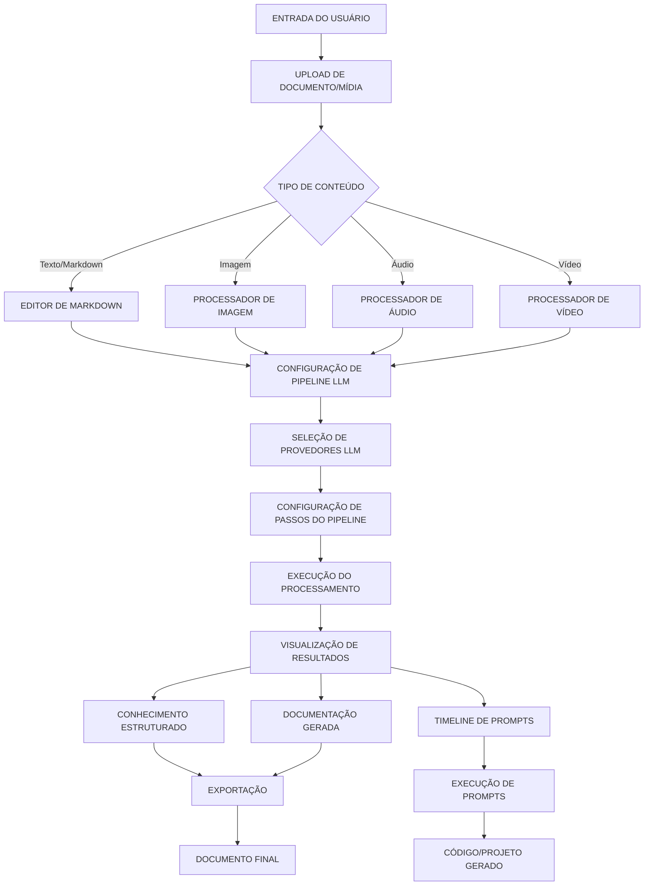
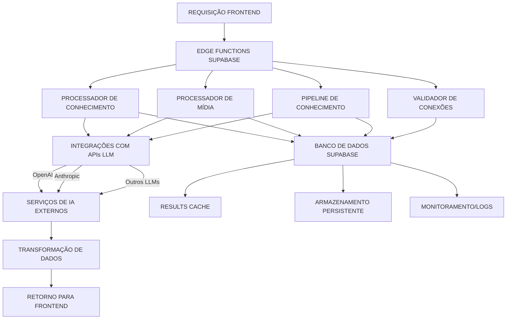
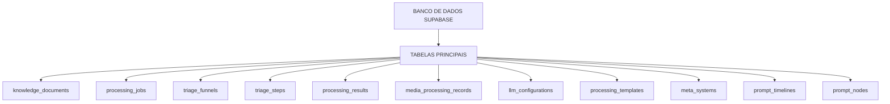
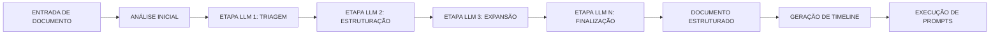
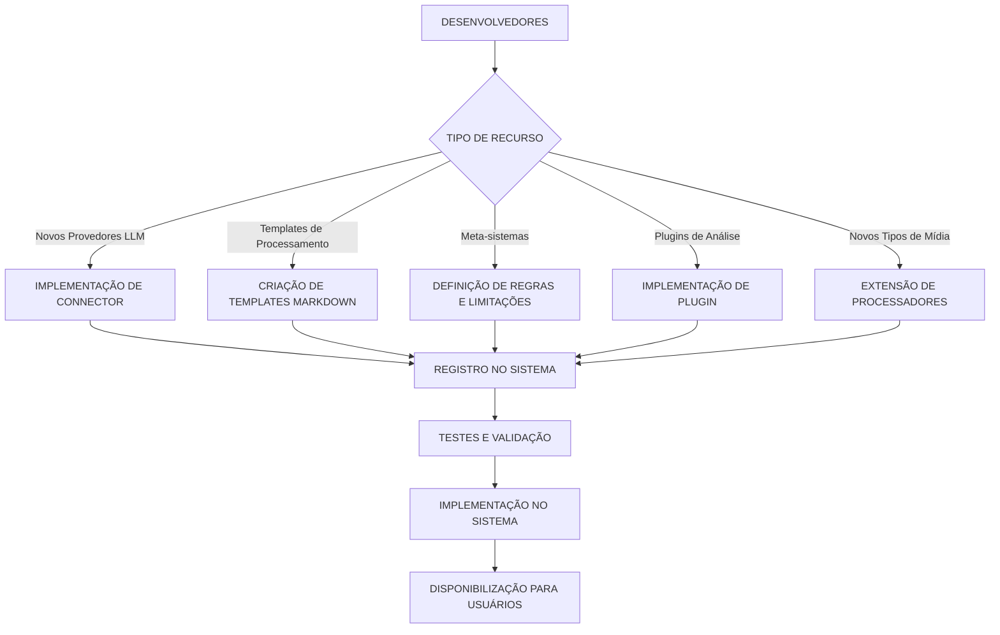

**WORKFLOWS DO SISTEMA DE PROCESSAMENTO DE CONHECIMENTO**

---

# **VISÃO GERAL DO USUÁRIO (FRONTEND)**



---

# **ARQUITETURA DO BACKEND**



---

# **ARQUITETURA DO BANCO DE DADOS**



---

# **PIPELINE DE PROCESSAMENTO DE CONHECIMENTO**



---

# **CRIAÇÃO E EXTENSÃO DE RECURSOS**



---

# **DETALHAMENTO DOS FLUXOS**

## **FLUXO DE USUÁRIO COMPLETO**

1. **ENTRADA DE CONTEÚDO**
    - Upload de documento Markdown
    - Upload de imagem, áudio ou vídeo
    - Criação direta via editor
2. **CONFIGURAÇÃO DE PROCESSAMENTO**
    - Seleção de funil de triagem existente
    - Configuração personalizada de pipeline
    - Seleção de LLMs para cada etapa
    - Configuração de templates
3. **EXECUÇÃO DO PROCESSAMENTO**
    - Documentos seguem através do pipeline configurado
    - Cada LLM aplica seu processamento específico
    - Resultados intermediários são armazenados
    - Métricas de desempenho são monitoradas
4. **VISUALIZAÇÃO E UTILIZAÇÃO**
    - Análise de estrutura e metadados extraídos
    - Revisão do documento processado
    - Geração de timeline de prompts
    - Execução de prompts para gerar código ou outros recursos

---

## **EXTENSIBILIDADE DO SISTEMA**

1. **NOVOS PROVEDORES LLM**
    - Implementação de conectores para novas APIs
    - Configuração de modelos e parâmetros
    - Integração com sistema de monitoramento
2. **TEMPLATES DE PROCESSAMENTO**
    - Criação em formato Markdown ou JSON
    - Definição de placeholders para inputs
    - Exemplos de uso e validação
3. **META-SISTEMAS**
    - Conjuntos de regras para guiar LLMs
    - Restrições de processamento
    - Objetivos de saída
4. **PLUGINS DE ANÁLISE**
    - Implementação da interface Plugin
    - Especialização em tipos específicos de análise
    - Integração com pipeline existente
5. **PROCESSADORES DE MÍDIA**
    - Extensão para novos formatos
    - Integração com APIs especializadas
    - Extração de conteúdo e metadados

```

Este documento foi atualizado com todos os fluxos detalhados para o sistema de processamento de conhecimento, garantindo estruturação adequada para ser utilizado no **Obsidian**.

```